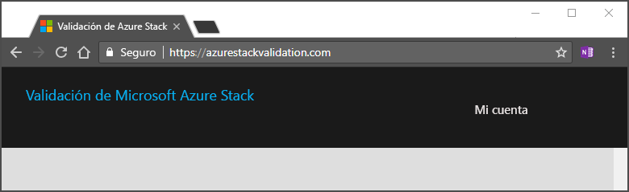

# Guía de inicio rápido: Uso del portal de validación como servicio para programar la primera prueba

[!INCLUDE [Azure_Stack_Partner](./includes/azure-stack-partner-appliesto.md)]

Obtenga información sobre cómo programar la primera prueba con el portal de validación como servicio (VaaS) para comprobar el hardware. El agente local debe implementarse en la solución de Azure Stack que se va a validar antes de ejecutar las pruebas de validación.

En esta guía de inicio rápido, agregará la solución y ejecutará pruebas.

## Requisitos previos

Antes de seguir con esta guía de inicio rápido, necesita disponer de:
 - Una cuenta de validación como servicio. Para obtener instrucciones, consulte [Configuración de la cuenta de validación como servicio](azure-stack-vaas-set-up-account.md).  
- El agente local instalado en el sistema. Para obtener instrucciones, consulte [Implementación del agente local y prueba de las máquinas virtuales](azure-stack-vaas-test-vm.md).

## Adición de una nueva solución

1. Inicie sesión en el [portal de validación](https://azurestackvalidation.com).

      

2. Seleccione **New solution** (Nueva solución).
3. Escriba un nombre para la solución y seleccione **Save** (Guardar).

## Creación de un flujo de trabajo de validación de solución

1. Seleccione el nombre de la solución.
2. Seleccione **Manage** (Administrar) en el icono **Solution Validations** (Validaciones de solución).

    

## Creación de un flujo de trabajo de la solución

1. Seleccione **New solution validation** (Nueva validación de solución).
2. Escriba el nombre de la validación.
3. Seleccione **Minimum** (Mínimo) o **Maximum** (Máximo).  
    - **Mínimo**  
    La solución se configura con el mínimo número admitido de nodos.  
    - **Máximo**  
    La solución se configura con el máximo número admitido de nodos.
4. Agregue los parámetros del entorno. Para más información, consulte [Adición de parámetros del entorno](#add-environmental-parameters).
5. Agregue los parámetros de prueba comunes. Para más información, consulte [Adición de parámetros de prueba comunes](#add-common-test-parameters).

    Según la definición de la prueba, la prueba puede requerir que escriba un valor con independencia de los parámetros comunes o puede permitirle invalidar el valor de los parámetros comunes.
6. Haga clic en **Submit** (Enviar) para programar la prueba.

## Adición de los parámetros del entorno

Agregue los siguientes parámetros del entorno:

| Información de la ejecución de la prueba | Obligatorio | DESCRIPCIÓN |
| --- | --- | --- | --- |
| Compilación de Azure Stack | Obligatorio | El valor del número de compilación de Azure Stack (por ejemplo, 20170501.1) debe ser un número de compilación o versión de Azure Stack válido, por ejemplo, 1.0.170330.9 |
| Id. de inquilino | Obligatorio | Identificador del inquilino de Active Directory. Esto debe ser un GUID (por ejemplo ECA23256-6BA0-4F27-8E4D-AFB02F088363) |
| Region | Obligatorio | Región de implementación de Azure Stack |
| Punto de conexión de Resource Manager del inquilino | Obligatorio | Punto de conexión para las operaciones de Azure Resource Manager del inquilino (por ejemplo, https://management.loc-ext.domain.com)) |
| Punto de conexión de Resource Manager de administrador | No se requiere | Punto de conexión para las operaciones de Azure Resource Manager del inquilino (por ejemplo, https://management.loc-ext.domain.com)) |
| FQDN externo | No se requiere | Nombre de dominio completo externo utilizado como sufijo para los puntos de conexión. (Por ejemplo, local.azurestack.external o redmond.contoso.com) |
| Número de nodos | Obligatorio | Número de nodos de la solución. |

## Adición de los parámetros de prueba comunes

Agregue los siguientes parámetros de prueba comunes:

| Información de la ejecución de la prueba | Obligatorio | DESCRIPCIÓN |
| --- | --- | --- |
| Nombre de usuario del inquilino | Obligatorio | Nombre de usuario del inquilino (por ejemplo tenant@contoso.onmicrosoft.com) |
| Contraseña del inquilino | Obligatorio | Contraseña del inquilino. |
| Nombre de usuario del administrador de servicios | No se requiere | Nombre de usuario del inquilino (por ejemplo tenant@contoso.onmicrosoft.com) |
| Contraseña del administrador de servicios | No se requiere | Nombre de usuario del administrador de servicios (por ejemplo serviceadmin@contoso.onmicrosoft.com) |
| Nombre de usuario del administrador de la nube | No se requiere | Cuenta del administrador de dominio de Azure Stack (por ejemplo, contoso\cloudadmin) |
| Contraseña del administrador de la nube | No se requiere | |
|  Cadena de conexión de diagnósticos | No se requiere | Identificador URI de SAS de una cuenta de Azure Storage en la que se copiarán los registro de diagnóstico durante la ejecución de la prueba. Consulte [Creación de un blob de Azure Storage para almacenar los registros](azure-stack-vaas-set-up-account.md#create-an-azure-storage-blob-to-store-logs).   El valor del parámetro común **Cadena de conexión de diagnósticos** lo almacenará el servicio y lo proporcionará en el momento de la programación para todas las pruebas del flujo de trabajo que usan este parámetro. Cuando falten menos de 30 días para que expire la dirección URL de SAS, se le pedirá una nueva dirección URL de SAS en la página de parámetros comunes. |
| Etiqueta: nombre | No se requiere |  Se pueden especificar etiquetas descriptivas para etiquetar el flujo de trabajo. Este es el nombre de la etiqueta. |
| Etiqueta: valor | No se requiere | Se pueden especificar etiquetas descriptivas para etiquetar el flujo de trabajo. Este es el valor de la etiqueta. |

## Pasos siguientes

- [Validación de una nueva solución de Azure Stack](azure-stack-vaas-validate-solution-new.md)  
- Para más información, consulte [Validación como servicio de Azure Stack](https://docs.microsoft.com/azure/azure-stack/partner).
