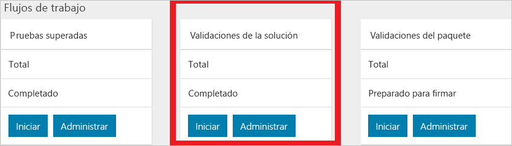

# Validación de una nueva solución de Azure Stack

[!INCLUDE [Azure_Stack_Partner](./includes/azure-stack-partner-appliesto.md)]

Obtenga información sobre cómo puede usar el flujo de trabajo de validación de soluciones para la certificación nuevas soluciones de Azure Stack.

Una solución de Azure Stack es una lista de materiales de hardware (BoM) que ha sido acordada conjuntamente con Microsoft y ha pasado los requisitos de certificación del logotipo de Windows Server. También puede usar el flujo de trabajo de validación de soluciones cuando se ha producido un cambio en el hardware de la lista de materiales que provocaría que una solución se clasifique como *nueva*. Si tiene preguntas sobre lo que desencadenaría una **nueva** solución o la **recertificación** de una solución, puede ponerse en contacto en la dirección [vaashelp@microsoft.com](mailto:vaashelp@microsoft.com).

Para certificar la solución, ejecute el flujo de trabajo dos veces. Ejecútelo una vez para la configuración *mínima* admitida. Ejecútelo una segunda vez para la configuración *máxima*. Microsoft certifica la solución si ambas configuraciones superan todas las pruebas.

Esta guía de inicio rápido le permitirá trabajar en el proceso de agregar la solución y ejecutar las pruebas.

## Adición de una nueva solución

1. Inicie sesión en el [portal de validación](https://azurestackvalidation.com).
2. Seleccione **New solution** (Nueva solución).
3. Escriba un nombre para la solución y seleccione **Save** (Guardar).

## Creación de un flujo de trabajo de validación de solución

1. Seleccione el nombre de la solución.
2. Seleccione **Manage** (Administrar) en el icono **Solution Validations** (Validaciones de solución).

    

## Creación de un flujo de trabajo de la solución

1. Seleccione **New solution validation** (Nueva validación de solución).
2. Escriba el nombre de la validación.
3. Seleccione **Minimum** (Mínimo) o **Maximum** (Máximo).  
    - **Mínimo**  
    La solución se configura con el mínimo número admitido de nodos.  
    - **Máximo**  
    La solución se configura con el máximo número admitido de nodos.
4. Seleccione **Upload** (Cargar) y, a continuación, agregue el archivo de configuración de la implementación. Se trata de un paso opcional. También puede agregar los parámetros de prueba según los pasos descritos en la sección siguiente.

    > [!note]  
    > Para crear el archivo de configuración, puede agregar los parámetros en las secciones de parámetros del entorno y de parámetros de prueba comunes de la interfaz. Puede recuperar el archivo generado por el servicio desde la implementación de Azure Stack que se está validando. Para obtener instrucciones, consulte [Parámetros comunes del flujo de trabajo en la validación como servicio de Azure Stack](azure-stack-vaas-parameters.md).

5. Agregue los parámetros del entorno. Para más información, consulte [Adición de parámetros del entorno](#add-environmental-parameters).
6. Agregue los parámetros de prueba comunes. Para más información, consulte [Adición de parámetros de prueba comunes](#add-common-test-parameters).

    Según la definición de la prueba, la prueba puede requerir que escriba un valor con independencia de los parámetros comunes o puede permitirle invalidar el valor de los parámetros comunes.

7. Haga clic en **Submit** (Enviar) para programar la prueba.

## Adición de los parámetros del entorno

Agregue los siguientes parámetros del entorno:

| Información de la ejecución de la prueba | Obligatorio | DESCRIPCIÓN |
| --- | --- | --- | --- |
| Compilación de Azure Stack | Obligatorio | El valor del número de compilación de Azure Stack (por ejemplo, 20170501.1) debe ser un número de compilación o versión de Azure Stack válido, por ejemplo, 1.0.170330.9 |
| Id. de inquilino | Obligatorio | Identificador del inquilino de Active Directory. Esto debe ser un GUID (por ejemplo ECA23256-6BA0-4F27-8E4D-AFB02F088363) |
| Region | Obligatorio | Región de implementación de Azure Stack |
| Punto de conexión de Resource Manager del inquilino | Obligatorio | Punto de conexión para las operaciones de Azure Resource Manager del inquilino (por ejemplo, https://management.loc-ext.domain.com)) |
| Punto de conexión de Resource Manager de administrador | No se requiere | Punto de conexión para las operaciones de Azure Resource Manager del inquilino (por ejemplo, https://management.loc-ext.domain.com)) |
| FQDN externo | No se requiere | Nombre de dominio completo externo utilizado como sufijo para los puntos de conexión. (Por ejemplo, local.azurestack.external o redmond.contoso.com) |
| Número de nodos | Obligatorio | Número de nodos de la solución. |

## Adición de los parámetros de prueba comunes

Agregue los siguientes parámetros de prueba comunes:

| Información de la ejecución de la prueba | Obligatorio | DESCRIPCIÓN |
| --- | --- | --- |
| Nombre de usuario del inquilino | Obligatorio | Nombre de usuario del inquilino (por ejemplo tenant@contoso.onmicrosoft.com) |
| Contraseña del inquilino | Obligatorio | Contraseña del inquilino. |
| Nombre de usuario del administrador de servicios | No se requiere | Nombre de usuario del inquilino (por ejemplo tenant@contoso.onmicrosoft.com) |
| Contraseña del administrador de servicios | No se requiere | Nombre de usuario del administrador de servicios (por ejemplo serviceadmin@contoso.onmicrosoft.com) |
| Nombre de usuario del administrador de la nube | No se requiere | Cuenta del administrador de dominio de Azure Stack (por ejemplo, contoso\cloudadmin) |
| Contraseña del administrador de la nube | No se requiere | |
|  Cadena de conexión de diagnósticos | No se requiere | Identificador URI de SAS de una cuenta de Azure Storage en la que se copiarán los registro de diagnóstico durante la ejecución de la prueba. Consulte [Creación de un blob de Azure Storage para almacenar los registros](azure-stack-vaas-set-up-account.md#create-an-azure-storage-blob-to-store-logs).   El valor del parámetro común **Cadena de conexión de diagnósticos** lo almacenará el servicio y lo proporcionará en el momento de la programación para todas las pruebas del flujo de trabajo que usan este parámetro. Cuando falten menos de 30 días para que expire la dirección URL de SAS, se le pedirá una nueva dirección URL de SAS en la página de parámetros comunes. |
| Etiqueta: nombre | No se requiere |  Se pueden especificar etiquetas descriptivas para etiquetar el flujo de trabajo. Este es el nombre de la etiqueta. |
| Etiqueta: valor | No se requiere | Se pueden especificar etiquetas descriptivas para etiquetar el flujo de trabajo. Este es el valor de la etiqueta. |

## Pasos siguientes

- [Reprogramación o cancelación de una prueba](azure-stack-vaas-monitor-test.md#reschedule-a-test)
- Para más información, consulte [Validación como servicio de Azure Stack](https://docs.microsoft.com/azure/azure-stack/partner).