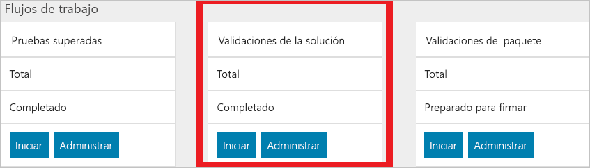
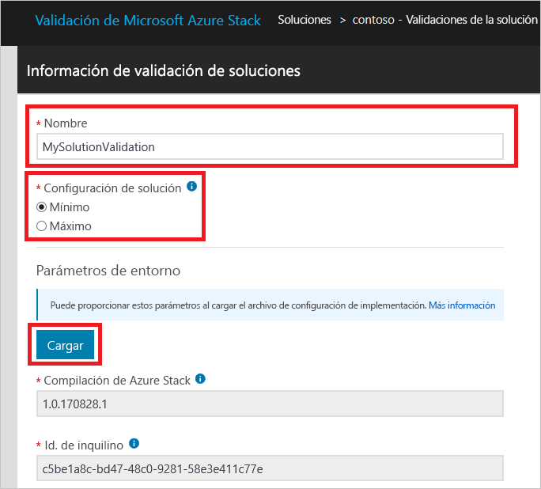
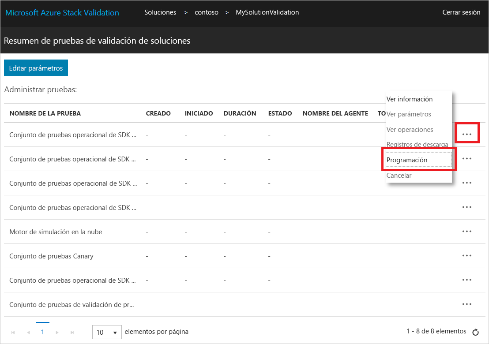

# Validación de una nueva solución de Azure Stack

[!INCLUDE [Azure_Stack_Partner](./includes/azure-stack-partner-appliesto.md)]

Aprenda a usar el flujo de trabajo de **validación de soluciones** para comprobar las nuevas soluciones de Azure Stack.

Una solución de Azure Stack es una lista de materiales de hardware que se ha acordado conjuntamente entre Microsoft y el asociado después de haber cubierto los requisitos de certificación del logotipo de Windows Server. Una solución se debe volver a certificar cuando ha habido un cambio en la lista de materiales de hardware. Si tiene preguntas adicionales sobre cuándo volver a certificar las soluciones, póngase en contacto con el equipo en [vaashelp@microsoft.com](mailto:vaashelp@microsoft.com).

Para certificar la solución, ejecute dos veces el flujo de trabajo de validación de soluciones. Ejecútelo una vez para la configuración *mínima* admitida. Ejecútelo una segunda vez para la configuración *máxima* admitida. Microsoft certifica la solución si ambas configuraciones superan todas las pruebas.

[!INCLUDE [azure-stack-vaas-workflow-validation-completion](includes/azure-stack-vaas-workflow-validation-completion.md)]

## Creación de un flujo de trabajo de validación de soluciones

1. [!INCLUDE [azure-stack-vaas-workflow-step_select-solution](includes/azure-stack-vaas-workflow-step_select-solution.md)]

3. Seleccione **Iniciar** en el icono **Solution Validations** (Validación de soluciones).

    

4. [!INCLUDE [azure-stack-vaas-workflow-step_naming](includes/azure-stack-vaas-workflow-step_naming.md)]

5. Seleccione la **configuración de la solución**.
    - **Minimum** (Mínima): la solución se configura con el número mínimo admitido de nodos.
    - **Maximum** (Máxima): la solución se configura con el número máximo admitido de nodos.
6. [!INCLUDE [azure-stack-vaas-workflow-step_upload-stampinfo](includes/azure-stack-vaas-workflow-step_upload-stampinfo.md)]

    

7. [!INCLUDE [azure-stack-vaas-workflow-step_test-params](includes/azure-stack-vaas-workflow-step_test-params.md)]

    > [!NOTE]
    > No se pueden modificar los parámetros de entorno después de crear un flujo de trabajo.

8. [!INCLUDE [azure-stack-vaas-workflow-step_tags](includes/azure-stack-vaas-workflow-step_tags.md)]
9. [!INCLUDE [azure-stack-vaas-workflow-step_submit](includes/azure-stack-vaas-workflow-step_submit.md)]
    Se le redirigirá a la página de resumen de las pruebas.

## Ejecución de pruebas de validación de soluciones

En la página **Solution validation tests summary** (Resumen de pruebas de validación de soluciones), verá una lista de las pruebas necesarias para realizar la validación.

En los flujos de trabajo de validación, para **programar** una prueba se usan los parámetros comunes de nivel de flujo de trabajo que especificó durante la creación del flujo de trabajo (consulte [Parámetros comunes del flujo de trabajo en la validación de Azure Stack como servicio](azure-stack-vaas-parameters.md)). Si alguno de los valores de parámetro de prueba deja de ser válido, debe volver a suministrarlo como se indica en [Modify workflow parameters](azure-stack-vaas-monitor-test.md#change-workflow-parameters) (Modificación de los parámetros de flujo de trabajo).

> [!NOTE]
> La programación a través de una prueba de validación a través de una instancia existente creará una nueva instancia en el lugar de la anterior en el portal. Los registros de la instancia anterior se conservarán, pero no se podrá acceder a ellos desde el portal.  
Una vez finalizada una prueba correctamente, la acción **Schedule** (Programar) pasará a estar deshabilitada.

1. [!INCLUDE [azure-stack-vaas-workflow-step_select-agent](includes/azure-stack-vaas-workflow-step_select-agent.md)]

2. Seleccione las pruebas siguientes:
    - Cloud Simulation Engine
    - Compute SDK Operational Suite
    - Disk Identification Test
    - KeyVault Extension SDK Operational Suite
    - KeyVault SDK Operational Suite
    - Network SDK Operational Suite
    - Storage Account SDK Operational Suite

3. Seleccione **Schedule** (Programar) desde el menú contextual para abrir un símbolo del sistema y programar la instancia de prueba.

4. Revise los parámetros de prueba y, luego, seleccione **Submit** (Enviar) para programar la ejecución de la prueba.

## Pasos siguientes

- [Supervisión y administración de pruebas en el portal de VaaS](azure-stack-vaas-monitor-test.md)