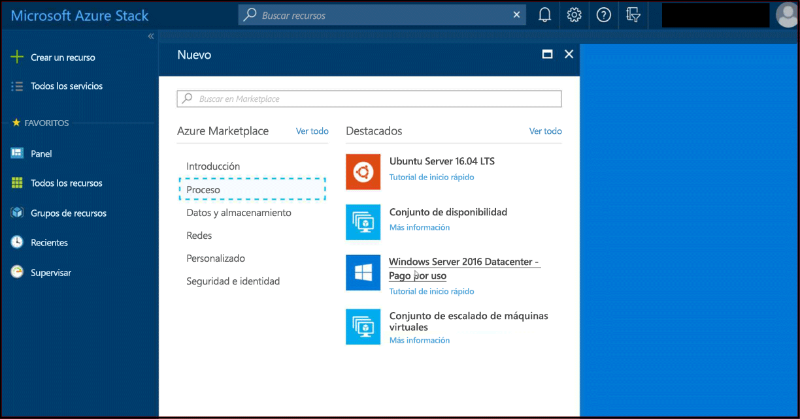

# Guía de inicio rápido: Creación de una máquina virtual Windows Server con el portal de Azure Stack

*Se aplica a: Sistemas integrados de Azure Stack y Kit de desarrollo de Azure Stack*

Puede crear una máquina virtual Windows Server 2016 mediante el portal de Azure Stack. Siga los pasos descritos en este artículo para crear y usar una máquina virtual.

> [!NOTE]  
> Las imágenes de pantalla de este artículo se han actualizado para que coincidan con la interfaz de usuario introducida con la versión de Azure Stack 1808. 1808 agrega compatibilidad para usar los *discos administrados* además de los no administrados. Si usa una versión anterior, algunas imágenes como la selección de disco diferirá de la que se muestra en este artículo.  

## Inicio de sesión en el portal de Azure Stack

Inicie sesión en el portal de Azure Stack. La dirección del portal de Azure Stack depende del producto de Azure Stack al que se vaya a conectar:

* Para obtener el Kit de desarrollo de Azure Stack (ASDK), vaya a: https://portal.local.azurestack.external.
* Para un sistema integrado de Azure Stack, vaya a la dirección URL que proporciona su operador de Azure Stack.

## de una máquina virtual

1. Haga clic en **+ Crear un recurso** > **Proceso** > **Windows Server 2016 Datacenter – Pago por uso** > **Crear**. Si no se muestra la entrada **Windows Server 2016 Datacenter – Pago por uso**, póngase en contacto con el operador de Azure Stack. Pídale que la agregue a Marketplace como se explica en el artículo [Add the Windows Server 2016 VM image to the Azure Stack marketplace](../azure-stack-add-default-image.md) (Adición de la imagen de máquina virtual Windows Server 2016 a Azure Stack Marketplace).

    
2. En **Aspectos básicos**, escriba un **nombre**, un **nombre de usuario** y una **contraseña**. Elija una **suscripción**. Cree un **grupo de recursos**, o seleccione uno ya existente, seleccione una **ubicación** y luego haga clic en **Aceptar**.

    
3. En **Tamaño** seleccione **D1 Estándar** y después haga clic en **Seleccionar**.  
    

4. En la página **Configuración**, realice los cambios necesarios en los valores predeterminados.
   - A partir de la versión de Azure Stack 1808, puede configurar **Almacenamiento**, donde podrá elegir los *discos administrados*. Antes de la versión 1808 solo se pueden usar discos no administrados.  
     
   Cuando las configuraciones estén preparadas, seleccione **Aceptar** para continuar.

5. En **Resumen**, haga clic en **Aceptar** para crear la máquina virtual.
    

6. Para ver la nueva máquina virtual, haga clic en **Todos los recursos**, busque el nombre de la máquina virtual y, a continuación, haga clic en su nombre en los resultados de la búsqueda.
    

## Limpieza de recursos

Cuando haya terminado de usarla, elimine la máquina virtual y sus recursos. Para ello, seleccione el grupo de recursos en la página de la máquina virtual y haga clic en **Eliminar**.

## Pasos siguientes

En esta guía de inicio rápido ha implementado una máquina virtual básica con Windows Server. Para aprender más sobre las máquina virtuales de Azure Stack, continúe con el artículo [Considerations for Virtual Machines in Azure Stack](azure-stack-vm-considerations.md) (Consideraciones acerca de máquinas virtuales de Azure Stack).
