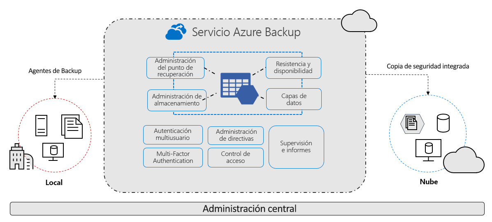

# ¿Qué es el servicio Azure Backup?

El servicio Azure Backup proporciona soluciones sencillas, seguras y rentables tanto para realizar copias de seguridad de datos de la nube de Microsoft Azure como para recuperarlos.

> [!VIDEO https://www.youtube.com/embed/elODShatt-c]

## ¿De qué puedo hacer copia de seguridad?

- **Entorno local**: realice una copia de seguridad tanto de los archivos, como de las carpetas y del estado del sistema mediante el [agente de Microsoft Azure Recovery Services (MARS)](backup-support-matrix-mars-agent.md). O bien, use el agente de DPM o de Azure Backup Server (MABS) para proteger las máquinas virtuales locales ([Hyper-V](back-up-hyper-v-virtual-machines-mabs.md) y [VMWare](backup-azure-backup-server-vmware.md)) y otras [cargas de trabajo locales](backup-mabs-protection-matrix.md)
- **Máquinas virtuales de Azure** - [realice copias de seguridad de máquinas virtuales Windows o Linux completas](backup-azure-vms-introduction.md) (mediante extensiones de copia de seguridad), o bien realice copias de seguridad de archivos, carpetas y estados del sistema mediante el [agente de MARS](backup-azure-manage-mars.md).
- **Recursos compartidos de Azure Files** - [realice copias de seguridad y restaure recursos compartidos de Azure Files para almacenar la cuenta](backup-azure-files.md)
- **SQL Server en máquinas virtuales de Azure** -  [haga copias de seguridad de las bases de datos de SQL Server que se ejecutan en las máquinas virtuales de Azure](backup-azure-sql-database.md)
- **Bases de datos de SAP HANA en máquinas virtuales de Azure** - [ haga copias de seguridad de las bases de datos de SAP HANA que se ejecutan en las máquinas virtuales de Azure](backup-azure-sap-hana-database.md)

## ¿Por qué usar Azure Backup?

Azure Backup proporciona las siguientes ventajas principales:

- **Descarga de copia de seguridad local**: Azure Backup ofrece una solución sencilla para hacer copias de seguridad de los recursos locales en la nube. Obtenga copias de seguridad a corto y largo plazo sin necesidad de implementar complejas soluciones de copias de seguridad locales.
- **Copia de seguridad de máquinas virtuales de IaaS de Azure**: Azure Backup proporciona copias de seguridad independientes y aisladas para evitar la destrucción accidental de datos originales. Las copias de seguridad se almacenan en un almacén de Recovery Services con administración integrada de puntos de recuperación. La configuración y la escalabilidad son sencillas, las copias de seguridad están optimizadas y puede restaurarlas fácilmente cuando sea necesario.
- **Escala sencilla**: Azure Backup usa la eficacia subyacente y la escala ilimitada de la nube de Azure para proporcionar alta disponibilidad, sin sobrecarga de mantenimiento o supervisión.
- **Obtención de una transferencia de datos ilimitada**: Azure Backup no limita la cantidad de datos de entrada y salida que se transfieren ni cobra por ellos.
  - Datos de salida hacen referencia a los datos transferidos desde un almacén de Recovery Services durante una operación de restauración.
  - Si realiza una copia de seguridad inicial sin conexión mediante el servicio Azure Import/Export para importar grandes cantidades de datos, hay un costo asociado a los datos de entrada.  [Más información](backup-azure-backup-import-export.md).
- **Protección de los datos**: Azure Backup proporciona soluciones para proteger los datos tanto [en tránsito](backup-azure-security-feature.md) como [en reposo](backup-azure-security-feature-cloud.md).
- **Supervisión y administración centralizadas**: Azure Backup proporciona [funcionalidades de supervisión y alerta integradas](backup-azure-monitoring-built-in-monitor.md) en un almacén de Recovery Services. Estas funcionalidades están disponibles sin ninguna infraestructura de administración adicional. También puede aumentar la escala de la supervisión y los informes mediante [Azure Monitor](backup-azure-monitoring-use-azuremonitor.md).
- **Obtención de copias de seguridad coherentes de la aplicación**: una copia de seguridad coherente con la aplicación significa un punto de recuperación que tiene todos los datos necesarios para restaurar la copia de seguridad. Azure Backup proporciona copias de seguridad coherentes con las aplicaciones, lo que garantiza que no se van a necesitar correcciones adicionales para restaurar los datos. La restauración de datos coherentes con la aplicación reduce el tiempo de restauración, lo que permite volver rápidamente a un estado de ejecución.
- **Retención de los datos a corto y largo plazo**: puede usar los [almacenes de Recovery Services](backup-azure-recovery-services-vault-overview.md) para la retención de datos tanto a corto como a largo plazo.
- **Administración de almacenamiento automática**: los entornos híbridos requieren con frecuencia almacenamiento heterogéneo, unos local y otros en la nube. Con Azure Backup, el uso de dispositivos de almacenamiento local no supone ningún costo. Azure Backup asigna y administra automáticamente almacenamiento de copia de seguridad y emplea un modelo de pago por uso. Solo tiene que pagar el almacenamiento que consuma. [Más información](https://azure.microsoft.com/pricing/details/backup) sobre precios.
- **Varias opciones de almacenamiento**: Azure Backup ofrece dos tipos de replicación para mantener la alta disponibilidad de los datos o del almacenamiento.
  - El [almacenamiento con redundancia local (LRS)](../storage/common/storage-redundancy-lrs.md) replica los datos tres veces (crea tres copias de los datos) en una unidad de escalado de almacenamiento de un centro de datos. Todas las copias de los datos se encuentran en la misma región. LRS es una opción de bajo costo para proteger los datos contra errores de hardware local.
  - El [almacenamiento con redundancia geográfica (GRS)](../storage/common/storage-redundancy-grs.md) es la opción de replicación predeterminada y recomendada. GRS replica los datos en una región secundaria (a cientos de kilómetros de la ubicación principal de los datos de origen). GRS cuesta más que LRS, pero proporciona un mayor nivel de durabilidad de los datos, aunque se produzca una interrupción regional.

## Pasos siguientes

- [Revise](backup-architecture.md) la arquitectura y los componentes de los diferentes escenarios de copia de seguridad.
- [Compruebe](backup-support-matrix.md) los requisitos de soporte técnico y las limitaciones de copia de seguridad en general y de la [copia de seguridad de máquinas virtuales de Azure](backup-support-matrix-iaas.md) en particular.
