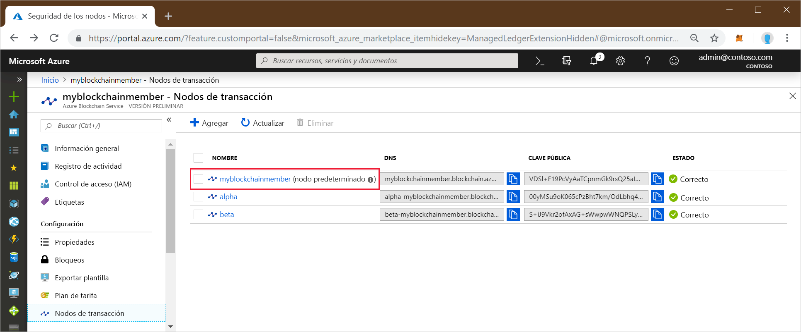
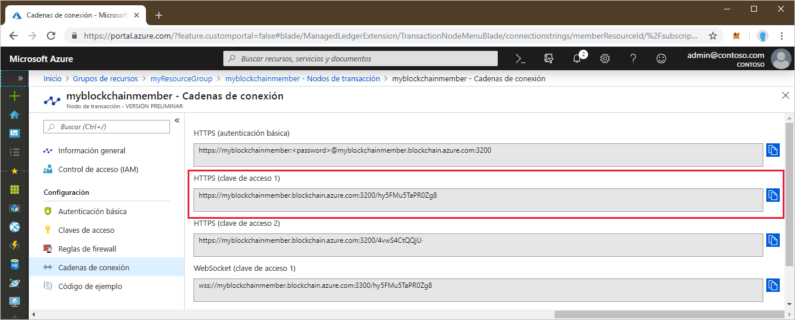

# <a name="quickstart-use-geth-to-connect-to-a-transaction-node"></a>Inicio rápido: Uso de Geth para conectarse a un nodo de transacción

Geth es un cliente de Go Ethereum que se puede usar para conectarse a una instancia de Geth en un nodo de transacción de Azure Blockchain Service.

[!INCLUDE [quickstarts-free-trial-note](../../../includes/quickstarts-free-trial-note.md)]

## <a name="prerequisites"></a>Requisitos previos

* Instalar [Geth](https://github.com/ethereum/go-ethereum/wiki/geth)
* [Crear un miembro de Azure Blockchain](create-member.md)

## <a name="get-the-geth-connection-string"></a>Obtención de la cadena de conexión de Geth

Puede encontrar la cadena de conexión de Geth en Azure Portal.

1. Inicie sesión en el [Azure Portal](https://portal.azure.com).
1. Vaya al miembro de Azure Blockchain Service. Seleccione **Nodos de transacción** y el vínculo al nodo de transacción predeterminado.

    

1. Seleccione **Cadenas de conexión**.
1. Copie la cadena de conexión de **HTTPS (Access key 1)** (HTPPS [clave de acceso 1]). Necesitará el comando para la siguiente sección.

    

## <a name="connect-to-geth"></a>Conexión a Geth

1. Abra el shell o un símbolo del sistema.
1. Use el subcomando attach de Geth para conectarse a la instancia de Geth en ejecución en el nodo de transacción. Pegue la cadena de conexión como un argumento para el subcomando attach. Por ejemplo,

    ```
    geth attach <connection string>
    ```

1. Una vez conectado a la consola de Ethereum del nodo de transacción, puede llamar a la API de aplicación deserializada web3 JavaScript o a la API de administración.

    Por ejemplo, use la siguiente API para averiguar el valor de chainId.

    ```bash
    admin.nodeInfo.protocols.istanbul.config.chainId
    ```

    En este ejemplo, es 297.

    

1. Para desconectarse de la consola, escriba `exit`.

## <a name="next-steps"></a>Pasos siguientes

En este tutorial, usó el cliente de Geth para conectarse a una instancia de Geth en un nodo de transacción de Azure Blockchain Service. Pruebe el siguiente tutorial para implementar y enviar una transacción con Truffle.

> [!div class="nextstepaction"]
> [Envío de una transacción](send-transaction.md)