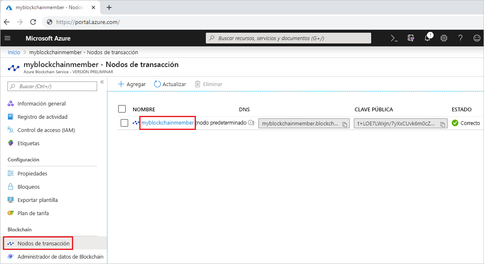
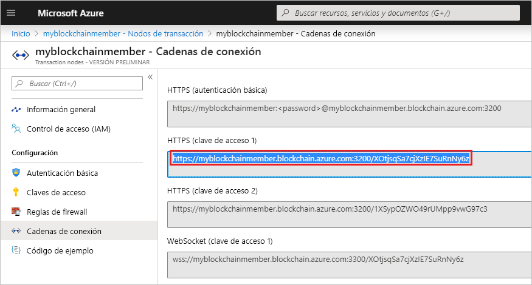
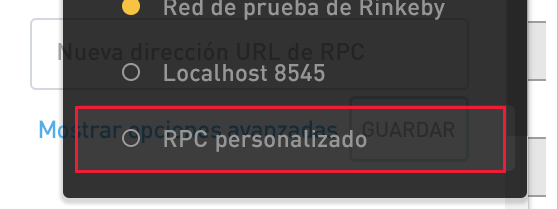
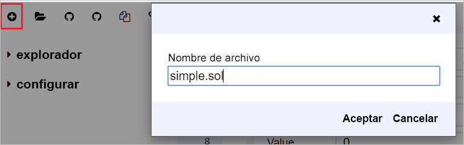
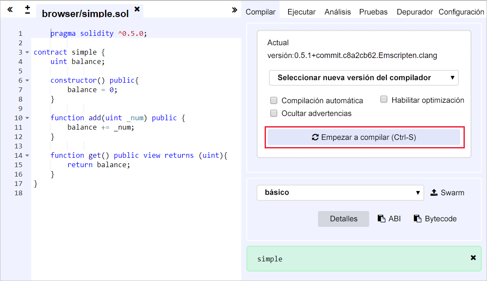
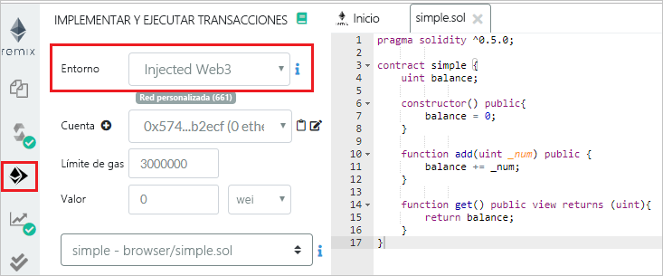
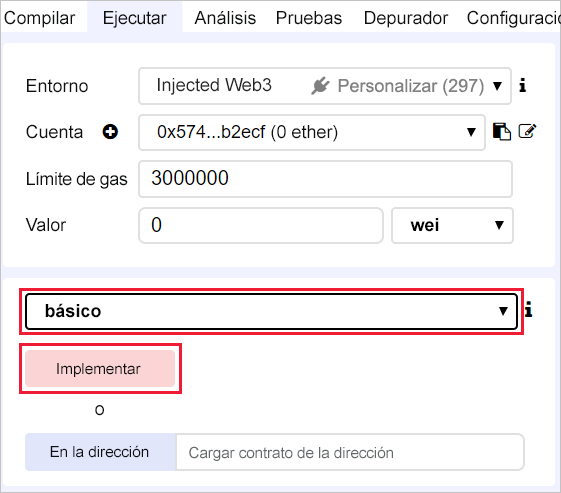
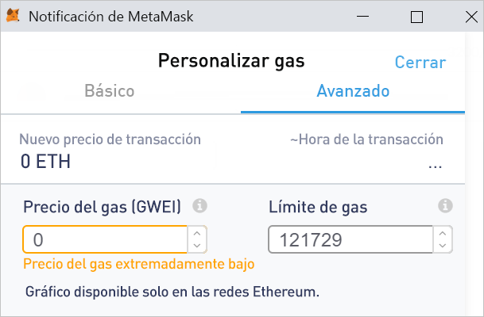
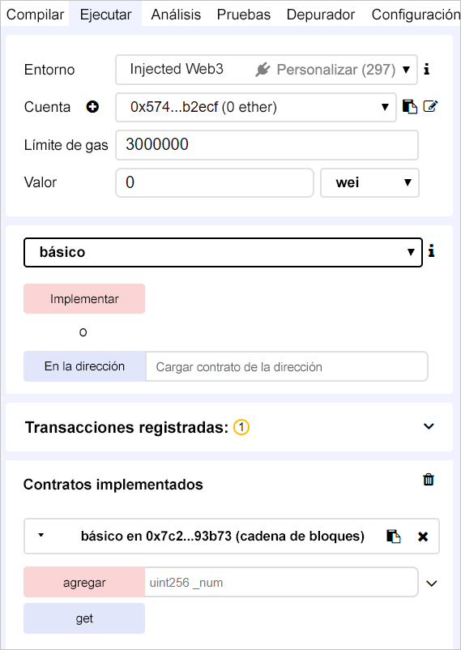
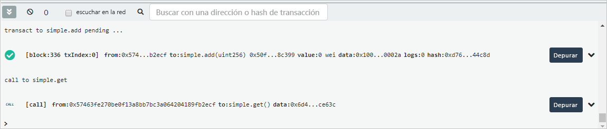

# <a name="quickstart-use-metamask-to-connect-and-deploy-a-smart-contract"></a>Inicio rápido: Uso de MetaMask para conectarse a un contrato inteligente e implementarlo

En este inicio rápido, usará MetaMask para conectarse a una red de Azure Blockchain Service y usará Remix para implementar un contrato inteligente. MetaMask es una extensión del navegador para administrar una cartera de Ether y realizar acciones de contrato inteligente.

[!INCLUDE [quickstarts-free-trial-note](../../../includes/quickstarts-free-trial-note.md)]

## <a name="prerequisites"></a>Requisitos previos

* Realizar el tutorial [Quickstart: Creación de un miembro de cadena de bloques mediante Azure Portal](create-member.md) o [Inicio rápido: Creación de un miembro de cadena de bloques de Azure Blockchain Service mediante la CLI de Azure](create-member-cli.md)
* Instalar la [extensión del explorador MetaMask](https://metamask.io)
* Generar una [cartera](https://metamask.zendesk.com/hc/en-us/articles/360015488971-New-to-MetaMask-Learn-How-to-Setup-MetaMask-the-First-Time) de MetaMask

## <a name="get-endpoint-address"></a>Obtención de la dirección de punto de conexión

Necesitará la dirección de punto de conexión de Azure Blockchain Service para conectarse a la red de cadena de bloques. Puede encontrar la dirección de punto de conexión y las claves de acceso en Azure Portal.

1. Inicie sesión en el [Azure Portal](https://portal.azure.com).
1. Vaya al miembro de Azure Blockchain Service. Seleccione **Nodos de transacción** y el vínculo al nodo de transacción predeterminado.

    

1. Seleccione **Cadenas de conexión > Claves de acceso**.
1. Copie la dirección de punto de conexión de **HTTPS (Access key 1)** (HTTPS [clave de acceso 1]). La necesitará en la próxima sección.

    

## <a name="connect-metamask"></a>Conexión de MetaMask

1. Abra la extensión del explorador MetaMask e inicie sesión.
1. En la lista desplegable de redes, seleccione **Custom RPC** (RPC personalizado).

    

1. En **New Network > New RPC URL** (Nueva red > Nueva URL de RPC), especifique la dirección de punto de conexión copiada de la sección anterior.
1. Seleccione **Guardar**.

    Si la conexión se realizó correctamente, la red privada se muestra en la lista desplegable de redes.

    

## <a name="deploy-smart-contract"></a>Implementación de un contrato inteligente

Remix es un entorno de desarrollo de Solidity basado en explorador. Cuando se usan MetaMask y Remix juntos, puede implementar y realizar acciones sobre los contratos inteligentes.

1. Abra el explorador y vaya a `https://remix.ethereum.org`.
1. Seleccione **Nuevo archivo** en la pestaña **Inicio**, en **Archivo**.

    Asigne el nombre `simple.sol` al archivo nuevo.

    

    Seleccione **Aceptar**.
1. En el editor Remix, pegue el siguiente código de **contrato inteligente sencillo**.

    ```solidity
    pragma solidity ^0.5.0;
             
    contract simple {
        uint balance;
                 
        constructor() public{
            balance = 0;
        }
                 
        function add(uint _num) public {
            balance += _num;
        }
                 
        function get() public view returns (uint){
            return balance;
        }
    }
    ```

    El **contrato simple** declara una variable de estado denominada **balance**. Hay dos funciones definidas. La función **add** agrega un número a **balance**. La función **get** devuelve el valor de **balance**.
1. Para compilar el contrato, primero seleccione el panel del compilador de Solidity y, a continuación, seleccione **Compile simple.sol**. 

    

1. Seleccione el panel **Deploy & Run** (Implementar y ejecutar) y, a continuación, establezca **Environment** (Entorno) en **Injected Web3** (Web3 insertado) para conectarse a través de MetaMask al miembro de cadena de bloques.

    

1. Seleccione el contrato **simple** (sencillo) y haga clic en **Deploy** (Implementar).

    


1. Se muestra una notificación de MetaMask que le avisa de que no hay fondos suficientes para realizar la transacción.

    Con una red pública de cadena de bloques, necesitaría Ether para pagar el costo de la transacción. Puesto que se trata de una red privada de un consorcio, puede establecer el precio del gas en cero.

1.  Seleccione **Gas Fee > Edit > Advanced** (Tarifa de gas > Editar > Avanzado) y establezca **Gas Price** (Precio del gas) en 0.

    

    Seleccione **Guardar**.

1. Seleccione **Confirm** (Confirmar) para implementar el contrato inteligente en la cadena de bloques.
1. En la sección **Deployed Contracts** (Contratos implementados), expanda el contrato **simple** (sencillo).

    

    Hay dos acciones **add** (agregar) y **get** (obtener) que se asignan a las funciones definidas en el contrato.

1. Para realizar una transacción **add** sobre la cadena de bloques, escriba un número para agregar y, luego, seleccione **add** (agregar). Puede recibir un mensaje de error de estimación de gas de Remix. Está enviando la transacción a una cadena de bloques privada que no requiere gas. Seleccione **Send Transaction** (Enviar transacción) para forzar la transacción.
1. Al igual que cuando implementó el contrato, se muestra una notificación de MetaMask que le avisa de que no hay fondos suficientes para realizar la transacción.

    Puesto que se trata de una red privada de un consorcio, podemos establecer el precio del gas en cero.

1.  Seleccione **Gas Fee > Edit > Advanced** (Tarifa de gas > Editar > Avanzado), establezca **Gas Price** (Precio del gas) en 0 y seleccione **Save** (Guardar).
1. Seleccione **Confirm** (Confirmar) para enviar la transacción a la cadena de bloques.
1. Seleccione la acción **get** (obtener). Esta es una llamada a los datos del nodo de consulta. No es necesaria una transacción.
1. En el panel de depuración de Remix, puede ver detalles acerca de las transacciones sobre la cadena de bloques.

    

    Puede ver la creación del contrato **simple** (sencillo), la transacción de **simple.add** y la llamada a **simple.get**.

1. También puede ver el historial de transacciones en MetaMask. Abra la extensión del explorador MetaMask.
1. En la sección **History** (Historial), puede ver un registro del contrato implementado y de las transacciones.

## <a name="next-steps"></a>Pasos siguientes

En este tutorial, usó la extensión del explorador MetaMask para conectarse a un nodo de transacción de Azure Blockchain Service, implementar un contrato inteligente y enviar una transacción a la cadena de bloques. Pruebe el siguiente tutorial para usar el kit de desarrollo de Azure Blockchain para Ethereum y Truffle a fin de crear, compilar, implementar y ejecutar una función de contrato inteligente mediante una transacción.

> [!div class="nextstepaction"]
> [Creación, compilación e implementación de contratos inteligentes en Azure Blockchain Service](send-transaction.md)