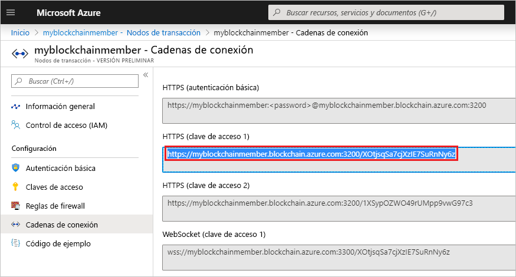

# <a name="quickstart-use-truffle-to-connect-to-azure-blockchain-service"></a>Inicio rápido: Uso de Truffle para conectarse a Azure Blockchain Service

En este inicio rápido, se usa Truffle para conectarse a un nodo de transacción de Azure Blockchain Service. Luego, se usa la consola interactiva de Truffle para llamar a los métodos de **web3** para interactuar con la red de cadenas de bloque.

[!INCLUDE [quickstarts-free-trial-note](../../../includes/quickstarts-free-trial-note.md)]

## <a name="prerequisites"></a>Requisitos previos

* Realizar el tutorial [Quickstart: Creación de un miembro de cadena de bloques mediante Azure Portal](create-member.md) o [Inicio rápido: Creación de un miembro de cadena de bloques de Azure Blockchain Service mediante la CLI de Azure](create-member-cli.md)
* Instale [Truffle](https://github.com/trufflesuite/truffle). Para usar Truffle es necesario instalar varias herramientas, como [Node.js](https://nodejs.org) y [Git](https://git-scm.com/book/en/v2/Getting-Started-Installing-Git).
* Instale [Python 2.7.15](https://www.python.org/downloads/release/python-2715/). Python es necesario para Web3.

## <a name="create-truffle-project"></a>Creación de un proyecto de Truffle

1. Abra un símbolo del sistema o shell de Node.js.
1. Cambie el directorio por el lugar donde quiere crear el directorio del proyecto de Truffle.
1. Cree un directorio para el proyecto y cambie la ruta de acceso para que señale al nuevo directorio. Por ejemplo,

    ``` bash
    mkdir truffledemo
    cd truffledemo
    ```

1. Inicialice el proyecto de Truffle.

    ``` bash
    truffle init
    ```

1. Instale Ethereum JavaScript API web3 en la carpeta del proyecto. Actualmente, se requiere web3 1.0.0-beta.37.

    ``` bash
    npm install web3@1.0.0-beta.37
    ```

    Puede que reciba advertencias de npm durante la instalación.
    
## <a name="configure-truffle-project"></a>Configuración del proyecto de Truffle

Para configurar el proyecto de Truffle, debe ir a Azure Portal para obtener información del nodo de transacción.

1. Inicie sesión en el [Azure Portal](https://portal.azure.com).
1. Vaya al miembro de Azure Blockchain Service. Seleccione **Nodos de transacción** y el vínculo al nodo de transacción predeterminado.

    

1. Seleccione **Cadenas de conexión**.
1. Copie la cadena de conexión de **HTTPS (Access key 1)** (HTPPS [clave de acceso 1]). Necesita la cadena para la siguiente sección.

    

### <a name="edit-configuration-file"></a>Edición del archivo de configuración

A continuación debe actualizar el archivo de configuración de Truffle con el punto de conexión del nodo de transacción.

1. En la carpeta del proyecto **truffledemo**, abra el archivo de configuración `truffle-config.js` de Truffle en un editor.
1. Reemplace el contenido del archivo por la siguiente información de configuración. Agregue una variable que contenga la dirección del punto de conexión. Reemplace los corchetes angulares por los valores recopilados de la sección anterior.

    ``` javascript
    var defaultnode = "<default transaction node connection string>";   
    var Web3 = require("web3");
    
    module.exports = {
      networks: {
        defaultnode: {
          provider: new Web3.providers.HttpProvider(defaultnode),
          network_id: "*"
        }
      }
    }
    ```

1. Guarde los cambios en `truffle-config.js`.

## <a name="connect-to-transaction-node"></a>Conexión al nodo de transacción

Use *Web3* para la conexión al nodo de transacción.

1. Use la consola de Truffle para conectarse al nodo de transacción predeterminado. En el símbolo del sistema o shell, ejecute el siguiente comando:

    ``` bash
    truffle console --network defaultnode
    ```

    Truffle se conecta al nodo de transacción predeterminado y proporciona una consola interactiva.

    Puede llamar a los métodos del objeto **web3** para interactuar con la red de cadenas de bloque.

1. Llame al método **getBlockNumber** para devolver el número de bloque actual.

    ```bash
    web3.eth.getBlockNumber();
    ```

    Salida de ejemplo:

    ```bash
    truffle(defaultnode)> web3.eth.getBlockNumber();
    18567
    ```
1. Salga de la consola de Truffle.

    ```bash
    .exit
    ```

## <a name="next-steps"></a>Pasos siguientes

En este inicio rápido, ha usado Truffle para conectarse a un nodo de transacción predeterminado de Azure Blockchain Service y ha usado la consola interactiva para devolver el número de bloque actual de la cadena de bloques.

Pruebe el siguiente tutorial para usar Azure Blockchain Development Kit for Ethereum para crear, compilar, implementar y ejecutar una función de contrato inteligente mediante una transacción.

> [!div class="nextstepaction"]
> [Creación, compilación e implementación de contratos inteligentes en Azure Blockchain Service](send-transaction.md)
