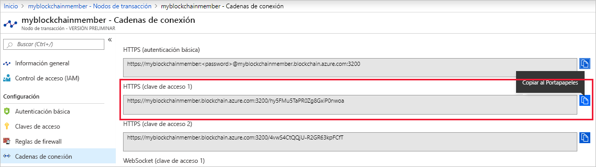

# <a name="quickstart-use-truffle-to-connect-to-an-azure-blockchain-service-network"></a>Inicio rápido: Uso de Truffle para conectarse a una red de Azure Blockchain Service

Truffle es un entorno de desarrollo de cadena de bloques que puede usarse para conectarse a un nodo de Azure Blockchain Service.

[!INCLUDE [quickstarts-free-trial-note](../../../includes/quickstarts-free-trial-note.md)]

## <a name="prerequisites"></a>Requisitos previos

* [Crear un miembro de Azure Blockchain](create-member.md)
* Instale [Truffle](https://github.com/trufflesuite/truffle). Para usar Truffle es necesario instalar varias herramientas, como [Node.js](https://nodejs.org) y [Git](https://git-scm.com/book/en/v2/Getting-Started-Installing-Git).
* Instale [Python 2.7.15](https://www.python.org/downloads/release/python-2715/). Python es necesario para Web3.

## <a name="create-truffle-project"></a>Creación de un proyecto de Truffle

1. Abra un símbolo del sistema o shell de Node.js.
1. Cambie el directorio por el lugar donde quiere crear el directorio del proyecto de Truffle.
1. Cree un directorio para el proyecto y cambie la ruta de acceso para que señale al nuevo directorio. Por ejemplo,

    ``` bash
    mkdir truffledemo
    cd truffledemo
    ```

1. Inicialice el proyecto de Truffle.

    ``` bash
    truffle init
    ```

1. Instale Ethereum JavaScript API web3 en la carpeta del proyecto. Actualmente, se requiere web3 1.0.0-beta.37.

    ``` bash
    npm install web3@1.0.0-beta.37
    ```

    Puede que reciba advertencias de npm durante la instalación.
    
## <a name="configure-truffle-project"></a>Configuración del proyecto de Truffle

Para configurar el proyecto de Truffle, debe ir a Azure Portal para obtener información del nodo de transacción.

### <a name="transaction-node-endpoint-addresses"></a>Direcciones de punto de conexión de nodo de transacción

1. En Azure Portal, vaya a al nodo de la transacción predeterminado y seleccione **Transaction nodes > Connection strings** (Nodos de transacción > Cadenas de conexión).
1. Copie y guarde la dirección URL del punto de conexión que aparece en **HTTPS (Access key 1)** (HTTPS [clave de acceso 1]). Más adelante en el tutorial necesitará las direcciones de punto de conexión del archivo de configuración del contrato inteligente.

    

### <a name="edit-configuration-file"></a>Edición del archivo de configuración

A continuación debe actualizar el archivo de configuración de Truffle con el punto de conexión del nodo de transacción.

1. En la carpeta del proyecto **truffledemo**, abra el archivo de configuración `truffle-config.js` de Truffle en un editor.
1. Reemplace el contenido del archivo por la siguiente información de configuración. Agregue una variable que contenga la dirección del punto de conexión. Reemplace los corchetes angulares por los valores recopilados de la sección anterior.

    ``` javascript
    var defaultnode = "<default transaction node connection string>";   
    var Web3 = require("web3");
    
    module.exports = {
      networks: {
        defaultnode: {
          provider: new Web3.providers.HttpProvider(defaultnode),
          network_id: "*"
        }
      }
    }
    ```

1. Guarde los cambios en `truffle-config.js`.

## <a name="connect-to-transaction-node"></a>Conexión al nodo de transacción

Use *Web3* para la conexión al nodo de transacción.

1. Use la consola de Truffle para conectarse al nodo de transacción predeterminado. En el símbolo del sistema o shell, ejecute el siguiente comando:

    ``` bash
    truffle console --network defaultnode
    ```

    Truffle se conecta al nodo de transacción predeterminado y proporciona una consola interactiva.

    Puede llamar a los métodos del objeto **web3** para interactuar con el nodo de la transacción.

1. Llame al método **getBlockNumber** para devolver el número de bloque actual.

    ```bash
    web3.eth.getBlockNumber();
    ```

    Salida de ejemplo:

    ```bash
    truffle(defaultnode)> web3.eth.getBlockNumber();
    18567
    ```
1. Salga de la consola de Truffle.

    ```bash
    .exit
    ```

## <a name="next-steps"></a>Pasos siguientes

En este tutorial, creó un proyecto de Truffle para conectarse a su nodo de transacción predeterminado de Azure Blockchain Service.

Pruebe el kit de desarrollo de Azure Blockchain para Ethereum y Truffleen el siguiente tutorial para ejecutar una función de contrato inteligente mediante una transacción en una red de consorcio de la cadena de bloques.

> [!div class="nextstepaction"]
> [Uso de contratos inteligentes en Azure Blockchain Service](send-transaction.md)
