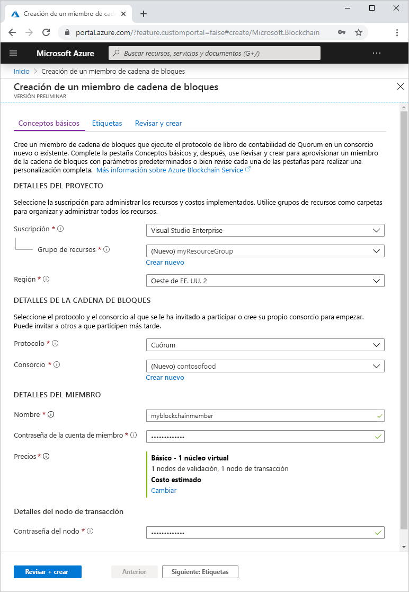
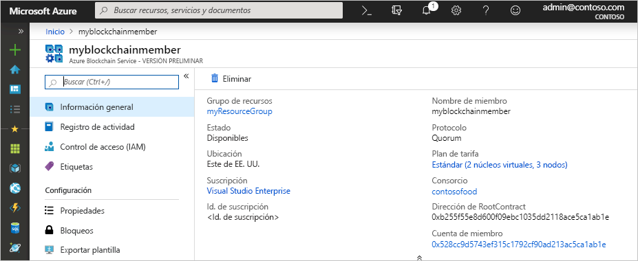

# Inicio rápido: Creación de un miembro de cadena de bloques de Azure Blockchain Service mediante Azure Portal

En este inicio rápido se implementan un nuevo miembro de una cadena de bloques y el consorcio en Azure Blockchain Service mediante Azure Portal.

[!INCLUDE [quickstarts-free-trial-note](../../../includes/quickstarts-free-trial-note.md)]

## Creación de un miembro de cadena de bloques

Un miembro de Azure Blockchain Service es un nodo de la cadena de bloques en una red de cadenas de bloques del consorcio privado. Al aprovisionar un miembro, puede crear una red de consorcio o unirse a ella. Necesita al menos un miembro para una red de consorcio. El número de miembros de la cadena de bloques que necesitan los participantes depende de su escenario. Los participantes del consorcio pueden tener uno o varios miembros de la cadena de bloques o pueden compartir miembros con otros participantes. Para más información sobre los consorcios, consulte [Consorcio de Azure Blockchain Service](consortium.md).

1. Inicie sesión en [Azure Portal](https://portal.azure.com).
1. Haga clic en **Crear un recurso** en la esquina superior izquierda de Azure Portal.
1. Seleccione **Cadena de bloques** > **Azure Blockchain Service (versión preliminar)** .

    

    Configuración | Descripción
    --------|------------
    Subscription | Seleccione la suscripción de Azure que quiere usar con el servicio. Si tiene varias suscripciones, elija aquella en la que se factura el recurso.
    Resource group | Cree un nombre de grupo de recursos o use uno existente en la suscripción.
    Region | Elija la región en que desea crear el miembro. Todos los miembros del consorcio deben estar en la misma ubicación.
    Protocolo | Actualmente, la versión preliminar de Azure Blockchain Service admite el protocolo Quorum.
    Consortium | Si es un nuevo consorcio, escriba un nombre único. Si se va a unirse a un consorcio por medio de una invitación, elija dicho consorcio. Para más información sobre los consorcios, consulte [Consorcio de Azure Blockchain Service](consortium.md).
    Nombre | Elija un nombre único para el miembro de Azure Blockchain Service. El nombre del miembro de la cadena de bloques solo puede contener letras minúsculas y números. El primer carácter debe ser una letra. El valor debe tener entre 2 y 20 caracteres.
    Member account password (Contraseña de la cuenta del miembro) | cifrar la clave privada de la cuenta de Ethereum que se crea para el miembro. Usará la cuenta del miembro y la contraseña de la cuenta del miembro para la administración del consorcio.
    Precios | La configuración de nodo y el costo del nuevo servicio. Seleccione el vínculo **Cambiar** para elegir entre los niveles **Estándar** y **Básico**.
    Contraseña del nodo | La contraseña del nodo de transacción predeterminado del miembro. Use la contraseña para la autenticación básica al conectarse al punto de conexión público del nodo de transacción predeterminado del miembro de la cadena de bloques.

1. Seleccione **Revisar y crear** para validar la configuración. Seleccione **Crear** para aprovisionar el servicio. El aprovisionamiento tarda aproximadamente 10 minutos.
1. Para supervisar el proceso de implementación, seleccione **Notificaciones** en la barra de herramientas.
1. Después de la implementación, vaya al miembro de cadena de bloques.

Seleccione **Información general** para ver la información básica sobre el servicio, como la dirección y la cuenta del miembro RootContract.

## Limpieza de recursos

Puede usar el miembro que ha creado en el siguiente inicio rápido o tutorial. Cuando ya no necesite los recursos, puede eliminarlos; para ello, elimine el grupo de recursos `myResourceGroup` que creó para el inicio rápido.

Para eliminar el grupo de recursos:

1. En Azure Portal, vaya a **Grupo de recursos** en el panel de navegación izquierdo y seleccione el grupo de recursos que desea eliminar.
2. Seleccione **Eliminar grupo de recursos**. Compruebe la eliminación escribiendo el nombre del grupo de recursos y seleccionando **Eliminar**.

## Pasos siguientes

En este inicio rápido ha implementado un miembro de Azure Blockchain Service y un nuevo consorcio. Pruebe el siguiente inicio rápido para usar Azure Blockchain Development Kit para Ethereum para adjuntar a un miembro de Azure Blockchain Service.

> [!div class="nextstepaction"]
> [Uso de Visual Studio Code para conectarse a Azure Blockchain Service](connect-vscode.md)
