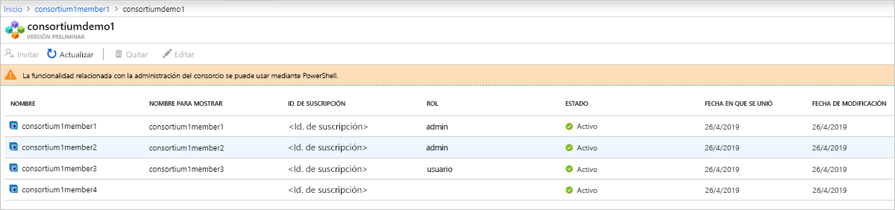

# ¿Qué es Azure Blockchain Service?

Azure Blockchain Service es un servicio de libro de contabilidad totalmente administrado que permite a los usuarios la capacidad de crecer y trabajar con redes de la cadena de bloques a escala en Azure. Al proporcionar un control unificado para administración de la infraestructura así como gobierno de la red de blockchain, cadena de bloques de Azure Service proporciona:

* Operaciones e implementación de red simple
* Administración de consorcios integrada
* Desarrollar los contratos inteligentes con herramientas de desarrollo conocidas

Azure Blockchain Service está diseñado para admitir varios protocolos de libro de contabilidad. Actualmente, ofrece compatibilidad con la Ethereum [quórum](https://www.jpmorgan.com/Quorum) utilizando el libro de contabilidad el [IBFT](https://github.com/jpmorganchase/quorum/wiki/Quorum-Consensus) mecanismo de consenso.

Estas funcionalidades no requieren casi ninguna tarea de administración y todas se proporcionan sin ningún costo adicional. Puede centrarse en el desarrollo de aplicaciones y lógica de negocios en lugar de tiempo y recursos para administrar las máquinas virtuales y la infraestructura. Además, puede seguir desarrollar su aplicación con la plataforma de su elección para entregar las soluciones sin tener que aprender nuevas habilidades y herramientas de código abierto.

## Implementación de la red y las operaciones

Implementación de servicio de la cadena de bloques de Azure puede realizarse a través del portal de Azure, CLI de Azure, así como a través de Visual Studio code mediante la extensión de Azure Blockchain.  Se simplifica la implementación, incluido el aprovisionamiento de la transacción y validador de nodos, redes virtuales de Azure para el aislamiento de seguridad, así como almacenamiento administrado por el servicio.  Además, al implementar a un nuevo miembro de la cadena de bloques, los usuarios también crean o unirse, un consorcio.  Salvaguarda habilitar varias entidades en diferentes suscripciones de Azure poder comunicarse entre sí de forma segura en una cadena de bloques compartido.  Esta implementación simplificada reduce la implementación de red de cadena de bloques de días a minutos.

### Niveles de rendimiento y servicio

El servicio de la cadena de bloques de Azure ofrece dos niveles de servicio: *Básico* y *estándar*. Cada nivel ofrece un rendimiento diferente y capacidades para admitir el desarrollo ligera y probar las cargas de trabajo hasta masivo escalan implementaciones de la cadena de bloques de producción. Ambos niveles incluyen el nodo de al menos una transacción y un nodo de control de validación (Basic) o dos nodos validador (estándar).

Además de ofrecer dos nodos de control de validación, el *estándar* nivel proporciona 2 *núcleos virtuales* para cada nodo de la transacción y un validador, mientras que el nivel básico ofrece una configuración de memoria con núcleo virtual 1.  Ofreciendo 2 núcleos virtuales para los nodos de la transacción y un validador de 1 núcleo virtual se puede dedicar al libro de contabilidad de quórum mientras el resto 1 núcleo virtual puede usarse para otros servicios relacionados con la infraestructura, lo que garantiza un rendimiento óptimo para la producción de las cargas de trabajo de la cadena de bloques. Para obtener más información sobre los detalles de precios, consulte [precios de Azure Blockchain Service](https://azure.microsoft.com/pricing/details/blockchain-service).

### Seguridad y mantenimiento

Después de aprovisionar al primer miembro de la cadena de bloques, tiene la capacidad de agregar nodos de transacciones adicionales a sus miembros.  De forma predeterminada, los nodos de la transacción se protegen mediante las reglas de firewall y deben configurarse para el acceso.  Además, todos los nodos de transacción cifrar datos en tránsito a través de TLS.  Existen varias opciones para proteger el acceso del nodo de transacciones, incluidas las reglas de firewall, autenticación básica, las claves de acceso, así como integración de Azure Active Directory. Para obtener más información, consulte [configurar los nodos de la transacción](configure-transaction-nodes.md) y [configurar el acceso de Azure Active Directory](configure-aad.md).

Como un servicio administrado, Azure Blockchain servicio garantiza que se debe haber revisado los nodos del miembro de la cadena de bloques con el host más reciente de funcionamiento de las actualizaciones de pila de software del sistema y la contabilidad, configurado para alta disponibilidad (solo nivel estándar), lo que elimina gran parte de la DevOps se requiere para los nodos de cadena de bloques de IaaS tradicionales.  Para obtener más información sobre la aplicación de revisiones y actualizaciones, consulte [admite las versiones de libro de contabilidad de servicio de Azure Blockchain](ledger-versions.md).

### Supervisión y registro

Además, Azure Blockchain Service proporciona métricas enriquecidas a través de Azure Monitor de servicio que proporciona información sobre los nodos de CPU, memoria y uso de almacenamiento, así como información muy útil en la actividad de red de cadena de bloques, como transacciones y bloques extraídos, profundidad de cola de transacciones, así como las conexiones activas.  Las métricas se pueden personalizar para proporcionar vistas de la información que son importantes para la aplicación de cadena de bloques.  Además, los umbrales se pueden definir a través de alertas permite a los usuarios desencadenar acciones como enviar un mensaje de texto o correo electrónico, ejecutar una aplicación lógica, en función de Azure o enviar a un webhook personalizado.

A través de Azure Log Analytics, los usuarios pueden ver los registros relacionados con el libro de contabilidad de quórum, u otras conexiones de información importante, como se ha intentado a los nodos de la transacción.

## Administración de consorcios integrada

Al implementar a su primer miembro de la cadena de bloques, une o crea un consorcio nuevo.  Un consorcio es un grupo lógico que se usa para administrar el gobierno y la conectividad entre los miembros de la cadena de bloques que operar en un proceso de varias parte.  Azure Blockchain Service proporciona controles integrados a través de los contratos inteligentes predefinidos, que determinan qué pueden hacer los miembros de acciones en el consorcio.  Estos controles se pueden personalizar según sea necesario por el administrador del consorcio. Cuando creas un consorcio nuevo, el miembro de la cadena de bloques es el administrador predeterminado del consorcio, habilitar la capacidad para invitar a otras partes para unir el consorcio.  Puede unir un consorcio solo si ha sido invitado anteriormente.  Al combinar un consorcio, es miembro de la cadena de bloques sujetos a los controles de gobierno impuestos por el administrador del consorcio.

Las acciones de administración del consorcio como agregar y quitar a miembros de un consorcio pueden obtenerse a través de PowerShell y una API de REST. Puede administrar mediante programación un consorcio utilizando las interfaces más habituales en lugar de modificar y enviar los contratos inteligentes en función de solidity. Para obtener más información, consulte [administración consortium](consortium.md).

## Desarrollar con herramientas de desarrollo conocidas

Según el libro de contabilidad de quórum Ethereum abierto, puede desarrollar aplicaciones para el servicio de Azure Blockchain la misma manera como lo hace para las aplicaciones existentes de Ethereum. Trabajar con socios de líderes del sector, la extensión de Azure Blockchain Development Kit Visual Studio Code permite a los desarrolladores aprovechar herramientas conocidas como Truffle Suite para generar los contratos inteligentes. Con la extensión del Kit de desarrollo de Azure Blockchain, pueden crear o conectarse a los desarrolladores y consortium existente para que se puede compilar e implementar su inteligente todos los contratos desde un único IDE. Con la extensión de Azure Blockchain Visual Studio Code, puede crear o conectarse a un consorcio existente para que se puede compilar e implementar sus contratos inteligentes todo desde un mismo IDE. Para obtener más información, consulte [Kit de desarrollo de la cadena de bloques de Azure en marketplace de VS Code](https://aka.ms/vscodebcextension) y [Guía de usuario del Kit de desarrollo de Azure Blockchain](https://aka.ms/vscodebcextensionwiki ).

## Soporte y comentarios

¿Necesita ayuda o tiene algún comentario?

* Visite el [blog de Azure Blockchain](https://azure.microsoft.com/blog/topics/blockchain/), [Microsoft Tech Community](https://techcommunity.microsoft.com/t5/Blockchain/bd-p/AzureBlockchain), y [foro de Azure Blockchain](https://social.msdn.microsoft.com/Forums/home?forum=azureblockchain).
* Para proporcionar comentarios o solicitar nuevas características, cree una entrada mediante [UserVoice](https://feedback.azure.com/forums/921130-azure-blockchain-service).

## Pasos siguientes

Para empezar, pruebe un inicio rápido o conocer más detalles de estos recursos.
* [Crear un miembro de cadena de bloques con Azure portal](create-member.md) o [crear un miembro de la cadena de bloques mediante la CLI de Azure](create-member-cli.md)
* Para comparaciones de costos y calculadoras de, consulte el [página de precios](https://azure.microsoft.com/pricing/details/blockchain-service).
* Compile su primera aplicación con el [Kit de desarrollo de Azure Blockchain](https://github.com/Azure-Samples/blockchain-devkit)
* Extensión de Azure Blockchain VSCode [Guía del usuario](https://github.com/Microsoft/vscode-azure-blockchain-ethereum/wiki)
