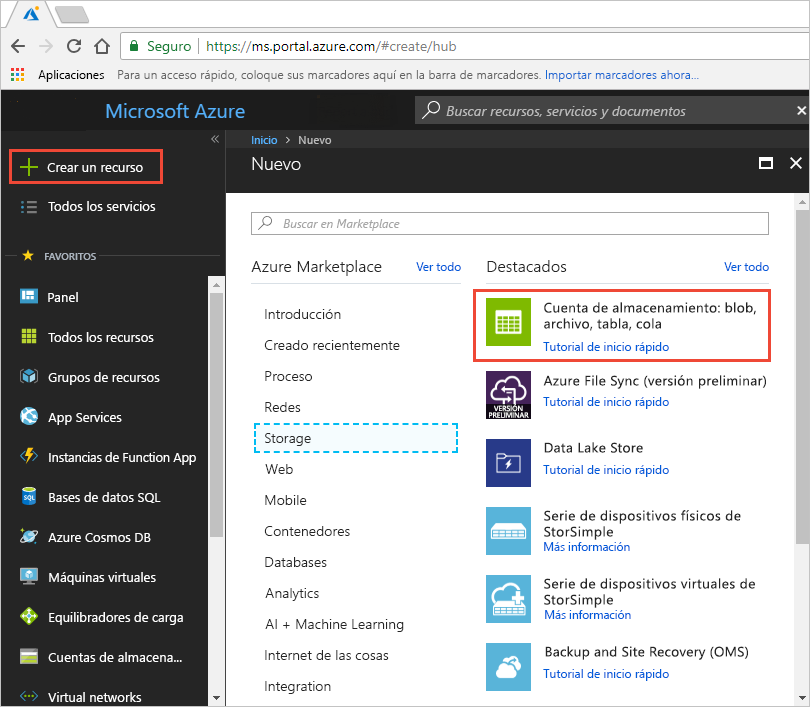
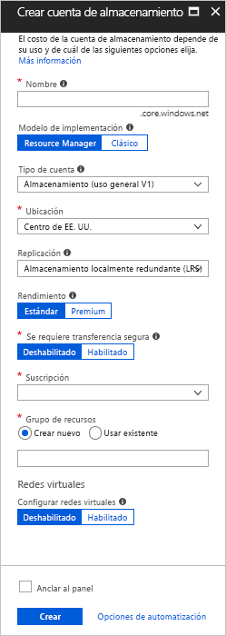
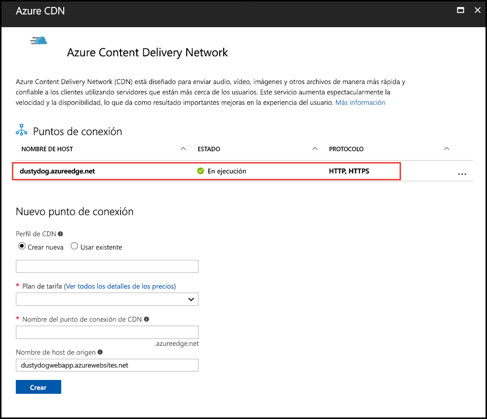
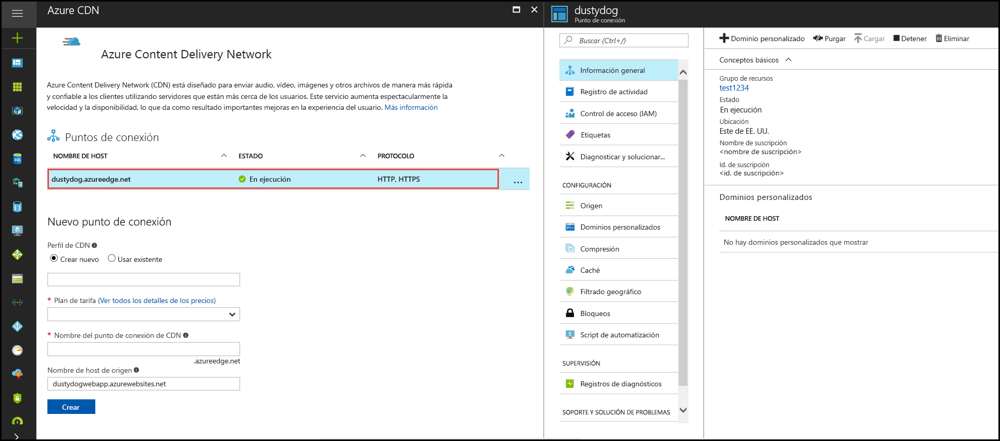

# Guía de inicio rápido: Integración de una cuenta de Azure Storage con Azure CDN
En esta guía de inicio rápido, habilitará [Azure Content Delivery Network (CDN)](cdn-overview.md) para almacenar en caché el contenido de Azure Storage. Azure CDN ofrece a los desarrolladores una solución global para entregar contenido con alto ancho de banda. Es posible almacenar en caché blobs y contenido estático de instancias de proceso en nodos físicos en los Estados Unidos, Europa, Asia, Australia y Sudamérica.

[!INCLUDE [quickstarts-free-trial-note](../../includes/quickstarts-free-trial-note.md)]

## Iniciar sesión en Azure Portal
Inicie sesión en [Azure Portal](https://portal.azure.com) con su cuenta de Azure.

## Crear una cuenta de almacenamiento
Use el siguiente procedimiento para crear una nueva cuenta de almacenamiento para una suscripción de Azure. Una cuenta de almacenamiento proporciona acceso a los servicios de Azure Storage. La cuenta de almacenamiento representa el máximo nivel del espacio de nombres para el acceso a todos los componentes del servicio Azure Storage: Azure Blob, Queue y Table Storage. Para más información, consulte [Introducción a Microsoft Azure Storage](../storage/common/storage-introduction.md).

Para crear una cuenta de almacenamiento, debe ser administrador del servicio o coadministrador de la suscripción asociada.

Se pueden usar varios métodos para crear una cuenta de almacenamiento, incluido Azure Portal y Powershell. En esta guía de inicio rápido se muestra cómo usar Azure Portal.   

**Para crear una cuenta de almacenamiento para una suscripción de Azure**

1. En Azure Portal, en la parte superior izquierda, seleccione **Crear un recurso**. 

    Aparece el panel **Nuevos**.

2. Seleccione **Storage** y, a continuación, seleccione **Storage account - blob, file, table, queue** (Cuenta de almacenamiento: blob, archivo, tabla, cola).
    
    

    Aparece el panel **Crear cuenta de almacenamiento**.   

    

3. En el cuadro **Nombre**, escriba un nombre de subdominio. Esta entrada puede contener de 3 a 24 letras minúsculas y números.
   
    Este valor se convierte en el nombre del host dentro del URI que se ha usado para direccionar los recursos de blob, cola o tabla de la suscripción. Para direccionar un recurso de contenedor en Blob Storage, use un URI con el siguiente formato:
   
    http://*&lt;StorageAcountLabel&gt;*.blob.core.windows.net/*&lt;mycontainer&gt;*

    donde *&lt;StorageAccountLabel&gt;* hace referencia al valor especificado en el cuadro **Nombre**.
   
    > [!IMPORTANT]    
    > La etiqueta de URL forma el subdominio del URI de la cuenta de almacenamiento y debe ser único entre todos los servicios hospedados en Azure.
   
    Este valor también se usa como nombre de la cuenta de almacenamiento en el portal o en el acceso a esta cuenta mediante programación.
    
4. En el resto de la configuración, utilice los valores especificados en la tabla siguiente:

    | Configuración  | Valor |
    | -------- | ----- |
    | **Modelo de implementación** | Use el valor predeterminado. |
    | **Tipo de cuenta** | Use el valor predeterminado. |
    | **Ubicación**    | Seleccione **Centro de EE. UU.** en la lista desplegable. |
    | **Replicación** | Use el valor predeterminado. |
    | **Rendimiento** | Use el valor predeterminado. |
    | **Se requiere transferencia segura** | Use el valor predeterminado. |
    | **Suscripción** | Seleccione una suscripción de Azure en la lista desplegable. |
    | **Grupos de recursos** | Seleccione **Crear nuevo** y escriba *my-resource-group-123* y un nombre para el nuevo grupo de recursos. Este nombre debe ser único globalmente. Si ya está en uso, puede especificar un nombre diferente o puede seleccionar **Usar existente** y seleccionar **my-resource-group-123** en la lista desplegable.  Para más información sobre los grupos de recursos, consulte [Información general sobre Azure Resource Manager](../azure-resource-manager/resource-group-overview.md#resource-groups).| 
    | **Configuración de redes virtuales** | Use el valor predeterminado. |  
    
5. Seleccione **Anclar al panel** para guardar la cuenta de almacenamiento en el panel después de su creación.
    
6. Seleccione **Crear**. La creación de la cuenta de almacenamiento podría tardar varios minutos en finalizar.

## Habilitación de Azure CDN para la cuenta de almacenamiento

Puede habilitar Azure CDN para la cuenta de almacenamiento directamente desde esta. Si quiere especificar valores de configuración avanzados para el punto de conexión de CDN, como la [optimización de la descarga de archivos grandes](cdn-optimization-overview.md#large-file-download), puede usar la [extensión Azure CDN](cdn-create-new-endpoint.md) para crear un perfil y un punto de conexión de CDN.

1. Seleccione una cuenta de almacenamiento del panel y luego seleccione **Azure CDN** en el panel izquierdo. Si el botón **Azure CDN** no está visible inmediatamente, puede escribir CDN en el cuadro **Buscar** del panel izquierdo para localizarlo.
    
    Aparece la página **Azure CDN**.

    
    
2. Para crear un nuevo punto de conexión, escriba la información necesaria que se especifica en la tabla siguiente:

    | Configuración  | Valor |
    | -------- | ----- |
    | **Perfil de CDN** | Seleccione **Crear nuevo** y escriba *my-cdn-profile-123* para el nombre de perfil. Este nombre debe ser único globalmente; si ya está en uso, puede especificar otro diferente.  |
    | **Plan de tarifa** | Seleccione **Verizon estándar** en la lista desplegable. |
    | **Nombre del punto de conexión de CDN** | Escriba *my-endpoint-123* para el nombre de host del punto de conexión. Este nombre debe ser único globalmente; si ya está en uso, puede especificar otro diferente. Este nombre se usa para acceder a los recursos almacenados en caché en el dominio _&lt;nombre del punto de conexión&gt;_.azureedge.net. De forma predeterminada, un nuevo punto de conexión de CDN usa el nombre de host de la cuenta de almacenamiento como servidor de origen.|

3. Seleccione **Crear**. Después de que se crea el punto de conexión, aparece en la lista de puntos de conexión.

    

## Habilitación de características adicionales de CDN
En el página **Azure CDN** de la cuenta de almacenamiento, seleccione el punto de conexión de CDN de la lista para abrir la página de configuración del punto de conexión de CDN. Desde esta página, puede habilitar características adicionales de CDN para la entrega, como la [compresión](cdn-improve-performance.md), el [almacenamiento en memoria caché de la cadena de consulta](cdn-query-string.md) y el [filtrado geográfico](cdn-restrict-access-by-country.md). 
    

## Habilitar SAS
Si quiere conceder acceso limitado a los contenedores de almacenamiento privado, puede usar la característica de firma de acceso compartido (SAS) de la cuenta de Azure Storage. Una SAS es un identificador URI que concede derechos de acceso restringido a los recursos de Azure Storage sin exponer la clave de cuenta. Para obtener más información, vea [Uso de la red Azure CDN con SAS](cdn-sas-storage-support.md).

## Obtener acceso a su contenido de la red CDN
Para obtener acceso al contenido almacenado en la memoria caché de la red CDN, use la URL de la red CDN que se le ha proporcionado en el portal. La dirección de un blob en caché tiene el siguiente formato:

http://<*EndpointName*\>.azureedge.net/<*myPublicContainer*\>/<*BlobName*\>

> [!NOTE]
> Después de habilitar el acceso de Azure CDN a una cuenta de almacenamiento, todos los objetos disponibles de forma pública se pueden almacenar en caché en el POP de la red CDN. Si modifica un objeto que está almacenado actualmente en caché en la red CDN, el nuevo contenido no estará disponible a través de Azure CDN hasta que Azure CDN actualice su contenido al cumplir el período de vida del contenido almacenado en caché.

## Eliminación de contenido de Azure CDN
Si ya no desea almacenar en caché un objeto en Azure CDN, puede realizar uno de los siguientes pasos:

* Convierta el contenedor en privado en lugar de público. Para más información, consulte [Administración del acceso de lectura anónimo a contenedores y blobs](../storage/blobs/storage-manage-access-to-resources.md).
* Deshabilite o elimine el punto de conexión de CDN mediante Azure Portal.
* Modifique su servicio hospedado para no seguir respondiendo a las solicitudes del objeto.

Un objeto que ya está almacenado en caché en Azure CDN permanece en caché hasta que cumple el período de vida del objeto o hasta que se [purgue](cdn-purge-endpoint.md) el punto de conexión. Al cumplir el período de vida, Azure CDN determina si el punto de conexión de CDN sigue siendo válido y si el objeto sigue siendo accesible de forma anónima. En caso negativo, el objeto dejará de estar almacenado en caché.

## Limpieza de recursos
En los pasos anteriores, ha creado un perfil y un punto de conexión de CDN en un grupo de recursos. Guarde estos recursos si desea continuar con los [Pasos siguientes](#next-steps) y aprender cómo agregar un dominio personalizado al punto de conexión. No obstante, si no cree que vaya a necesitar estos recursos en el futuro, puede eliminarlos mediante la eliminación del grupo de recursos y así evitar cargos adicionales:

1. En el menú izquierdo de Azure Portal, seleccione **Grupos de recursos** y, a continuación, seleccione **my-resource-group-123**.

2. En la página **Grupo de recursos**, seleccione **Eliminar grupo de recursos**, escriba *my-resource-group-123* en el cuadro de texto y, a continuación, seleccione **Eliminar**.

    Esta acción eliminará el grupo de recursos, el perfil y el punto de conexión que creó en esta guía de inicio rápido.

3. Para eliminar la cuenta de almacenamiento, selecciónela en el panel y, a continuación, seleccione **Eliminar** en el menú superior.

## Pasos siguientes
Para obtener información sobre cómo agregar un dominio personalizado y habilitar HTTPS en el punto de conexión de CDN, vea el tutorial siguiente:

> [!div class="nextstepaction"]
> [Tutorial: Acceso a blobs mediante un dominio personalizado a través de HTTPS](cdn-storage-custom-domain-https.md)

