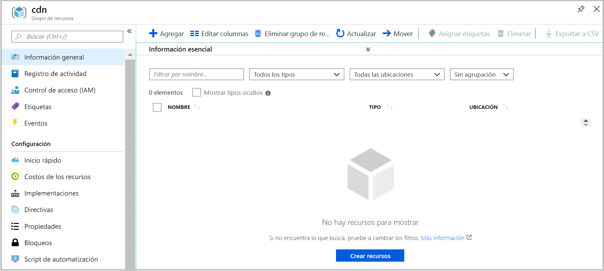

# <a name="quickstart-create-an-azure-cdn-profile-and-endpoint-using-resource-manager-template"></a>Inicio rápido: Creación de un perfil y un punto de conexión de Azure CDN mediante una plantilla de Resource Manager

En esta guía de inicio rápido, implementará una plantilla de Azure Resource Manager mediante la CLI. La plantilla que cree implementa un perfil de CDN y un punto de conexión de CDN que se coloca en la parte delantera de la aplicación web.
Tardará unos diez minutos en completar estos pasos.

[!INCLUDE [quickstarts-free-trial-note](../../includes/quickstarts-free-trial-note.md)]

## <a name="prequisites"></a>Requisitos previos

Para los fines de este inicio rápido, debe tener una aplicación web que se usará como su origen. El ejemplo de aplicación web que se usa en este inicio rápido se implementó en https://cdndemo.azurewebsites.net

Para obtener más información, consulte [Creación de una aplicación web HTML estática en Azure](https://docs.microsoft.com/azure/app-service/app-service-web-get-started-html).

## <a name="create-a-resource-group"></a>Crear un grupo de recursos

Todos los recursos se deben implementar en el mismo grupo de recursos.

Cree el grupo de recursos en la ubicación que seleccione. En este ejemplo se muestra la creación de un grupo de recursos denominado cdn en la ubicación Este de EE. UU.

```bash
az group create --name cdn --location eastus
```



## <a name="create-the-resource-manager-template"></a>Creación de la plantilla de Resource Manager

En este paso, creará un archivo de plantilla que implementa los recursos.

Aunque este ejemplo le guía a través de un escenario de aceleración de sitio web general, hay muchas otras configuraciones que se pueden definir. Estas opciones están disponibles en la referencia de plantilla de Azure Resource Manager. Consulte las referencias del [perfil de CDN](https://docs.microsoft.com/azure/templates/microsoft.cdn/2017-10-12/profiles) y el [punto de conexión del perfil de CDN](https://docs.microsoft.com/azure/templates/microsoft.cdn/2017-10-12/profiles/endpoints).

Tenga en cuenta que Microsoft CDN no admite la modificación de la lista de tipo de contenido.

Guarde la plantilla como **resource-manager-cdn.json**.

```json
{
    "$schema": "https://schema.management.azure.com/schemas/2015-01-01/deploymentTemplate.json#",
    "contentVersion": "1.0.0.0",
    "parameters": {
        "cdnProfileSku": {
            "type": "string",
            "allowedValues": [
                "Standard_Microsoft",
                "Standard_Akamai",
                "Standard_Verizon",
                "Premium_Verizon"
            ]
        },
        "endpointOriginHostName": {
            "type": "string"
        }
    },
    "variables": {
        "profile": {
            "name": "[replace(toLower(parameters('cdnProfileSku')), '_', '-')]"
        },
        "endpoint": {
            "name": "[replace(toLower(parameters('endpointOriginHostName')), '.', '-')]",
            "originHostName": "[parameters('endpointOriginHostName')]"
        }
    },
    "resources": [
        {
            "type": "Microsoft.Cdn/profiles",
            "apiVersion": "2017-10-12",
            "location": "[resourceGroup().location]",
            "name": "[variables('profile').name]",
            "sku": {
                "name": "[parameters('cdnProfileSku')]"
            }
        },
        {
            "dependsOn": [
                "[resourceId('Microsoft.Cdn/profiles', variables('profile').name)]"
            ],
            "type": "Microsoft.Cdn/profiles/endpoints",
            "apiVersion": "2017-10-12",
            "location": "[resourceGroup().location]",
            "name": "[concat(variables('profile').name, '/', variables('endpoint').name)]",
            "properties": {
                "hostName": "[concat(variables('endpoint').name, '.azureedge.net')]",
                "originHostHeader": "[variables('endpoint').originHostName]",
                "isHttpAllowed": true,
                "isHttpsAllowed": true,
                "queryStringCachingBehavior": "IgnoreQueryString",
                "origins": [
                    {
                        "name": "[replace(variables('endpoint').originHostName, '.', '-')]",
                        "properties": {
                            "hostName": "[variables('endpoint').originHostName]",
                            "httpPort": 80,
                            "httpsPort": 443
                        }
                    }
                ],
                "contentTypesToCompress": [
                    "application/eot",
                    "application/font",
                    "application/font-sfnt",
                    "application/javascript",
                    "application/json",
                    "application/opentype",
                    "application/otf",
                    "application/pkcs7-mime",
                    "application/truetype",
                    "application/ttf",
                    "application/vnd.ms-fontobject",
                    "application/xhtml+xml",
                    "application/xml",
                    "application/xml+rss",
                    "application/x-font-opentype",
                    "application/x-font-truetype",
                    "application/x-font-ttf",
                    "application/x-httpd-cgi",
                    "application/x-javascript",
                    "application/x-mpegurl",
                    "application/x-opentype",
                    "application/x-otf",
                    "application/x-perl",
                    "application/x-ttf",
                    "font/eot",
                    "font/ttf",
                    "font/otf",
                    "font/opentype",
                    "image/svg+xml",
                    "text/css",
                    "text/csv",
                    "text/html",
                    "text/javascript",
                    "text/js",
                    "text/plain",
                    "text/richtext",
                    "text/tab-separated-values",
                    "text/xml",
                    "text/x-script",
                    "text/x-component",
                    "text/x-java-source"
                ],
                "isCompressionEnabled": true,
                "optimizationType": "GeneralWebDelivery"
            }
        }
    ],
    "outputs": {
        "cdnUrl": {
            "type": "string",
            "value": "[concat('https://', variables('endpoint').name, '.azureedge.net')]"
        }
    }
}
```

## <a name="create-the-resources"></a>Creación de los recursos

Implemente la plantilla mediante la CLI de Azure. Se le pedirá que proporcione dos informaciones:

**cdnProfileSku**: el proveedor de CDN que desea usar. Las opciones son:

* Standard_Microsoft
* Standard_Akamai
* Standard_Verizon
* Premium_Verizon.

**endpointOriginHostName**: el punto de conexión que se atenderá a través de la red CDN, por ejemplo, cdndemo.azurewebsites.net.

```bash
az group deployment create --resource-group cdn --template-file arm-cdn.json
```


## <a name="view-the-cdn-profile"></a>Visualización del perfil de CDN

```bash
az cdn profile list --resource-group cdn -o table
```


## <a name="view-the-cdn-endpoint-for-the-profile-standard-microsoft"></a>Visualización del punto de conexión de CDN para el perfil standard-microsoft

```bash
az cdn endpoint list --profile-name standard-microsoft --resource-group cdn -o table
```


Utilice el nombre de host para ver el contenido. Por ejemplo, acceda a https://cdndemo-azurewebsites-net.azureedge.net mediante el explorador.

## <a name="clean-up"></a>Limpieza

La eliminación del grupo de recursos quitará automáticamente todos los recursos que se implementaron en él.

```bash
az group delete --name cdn
```


## <a name="references"></a>Referencias

* Perfil de CDN: [Azure Resource Manager Template Reference](https://docs.microsoft.com/azure/templates/microsoft.cdn/2017-10-12/profiles) (Referencia de plantilla de Azure Resource Manager)
* Punto de conexión de CDN: [Azure Resource Manager Template Reference Documentation](https://docs.microsoft.com/azure/templates/microsoft.cdn/2017-10-12/profiles/endpoints) (Documentación de referencia de plantilla de Azure Resource Manager)

## <a name="next-steps"></a>Pasos siguientes

Para obtener información acerca de cómo agregar un dominio personalizado al punto de conexión de CDN, consulte el tutorial siguiente:

> [!div class="nextstepaction"]
> [Tutorial: Adición de un dominio personalizado a un punto de conexión de Azure CDN](cdn-map-content-to-custom-domain.md)
