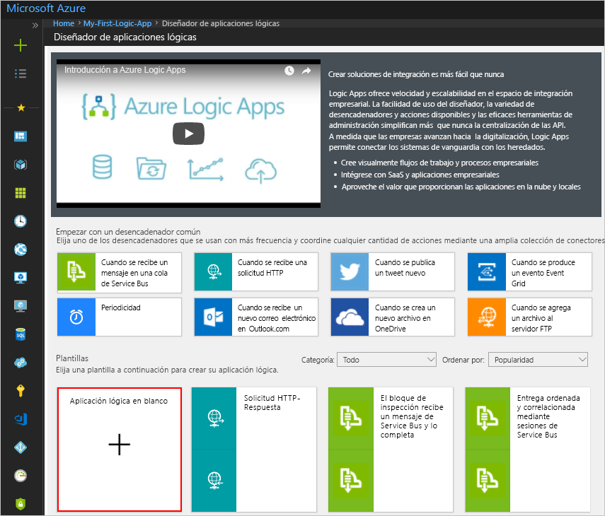

# <a name="tutorial-use-form-recognizer-with-azure-logic-apps-to-analyze-invoices"></a>Tutorial: Uso de Form Recognizer con Azure Logic Apps para analizar facturas

En este tutorial, creará un flujo de trabajo en Azure Logic Apps que use Form Recognizer, un servicio que forma parte del conjunto de Azure Cognitive Services y que sirve para extraer datos de facturas. En primer lugar, entrene un modelo de Form Recognizer mediante un conjunto de datos de ejemplo y, después, pruebe el modelo en otro conjunto de datos.

Este tutorial abarca lo siguiente:

> [!div class="checklist"]
> * Solicitud de acceso para Form Recognizer
> * Creación de un contenedor de blobs de Azure Storage
> * Carga de datos de ejemplo en el contenedor de blobs de Azure
> * Creación de una instancia de Azure Logic App
> * Configuración de la aplicación lógica para usar un recurso de Form Recognizer
> * Prueba del flujo de trabajo mediante la ejecución de la aplicación lógica

## <a name="prerequisites"></a>Prerequisites

* Una suscripción a Azure: [cree una cuenta gratuita](https://azure.microsoft.com/free/).

## <a name="request-access-for-form-recognizer"></a>Solicitud de acceso para Form Recognizer

Form Recognizer está disponible como versión preliminar de acceso limitado. Para acceder a la versión preliminar, rellene y envíe el formulario [Solicitud de acceso de Form Recognizer](https://aka.ms/FormRecognizerRequestAccess). Cuando el equipo de Azure Cognitive Services apruebe la solicitud, recibirá un correo electrónico con instrucciones para acceder al servicio.

## <a name="understand-the-invoice-to-be-analyzed"></a>Información de la factura que se va a analizar

El conjunto de datos de ejemplo que va a usar para entrenar el modelo y probarlo está disponible como archivo. zip en [GitHub](https://go.microsoft.com/fwlink/?linkid=2090451). Descargue y extraiga el archivo .zip y abra un archivo PDF de factura en la carpeta **/Train**. Observe que tiene una tabla con el número de factura, la fecha de factura, etc. 

> [!div class="mx-imgBorder"]
> 

En este tutorial aprenderá a usar un flujo de trabajo de Azure Logic Apps para extraer la información de tablas como estas en formato JSON.

## <a name="create-an-azure-storage-blob-container"></a>Creación de un contenedor de blobs de Azure Storage

Este contenedor se usa para cargar datos de ejemplo necesarios para entrenar el modelo.

1. Siga las instrucciones de [Creación de una cuenta de Azure Storage](../../storage/common/storage-account-create.md) para crear una cuenta de almacenamiento. Use **formrecostorage** como nombre de cuenta de almacenamiento.
1. Siga las instrucciones de [Creación de un contenedor de blobs de Azure](../../storage/blobs/storage-quickstart-blobs-portal.md) para crear un contenedor en la cuenta de Azure Storage. Use **formrecocontainer** como nombre del contenedor. Asegúrese de establecer el nivel de acceso público en **Contenedor (acceso de lectura anónimo para contenedores y blobs)** .

    > [!div class="mx-imgBorder"]
    > 

## <a name="upload-sample-data-to-the-azure-blob-container"></a>Carga de datos de ejemplo en el contenedor de blobs de Azure

Descargue los datos de ejemplo disponibles en [GitHub](https://go.microsoft.com/fwlink/?linkid=2090451). Extraiga los datos en una carpeta local y cargue el contenido de la carpeta **/Train** en el contenedor **formrecocontainer** que creó anteriormente. Siga las instrucciones que se indican en [Carga de un blob en bloques](../../storage/blobs/storage-quickstart-blobs-portal.md#upload-a-block-blob) para cargar datos en un contenedor.

Copie la dirección URL del contenedor. Esta dirección URL se necesitará más adelante en el tutorial. Si ha creado la cuenta de almacenamiento y el contenedor con los mismos nombres que se muestran en este tutorial, la dirección URL será *https:\//formrecostorage.blob.core.windows.net/formrecocontainer/* .

## <a name="create-a-form-recognizer-resource"></a>Creación de un recurso de Form Recognizer

[!INCLUDE [create resource](./includes/create-resource.md)]

## <a name="create-your-logic-app"></a>Creación de una aplicación lógica

Puede usar Azure Logic Apps para automatizar y organizar tareas y flujos de trabajo. En este tutorial, creará una aplicación lógica que se desencadenará al recibir una factura que desee analizar como datos adjuntos de correo electrónico. En este flujo de trabajo se realizan las siguientes tareas:
* Configure la aplicación lógica para que se desencadene automáticamente cuando reciba un correo electrónico con una factura adjunta.
* Configure la aplicación lógica para que use una operación de **entrenamiento de modelo** de Form Recognizer para entrenar un modelo con los datos de ejemplo que cargó en el almacenamiento de blobs de Azure.
* Configure la aplicación lógica para que use una operación de **análisis de formulario** de Form Recognizer para usar el modelo que ya ha entrenado. Este componente analizará la factura que se proporciona a esta aplicación lógica según el modelo entrenado anteriormente.

siga estos pasos para configurar el flujo de trabajo.

1. En el menú principal de Azure, seleccione **Crear un recurso** > **Integración** > **Aplicación lógica**.

1. En **Crear aplicación lógica**, proporcione información sobre la aplicación lógica, como se muestra a continuación. Seleccione **Crear** cuando haya terminado.

   | Propiedad | Value | Descripción |
   |----------|-------|-------------|
   | **Nombre** | <*nombre-de-la-aplicación-lógica*> | El nombre de la aplicación lógica, que solo puede contener letras, números,guiones (`-`), caracteres de subrayado (`_`), paréntesis (`(`,`)`) y puntos (`.`). En este ejemplo se usa "My-First-Logic-App". |
   | **Suscripción** | <*Azure-subscription-name*> | El nombre de la suscripción de Azure |
   | **Grupos de recursos** | <*nombre del grupo de recursos de Azure*> | Nombre del [grupo de recursos de Azure](./../../azure-resource-manager/management/overview.md) que se utiliza para organizar recursos relacionados. En este ejemplo se usa "My-First-LA-RG". |
   | **Ubicación** | <*Azure-region*> | La región en la que desea almacenar la información de la aplicación lógica. En este ejemplo se utiliza "Oeste de EE. UU.". |
   | **Log Analytics** | Off | Mantenga el valor **Off** para el registro de diagnóstico. |
   ||||

1. Una vez que Azure implemente la aplicación, en la barra de herramientas de Azure, seleccione **Notificaciones** > **Ir al recurso** para la aplicación lógica implementada. O también puede buscar y seleccionar la aplicación lógica escribiendo el nombre en el cuadro de búsqueda.

   El Diseñador de aplicación lógica se abre y muestra una página con un vídeo de introducción y desencadenadores utilizados frecuentemente. En **Plantillas**, elija **Blank Logic App**.

   > [!div class="mx-imgBorder"]
   > 

### <a name="configure-the-logic-app-to-trigger-the-workflow-when-an-email-arrives"></a>Configuración de la aplicación lógica para desencadenar el flujo de trabajo cuando se reciba un correo electrónico

En este tutorial, desencadenará el flujo de trabajo cuando se reciba un correo electrónico con una factura adjunta. En este tutorial, se usa Office 365 como servicio de correo electrónico, pero puede usar cualquier otro proveedor de correo electrónico que desee.

1. En las pestañas, seleccione Todo, seleccione **Office 365 Outlook** y, a continuación, en **Desencadenadores**, seleccione **Cuando llega un nuevo correo electrónico**.

    

1. En el cuadro **Office 365 Outlook**, haga clic en **Iniciar sesión** y escriba los datos de inicio de sesión de una cuenta de Office 365.

1. En el cuadro de diálogo siguiente, realice estos pasos:
    1. Seleccione la carpeta que debe supervisarse en la que se recibirá nuevo correo electrónico.
    1. En **Tiene datos adjuntos**, seleccione **Sí**. Esto garantiza que solo los mensajes de correo electrónico con datos adjuntos desencadenen el flujo de trabajo.
    1. En **Incluir datos adjuntos**, seleccione **Sí**. Esto garantiza que el contenido de los datos adjuntos se use en el procesamiento posterior.

        > [!div class="mx-imgBorder"]
        > 

1. Haga clic en **Guardar** en la barra de herramientas de la parte superior.

### <a name="configure-the-logic-app-to-use-form-recognizer-train-model-operation"></a>Configuración de la aplicación lógica para usar la operación de entrenamiento de modelo de Form Recognizer

Antes de usar el servicio Form Recognizer para analizar las facturas, debe entrenar un modelo proporcionándole algunos datos de facturas de ejemplo que el modelo puede analizar para aprender.

1. Seleccione **Nuevo paso** y, en **Elegir una acción**, busque **Form Recognizer**. En los resultados que se muestran, seleccione **Form Recognizer** y, a continuación, en las acciones que están disponibles para Form Recognizer, seleccione **Train Model** (Entrenar modelo).

    > [!div class="mx-imgBorder"]
    > 

1. En el cuadro de diálogo Form Recognizer, proporcione un nombre para la conexión y escriba la dirección URL del punto de conexión y la clave que recuperó para el recurso de Form Recognizer.

    > [!div class="mx-imgBorder"]
    > 

    Haga clic en **Crear**.

1. En el cuadro de diálogo **Train Model** (Entrenar modelo), en **Origen**, escriba la dirección URL del contenedor en el que ha cargado los datos de ejemplo.

    > [!div class="mx-imgBorder"]
    > 

1. Haga clic en **Guardar** en la barra de herramientas de la parte superior.

### <a name="configure-the-logic-app-to-use-the-form-recognizer-analyze-form-operation"></a>Configuración de la aplicación lógica para usar la operación de análisis de formulario de Form Recognizer

En esta sección, agregará la operación de **análisis de formulario** al flujo de trabajo. Esta operación usa el modelo ya entrenado para analizar una factura nueva que se proporciona a la aplicación lógica.

1. Seleccione **Nuevo paso** y, en **Elegir una acción**, busque **Form Recognizer**. En los resultados que se muestran, seleccione **Form Recognizer** y, a continuación, en las acciones que están disponibles para Form Recognizer, seleccione **Analyze Form** (Analizar formulario).

    > [!div class="mx-imgBorder"]
    > 

1. En el cuadro de diálogo **Analyze Form** (Analizar formulario), siga estos pasos:

    1. Haga clic en el cuadro de texto **Id. del modelo** y, en el cuadro de diálogo que se abre, en la pestaña **Contenido dinámico**, seleccione **modelId**. Al hacerlo, proporciona la aplicación de flujo con el identificador del modelo entrenado en la última sección.

        > [!div class="mx-imgBorder"]
        > 

    2. Haga clic en el cuadro de texto **Documento** y, en el cuadro de diálogo que se abre, en la pestaña **Contenido dinámico**, seleccione **Attachments Content** (Contenido de datos adjuntos). Así se configura el flujo para usar el archivo de factura de ejemplo que se adjunta en el correo electrónico que desencadena el flujo de trabajo.

        > [!div class="mx-imgBorder"]
        > 

1. Haga clic en **Guardar** en la barra de herramientas de la parte superior.

### <a name="extract-the-table-information-from-the-invoice"></a>Extracción de la información de tabla de la factura

En esta sección, se configura la aplicación lógica para extraer la información de tabla dentro de las facturas.

1. Seleccione **Agregar una acción**, en **Elegir una acción** busque **Redactar** y, en las acciones que están disponibles, seleccione **Redactar** de nuevo.
    

1. En el cuadro de diálogo **Redactar**, haga clic en el cuadro de texto **Entradas** y, en el cuadro de diálogo que aparece, seleccione **tablas**.

    > [!div class="mx-imgBorder"]
    > 

1. Haga clic en **Save**(Guardar).

## <a name="test-your-logic-app"></a>Comprobación de la aplicación lógica

Para probar la aplicación lógica, use las facturas de ejemplo de la carpeta **/Test** del conjunto de datos de ejemplo que descargó de [GitHub](https://go.microsoft.com/fwlink/?linkid=2090451). Siga estos pasos:

1. En el diseñador de Azure Logic Apps de la aplicación, seleccione **Ejecutar** en la barra de herramientas de la parte superior. El flujo de trabajo ahora está activo y espera a recibir un correo electrónico con la factura adjunta.
1. Envíe un correo electrónico con una factura de ejemplo adjunta a la dirección de correo electrónico que proporcionó al crear la aplicación lógica. Asegúrese de que el correo electrónico se entrega en la carpeta que proporcionó al configurar la aplicación lógica.
1. En cuanto se entregue el correo electrónico en la carpeta, el diseñador de Logic Apps mostrará una pantalla con el progreso de cada fase. En la captura de pantalla siguiente, verá que se ha recibido un correo electrónico con datos adjuntos y que el flujo de trabajo está en curso.

    > [!div class="mx-imgBorder"]
    > 

1. Una vez finalizada la ejecución de todas las fases del flujo de trabajo, el diseñador de Logic Apps muestra una casilla verde en cada fase. En la ventana del diseñador, seleccione **For each 2** (Para cada dos) y, a continuación, seleccione **Redactar**.

    > [!div class="mx-imgBorder"]
    > 

    En el cuadro **SALIDAS**, copie la salida y péguela en cualquier editor de texto.

1. Compare la salida JSON con la factura de ejemplo que envió como datos adjuntos en el correo electrónico. Compruebe que los datos JSON se corresponden con los datos de la tabla dentro de la factura.

    ```json
    [
      {
        "id": "table_0",
        "columns": [
          {
            "header": [
              {
                "text": "Invoice Number",
                "boundingBox": [
                  38.5,
                  585.2,
                  113.4,
                  585.2,
                  113.4,
                  575.8,
                  38.5,
                  575.8
                ]
              }
            ],
            "entries": [
              [
                {
                  "text": "7689302",
                  "boundingBox": [
                    38.5,
                    549.8,
                    77.3,
                    549.8,
                    77.3,
                    536.2,
                    38.5,
                    536.2
                  ],
                  "confidence": 1
                }
              ]
            ]
          },
          {
            "header": [
              {
                "text": "Invoice Date",
                "boundingBox": [
                  139.7,
                  585.2,
                  198.5,
                  585.2,
                  198.5,
                  575.8,
                  139.7,
                  575.8
                ]
              }
            ],
            "entries": [
              [
                {
                  "text": "3/09/2015",
                  "boundingBox": [
                    139.7,
                    548.1,
                    184,
                    548.1,
                    184,
                    536.2,
                    139.7,
                    536.2
                  ],
                  "confidence": 1
                }
              ]
            ]
          },
          {
            "header": [
              {
                "text": "Invoice Due Date",
                "boundingBox": [
                  240.5,
                  585.2,
                  321,
                  585.2,
                  321,
                  575.8,
                  240.5,
                  575.8
                ]
              }
            ],
            "entries": [
              [
                {
                  "text": "6/29/2016",
                  "boundingBox": [
                    240.5,
                    549,
                    284.8,
                    549,
                    284.8,
                    536.2,
                    240.5,
                    536.2
                  ],
                  "confidence": 1
                }
              ]
            ]
          },
          {
            "header": [
              {
                "text": "Charges",
                "boundingBox": [
                  341.3,
                  585.2,
                  381.2,
                  585.2,
                  381.2,
                  575.8,
                  341.3,
                  575.8
                ]
              }
            ],
            "entries": [
              [
                {
                  "text": "$22,123.24",
                  "boundingBox": [
                    380.6,
                    548.5,
                    430.5,
                    548.5,
                    430.5,
                    536.2,
                    380.6,
                    536.2
                  ],
                  "confidence": 1
                }
              ]
            ]
          },
          {
            "header": [
              {
                "text": "VAT ID",
                "boundingBox": [
                  442.1,
                  590,
                  474.8,
                  590,
                  474.8,
                  575.8,
                  442.1,
                  575.8
                ]
              }
            ],
            "entries": [
              [
                {
                  "text": "QR",
                  "boundingBox": [
                    447.7,
                    549.8,
                    462.6,
                    549.8,
                    462.6,
                    536.2,
                    447.7,
                    536.2
                  ],
                  "confidence": 1
                }
              ]
            ]
          }
        ]
      }
    ]
    ```
    Ha completado correctamente este tutorial.

## <a name="next-steps"></a>Pasos siguientes

En este tutorial, ha configurado un flujo de trabajo de Azure Logic Apps para usar Form Recognizer para entrenar un modelo y extraer el contenido de una factura. A continuación, obtenga información sobre cómo crear un conjunto de datos de entrenamiento para poder crear un escenario similar con sus propios formularios.

> [!div class="nextstepaction"]
> [Creación de un conjunto de datos de aprendizaje](build-training-data-set.md)