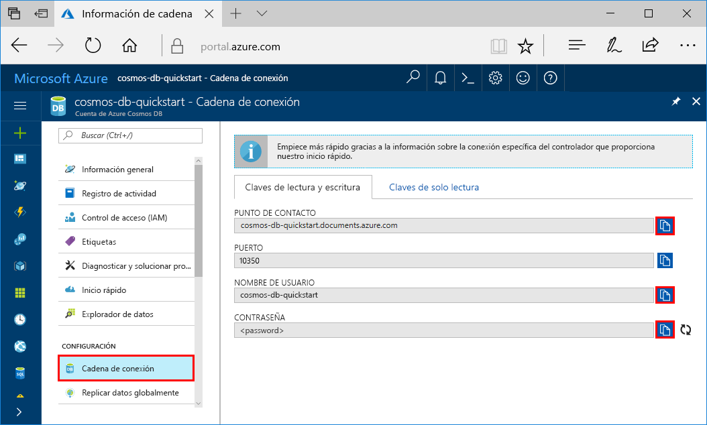

# <a name="quickstart-build-a-cassandra-app-with-net-sdk-and-azure-cosmos-db"></a>Inicio rápido: Creación de una aplicación de Cassandra con .NET SDK y Azure Cosmos DB

> [!div class="op_single_selector"]
> * [.NET](create-cassandra-dotnet.md)
> * [Java](create-cassandra-java.md)
> * [Node.js](create-cassandra-nodejs.md)
> * [Python](create-cassandra-python.md)
>  

Esta guía de inicio rápido muestra cómo se usan .NET y la [API de Cassandra](cassandra-introduction.md) de Azure Cosmos DB para compilar una aplicación de perfil mediante la clonación de un ejemplo de GitHub. En esta guía de inicio rápido también se muestra cómo usar Azure Portal basado en web para crear una cuenta de Azure Cosmos DB.

Azure Cosmos DB es un servicio de base de datos con varios modelos y de distribución global de Microsoft. Puede crear rápidamente bases de datos de documentos, tablas, clave-valor y grafos, y realizar consultas en ellas. Todas las bases de datos se beneficiarán de las funcionalidades de distribución global y escala horizontal en Azure Cosmos DB. 

## <a name="prerequisites"></a>Requisitos previos

[!INCLUDE [quickstarts-free-trial-note](../../includes/quickstarts-free-trial-note.md)] También puede [probar gratis Azure Cosmos DB](https://azure.microsoft.com/try/cosmosdb/) sin suscripción de Azure, sin cargos y sin compromiso.

Además, necesita: 
* Si todavía no tiene instalado Visual Studio 2017, puede descargar y usar la versión **gratis** de [Visual Studio 2017 Community Edition](https://www.visualstudio.com/downloads/). Asegúrese de que habilita **Desarrollo de Azure** durante la instalación de Visual Studio.
* Instale [Git](https://www.git-scm.com/) para clonar el ejemplo.

<a id="create-account"></a>
## <a name="create-a-database-account"></a>Creación de una cuenta de base de datos

[!INCLUDE [cosmos-db-create-dbaccount-cassandra](../../includes/cosmos-db-create-dbaccount-cassandra.md)]


## <a name="clone-the-sample-application"></a>Clonación de la aplicación de ejemplo

Ahora vamos a empezar a trabajar con el código. Vamos a clonar una aplicación de la API de Cassandra desde GitHub, establecer la cadena de conexión y ejecutarla. Verá lo fácil que es trabajar con datos mediante programación. 

1. Abra el símbolo del sistema. Cree una carpeta nueva denominada `git-samples`. Después cierre el símbolo del sistema.

    ```bash
    md "C:\git-samples"
    ```

2. Abra una ventana de terminal de Git, como git bash y utilice el comando `cd` para cambiar a la nueva carpeta para instalar la aplicación de ejemplo.

    ```bash
    cd "C:\git-samples"
    ```

3. Ejecute el comando siguiente para clonar el repositorio de ejemplo. Este comando crea una copia de la aplicación de ejemplo en el equipo.

    ```bash
    git clone https://github.com/Azure-Samples/azure-cosmos-db-cassandra-dotnet-getting-started.git
    ```

4. Luego abra el archivo de la solución CassandraQuickStartSample en Visual Studio. 

## <a name="review-the-code"></a>Revisión del código

Este paso es opcional. Si le interesa aprender cómo el código crea los recursos de base de datos, puede revisar los siguientes fragmentos de código. Los fragmentos de código se toman todos del archivo `Program.cs` instalado en la carpeta `C:\git-samples\azure-cosmos-db-cassandra-dotnet-getting-started\CassandraQuickStartSample`. En caso contrario, puede ir directamente a [Actualización de la cadena de conexión](#update-your-connection-string).

* Inicialice la sesión mediante la conexión a un punto de conexión del clúster de Cassandra. La API de Cassandra API en Azure Cosmos DB solo admite TLSv1.2. 

  ```csharp
   var options = new Cassandra.SSLOptions(SslProtocols.Tls12, true, ValidateServerCertificate);
   options.SetHostNameResolver((ipAddress) => CassandraContactPoint);
   Cluster cluster = Cluster.Builder().WithCredentials(UserName, Password).WithPort(CassandraPort).AddContactPoint(CassandraContactPoint).WithSSL(options).Build();
   ISession session = cluster.Connect();
   ```

* Cree un nuevo espacio de claves.

    ```csharp
    session.Execute("CREATE KEYSPACE uprofile WITH REPLICATION = { 'class' : 'NetworkTopologyStrategy', 'datacenter1' : 1 };"); 
    ```

* Cree una nueva tabla.

   ```csharp
  session.Execute("CREATE TABLE IF NOT EXISTS uprofile.user (user_id int PRIMARY KEY, user_name text, user_bcity text)");
   ```

* Inserte las entidades de usuario mediante el uso del objeto IMapper con una sesión nueva que se conecta al espacio de claves del perfil.

    ```csharp
    mapper.Insert<User>(new User(1, "LyubovK", "Dubai"));
    ```
    
* Realice una consulta para obtener la información de todos los usuarios.

    ```csharp
   foreach (User user in mapper.Fetch<User>("Select * from user"))
   {
      Console.WriteLine(user);
   }
    ```
    
* Realice una consulta para obtener la información de un único usuario.

    ```csharp
    mapper.FirstOrDefault<User>("Select * from user where user_id = ?", 3);
    ```

## <a name="update-your-connection-string"></a>Actualización de la cadena de conexión

Ahora vuelva a Azure Portal para obtener la información de la cadena de conexión y cópiela en la aplicación. La información de la cadena de conexión permite que la aplicación se comunique con la base de datos hospedada.

1. En [Azure Portal](https://portal.azure.com/) seleccione **Cadena de conexión**.

    Use el  Copiar en el lado derecho de la pantalla para copiar el valor de USERNAME.

    

2. En Visual Studio 2017, abra el archivo Program.cs. 

3. Pegue el valor de USERNAME del portal sobre `<FILLME>` en la línea 13.

    La línea 13 de Program.cs debe tener ahora un aspecto similar a 

    `private const string UserName = "cosmos-db-quickstart";`

3. Vuelva al portal y copie el valor de PASSWORD. Pegue el valor de PASSWORD del portal sobre `<FILLME>` en la línea 14.

    La línea 14 de Program.cs debe tener ahora un aspecto similar a 

    `private const string Password = "2Ggkr662ifxz2Mg...==";`

4. Vuelva al portal y copie el valor de CONTACT POINT. Pegue el valor de CONTACT POINT del portal en `<FILLME>` en la línea 15.

    La línea 15 de Program.cs debe tener ahora un aspecto similar a 

    `private const string CassandraContactPoint = "cosmos-db-quickstarts.cassandra.cosmosdb.azure.com"; //  DnsName`

5. Guarde el archivo Program.cs.
    
## <a name="run-the-net-app"></a>Ejecución de la aplicación .NET

1. En Visual Studio, seleccione **Herramientas** > **Administrador de paquetes NuGet** > **Consola del administrador de paquetes**.

2. En el símbolo del sistema, use el comando siguiente para instalar el paquete NuGet del controlador .NET. 

    ```cmd
    Install-Package CassandraCSharpDriver
    ```
3. Presione CTRL+F5 para ejecutar la aplicación. La aplicación aparece en la ventana de la consola. 

    

    Presione CTRL+C para detener la ejecución del programa y cerrar la ventana de la consola. 
    
4. En Azure Portal abra **Explorador de datos** para consultar, modificar y trabajar con estos nuevos datos.

    

## <a name="review-slas-in-the-azure-portal"></a>Revisión de los SLA en Azure Portal

[!INCLUDE [cosmosdb-tutorial-review-slas](../../includes/cosmos-db-tutorial-review-slas.md)]

## <a name="clean-up-resources"></a>Limpieza de recursos

[!INCLUDE [cosmosdb-delete-resource-group](../../includes/cosmos-db-delete-resource-group.md)]

## <a name="next-steps"></a>Pasos siguientes

En esta guía de inicio rápido ha aprendido a crear una cuenta de Azure Cosmos DB, a crear un contenedor mediante el Explorador de datos y a ejecutar una aplicación. Ahora puede importar datos adicionales en la cuenta de Cosmos DB. 

> [!div class="nextstepaction"]
> [Importación de datos de Cassandra en Azure Cosmos DB](cassandra-import-data.md)
