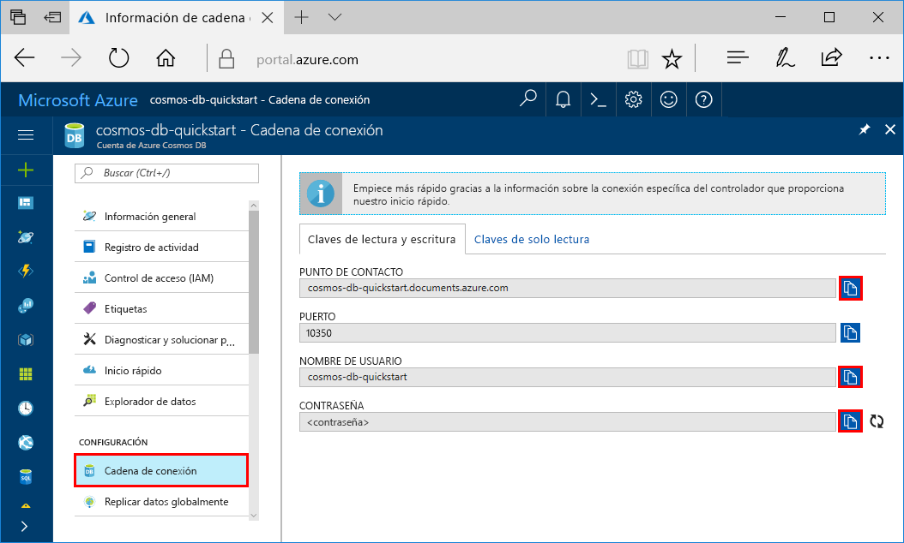
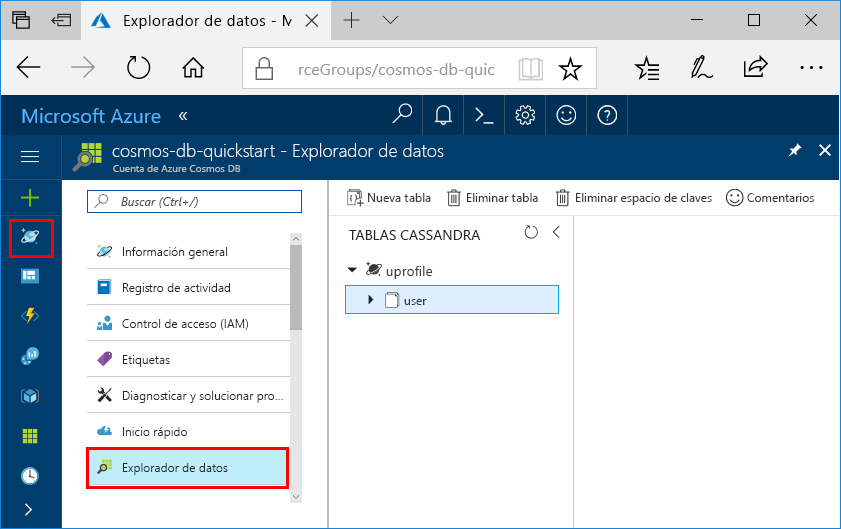

# <a name="quickstart-build-a-cassandra-app-with-nodejs-sdk-and-azure-cosmos-db"></a>Inicio rápido: Creación de una aplicación de Cassandra con Node.js SDK y Azure Cosmos DB

> [!div class="op_single_selector"]
> * [.NET](create-cassandra-dotnet.md)
> * [Java](create-cassandra-java.md)
> * [Node.js](create-cassandra-nodejs.md)
> * [Python](create-cassandra-python.md)
>  

En este inicio rápido se crea una cuenta de Cassandra API de Azure Cosmos DB y se utiliza una aplicación Node.js de Cassandra clonada desde GitHub para crear un contenedor y una base de datos de Cassandra. Azure Cosmos DB es un servicio de base de datos multimodelo que permite crear y consultar rápidamente bases de datos de documentos, tablas, claves-valores y grafos con funcionalidades de distribución global y escala horizontal.

## <a name="prerequisites"></a>Prerrequisitos

- Una cuenta de Azure con una suscripción activa. [cree una de forma gratuita](https://azure.microsoft.com/free/?ref=microsoft.com&utm_source=microsoft.com&utm_medium=docs&utm_campaign=visualstudio). O bien, [pruebe gratis Azure Cosmos DB](https://azure.microsoft.com/try/cosmosdb/) sin una suscripción de Azure.
- [Node.js 0.10.29+](https://nodejs.org/).
- [Git](https://www.git-scm.com/downloads).

## <a name="create-a-database-account"></a>Creación de una cuenta de base de datos

Para poder crear una base de datos de documentos, debe crear una cuenta de Cassandra con Azure Cosmos DB.

[!INCLUDE [cosmos-db-create-dbaccount-cassandra](../../includes/cosmos-db-create-dbaccount-cassandra.md)]

## <a name="clone-the-sample-application"></a>Clonación de la aplicación de ejemplo

Ahora vamos a clonar una aplicación de la API de Cassandra desde GitHub, establecer la cadena de conexión y ejecutarla. Verá lo fácil que es trabajar con datos mediante programación. 

1. Abra un símbolo del sistema. Cree una carpeta nueva denominada `git-samples`. Después cierre el símbolo del sistema.

    ```bash
    md "C:\git-samples"
    ```

2. Abra una ventana de terminal de Git, como Git Bash. Use el comando `cd` para cambiar a la nueva carpeta e instalar la aplicación de ejemplo.

    ```bash
    cd "C:\git-samples"
    ```

3. Ejecute el comando siguiente para clonar el repositorio de ejemplo. Este comando crea una copia de la aplicación de ejemplo en el equipo.

    ```bash
    git clone https://github.com/Azure-Samples/azure-cosmos-db-cassandra-nodejs-getting-started.git
    ```

## <a name="review-the-code"></a>Revisión del código

Este paso es opcional. Si le interesa aprender cómo el código crea los recursos de base de datos, puede revisar los siguientes fragmentos de código. Los fragmentos de código se toman del archivo `uprofile.js` de la carpeta `C:\git-samples\azure-cosmos-db-cassandra-nodejs-getting-started`. En caso contrario, puede ir directamente a [Actualización de la cadena de conexión](#update-your-connection-string). 

* Se establecieron los valores de nombre de usuario y contraseña utilizando la página de la cadena de conexión en el Azure Portal. El `path\to\cert` proporciona una ruta de acceso a un certificado X509. 

   ```javascript
   var ssl_option = {
        cert : fs.readFileSync("path\to\cert"),
        rejectUnauthorized : true,
        secureProtocol: 'TLSv1_2_method'
        };
   const authProviderLocalCassandra = new cassandra.auth.PlainTextAuthProvider(config.username, config.password);
   ```

* El objeto `client` se inicializa con la información de contactPoint. contactPoint se recupera de Azure Portal.

    ```javascript
    const client = new cassandra.Client({contactPoints: [config.contactPoint], authProvider: authProviderLocalCassandra, sslOptions:ssl_option});
    ```

* El objeto `client` se conecta a la API de Cassandra de Azure Cosmos DB.

    ```javascript
    client.connect(next);
    ```

* Se crea un espacio de claves.

    ```javascript
    function createKeyspace(next) {
        var query = "CREATE KEYSPACE IF NOT EXISTS uprofile WITH replication = {\'class\': \'NetworkTopologyStrategy\', \'datacenter1\' : \'1\' }";
        client.execute(query, next);
        console.log("created keyspace");    
  }
    ```

* Se crea una tabla.

   ```javascript
   function createTable(next) {
    var query = "CREATE TABLE IF NOT EXISTS uprofile.user (user_id int PRIMARY KEY, user_name text, user_bcity text)";
        client.execute(query, next);
        console.log("created table");
   },
   ```

* Se insertan entidades de clave/valor.

    ```javascript
    ...
       {
          query: 'INSERT INTO  uprofile.user  (user_id, user_name , user_bcity) VALUES (?,?,?)',
          params: [5, 'IvanaV', 'Belgaum']
        }
    ];
    client.batch(queries, { prepare: true}, next);
    ```

* Realice una consulta para obtener todos los valores de clave.

    ```javascript
   var query = 'SELECT * FROM uprofile.user';
    client.execute(query, { prepare: true}, function (err, result) {
      if (err) return next(err);
      result.rows.forEach(function(row) {
        console.log('Obtained row: %d | %s | %s ',row.user_id, row.user_name, row.user_bcity);
      }, this);
      next();
    });
    ```  
    
* Realice una consulta para obtener un valor de clave.

    ```javascript
    function selectById(next) {
        console.log("\Getting by id");
        var query = 'SELECT * FROM uprofile.user where user_id=1';
        client.execute(query, { prepare: true}, function (err, result) {
        if (err) return next(err);
            result.rows.forEach(function(row) {
            console.log('Obtained row: %d | %s | %s ',row.user_id, row.user_name, row.user_bcity);
        }, this);
        next();
        });
    }
    ```  

## <a name="update-your-connection-string"></a>Actualización de la cadena de conexión

Ahora vuelva a Azure Portal para obtener la información de la cadena de conexión y cópiela en la aplicación. La cadena de conexión permite a la aplicación comunicarse con la base de datos hospedada.

1. En la cuenta de Azure Cosmos DB, en [Azure Portal](https://portal.azure.com/), seleccione **Cadena de conexión**. 

    Use el  del lado derecho de la pantalla para copiar el valor superior, CONTACT POINT (Punto de contacto).

    

2. Abra el archivo `config.js` . 

3. Pegue el valor de CONTACT POINT (Punto de contacto) del portal en `<FillMEIN>` en la línea 4.

    La línea 4 ahora debe ser similar a 

    `config.contactPoint = "cosmos-db-quickstarts.cassandra.cosmosdb.azure.com:10350"`

4. Copie el valor de NOMBRE DE USUARIO del portal y péguelo en `<FillMEIN>` en la línea 2.

    La línea 2 ahora debe ser similar a 

    `config.username = 'cosmos-db-quickstart';`
    
5. Copie el valor de CONTRASEÑA del portal y péguelo en `<FillMEIN>` en la línea 3.

    La línea 3 ahora debe ser similar a

    `config.password = '2Ggkr662ifxz2Mg==';`

6. Guarde el archivo `config.js`.
    
## <a name="use-the-x509-certificate"></a>Uso del certificado X509

1. Descargue el certificado Baltimore CyberTrust Root de forma loca desde [https://cacert.omniroot.com/bc2025.crt](https://cacert.omniroot.com/bc2025.crt). Cambie el nombre del archivo con la extensión de archivo `.cer`.

   El certificado tiene el número de serie `02:00:00:b9` y la huella digital SHA1 `d4🇩🇪20:d0:5e:66:fc:53:fe:1a:50:88:2c:78:db:28:52:ca:e4:74`.

2. Abra `uprofile.js` y cambie el `path\to\cert` para que apunte al nuevo certificado.

3. Guarde `uprofile.js`.

## <a name="run-the-nodejs-app"></a>Ejecute la aplicación Node.js

1. En la ventana del terminal de git, ejecute `npm install` para instalar los módulos de npm necesarios.

2. Ejecute `node uprofile.js` para iniciar la aplicación de nodo.

3. Compruebe los resultados previstos desde la línea de comandos.

    

    Presione CTRL+C para detener la ejecución del programa y cerrar la ventana de la consola. 

4. En Azure Portal abra **Explorador de datos** para consultar, modificar y trabajar con estos nuevos datos. 

     

## <a name="review-slas-in-the-azure-portal"></a>Revisión de los SLA en Azure Portal

[!INCLUDE [cosmosdb-tutorial-review-slas](../../includes/cosmos-db-tutorial-review-slas.md)]

## <a name="clean-up-resources"></a>Limpieza de recursos

[!INCLUDE [cosmosdb-delete-resource-group](../../includes/cosmos-db-delete-resource-group.md)]

## <a name="next-steps"></a>Pasos siguientes

En este inicio rápido ha aprendido a crear una cuenta de Azure Cosmos DB con Cassandra API y a ejecutar una aplicación Node.js de Cassandra que cree un contenedor y una base de datos de Cassandra. Ya puede importar datos adicionales en la cuenta de Azure Cosmos DB. 

> [!div class="nextstepaction"]
> [Importación de datos de Cassandra en Azure Cosmos DB](cassandra-import-data.md)


