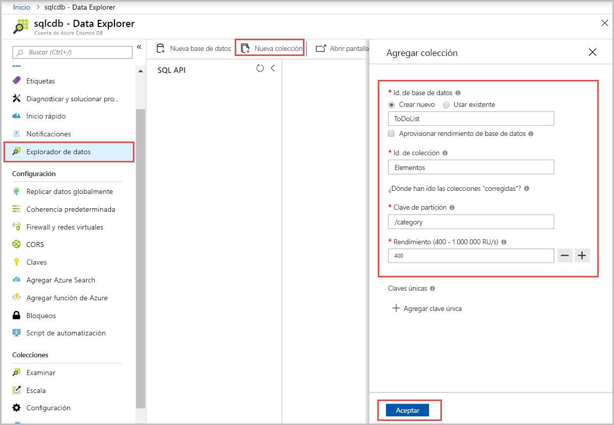
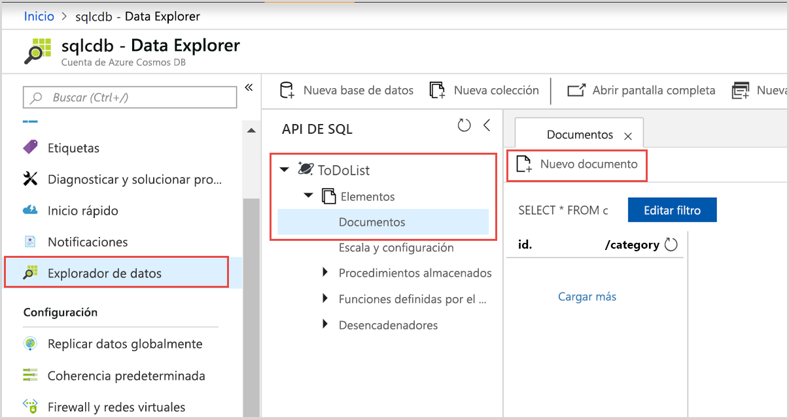
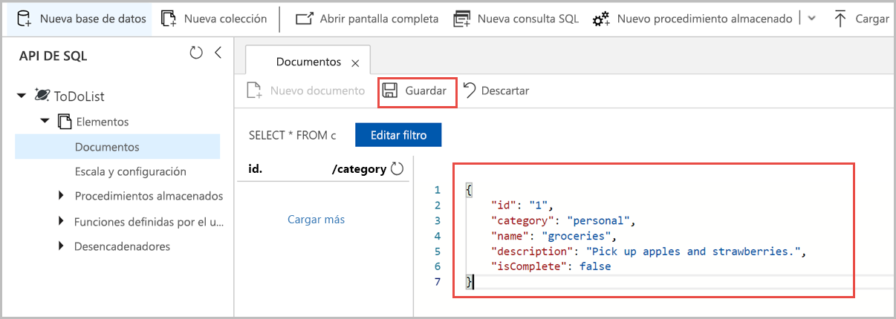

# <a name="quickstart-create-an-azure-cosmos-account-database-container-and-items-from-the-azure-portal"></a>Inicio rápido: Creación de una base de datos, un contenedor y elementos de Azure Cosmos desde Azure Portal

> [!div class="op_single_selector"]
> * [Azure Portal](create-cosmosdb-resources-portal.md)
> * [.NET](create-sql-api-dotnet.md)
> * [Java](create-sql-api-java.md)
> * [Node.js](create-sql-api-nodejs.md)
> * [Python](create-sql-api-python.md)
> * [Xamarin](create-sql-api-xamarin-dotnet.md)
>  

Azure Cosmos DB es un servicio de base de datos con varios modelos y de distribución global de Microsoft. Puede usar Azure Cosmos DB para crear rápidamente una clave de consulta y bases de datos de valores, así como bases de datos de documentos y de grafos, y realizar consultas en ellas. Todas estas bases de datos se beneficiarán de las funcionalidades de distribución global y escala horizontal de Azure Cosmos DB. 

En este inicio rápido se muestra cómo usar Azure Portal para crear una cuenta de [SQL API](sql-api-introduction.md) de Azure Cosmos DB, crear una base de datos de documentos y un contenedor, y agregar datos a dicho contenedor. 

## <a name="prerequisites"></a>Prerrequisitos

Una suscripción a Azure o una cuenta de evaluación gratuita de Azure Cosmos DB
- [!INCLUDE [quickstarts-free-trial-note](../../includes/quickstarts-free-trial-note.md)] 

- [!INCLUDE [cosmos-db-emulator-docdb-api](../../includes/cosmos-db-emulator-docdb-api.md)]  

<a id="create-account"></a>
## <a name="create-an-azure-cosmos-db-account"></a>Creación de una cuenta de Azure Cosmos DB

[!INCLUDE [cosmos-db-create-dbaccount](../../includes/cosmos-db-create-dbaccount.md)]

<a id="create-container-database"></a>
## <a name="add-a-database-and-a-container"></a>Adición de una base de datos y un contenedor 

Para crear una base de datos y un contenedor, puede usar Data Explorer en Azure Portal. 

1.  Seleccione **Data Explorer** en el panel de navegación izquierdo de la página de la cuenta de Azure Cosmos DB y, después, seleccione **Nuevo contenedor**. 
    
    Es posible que deba desplazarse hacia la derecha para ver la ventana **Agregar contenedor**.
    
    
    
1.  En el panel **Agregar contenedor**, especifique la configuración del nuevo contenedor.
    
    |Configuración|Valor sugerido|Descripción
    |---|---|---|
    |**Identificador de base de datos**|ToDoList|Escriba *ToDoList* como nombre de la nueva base de datos. Los nombres de base de datos tienen que tener entre 1 y 255 caracteres y no pueden contener `/, \\, #, ?` o espacios finales. Seleccione la opción **Provision database throughput** (Aprovisionar rendimiento de la base de datos) que le permite compartir el rendimiento aprovisionado de la base de datos entre todos los contenedores de esta. Esta opción también le ayudará a reducir los costos. |
    |**Rendimiento**|400|Deje el rendimiento en 400 unidades de solicitud por segundo (RU/s). Si quiere reducir la latencia, puede escalar verticalmente el rendimiento más adelante.| 
    |**ID de contenedor**|Elementos|Escriba *Elementos* como nombre del nuevo contenedor. Los identificadores de contenedor tienen los mismos requisitos de caracteres que los nombres de las bases de datos.|
    |**Clave de partición**| /categoría| El ejemplo que se describe en este artículo usa */category* como clave de partición.|

    
    No agregue **claves únicas** en este ejemplo. Las claves únicas le permiten agregar una capa de integridad de datos a la base de datos mediante la garantía de unicidad de uno o varios valores por clave de partición. Para más información, consulte [Claves únicas en Azure Cosmos DB](unique-keys.md).
    
1.  Seleccione **Aceptar**. Data Explorer muestra la nueva base de datos y el contenedor que ha creado.

## <a name="add-data-to-your-database"></a>Adición de datos a la base de datos

Agregue datos a una base de datos nueva mediante Data Explorer.

1. En **Data Explorer**, expanda la base de datos **ToDoList** y el contenedor **Items**. A continuación, seleccione **Elementos** y, después, **Nuevo elemento**. 
   
   
   
1. Agregue la siguiente estructura al documento de la derecha del panel **Documentos**:

     ```json
     {
         "id": "1",
         "category": "personal",
         "name": "groceries",
         "description": "Pick up apples and strawberries.",
         "isComplete": false
     }
     ```

1. Seleccione **Guardar**.
   
   
   
1. Vuelva a seleccionar **Nuevo documento** y cree y guarde otro documento con un valor de `id` único y las restantes propiedades y valores que desee. Los documentos pueden tener cualquier estructura, ya que Azure Cosmos DB no impone ningún esquema en los datos.

## <a name="query-your-data"></a>Consulta de los datos

[!INCLUDE [cosmos-db-create-sql-api-query-data](../../includes/cosmos-db-create-sql-api-query-data.md)] 

## <a name="clean-up-resources"></a>Limpieza de recursos

[!INCLUDE [cosmosdb-delete-resource-group](../../includes/cosmos-db-delete-resource-group.md)]

Si desea eliminar solo la base de datos y usar la cuenta de Azure Cosmos en el futuro, puede eliminar la base de datos con los pasos siguientes:

* Vaya a la cuenta de Azure Cosmos.
* Abra **Explorador de datos**, haga clic con el botón derecho en la base de datos que desee eliminar y seleccione **Eliminar base de datos**.
* Escriba el nombre de la base de datos o su identificador para confirmar la eliminación. 

## <a name="next-steps"></a>Pasos siguientes

En esta guía de inicio rápido ha aprendido a crear una cuenta de Azure Cosmos DB, una base de datos y un contenedor con el Explorador de datos. Ahora puede importar datos adicionales en la cuenta de Azure Cosmos DB. 

> [!div class="nextstepaction"]
> [Importación de datos a Azure Cosmos DB](import-data.md)
