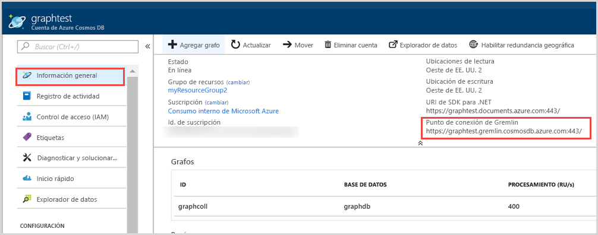
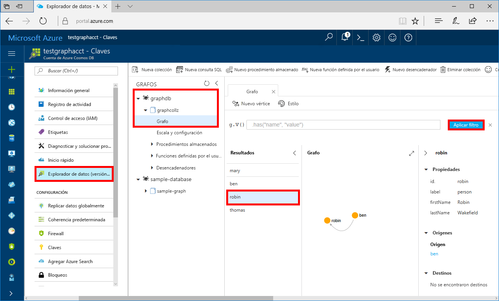

# <a name="quickstart-build-a-net-framework-or-core-application-using-the-azure-cosmos-db-gremlin-api-account"></a>Inicio rápido: Compilación de una aplicación .NET Framework o Core mediante la cuenta de Gremlin API de Azure Cosmos DB

> [!div class="op_single_selector"]
> * [Gremlin Console](create-graph-gremlin-console.md)
> * [.NET](create-graph-dotnet.md)
> * [Java](create-graph-java.md)
> * [Node.js](create-graph-nodejs.md)
> * [Python](create-graph-python.md)
> * [PHP](create-graph-php.md)
>  

Azure Cosmos DB es un servicio de base de datos con varios modelos y de distribución global de Microsoft. Puede crear rápidamente bases de datos de documentos, clave-valor y grafos, y realizar consultas en ellas. Todas las bases de datos se beneficiarán de las funcionalidades de distribución global y escala horizontal en Azure Cosmos DB. 

En este inicio rápido se muestra cómo crear una cuenta de [Gremlin API](graph-introduction.md), una base de datos y un grafo (contenedor) de Azure Cosmos DB mediante Azure Portal. Después, compile y ejecute una aplicación de consola compilada con el controlador [Gremlin.Net](https://tinkerpop.apache.org/docs/3.2.7/reference/#gremlin-DotNet) de código abierto.  

## <a name="prerequisites"></a>Prerrequisitos

Si no tiene Visual Studio 2019 instalado, puede descargar y usar la **versión gratuita** de [Visual Studio 2019 Community Edition](https://www.visualstudio.com/downloads/). Asegúrese de que habilita **Desarrollo de Azure** durante la instalación de Visual Studio.

[!INCLUDE [quickstarts-free-trial-note](../../includes/quickstarts-free-trial-note.md)]

## <a name="create-a-database-account"></a>Creación de una cuenta de base de datos

[!INCLUDE [cosmos-db-create-dbaccount-graph](../../includes/cosmos-db-create-dbaccount-graph.md)]

## <a name="add-a-graph"></a>Agregar un grafo

[!INCLUDE [cosmos-db-create-graph](../../includes/cosmos-db-create-graph.md)]

## <a name="clone-the-sample-application"></a>Clonación de la aplicación de ejemplo

Ahora, vamos a clonar una aplicación de Gremlin API desde GitHub, establecer la cadena de conexión y ejecutarla. Verá lo fácil que es trabajar con datos mediante programación. 

1. Abra un símbolo del sistema, cree una carpeta nueva denominada ejemplos de GIT y, después, cierre el símbolo del sistema.

    ```bash
    md "C:\git-samples"
    ```

2. Abra una ventana de terminal de Git, como git bash y utilice el comando `cd` para cambiar a la nueva carpeta para instalar la aplicación de ejemplo.

    ```bash
    cd "C:\git-samples"
    ```

3. Ejecute el comando siguiente para clonar el repositorio de ejemplo. Este comando crea una copia de la aplicación de ejemplo en el equipo.

    ```bash
    git clone https://github.com/Azure-Samples/azure-cosmos-db-graph-gremlindotnet-getting-started.git
    ```

4. A continuación, abra Visual Studio y el archivo de solución.

5. Restaure los paquetes de NuGet en el proyecto. Debe incluir el controlador Gremlin.Net, así como el paquete Newtonsoft.Json.


6. También puede instalar manualmente el controlador Gremlin.Net mediante el administrador de paquetes NuGet o la [utilidad de línea de comandos de NuGet](https://docs.microsoft.com/nuget/install-nuget-client-tools): 

    ```bash
    nuget install Gremlin.Net
    ```

## <a name="review-the-code"></a>Revisión del código

Este paso es opcional. Si está interesado en aprender cómo se crean los recursos de base de datos en el código, puede revisar los siguientes fragmentos de código. En caso contrario, puede ir directamente a [Actualización de la cadena de conexión](#update-your-connection-string). 

Los fragmentos de código siguientes se han tomado del archivo Program.cs.

* Establezca los parámetros de conexión en función de la cuenta creada anteriormente: 

   :::code language="csharp" source="~/azure-cosmosdb-graph-dotnet/GremlinNetSample/Program.cs" id="configureConnectivity":::

* Se muestran los comandos de Gremlin que se van a ejecutar en un diccionario:

   :::code language="csharp" source="~/azure-cosmosdb-graph-dotnet/GremlinNetSample/Program.cs" id="defineQueries":::

* Cree objetos de conexión `GremlinServer` y `GremlinClient` nuevos con los parámetros proporcionados anteriormente:

   :::code language="csharp" source="~/azure-cosmosdb-graph-dotnet/GremlinNetSample/Program.cs" id="defineClientandServerObjects":::

* Ejecute cada consulta de Gremlin mediante el objeto `GremlinClient` con una tarea asincrónica. Puede leer las consultas Gremlin del diccionario definido en el paso anterior y ejecutarlas. Más tarde, recupere el resultado y lea los valores con formato de diccionario mediante la clase `JsonSerializer` del paquete Newtonsoft.Json:

   :::code language="csharp" source="~/azure-cosmosdb-graph-dotnet/GremlinNetSample/Program.cs" id="executeQueries":::

## <a name="update-your-connection-string"></a>Actualización de la cadena de conexión

Ahora vuelva a Azure Portal para obtener la información de la cadena de conexión y cópiela en la aplicación.

1. En [Azure Portal](https://portal.azure.com/), vaya a la cuenta de base de datos de grafos. En la pestaña **Información general**, puede ver dos puntos de conexión. 
 
   **URI del SDK de .NET**: este valor se usa al conectarse a la cuenta de grafos mediante la biblioteca de Microsoft.Azure.Graphs. 

   **Punto de conexión de Gremlin**: este valor se usa cuando se conecta a la cuenta de grafos mediante la biblioteca Gremlin.Net.

    

   Para ejecutar este ejemplo, copie el valor de **Punto de conexión de Gremlin** y elimine el número de puerto del final de manera que el identificador URI se convierta en `https://<your cosmos db account name>.gremlin.cosmosdb.azure.com`. El valor del punto de conexión debe parecerse a `testgraphacct.gremlin.cosmosdb.azure.com`.

1. A continuación, vaya a la pestaña **Claves** y copie el valor de **CLAVE PRINCIPAL** de Azure Portal. 

1. Una vez copiados el URI y la CLAVE PRINCIPAL de la cuenta, guárdelos en una variable de entorno nueva en la máquina local que ejecuta la aplicación. Para establecer la variable de entorno, abra una ventana del símbolo del sistema y ejecute el siguiente comando. Asegúrese de reemplazar los valores de <URI_de_la_cuenta_de_Azure_Cosmos> y <CLAVE_PRINCIPAL_de_la_cuenta_de_Azure_Cosmos>.

   ```console
   setx EndpointUrl "https://<your cosmos db account name>.gremlin.cosmosdb.azure.com"
   setx PrimaryKey "<Your_Azure_Cosmos_account_PRIMARY_KEY>"
   ```

1. Abra el archivo *Program.cs* y actualice las variables "base de datos" y "contenedor" con los nombres de la base de datos y el contenedor (que también es el nombre del grafo) creados anteriormente.

    `private static string database = "your-database-name";` `private static string container = "your-container-or-graph-name";`

1. Guarde el archivo Program.cs. 

Ya ha actualizado la aplicación con toda la información que necesita para comunicarse con Azure Cosmos DB. 

## <a name="run-the-console-app"></a>Ejecutar la aplicación de consola

Haga clic en CTRL + F5 para ejecutar la aplicación. La aplicación imprimirá los resultados de la consola y los comandos de consulta de Gremlin.

   En la ventana de la consola se muestran los vértices y los bordes que se agregan al grafo. Cuando se complete el script, presione ENTRAR para cerrar la ventana de la consola.

## <a name="browse-using-the-data-explorer"></a>Examinar mediante el Explorador de datos

Ahora puede volver al Explorador de datos en Azure Portal para examinar y consultar los datos del nuevo grafo.

1. En el Explorador de datos, la nueva base de datos aparece en el panel Grafos. Expanda los nodos del contenedor y de la base de datos y, a continuación, haga clic en **Grafo**.

2. Haga clic en el botón **Aplicar filtro** para usar la consulta predeterminada para visualizar todos los vértices del grafo. Los datos generados por la aplicación de ejemplo se muestran en el panel grafos.

    Puede acercar o alejar el grafo, expandir el espacio de visualización del grafo, agregar vértices adicionales y mover los vértices sobre la superficie de visualización.

    

## <a name="review-slas-in-the-azure-portal"></a>Revisión de los SLA en Azure Portal

[!INCLUDE [cosmosdb-tutorial-review-slas](../../includes/cosmos-db-tutorial-review-slas.md)]

## <a name="clean-up-resources"></a>Limpieza de recursos

[!INCLUDE [cosmosdb-delete-resource-group](../../includes/cosmos-db-delete-resource-group.md)]

## <a name="next-steps"></a>Pasos siguientes

En esta guía de inicio rápido, ha obtenido información sobre cómo crear una cuenta de Azure Cosmos DB, crear un grafo mediante el Explorador de datos y ejecutar una aplicación. Ahora puede crear consultas más complejas e implementar con Gremlin una lógica eficaz de recorrido del grafo. 

> [!div class="nextstepaction"]
> [Consulta mediante Gremlin](tutorial-query-graph.md)

