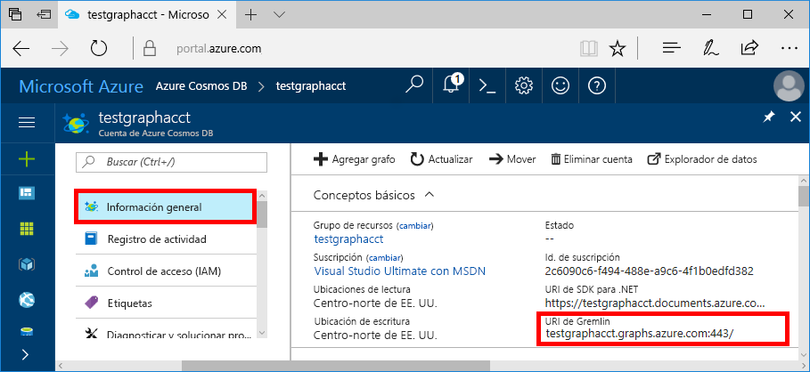
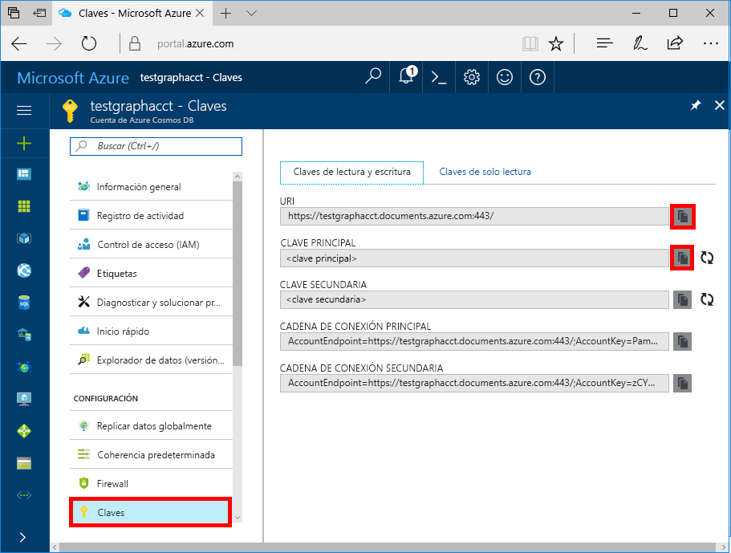

# <a name="quickstart-build-a-nodejs-application-by-using-azure-cosmos-db-gremlin-api-account"></a>Inicio rápido: Compilación de una aplicación de Node.js mediante una cuenta de Gremlin API con Azure Cosmos DB

> [!div class="op_single_selector"]
> * [Gremlin Console](create-graph-gremlin-console.md)
> * [.NET](create-graph-dotnet.md)
> * [Java](create-graph-java.md)
> * [Node.js](create-graph-nodejs.md)
> * [Python](create-graph-python.md)
> * [PHP](create-graph-php.md)
>  

En este inicio rápido, se crea y administra una cuenta de Azure Cosmos DB para Gremlin (Graph) API desde Azure Portal y se agregan datos mediante una aplicación de Node.js clonada desde GitHub. Azure Cosmos DB es un servicio de base de datos multimodelo que permite crear y consultar rápidamente bases de datos de documentos, tablas, claves-valores y grafos con funcionalidades de distribución global y escala horizontal.

## <a name="prerequisites"></a>Prerrequisitos
- Una cuenta de Azure con una suscripción activa. [cree una de forma gratuita](https://azure.microsoft.com/free/?ref=microsoft.com&utm_source=microsoft.com&utm_medium=docs&utm_campaign=visualstudio). 
- [Node.js 0.10.29+](https://nodejs.org/).
- [Git](https://git-scm.com/downloads).

## <a name="create-a-database-account"></a>Creación de una cuenta de base de datos

[!INCLUDE [cosmos-db-create-dbaccount-graph](../../includes/cosmos-db-create-dbaccount-graph.md)]

## <a name="add-a-graph"></a>Agregar un grafo

[!INCLUDE [cosmos-db-create-graph](../../includes/cosmos-db-create-graph.md)]

## <a name="clone-the-sample-application"></a>Clonación de la aplicación de ejemplo

Ahora, vamos a clonar una aplicación de Gremlin API desde GitHub, establecer la cadena de conexión y ejecutarla. Verá lo fácil que es trabajar con datos mediante programación. 

1. Abra un símbolo del sistema, cree una carpeta nueva denominada ejemplos de GIT y, después, cierre el símbolo del sistema.

    ```bash
    md "C:\git-samples"
    ```

2. Abra una ventana de terminal de Git, como git bash y utilice el comando `cd` para cambiar a la nueva carpeta para instalar la aplicación de ejemplo.

    ```bash
    cd "C:\git-samples"
    ```

3. Ejecute el comando siguiente para clonar el repositorio de ejemplo. Este comando crea una copia de la aplicación de ejemplo en el equipo.

    ```bash
    git clone https://github.com/Azure-Samples/azure-cosmos-db-graph-nodejs-getting-started.git
    ```

3. Abra el archivo de solución en Visual Studio. 

## <a name="review-the-code"></a>Revisión del código

Este paso es opcional. Si está interesado en aprender cómo se crean los recursos de base de datos en el código, puede revisar los siguientes fragmentos de código. En caso contrario, puede ir directamente a [Actualización de la cadena de conexión](#update-your-connection-string). 

Los fragmentos de código siguientes se han tomado del archivo *app.js*.

Esta aplicación de consola usa el controlador de [Gremlin node.js](https://www.npmjs.com/package/gremlin) de código abierto.

* Se crea el cliente Gremlin.

    ```javascript
    const authenticator = new Gremlin.driver.auth.PlainTextSaslAuthenticator(
        `/dbs/${config.database}/colls/${config.collection}`, 
        config.primaryKey
    )


    const client = new Gremlin.driver.Client(
        config.endpoint, 
        { 
            authenticator,
            traversalsource : "g",
            rejectUnauthorized : true,
            mimeType : "application/vnd.gremlin-v2.0+json"
        }
    );

    ```

  Las configuraciones están todas en *config.js*, que se edita en la [sección siguiente](#update-your-connection-string).

* Se definen una serie de funciones para ejecutar distintas operaciones de Gremlin. Este es una de ellas:

    ```javascript
    function addVertex1()
    {
        console.log('Running Add Vertex1'); 
        return client.submit("g.addV(label).property('id', id).property('firstName', firstName).property('age', age).property('userid', userid).property('pk', 'pk')", {
                label:"person",
                id:"thomas",
                firstName:"Thomas",
                age:44, userid: 1
            }).then(function (result) {
                    console.log("Result: %s\n", JSON.stringify(result));
            });
    }
    ```

* Cada función ejecuta un método `client.execute` con un parámetro de cadena de consulta de Gremlin. Este es un ejemplo de cómo se ejecuta `g.V().count()`:

    ```javascript
    function countVertices()
    {
        console.log('Running Count');
        return client.submit("g.V().count()", { }).then(function (result) {
            console.log("Result: %s\n", JSON.stringify(result));
        });
    }
    ```

* Al final del archivo, todos los métodos se invocan. Se ejecutarán sucesivamente:

    ```javascript
    client.open()
    .then(dropGraph)
    .then(addVertex1)
    .then(addVertex2)
    .then(addEdge)
    .then(countVertices)
    .catch((err) => {
        console.error("Error running query...");
        console.error(err)
    }).then((res) => {
        client.close();
        finish();
    }).catch((err) => 
        console.error("Fatal error:", err)
    );
    ```


## <a name="update-your-connection-string"></a>Actualización de la cadena de conexión

1. Abra el archivo *config.js*. 

2. En *config.js*, rellene la clave `config.endpoint` con el valor de **Gremlin Endpoint** (Punto de conexión de Gremlin) de la página **Información general** de la cuenta de Cosmos DB en Azure Portal. 

    `config.endpoint = "https://<your_Gremlin_account_name>.gremlin.cosmosdb.azure.com:443/";`

    

3. En *config.js*, rellene el valor de config.primaryKey con el valor de **Clave principal** de la página **Claves** de la cuenta de Cosmos DB en Azure Portal. 

    `config.primaryKey = "PRIMARYKEY";`

   

4. Escriba el nombre de la base de datos y el nombre del grafo (contenedor) para el valor de config.database y config.collection. 

Este es un ejemplo del aspecto que debería tener el archivo *config.js* completado:

```javascript
var config = {}

// Note that this must not have HTTPS or the port number
config.endpoint = "https://testgraphacct.gremlin.cosmosdb.azure.com:443/"; 
config.primaryKey = "Pams6e7LEUS7LJ2Qk0fjZf3eGo65JdMWHmyn65i52w8ozPX2oxY3iP0yu05t9v1WymAHNcMwPIqNAEv3XDFsEg==";
config.database = "graphdb"
config.collection = "Persons"

module.exports = config;
```

## <a name="run-the-console-app"></a>Ejecutar la aplicación de consola

1. Abra una ventana del terminal y cambie (mediante el comando `cd`) al directorio de instalación del archivo *package.json* que se incluye en el proyecto.

2. Ejecute `npm install` para instalar los módulos npm necesarios, incluido `gremlin`.

3. Ejecute `node app.js` en un terminal para iniciar la aplicación de nodo.

## <a name="browse-with-data-explorer"></a>Examinar con el Explorador de datos

Ahora puede volver al Explorador de datos en Azure Portal para examinar, consultar, modificar y trabajar con los datos del nuevo grafo.

En el Explorador de datos, la nueva base de datos aparece en el panel **Grafos**. Expanda la base de datos, luego el contenedor y, finalmente, seleccione **Grafo**.

Los datos generados por la aplicación de ejemplo se muestran en el panel siguiente dentro de la pestaña **Grafo** al seleccionar **Aplicar filtro**.

Intente completar `g.V()` con `.has('firstName', 'Thomas')` para probar el filtro. Tenga en cuenta que el valor distingue mayúsculas de minúsculas.

## <a name="review-slas-in-the-azure-portal"></a>Revisión de los SLA en Azure Portal

[!INCLUDE [cosmosdb-tutorial-review-slas](../../includes/cosmos-db-tutorial-review-slas.md)]

## <a name="clean-up-your-resources"></a>Limpiar los recursos

[!INCLUDE [cosmosdb-delete-resource-group](../../includes/cosmos-db-delete-resource-group.md)]

## <a name="next-steps"></a>Pasos siguientes

En este artículo, ha aprendido a crear una cuenta de Azure Cosmos DB, a crear un grafo mediante el Explorador de datos y a ejecutar una aplicación de Node.js para agregar datos al grafo. Ahora puede usar Gremlin para implementar una lógica de recorrido del grafo eficaz y crear consultas más complejas. 

> [!div class="nextstepaction"]
> [Consulta mediante Gremlin](tutorial-query-graph.md)
