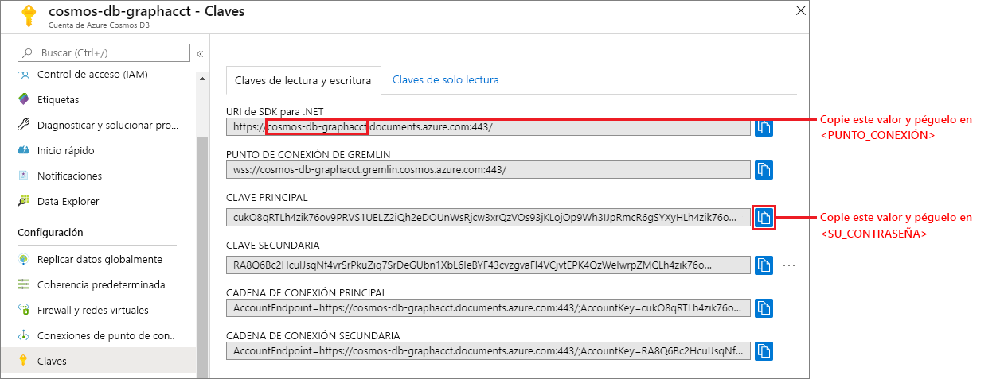
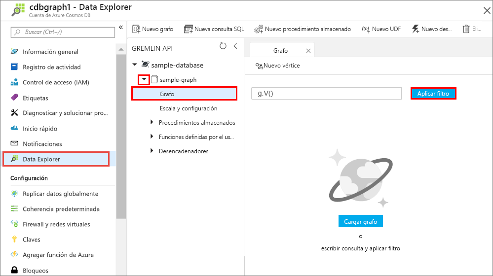
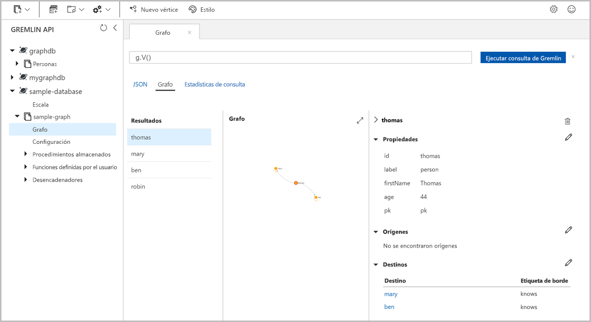
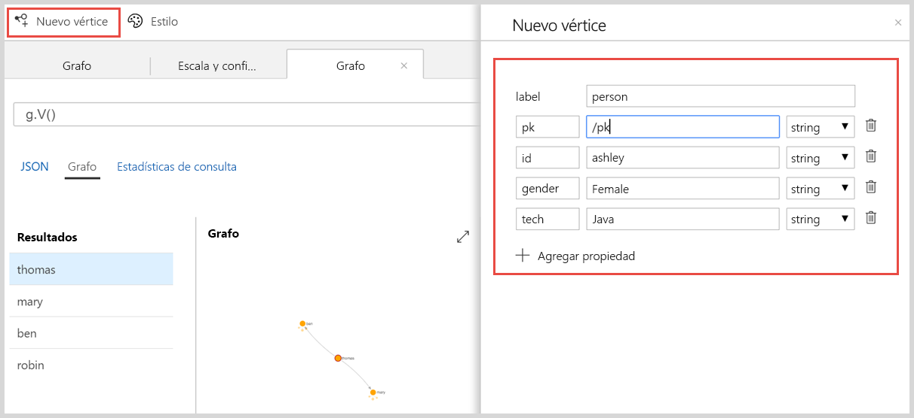

# <a name="quickstart-create-a-graph-database-in-azure-cosmos-db-using-python-and-the-azure-portal"></a>Inicio rápido: Creación de una base de datos de grafos en Azure Cosmos DB mediante Python y Azure Portal

> [!div class="op_single_selector"]
> * [Gremlin Console](create-graph-gremlin-console.md)
> * [.NET](create-graph-dotnet.md)
> * [Java](create-graph-java.md)
> * [Node.js](create-graph-nodejs.md)
> * [Python](create-graph-python.md)
> * [PHP](create-graph-php.md)
>  

En este inicio rápido, se crea y administra una cuenta de Azure Cosmos DB para Gremlin (Graph) API desde Azure Portal y se agregan datos mediante una aplicación en Python clonada desde GitHub. Azure Cosmos DB es un servicio de base de datos multimodelo que permite crear y consultar rápidamente bases de datos de documentos, tablas, claves-valores y grafos con funcionalidades de distribución global y escala horizontal.

## <a name="prerequisites"></a>Prerrequisitos
- Una cuenta de Azure con una suscripción activa. [cree una de forma gratuita](https://azure.microsoft.com/free/?ref=microsoft.com&utm_source=microsoft.com&utm_medium=docs&utm_campaign=visualstudio). O bien, [pruebe gratis Azure Cosmos DB](https://azure.microsoft.com/try/cosmosdb/) sin una suscripción de Azure.
- [Python 3.5+](https://www.python.org/downloads/), incluido el instalador del paquete [pip](https://pip.pypa.io/en/stable/installing/).
- [Controlador de Python para Gremlin](https://github.com/apache/tinkerpop/tree/master/gremlin-python).
- [Git](https://git-scm.com/downloads).

> [!NOTE]
> Esta guía de inicio rápido requiere una cuenta de base de datos de grafos creada después del 20 de diciembre de 2017. Las cuentas existentes admitirán Python una vez que se hayan migrado a disponibilidad general.

## <a name="create-a-database-account"></a>Creación de una cuenta de base de datos

Para poder crear una base de datos de grafos, debe crear una cuenta de base de datos de Gremlin (Graph) con Azure Cosmos DB.

[!INCLUDE [cosmos-db-create-dbaccount-graph](../../includes/cosmos-db-create-dbaccount-graph.md)]

## <a name="add-a-graph"></a>Agregar un grafo

[!INCLUDE [cosmos-db-create-graph](../../includes/cosmos-db-create-graph.md)]

## <a name="clone-the-sample-application"></a>Clonación de la aplicación de ejemplo

Ahora vamos a empezar a trabajar con el código. Vamos a clonar una aplicación de Gremlin API desde GitHub, establecer la cadena de conexión y ejecutarla. Verá lo fácil que es trabajar con datos mediante programación.  

1. Abra un símbolo del sistema, cree una carpeta nueva denominada ejemplos de GIT y, después, cierre el símbolo del sistema.

    ```bash
    md "C:\git-samples"
    ```

2. Abra una ventana de terminal de Git, como git bash y utilice el comando `cd` para cambiar a una carpeta para instalar la aplicación de ejemplo.  

    ```bash
    cd "C:\git-samples"
    ```

3. Ejecute el comando siguiente para clonar el repositorio de ejemplo. Este comando crea una copia de la aplicación de ejemplo en el equipo. 

    ```bash
    git clone https://github.com/Azure-Samples/azure-cosmos-db-graph-python-getting-started.git
    ```

## <a name="review-the-code"></a>Revisión del código

Este paso es opcional. Si está interesado en aprender cómo se crean los recursos de base de datos en el código, puede revisar los siguientes fragmentos de código. Todos los fragmentos de código se han tomado del archivo *connect.py* de la carpeta *C:\git-samples\azure-cosmos-db-graph-python-getting-started\\* . En caso contrario, puede ir directamente a [Actualización de la cadena de conexión](#update-your-connection-information). 

* El valor de `client` de Gremlin se inicializa en la línea 104 de *connect.py*:

    ```python
    ...
    client = client.Client('wss://<YOUR_ENDPOINT>.gremlin.cosmosdb.azure.com:443/','g', 
        username="/dbs/<YOUR_DATABASE>/colls/<YOUR_COLLECTION_OR_GRAPH>", 
        password="<YOUR_PASSWORD>")
    ...
    ```

* Al principio del archivo *connect.py* se declara una serie de pasos de Gremlin. Luego se ejecutan utilizando el método `client.submitAsync()`:

    ```python
    client.submitAsync(_gremlin_cleanup_graph)
    ```

## <a name="update-your-connection-information"></a>Actualización de la información de conexión

Ahora vuelva a Azure Portal para obtener la información de conexión y cópiela en la aplicación. Esta configuración permitirá que la aplicación se comunique con la base de datos hospedada.

1. En la cuenta de Azure Cosmos DB, en [Azure Portal](https://portal.azure.com/), seleccione **Claves**. 

    Copie la primera parte del valor URI.

    

2. Abra el archivo *connect.py* y, en la línea 104, pegue el valor del identificador URI sobre `<YOUR_ENDPOINT>` aquí:

    ```python
    client = client.Client('wss://<YOUR_ENDPOINT>.gremlin.cosmosdb.azure.com:443/','g', 
        username="/dbs/<YOUR_DATABASE>/colls/<YOUR_COLLECTION_OR_GRAPH>", 
        password="<YOUR_PASSWORD>")
    ```

    La parte del URI del objeto de cliente ahora debe ser similar a este código:

    ```python
    client = client.Client('wss://test.gremlin.cosmosdb.azure.com:443/','g', 
        username="/dbs/<YOUR_DATABASE>/colls/<YOUR_COLLECTION_OR_GRAPH>", 
        password="<YOUR_PASSWORD>")
    ```

3. Cambie el segundo parámetro del objeto `client` para reemplazar las cadenas `<YOUR_DATABASE>` y `<YOUR_COLLECTION_OR_GRAPH>`. Si usó los valores sugeridos, el parámetro debe ser similar a este código:

    `username="/dbs/sample-database/colls/sample-graph"`

    Todo el objeto `client` debe parecerse ahora a este código:

    ```python
    client = client.Client('wss://test.gremlin.cosmosdb.azure.com:443/','g', 
        username="/dbs/sample-database/colls/sample-graph", 
        password="<YOUR_PASSWORD>")
    ```

4. En la página **Claves**, use el botón de copia para copiar la clave principal y péguela sobre `<YOUR_PASSWORD>` en el parámetro `password=<YOUR_PASSWORD>`.

    Toda la definición del objeto `client` debe parecerse ahora a este código:
    ```python
    client = client.Client('wss://test.gremlin.cosmosdb.azure.com:443/','g', 
        username="/dbs/sample-database/colls/sample-graph", 
        password="asdb13Fadsf14FASc22Ggkr662ifxz2Mg==")
    ```

6. Guarde el archivo *connect.py*.

## <a name="run-the-console-app"></a>Ejecutar la aplicación de consola

1. En la ventana del terminal de Git, use `cd` para cambiar a la carpeta azure-cosmos-db-graph-python-getting-started.

    ```git
    cd "C:\git-samples\azure-cosmos-db-graph-python-getting-started"
    ```

2. En la ventana del terminal de Git, use el comando siguiente para instalar los paquetes Python necesarios.

   ```
   pip install -r requirements.txt
   ```

3. En la ventana de terminal de Git, use el siguiente comando para iniciar la aplicación de Python.
    
    ```
    python connect.py
    ```

    En la ventana del terminal se muestran los vértices y los bordes que se agregan al grafo. 
    
    Si se producen errores de tiempo de espera, compruebe que actualizó la información de conexión correctamente en [Actualización de la información de conexión](#update-your-connection-information) e intente ejecutar de nuevo el último comando. 
    
    Una vez que el programa se detenga, presione ENTRAR y, después, vuelva a cambiar a Azure Portal en el Explorador de Internet.

<a id="add-sample-data"></a>
## <a name="review-and-add-sample-data"></a>Revise y agregue datos de ejemplo

Una vez que se insertan los vértices y los bordes, ahora puede volver al Explorador de datos y ver los vértices que se agregan al grafo, y agregar puntos de datos adicionales.

1. En la cuenta de Azure Cosmos DB, en Azure Portal, seleccione **Explorador de datos**, expanda **sample-graph**, seleccione **Grafo** y, por último, seleccione **Aplicar filtro**. 

   

2. En la lista **Resultados**, observe los tres nuevos usuarios agregados al grafo. Puede mover los vértices arrastrando y colocando, acercarse y alejarse desplazando la rueda del mouse y ampliar el tamaño del gráfico con la flecha doble. 

   

3. Vamos a agregar algunos usuarios nuevos. Seleccione el botón **Nuevo vértice** para agregar datos al grafo.

   

4. Escriba una etiqueta de *persona*.

5. Seleccione **Agregar propiedad** para agregar cada una de las siguientes propiedades. Tenga en cuenta que puede crear propiedades únicas para cada persona en el grafo. Solo se requiere la clave de identificador.

    key|value|Notas
    ----|----|----
    pk|/pk| 
    id|ashley|Identificador único del vértice. Si no se especifica un identificador, se genera uno automáticamente.
    gender|mujer| 
    técnico | Java | 

    > [!NOTE]
    > En esta guía de inicio rápido se crea una colección sin particiones. Sin embargo, si crea una colección con particiones especificando una clave de partición durante la creación de la colección, debe incluir la clave de partición como una clave en cada nuevo vértice. 

6. Seleccione **Aceptar**. Puede que tenga que expandir la pantalla para ver **Aceptar** en la parte inferior de la pantalla.

7. Seleccione **Nuevo vértice** de nuevo y agregue otro usuario. 

8. Escriba una etiqueta de *persona*.

9. Seleccione **Agregar propiedad** para agregar cada una de las siguientes propiedades:

    key|value|Notas
    ----|----|----
    pk|/pk| 
    id|rakesh|Identificador único del vértice. Si no se especifica un identificador, se genera uno automáticamente.
    gender|hombre| 
    centro educativo|MIT| 

10. Seleccione **Aceptar**. 

11. Seleccione el botón **Aplicar filtro** con el filtro `g.V()` predeterminado para mostrar todos los valores en el gráfico. Todos los usuarios se muestran ahora en la lista **Resultados**. 

    Si agrega más datos, puede usar filtros para limitar los resultados. De forma predeterminada, el Explorador de datos usa `g.V()` para recuperar todos los vértices en un gráfico. Se puede cambiar a otra [consulta de gráfico](tutorial-query-graph.md), como `g.V().count()`, para devolver un recuento de todos los vértices en el gráfico en formato JSON. Si ha cambiado el filtro, vuelva a cambiar el filtro a `g.V()` y seleccione **Aplicar filtro** para volver a mostrar todos los resultados.

12. Ahora podemos conectar a rakesh y ashley. Asegúrese de que **ashley** está seleccionado en la lista **Resultados** y, después, seleccione el botón para editar junto a **Destinos** en la parte inferior derecha. Puede que tenga que ampliar la ventana para ver el área **Propiedades**.

    

13. En el cuadro **Destino**, escriba *rakesh*, en el cuadro **Edge label** (Etiqueta de borde), escriba *conoce a* y, a continuación, seleccione la casilla.

    

14. Ahora seleccione **rakesh** en la lista de resultados y compruebe que ashley y rakesh están conectados. 

    

Esto completa la parte de la creación de recursos de este tutorial. Puede seguir agregando vértices en el grafo, modificar los vértices existentes o cambiar las consultas. Ahora vamos a revisar las métricas que proporciona Azure Cosmos DB y, a continuación, limpiaremos los recursos. 

## <a name="review-slas-in-the-azure-portal"></a>Revisión de los SLA en Azure Portal

[!INCLUDE [cosmosdb-tutorial-review-slas](../../includes/cosmos-db-tutorial-review-slas.md)]

## <a name="clean-up-resources"></a>Limpieza de recursos

[!INCLUDE [cosmosdb-delete-resource-group](../../includes/cosmos-db-delete-resource-group.md)]

## <a name="next-steps"></a>Pasos siguientes

En este inicio rápido, ha aprendido a crear una cuenta de Azure Cosmos DB, a crear un grafo mediante el Explorador de datos y a ejecutar una aplicación de Python para añadir datos al grafo. Ahora puede crear consultas más complejas e implementar con Gremlin una lógica eficaz de recorrido del grafo. 

> [!div class="nextstepaction"]
> [Consulta mediante Gremlin](tutorial-query-graph.md)

