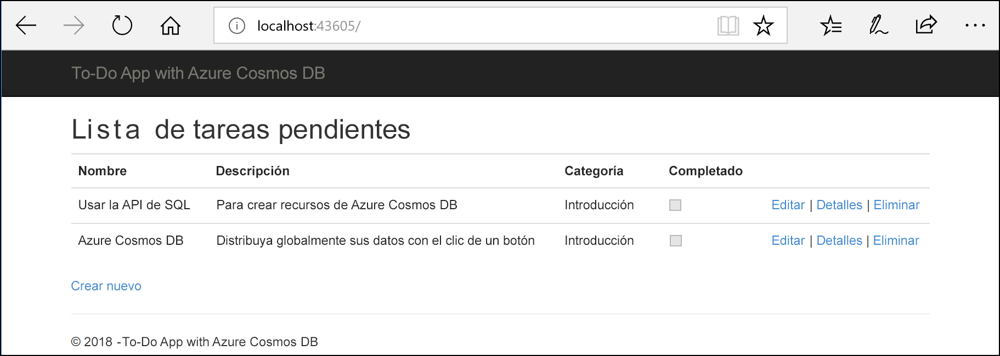
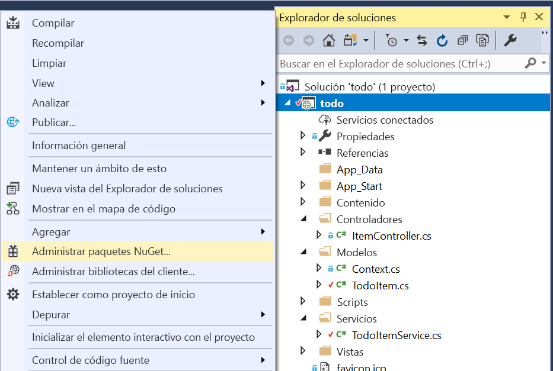
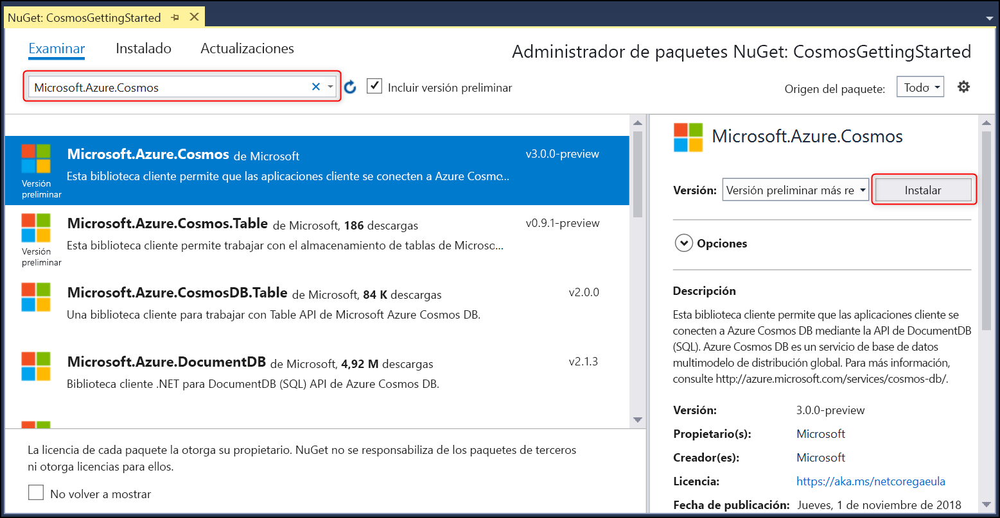

# <a name="quickstart-build-an-aspnet-web-app-using-azure-cosmos-db-sql-api-account"></a>Inicio rápido: Creación de una aplicación web ASP.NET con una cuenta de SQL API de Azure Cosmos DB

> [!div class="op_single_selector"]
> * [.NET (versión preliminar)](create-sql-api-dotnet-preview.md)
> * [.NET](create-sql-api-dotnet.md)
> * [Java](create-sql-api-java.md)
> * [Node.js](create-sql-api-nodejs.md)
> * [Python](create-sql-api-python.md)
> * [Xamarin](create-sql-api-xamarin-dotnet.md)
>  
> 

Azure Cosmos DB es el servicio de base de datos multimodelo, con alta disponibilidad, de distribución global de Microsoft. Puede crear rápidamente bases de datos de documentos, clave-valor y grafos, y realizar consultas en ellas. Todas las bases de datos se beneficiarán de las funcionalidades de distribución global y escala horizontal en Azure Cosmos DB. 

En esta guía de inicio rápido se muestra cómo crear una cuenta de [SQL API](sql-api-introduction.md) de Azure Cosmos DB, una base de datos y un contenedor mediante Azure Portal. Después, compilará e implementará una aplicación web de ASP.NET de lista de tareas pendientes integrada en [SQL API de .NET](sql-api-sdk-dotnet.md), tal como se muestra en la captura de pantalla siguiente. 

En esta guía de inicio rápido se usa la versión 3.0+ del SDK de Azure Cosmos DB para .NET. 



## <a name="prerequisites"></a>requisitos previos

Si aún no tiene Visual Studio de 2017 instalado, puede descargar y usar la versión **gratis** de [Visual Studio 2017 Community Edition](https://www.visualstudio.com/downloads/). Asegúrese de que habilita la carga de trabajo **Desarrollo de Azure** durante la instalación de Visual Studio.

[!INCLUDE [quickstarts-free-trial-note](../../includes/quickstarts-free-trial-note.md)] 
[!INCLUDE [cosmos-db-emulator-docdb-api](../../includes/cosmos-db-emulator-docdb-api.md)]  

<a id="create-account"></a>
## <a name="create-a-database-account"></a>Creación de una cuenta de base de datos

[!INCLUDE [cosmos-db-create-dbaccount-preview](../../includes/cosmos-db-create-dbaccount-preview.md)]

<a id="create-collection"></a>
## <a name="add-a-collection"></a>Agregar una colección

[!INCLUDE [cosmos-db-create-collection-preview](../../includes/cosmos-db-create-collection-preview.md)]

<a id="add-sample-data"></a>
## <a name="add-sample-data"></a>Adición de datos de ejemplo

[!INCLUDE [cosmos-db-create-sql-api-add-sample-data](../../includes/cosmos-db-create-sql-api-add-sample-data.md)]

## <a name="query-your-data"></a>Consulta de los datos

[!INCLUDE [cosmos-db-create-sql-api-query-data](../../includes/cosmos-db-create-sql-api-query-data.md)]

## <a name="clone-the-sample-application"></a>Clonación de la aplicación de ejemplo

Ahora vamos a empezar a trabajar con el código. Vamos a clonar una [aplicación de SQL API desde GitHub](https://github.com/Azure-Samples/cosmos-dotnet-todo-app), establecer la cadena de conexión y ejecutarla. 

1. Abra un símbolo del sistema, cree una carpeta nueva denominada ejemplos de GIT y, después, cierre el símbolo del sistema.

    ```bash
    md "C:\git-samples"
    ```

2. Abra una ventana de terminal de Git, como git bash y utilice el comando `cd` para cambiar a la nueva carpeta para instalar la aplicación de ejemplo.

    ```bash
    cd "C:\git-samples"
    ```

3. Ejecute el comando siguiente para clonar el repositorio de ejemplo. Este comando crea una copia de la aplicación de ejemplo en el equipo.

    ```bash
    git clone https://github.com/Azure-Samples/cosmos-dotnet-todo-app.git
    ```

4. Abra el archivo de solución **todo.sln** en Visual Studio. 

## <a name="review-the-code"></a>Revisión del código

Este paso es opcional. Si está interesado en aprender cómo se crean los recursos de base de datos en el código, puede revisar los siguientes fragmentos de código. En caso contrario, puede ir directamente a [Actualización de la cadena de conexión](#update-your-connection-string). 

Observe que, si está familiarizado con la versión anterior del SDK de .NET, puede estar habituado a ver los términos "colección" y "documento". Dado que Azure Cosmos DB admite varios modelos de API, todas las versiones del SDK de .NET posteriores a la 3.0 usan los términos genéricos "contenedor" y "elemento". Un contenedor puede ser una colección, un grafo o una tabla. Un elemento puede ser un documento, un vértice o borde, o una fila, y es el contenido que hay en un contenedor. [Más información acerca de las bases de datos, contenedores y elementos.](databases-containers-items.md)

Los fragmentos de código siguientes se han tomado del archivo ToDoItemService.cs.

* Se inicializa CosmosClient en las líneas 68 - 69.

    ```csharp
    CosmosConfiguration config = new CosmosConfiguration(Endpoint, PrimaryKey);
    client = new CosmosClient(config);
    ```

* Se crea una nueva base de datos en la línea 71.

    ```csharp
    CosmosDatabase database = await client.Databases.CreateDatabaseIfNotExistsAsync(DatabaseId);
    ```

* Se crea un nuevo contenedor en la línea 72 con la clave de partición "/category".

    ```csharp
    CosmosContainer container = await database.Containers.CreateContainerIfNotExistsAsync(ContainerId, "/category");
    ```

## <a name="update-your-connection-string"></a>Actualización de la cadena de conexión

Ahora vuelva a Azure Portal para obtener la información de la cadena de conexión y cópiela en la aplicación.

1. En [Azure Portal](https://portal.azure.com/), en la cuenta de Azure Cosmos DB, en el panel de navegación izquierdo, seleccione **Claves** y, después, **Claves de lectura y escritura**. Deberá usar los botones de copia del lado derecho de la pantalla para copiar el URI y la clave principal en el archivo web.config en el paso siguiente.

    

2. En Visual Studio 2017, abra el archivo **web.config**. 

3. Copie el valor del URI del portal (con el botón de copia) y conviértalo en el valor de la clave ``endpoint`` en web.config. 

    `<add key="endpoint" value="FILLME" />`

4. Después, copie el valor de la clave principal del portal y conviértalo en el valor de ``primarykey`` en web.config. 

    `<add key="primaryKey" value="FILLME" />`
    
5. A continuación, actualice el valor de la base de datos y del contenedor para que coincidan con los nombres que creó anteriormente. Ya ha actualizado la aplicación con toda la información que necesita para comunicarse con Azure Cosmos DB. 

    `<add key="database" value="Tasks" />`

    `<add key="container" value="Items" />`
    
## <a name="run-the-web-app"></a>Ejecución de la aplicación web

1. En el **Explorador de soluciones**, haga clic con el botón derecho en el nuevo proyecto de aplicación de la consola, que se encuentra en la solución de Visual Studio y, a continuación, haga clic en **Administrar paquetes NuGet...**
    
    
1. En la pestaña **NuGet**, haga clic en **Examinar** y escriba **Microsoft.Azure.Cosmos** en el cuadro de búsqueda.
1. En los resultados, busque **Microsoft.Azure.Cosmos** y haga clic en **Instalar**.
   El identificador del paquete de la biblioteca de cliente de la API de SQL de Azure Cosmos DB es [Microsoft Azure Cosmos DB Client Library](https://www.nuget.org/packages/Microsoft.Azure.Cosmos/).

   

    Si recibe un mensaje sobre cómo revisar los cambios en la solución, haga clic en **Aceptar**. Si recibe un mensaje acerca de la aceptación de licencia, haga clic en **Acepto**.

1. Seleccione CTRL+F5 para ejecutar la aplicación. La aplicación se muestra en el explorador. 

1. Seleccione **Crear nuevo** en el explorador y cree algunas tareas en la aplicación de tareas pendientes. También debería ver las tareas que creó en [Adición de datos de ejemplo](#add-sample-data)

   

Ahora puede volver al Explorador de datos y ver, consultar, modificar y trabajar con estos nuevos datos. 

## <a name="review-slas-in-the-azure-portal"></a>Revisión de los SLA en Azure Portal

[!INCLUDE [cosmosdb-tutorial-review-slas](../../includes/cosmos-db-tutorial-review-slas.md)]

## <a name="clean-up-resources"></a>Limpieza de recursos

[!INCLUDE [cosmosdb-delete-resource-group](../../includes/cosmos-db-delete-resource-group.md)]

## <a name="next-steps"></a>Pasos siguientes

En esta guía de inicio rápido ha aprendido a crear una cuenta de Azure Cosmos DB, a crear un contenedor y a agregarle elementos mediante Data Explorer y a ejecutar una aplicación. Ahora puede importar datos adicionales en la cuenta de Cosmos DB. 

> [!div class="nextstepaction"]
> [Importación de datos a Azure Cosmos DB](import-data.md)


