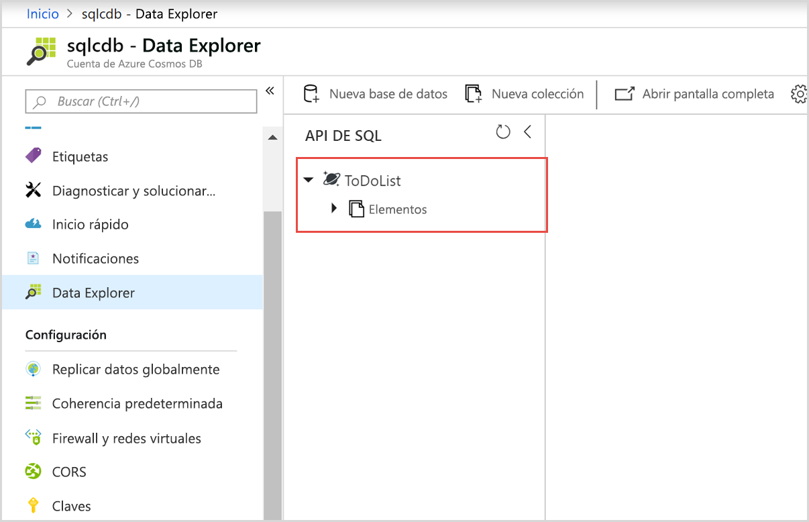
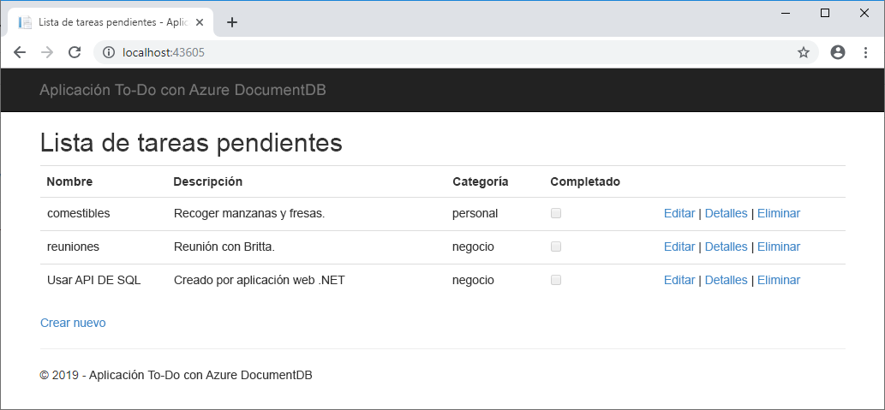

# <a name="quickstart-build-a-net-web-app-using-sql-api-account-in-azure-cosmos-db"></a>Inicio rápido: Creación de una aplicación web .NET con una cuenta de SQL API en Azure Cosmos DB

> [!div class="op_single_selector"]
> * [.NET](create-sql-api-dotnet.md)
> * [.NET (versión preliminar)](create-sql-api-dotnet-preview.md)
> * [Java](create-sql-api-java.md)
> * [Node.js](create-sql-api-nodejs.md)
> * [Python](create-sql-api-python.md)
> * [Xamarin](create-sql-api-xamarin-dotnet.md)
>  
> 

Azure Cosmos DB es un servicio de base de datos con varios modelos y de distribución global de Microsoft. Puede usar Azure Cosmos DB para crear rápidamente una clave de consulta y bases de datos de valores, así como bases de datos de documentos y de grafos, y realizar consultas en ellas. Todas estas bases de datos se beneficiarán de las funcionalidades de distribución global y escala horizontal de Azure Cosmos DB. 

En este inicio rápido se muestra cómo usar Azure Portal para crear una cuenta de [SQL API](sql-api-introduction.md) de Azure Cosmos DB, crear una base de datos de documentos y una colección, y agregar datos a dicha colección. Y luego usar un [kit de desarrollo de software de SQL .NET](sql-api-sdk-dotnet.md) para agregar más datos a la colección. 

En este inicio rápido se usa Data Explorer en Azure Portal para crear la base de datos y la colección. La base de datos y la colección también se pueden crear mediante el código de ejemplo de .NET. Para más información, consulte [Revisión del código de .NET](#review-the-net-code). 

## <a name="prerequisites"></a>Requisitos previos

Visual Studio 2017 con el flujo de trabajo de desarrollo de Azure instalado
- Puede descargar y usar [Visual Studio 2017 Community Edition](https://www.visualstudio.com/downloads/), que es **gratuita**. Asegúrese de que habilita **Desarrollo de Azure** durante la instalación de Visual Studio. 

Una suscripción a Azure o una cuenta de evaluación gratuita de Azure Cosmos DB
- [!INCLUDE [quickstarts-free-trial-note](../../includes/quickstarts-free-trial-note.md)] 
- [!INCLUDE [cosmos-db-emulator-docdb-api](../../includes/cosmos-db-emulator-docdb-api.md)]  

<a id="create-account"></a>
## <a name="create-an-azure-cosmos-db-account"></a>Creación de una cuenta de Azure Cosmos DB

[!INCLUDE [cosmos-db-create-dbaccount](../../includes/cosmos-db-create-dbaccount.md)]

<a id="create-collection-database"></a>
## <a name="add-a-database-and-a-collection"></a>Adición de una base de datos y una colección 

Para crear una base de datos y una colección, puede usar Data Explorer en Azure Portal. 

1.  Seleccione **Data Explorer** en el panel de navegación izquierdo de la página de la cuenta de Azure Cosmos DB y, después, seleccione **Nueva colección**. 
    
    Es posible que deba desplazarse hacia la derecha para ver el área **Agregar colección** .
    
    
    
1.  En la página **Agregar colección**, especifique la configuración de la nueva colección.
    
    |Configuración|Valor sugerido|DESCRIPCIÓN
    |---|---|---|
    |**Id. de base de datos**|ToDoList|Escriba *ToDoList* como nombre de la nueva base de datos. Los nombres de base de datos tienen que tener entre 1 y 255 caracteres y no pueden contener `/, \\, #, ?` o espacios finales.|
    |**Id. de colección**|Elementos|Escriba *Elementos* como nombre de la nueva colección. Los identificadores de colección tienen los mismos requisitos de caracteres que los nombres de las bases de datos.|
    |**Clave de partición**| /categoría| El ejemplo que se describe en este artículo usa */category* como clave de partición.|
    |**Rendimiento**|400|Deje el rendimiento en 400 unidades de solicitud por segundo (RU/s). Si quiere reducir la latencia, puede escalar verticalmente el rendimiento más adelante.| 
    
    No agregue **claves únicas** en este ejemplo. Las claves únicas le permiten agregar una capa de integridad de datos a la base de datos mediante la garantía de unicidad de uno o varios valores por clave de partición. Para más información, consulte [Claves únicas en Azure Cosmos DB](unique-keys.md).
    
1.  Seleccione **Aceptar**. 
    El Explorador de datos muestra la nueva base de datos y la colección.
    
    

## <a name="add-data-to-your-database"></a>Adición de datos a la base de datos

Agregue datos a una base de datos nueva mediante Data Explorer.

1. En **Data Explorer**, la nueva base de datos aparece en el panel **Colecciones**. Expanda la base de datos **ToDoList**, expanda la colección **Items**, seleccione **Documentos** y, después, **Nuevo documento**. 
   
   
   
1. Agregue la siguiente estructura al documento de la derecha del panel **Documentos**:

     ```json
     {
         "id": "1",
         "category": "personal",
         "name": "groceries",
         "description": "Pick up apples and strawberries.",
         "isComplete": false
     }
     ```

1. Seleccione **Guardar**.
   
   
   
1. Vuelva a seleccionar **Nuevo documento** y cree y guarde otro documento con un valor de `id` único y las restantes propiedades y valores que desee. Los documentos pueden tener cualquier estructura, ya que Azure Cosmos DB no impone ningún esquema en los datos.

## <a name="query-your-data"></a>Consulta de los datos

[!INCLUDE [cosmos-db-create-sql-api-query-data](../../includes/cosmos-db-create-sql-api-query-data.md)]

## <a name="use-the-net-web-app-to-manage-data"></a>Uso de la aplicación web .NET para administrar datos

Para ver lo fácil que es trabajar con los datos de Azure Cosmos DB mediante programación, clone la aplicación web .NET de SQL API de ejemplo de GitHub, actualice la cadena de conexión y ejecute la aplicación para actualizar los datos. 

La base de datos y la colección también se pueden crear mediante el código de ejemplo de .NET. Para más información, consulte [Revisión del código de .NET](#review-the-net-code).

### <a name="clone-the-sample-app"></a>Clonación de la aplicación de ejemplo

En primer lugar, clone una [aplicación de SQL API](https://github.com/Azure-Samples/documentdb-dotnet-todo-app) escrita en C# de GitHub. 

1. Abra una ventana de terminal git, como Git Bash, cree un directorio denominado *git-samples*y cambie a él: 
   
   ```bash
   mkdir /c/git-samples/
   cd /c/git-samples/
   ```
   
1. Ejecute el siguiente comando para clonar el repositorio de ejemplo y crear una copia de la aplicación de ejemplo en el equipo:
   
   ```bash
   git clone https://github.com/Azure-Samples/documentdb-dotnet-todo-app.git
   ```

### <a name="update-the-connection-string"></a>Actualización de la cadena de conexión 

1. Vaya al archivo *todo.sln* de la aplicación clonada en Visual Studio y ábralo. 

1. En el **Explorador de soluciones** de Visual Studio, abra el archivo *web.config*. 

1. Vuelva a Azure Portal para copiar la información de la cadena de conexión para pegarla en *web.config*.
   
   1. En el panel izquierdo de la cuenta de Azure Cosmos DB, seleccione **Claves**.
      
      
      
   1. En **Claves de lectura y escritura**, copie el valor de **URI** mediante el botón Copiar de la derecha y péguelo en la clave `endpoint` de *web.config*. Por ejemplo:  
      
      `<add key="endpoint" value="https://mysqlapicosmosdb.documents.azure.com:443/" />`
      
   1. Copie el valor de **PRIMARY KEY** y péguelo en la clave `authKey` de *web.config*. Por ejemplo: 
      
      `<add key="authKey" value="19ZDNJAiYL26tmnRvoez6hmtIfBGwjun50PWRjNYMC2ig8Ob9hYk7Fq1RYSv8FcIYnh1TdBISvCh7s6yyb0000==" />`

       
1. Asegúrese de que los valores de base de datos y colección de *web.config* coinciden con los nombres que creó anteriormente. 

   ```csharp
   <add key="database" value="ToDoList"/>
   <add key="collection" value="Items"/>
   ```
 
1. Guarde el archivo *web.config*. Ya ha actualizado la aplicación con toda la información que necesita para comunicarse con Azure Cosmos DB.

### <a name="run-the-web-app"></a>Ejecución de la aplicación web

1. En Visual Studio, haga clic con el botón derecho en el proyecto **todo** en el **Explorador de soluciones** y, después, seleccione en **Administrar paquetes NuGet**. 

1. En el cuadro **Examinar** de NuGet, escriba *DocumentDB*.

1. En los resultados, instale la biblioteca **Microsoft.Azure.DocumentDB**, en caso de que no esté instalada ya. Así se instala el paquete [Microsoft.Azure.DocumentDB](https://www.nuget.org/packages/Microsoft.Azure.DocumentDB/) y todas sus dependencias.
   
   Si el Administrador de paquetes de NuGet muestra un mensaje en el que se indica que faltan algunos paquetes de la solución, seleccione **Restaurar** para instalarlos desde fuentes internas. 

1. Seleccione **Ctrl**+**F5** para ejecutar la aplicación en el explorador. 

1. Seleccione **Crear nuevo** en la aplicación de tareas pendientes y cree algunas tareas.

   

Ya puede volver a Data Explorer en Azure Portal para ver, consultar, modificar los nuevos datos y trabajar con ellos. 

## <a name="review-the-net-code"></a>Revisión del código de .NET

Este paso es opcional. En este inicio rápido, ha creado una base de datos y una colección en Azure Portal, y ha agregado agregue datos de ejemplo mediante el ejemplo de .NET. Sin embargo, también puede crear la base de datos y la colección mediante el ejemplo de .NET. Si está interesado en aprender cómo se crean los recursos de base de datos en el código, examine los siguientes fragmentos de código. Todos los fragmentos de se han tomado del archivo *DocumentDBRepository.cs* del proyecto **todo**.

* Este código inicializa `DocumentClient`: 

    ```csharp
    client = new DocumentClient(new Uri(ConfigurationManager.AppSettings["endpoint"]), ConfigurationManager.AppSettings["authKey"]);
    ```

* Este código crea la base de datos mediante el método `CreateDatabaseAsync`:

    ```csharp
    await client.CreateDatabaseAsync(new Database { Id = DatabaseId });
    ```

* El siguiente código crea la colección mediante el método `CreateDocumentCollectionAsync`:

    ```csharp
    private static async Task CreateCollectionIfNotExistsAsync()
    {
        try
        {
           await client.ReadDocumentCollectionAsync(UriFactory.CreateDocumentCollectionUri(DatabaseId, CollectionId));
        }
        catch (DocumentClientException e)
        {
           if (e.StatusCode == System.Net.HttpStatusCode.NotFound)
           {
              await client.CreateDocumentCollectionAsync(
              UriFactory.CreateDatabaseUri(DatabaseId),
              new DocumentCollection
              {
                  Id = CollectionId
              },
              new RequestOptions { OfferThroughput = 400 });
           }
           else
           {
             throw;
           }
        }
    }
    ```

## <a name="clean-up-resources"></a>Limpieza de recursos

[!INCLUDE [cosmosdb-delete-resource-group](../../includes/cosmos-db-delete-resource-group.md)]

## <a name="next-steps"></a>Pasos siguientes

En este inicio rápido, ha aprendido a crear una cuenta de Azure Cosmos DB, a crear una base de datos y una colección mediante Datos Explorer y a ejecutar una aplicación web .NET para actualizar los datos. Ahora puede importar datos adicionales en la cuenta de Azure Cosmos DB. 

> [!div class="nextstepaction"]
> [Importación de datos a Azure Cosmos DB](import-data.md)

