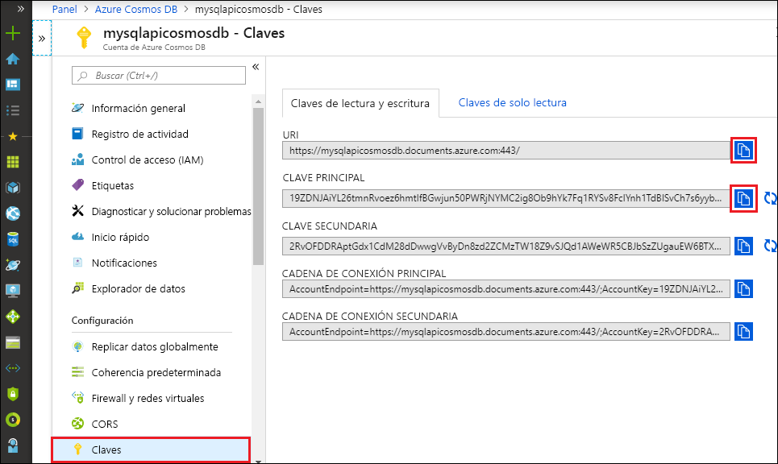

# <a name="quickstart-build-a-python-application-using-an-azure-cosmos-db-sql-api-account"></a>Inicio rápido: Compilación de una aplicación de Python mediante una cuenta de SQL API de Azure Cosmos DB

> [!div class="op_single_selector"]
> * [.NET V3](create-sql-api-dotnet.md)
> * [.NET V4](create-sql-api-dotnet-V4.md)
> * [Java](create-sql-api-java.md)
> * [Node.js](create-sql-api-nodejs.md)
> * [Python](create-sql-api-python.md)
> * [Xamarin](create-sql-api-xamarin-dotnet.md)

En este inicio rápido, se crea y administra una cuenta de Azure Cosmos DB para SQL API desde Azure Portal y desde Visual Studio Code con una aplicación en Python clonada desde GitHub. Azure Cosmos DB es un servicio de base de datos multimodelo que permite crear y consultar rápidamente bases de datos de documentos, tablas, claves-valores y grafos con funcionalidades de distribución global y escala horizontal.

## <a name="prerequisites"></a>Prerrequisitos

- Una cuenta de Azure con una suscripción activa. [cree una de forma gratuita](https://azure.microsoft.com/free/?ref=microsoft.com&utm_source=microsoft.com&utm_medium=docs&utm_campaign=visualstudio). O bien, [pruebe gratis Azure Cosmos DB](https://azure.microsoft.com/try/cosmosdb/) sin una suscripción de Azure. También puede usar el [emulador de Azure Cosmos DB](https://aka.ms/cosmosdb-emulator) con el identificador URI `https://localhost:8081` y la clave `C2y6yDjf5/R+ob0N8A7Cgv30VRDJIWEHLM+4QDU5DE2nQ9nDuVTqobD4b8mGGyPMbIZnqyMsEcaGQy67XIw/Jw==`.
- [Python 3.6+](https://www.python.org/downloads/), con el ejecutable `python` en `PATH`.
- [Visual Studio Code](https://code.visualstudio.com/).
- La [extensión de Python para Visual Studio Code](https://marketplace.visualstudio.com/items?itemName=ms-python.python#overview).
- [Git](https://www.git-scm.com/downloads). 

## <a name="create-a-database-account"></a>Creación de una cuenta de base de datos

[!INCLUDE [cosmos-db-create-dbaccount](../../includes/cosmos-db-create-dbaccount.md)]

## <a name="add-a-container"></a>Agregar un contenedor

Ahora puede usar la herramienta Explorador de datos en Azure Portal para crear una base de datos y un contenedor. 

1. Seleccione **Data Explorer** > **Nuevo contenedor**. 
    
    El área **Agregar contenedor** se muestra en el extremo derecho, pero es posible que haya que desplazarse hacia la derecha para verlo.

    

2. En la página **Agregar contenedor**, especifique la configuración del nuevo contenedor.

    |Configuración|Valor sugerido|Descripción
    |---|---|---|
    |**Identificador de base de datos**|Tareas|Escriba *ToDoList* como nombre de la nueva base de datos. Los nombres de base de datos tienen que tener entre 1 y 255 caracteres y no pueden contener `/, \\, #, ?` o espacios finales. Seleccione la opción **Provision database throughput** (Aprovisionar rendimiento de la base de datos) que le permite compartir el rendimiento aprovisionado de la base de datos entre todos los contenedores de esta. Esta opción también le ayudará a reducir los costos. |
    |**Rendimiento**|400|Deje el rendimiento en 400 unidades de solicitud por segundo (RU/s). Si quiere reducir la latencia, puede escalar verticalmente el rendimiento más adelante.| 
    |**ID de contenedor**|Elementos|Escriba *Elementos* como nombre del nuevo contenedor. Los identificadores de contenedor tienen los mismos requisitos de caracteres que los nombres de las bases de datos.|
    |**Clave de partición**| /categoría| El ejemplo que se describe en este artículo usa */category* como clave de partición.|
    
    Además de la configuración anterior, puede agregar opcionalmente **claves únicas** para el contenedor. En este ejemplo vamos a dejar el campo en blanco. Las claves únicas proporcionan a los desarrolladores la capacidad de agregar una capa de integridad de datos a la base de datos. Mediante la creación de una directiva de clave única al crear un contenedor, se garantiza la unicidad de uno o varios valores por clave de partición. Para más información, consulte el artículo [Claves únicas en Azure Cosmos DB](unique-keys.md).
    
    Seleccione **Aceptar**. El Explorador de datos muestra la nueva base de datos y el contenedor.

## <a name="add-sample-data"></a>Adición de datos de ejemplo

[!INCLUDE [cosmos-db-create-sql-api-add-sample-data](../../includes/cosmos-db-create-sql-api-add-sample-data.md)]

## <a name="query-your-data"></a>Consulta de los datos

[!INCLUDE [cosmos-db-create-sql-api-query-data](../../includes/cosmos-db-create-sql-api-query-data.md)]

## <a name="clone-the-sample-application"></a>Clonación de la aplicación de ejemplo

Ahora vamos a clonar una aplicación de SQL API desde GitHub, a establecer la cadena de conexión y a ejecutarla. Este inicio rápido usa la versión 4 del [SDK de Python](https://pypi.org/project/azure-cosmos/#history).

1. Abra un símbolo del sistema, cree una carpeta nueva denominada ejemplos de GIT y, después, cierre el símbolo del sistema.

    ```cmd
    md "git-samples"
    ```
   Si usa un símbolo del sistema de Bash, debe usar entonces el comando siguiente:

   ```bash
   mkdir "git-samples"
   ```

2. Abra una ventana de terminal de Git, como git bash y utilice el comando `cd` para cambiar a la nueva carpeta para instalar la aplicación de ejemplo.

    ```bash
    cd "git-samples"
    ```

3. Ejecute el comando siguiente para clonar el repositorio de ejemplo. Este comando crea una copia de la aplicación de ejemplo en el equipo. 

    ```bash
    git clone https://github.com/Azure-Samples/azure-cosmos-db-python-getting-started.git
    ```  

## <a name="update-your-connection-string"></a>Actualización de la cadena de conexión

Ahora vuelva a Azure Portal para obtener la información de la cadena de conexión y cópiela en la aplicación.

1. En la cuenta de Azure Cosmos DB, en [Azure Portal](https://portal.azure.com/), seleccione **Claves** en el panel de navegación izquierdo. Use los botones de copia de la derecha de la pantalla para copiar los valores de **URI** y **Clave principal** en el archivo *cosmos_get_started.py* en el paso siguiente.

    

2. In Visual Studio Code, abra el archivo *cosmos_get_started.py* de *\git-samples\azure-cosmos-db-python-getting-started*.

3. Copie el valor de **URI** del portal (mediante el botón de copia) y establézcalo como valor de la variable **endpoint** en *cosmos_get_started.py*. 

    `endpoint = 'https://FILLME.documents.azure.com',`

4. Después, copie el valor de **CLAVE PRINCIPAL** del portal y establézcalo como valor de **key** en *cosmos_get_started.py*. Ya ha actualizado la aplicación con toda la información que necesita para comunicarse con Azure Cosmos DB. 

    `key = 'FILLME'`

5. Guarde el archivo *cosmos_get_started.py*.

## <a name="review-the-code"></a>Revisión del código

Este paso es opcional. Aprenda sobre los recursos de base de datos creados en código o vaya directamente a [Actualización de la cadena de conexión](#update-your-connection-string).

Los siguientes fragmentos de código se han tomado del archivo *cosmos_get_started.py*.

* Se inicializa CosmosClient. Asegúrese de actualizar los valores de "endpoint" y "key" según se describe en la sección [Actualización de la cadena de conexión](#update-your-connection-string). 

    [!code-python[](~/azure-cosmos-db-python-getting-started/cosmos_get_started.py?name=create_cosmos_client)]

* Se crea una base de datos.

    [!code-python[](~/azure-cosmos-db-python-getting-started/cosmos_get_started.py?name=create_database_if_not_exists)]

* Se crea un nuevo contenedor, con 400 RU/s de [rendimiento aprovisionado](request-units.md). Elegimos `lastName` como [clave de partición](partitioning-overview.md#choose-partitionkey), lo que nos permite realizar consultas eficaces que filtran por esta propiedad. 

    [!code-python[](~/azure-cosmos-db-python-getting-started/cosmos_get_started.py?name=create_container_if_not_exists)]

* Se agregan algunos elementos al contenedor. Los contenedores son una colección de elementos (documentos JSON) que pueden tener un esquema variado. Los métodos auxiliares ```get_[name]_family_item``` devuelven representaciones de una familia que se almacenan en Azure Cosmos DB como documentos JSON.

    [!code-python[](~/azure-cosmos-db-python-getting-started/cosmos_get_started.py?name=create_item)]

* Las lecturas puntuales (búsquedas de valores de clave) se realizan mediante el método `read_item`. Se imprime la [carga de unidad de solicitud](request-units.md) de cada operación.
    [!code-python[](~/azure-cosmos-db-python-getting-started/cosmos_get_started.py?name=read_item)]

* Se realiza una consulta con la sintaxis de consulta SQL. Dado que usamos los valores de clave de partición de ```lastName``` en la cláusula WHERE, Azure Cosmos DB enrutará eficazmente esta consulta a las particiones pertinentes, lo que mejora el rendimiento.

    [!code-python[](~/azure-cosmos-db-python-getting-started/cosmos_get_started.py?name=query_items)]
   
## <a name="run-the-app"></a>Ejecución la aplicación

1. En el Visual Studio Code, seleccione **Ver** > **Paleta de comandos**. 

2. En el símbolo del sistema, escriba **Python: Select Interpreter** y seleccione la versión de Python que se va a utilizar.

    El pie de página de Visual Studio Code se actualiza para indicar el intérprete seleccionado. 

3. Seleccione **Ver** > **Terminal integrado** para abrir el terminal integrado de Visual Studio Code.

4. En la ventana del terminal integrado, asegúrese de que está en la carpeta *azure-cosmos-db-python-getting-started*. Si no lo está, ejecute el siguiente comando para cambiar a la carpeta de ejemplo. 

    ```cmd
    cd "\git-samples\azure-cosmos-db-python-getting-started"`
    ```

5. Ejecute el comando siguiente para instalar el paquete azure-cosmos. 

    ```python
    pip install --pre azure-cosmos
    ```

    Si aparece un error que indica que se deniega el acceso al intentar instalar azure-cosmos, será preciso [ejecutar VS Code como administrador](https://stackoverflow.com/questions/37700536/visual-studio-code-terminal-how-to-run-a-command-with-administrator-rights).

6. Ejecute el siguiente comando para ejecutar el ejemplo y crear y almacenar documentos nuevos en Azure Cosmos DB.

    ```python
    python cosmos_get_started.py
    ```

7. Para confirmar que los nuevos elementos se han creado y guardado, en Azure Portal, seleccione **Data Explorer** > **AzureSampleFamilyDatabase** > **Elementos**. Vea los elementos que se han creado. Por ejemplo, este es un documento JSON de ejemplo para la familia Andersen:
   
   ```json
   {
       "id": "Andersen-1569479288379",
       "lastName": "Andersen",
       "district": "WA5",
       "parents": [
           {
               "familyName": null,
               "firstName": "Thomas"
           },
           {
               "familyName": null,
               "firstName": "Mary Kay"
           }
       ],
       "children": null,
       "address": {
           "state": "WA",
           "county": "King",
           "city": "Seattle"
       },
       "registered": true,
       "_rid": "8K5qAIYtZXeBhB4AAAAAAA==",
       "_self": "dbs/8K5qAA==/colls/8K5qAIYtZXc=/docs/8K5qAIYtZXeBhB4AAAAAAA==/",
       "_etag": "\"a3004d78-0000-0800-0000-5d8c5a780000\"",
       "_attachments": "attachments/",
       "_ts": 1569479288
   }
   ```

## <a name="review-slas-in-the-azure-portal"></a>Revisión de los SLA en Azure Portal

[!INCLUDE [cosmosdb-tutorial-review-slas](../../includes/cosmos-db-tutorial-review-slas.md)]

## <a name="clean-up-resources"></a>Limpieza de recursos

[!INCLUDE [cosmosdb-delete-resource-group](../../includes/cosmos-db-delete-resource-group.md)]

## <a name="next-steps"></a>Pasos siguientes

En este inicio rápido, ha aprendido a crear una cuenta de Azure Cosmos DB, a crear un contenedor mediante el Explorador de datos y a ejecutar una aplicación de Python en Visual Studio Code. Ahora puede importar datos adicionales en la cuenta de Azure Cosmos DB. 

> [!div class="nextstepaction"]
> [Importación de datos en Azure Cosmos DB para SQL API](import-data.md)


