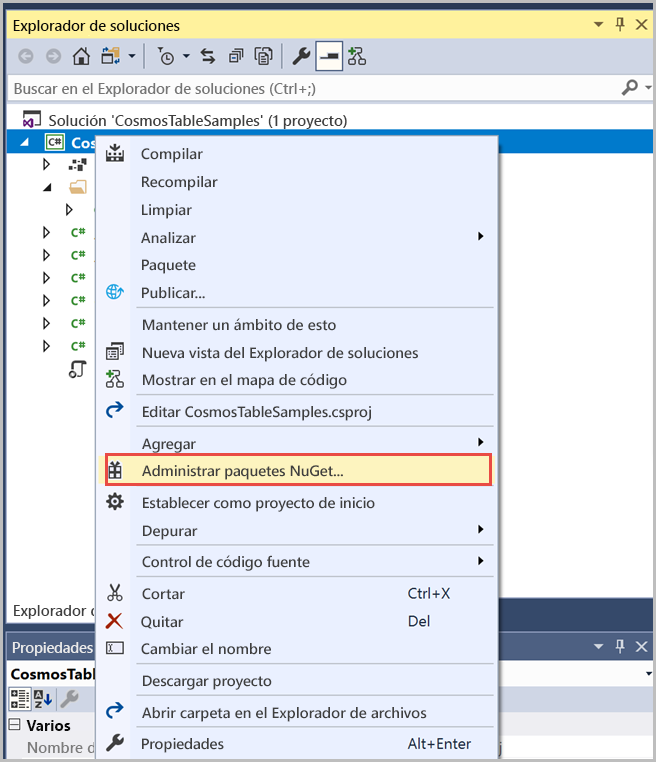
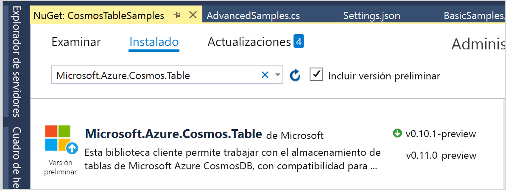

# <a name="quickstart-build-a-table-api-app-with-net-sdk-and-azure-cosmos-db"></a>Inicio rápido: creación de una aplicación de Table API con el SDK de .NET y Azure Cosmos DB 

> [!div class="op_single_selector"]
> * [.NET](create-table-dotnet.md)
> * [Java](create-table-java.md)
> * [Node.js](create-table-nodejs.md)
> * [Python](create-table-python.md)
>  

Esta guía de inicio rápido muestra cómo se usan .NET y [Table API](table-introduction.md) de Azure Cosmos DB para compilar una aplicación mediante la clonación de un ejemplo de GitHub. Esta guía de inicio rápido también muestra cómo crear una cuenta de Azure Cosmos DB y cómo usar el Explorador de datos para crear tablas y entidades en Azure Portal basado en web.

## <a name="prerequisites"></a>Requisitos previos

Si aún no tiene instalado Visual Studio 2019, puede descargar y usar la versión **gratuita** de [Visual Studio 2019 Community](https://www.visualstudio.com/downloads/). Asegúrese de que habilita **Desarrollo de Azure** durante la instalación de Visual Studio.

[!INCLUDE [quickstarts-free-trial-note](../../includes/quickstarts-free-trial-note.md)]

## <a name="create-a-database-account"></a>Creación de una cuenta de base de datos

[!INCLUDE [cosmos-db-create-dbaccount-table](../../includes/cosmos-db-create-dbaccount-table.md)]

## <a name="add-a-table"></a>Adición de una tabla

[!INCLUDE [cosmos-db-create-table](../../includes/cosmos-db-create-table.md)]

## <a name="add-sample-data"></a>Adición de datos de ejemplo

[!INCLUDE [cosmos-db-create-table-add-sample-data](../../includes/cosmos-db-create-table-add-sample-data.md)]

## <a name="clone-the-sample-application"></a>Clonación de la aplicación de ejemplo

Ahora vamos a clonar una aplicación de Table desde GitHub, establecer la cadena de conexión y ejecutarla. Verá lo fácil que es trabajar con datos mediante programación. 

1. Abra un símbolo del sistema, cree una carpeta nueva denominada ejemplos de GIT y, después, cierre el símbolo del sistema.

   ```bash
   md "C:\git-samples"
   ```

2. Abra una ventana de terminal de Git, como git bash y utilice el comando `cd` para cambiar a la nueva carpeta para instalar la aplicación de ejemplo.

   ```bash
   cd "C:\git-samples"
   ```

3. Ejecute el comando siguiente para clonar el repositorio de ejemplo. Este comando crea una copia de la aplicación de ejemplo en el equipo.

   ```bash
   git clone https://github.com/Azure-Samples/azure-cosmos-table-dotnet-core-getting-started.git
   ```

## <a name="open-the-sample-application-in-visual-studio"></a>Abrir la aplicación de ejemplo en Visual Studio

1. En Visual Studio, desde el menú **Archivo**, elija **Abrir** y, a continuación, elija **Proyecto o solución**. 

    

2. Navegue hasta la carpeta donde clonó la aplicación de ejemplo y abra el archivo TableStorage.sln.

## <a name="update-your-connection-string"></a>Actualización de la cadena de conexión

Ahora vuelva a Azure Portal para obtener la información de la cadena de conexión y cópiela en la aplicación. Esto permite que la aplicación se comunique con la base de datos hospedada. 

1. En [Azure Portal](https://portal.azure.com/), haga clic en **Cadena de conexión**. Use el botón de copia en el lado derecho de la ventana para copiar la **CADENA DE CONEXIÓN PRINCIPAL**.

   

2. En Visual Studio, abra el archivo **Settings.json**. 

3. Pegue la **CADENA DE CONEXIÓN PRINCIPAL** del portal en el valor de StorageConnectionString. Pegue la cadena dentro de las comillas.

   ```csharp
   {
      "StorageConnectionString": "<Primary connection string from Azure portal>"
   }
   ```

4. Presione CTRL+S para guardar el archivo **Settings.json**.

Ya ha actualizado la aplicación con toda la información que necesita para comunicarse con Azure Cosmos DB. 

## <a name="build-and-deploy-the-app"></a>Compilación e implementación de la aplicación

1. En Visual Studio, haga clic con el botón derecho en el proyecto **CosmosTableSamples** en **Explorador de soluciones** y, después, haga clic en **Administrar paquetes NuGet**. 

   

2. En el cuadro **Examinar** de NuGet, escriba Microsoft.Azure.Cosmos.Table. Se buscará la biblioteca de cliente de Table API de Cosmos DB. Observe que esta biblioteca está disponible actualmente para .NET Framework y .NET Standard. 
   
   

3. Haga clic en **Instalar** para instalar la biblioteca **Microsoft.Azure.Cosmos.Table**. De este modo, se instalan el paquete de Table API de Azure Cosmos DB y todas las dependencias.

4. Al ejecutar toda la aplicación, los datos de ejemplo se insertan en la entidad de tabla y eliminan al final, por lo que no verá datos insertados si ejecuta todo el ejemplo. Sin embargo, puede insertar algunos puntos de interrupción para ver los datos. Abra el archivo BasicSamples.cs y haga clic con el botón derecho en la línea 52, seleccione **Punto de interrupción** y, a continuación, seleccione **Insertar punto de interrupción**. Inserte otro punto de interrupción en la línea 55.

    

5. Presione F5 para ejecutar la aplicación. En la ventana de consola se muestra el nombre de la nueva base de datos de tablas (en este caso, demoa13b1) en Azure Cosmos DB. 
    
   

   Cuando se alcance el primer punto de interrupción, vuelva al Explorador de datos en Azure Portal. Haga clic en el botón **Actualizar**, expanda la tabla demo* y haga clic en **Entidades**. En la pestaña **Entidades** que está a la derecha se muestra la nueva entidad que se agregó para Walter Harp. Tenga en cuenta que el número de teléfono para la nueva entidad es 425-555-0101.

   
    
   Si recibe un error que indica que no se encuentra el archivo Settings.json al ejecutar el proyecto, puede resolverlo agregando la siguiente entrada XML a la configuración del proyecto. Haga clic en CosmosTableSamples, seleccione Editar CosmosTableSamples.csproj y agregue el itemGroup siguiente: 

   ```csharp
     <ItemGroup>
       <None Update="Settings.json">
         <CopyToOutputDirectory>PreserveNewest</CopyToOutputDirectory>
       </None>
     </ItemGroup>
   ```

6. Cierre la pestaña **Entidades** en el Explorador de datos.
    
7. Presione F5 para ejecutar la aplicación hasta el siguiente punto de interrupción. 

    Cuando se alcance el punto de interrupción, vuelva a Azure Portal, haga clic de nuevo en la pestaña **Entidades** para abrirla y compruebe que el número de teléfono se haya actualizado a 425-555-0105.

8. Presione F5 para ejecutar la aplicación. 
 
   La aplicación agrega entidades para usar en una aplicación de ejemplo avanzada que Table API no admite actualmente. A continuación, la aplicación elimina la tabla creada por la aplicación de ejemplo.

9. En la ventana de la consola, presione Entrar para finalizar la ejecución de la aplicación. 
  

## <a name="review-slas-in-the-azure-portal"></a>Revisión de los SLA en Azure Portal

[!INCLUDE [cosmosdb-tutorial-review-slas](../../includes/cosmos-db-tutorial-review-slas.md)]

## <a name="clean-up-resources"></a>Limpieza de recursos

[!INCLUDE [cosmosdb-delete-resource-group](../../includes/cosmos-db-delete-resource-group.md)]

## <a name="next-steps"></a>Pasos siguientes

En esta guía de inicio rápido, ha obtenido información sobre cómo crear una cuenta de Azure Cosmos DB, crear una tabla mediante el Explorador de datos y ejecutar una aplicación.  Ahora ya puede consultar los datos mediante Table API.  

> [!div class="nextstepaction"]
> [Importación de datos de tabla a Table API](table-import.md)

