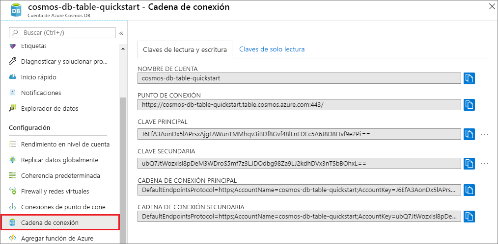

# <a name="quickstart-build-a-table-api-app-with-nodejs-and-azure-cosmos-db"></a>Inicio rápido: Compilación de una aplicación de Table API con Node.js y Azure Cosmos DB

> [!div class="op_single_selector"]
> * [.NET](create-table-dotnet.md)
> * [Java](create-table-java.md)
> * [Node.js](create-table-nodejs.md)
> * [Python](create-table-python.md)
> 

En este inicio rápido se crea una cuenta de Azure Cosmos DB para Table API y se utiliza Data Explorer y una aplicación de Node.js clonada desde GitHub para crear tablas y entidades. Azure Cosmos DB es un servicio de base de datos multimodelo que permite crear y consultar rápidamente bases de datos de documentos, tablas, claves-valores y grafos con funcionalidades de distribución global y escala horizontal.

## <a name="prerequisites"></a>Prerrequisitos

- Una cuenta de Azure con una suscripción activa. [cree una de forma gratuita](https://azure.microsoft.com/free/?ref=microsoft.com&utm_source=microsoft.com&utm_medium=docs&utm_campaign=visualstudio). O bien, [pruebe gratis Azure Cosmos DB](https://azure.microsoft.com/try/cosmosdb/) sin una suscripción de Azure. También puede usar el [emulador de Azure Cosmos DB](https://aka.ms/cosmosdb-emulator) con el identificador URI `https://localhost:8081` y la clave `C2y6yDjf5/R+ob0N8A7Cgv30VRDJIWEHLM+4QDU5DE2nQ9nDuVTqobD4b8mGGyPMbIZnqyMsEcaGQy67XIw/Jw==`.
- [Node.js 0.10.29+](https://nodejs.org/).
- [Git](https://git-scm.com/downloads).

## <a name="create-a-database-account"></a>Creación de una cuenta de base de datos

> [!IMPORTANT] 
> Debe crear una nueva cuenta de Table API para trabajar con los SDK de Table API disponibles para el público general. Las cuentas de Table API creadas durante la versión preliminar no son compatibles con los SDK disponibles para el público general.
>

[!INCLUDE [cosmos-db-create-dbaccount-table](../../includes/cosmos-db-create-dbaccount-table.md)]

## <a name="add-a-table"></a>Agregar una tabla

[!INCLUDE [cosmos-db-create-table](../../includes/cosmos-db-create-table.md)]

## <a name="add-sample-data"></a>Adición de datos de ejemplo

[!INCLUDE [cosmos-db-create-table-add-sample-data](../../includes/cosmos-db-create-table-add-sample-data.md)]

## <a name="clone-the-sample-application"></a>Clonación de la aplicación de ejemplo

Ahora vamos a clonar una aplicación de Table desde GitHub, establecer la cadena de conexión y ejecutarla. Verá lo fácil que es trabajar con datos mediante programación. 

1. Abra un símbolo del sistema, cree una carpeta nueva denominada ejemplos de GIT y, después, cierre el símbolo del sistema.

    ```bash
    md "C:\git-samples"
    ```

2. Abra una ventana de terminal de Git, como git bash y utilice el comando `cd` para cambiar a la nueva carpeta para instalar la aplicación de ejemplo.

    ```bash
    cd "C:\git-samples"
    ```

3. Ejecute el comando siguiente para clonar el repositorio de ejemplo. Este comando crea una copia de la aplicación de ejemplo en el equipo.

    ```bash
    git clone https://github.com/Azure-Samples/storage-table-node-getting-started.git
    ```

## <a name="update-your-connection-string"></a>Actualización de la cadena de conexión

Ahora vuelva a Azure Portal para obtener la información de la cadena de conexión y cópiela en la aplicación. Esto permite que la aplicación se comunique con la base de datos hospedada. 

1. En la cuenta de Azure Cosmos DB, en [Azure Portal](https://portal.azure.com/), seleccione **Cadena de conexión**. 

    

2. Utilice los botones de copia en el lado derecho para copiar la cadena de conexión principal (PRIMARY CONNECTION STRING).

3. Abra el archivo *app.config* y pegue el valor en la cadena connectionString de la línea tres. 

    > [!IMPORTANT]
    > Si el punto de conexión utiliza documents.azure.com, significa que tiene una cuenta en versión preliminar y que deberá crear una [nueva cuenta de Table API](#create-a-database-account) para trabajar con el SDK de Table API disponible para el público general.
    >

3. Guarde el archivo *app.config*.

Ya ha actualizado la aplicación con toda la información que necesita para comunicarse con Azure Cosmos DB. 

## <a name="run-the-app"></a>Ejecución la aplicación

1. En la ventana de terminal de Git, use `cd` para cambiar a la carpeta storage-table-java-getting-started.

    ```
    cd "C:\git-samples\storage-table-node-getting-started"
    ```

2. Ejecute el comando siguiente para instalar los módulos [azure], [node-uuid], [nconf] y [async] localmente y para guardar una entrada para ellos en el archivo *package.json*.

   ```
   npm install azure-storage node-uuid async nconf --save
   ```

2. En la ventana de terminal de GIT, ejecute los siguientes comandos para ejecutar la aplicación de Node.js.

    ```
    node ./tableSample.js 
    ```

    La ventana de consola muestra los datos de tabla que se van a agregar a la nueva base de datos de tablas en Azure Cosmos DB.

    Ahora puede volver al Explorador de datos y ver, consultar, modificar y trabajar con estos nuevos datos. 

## <a name="review-slas-in-the-azure-portal"></a>Revisión de los SLA en Azure Portal

[!INCLUDE [cosmosdb-tutorial-review-slas](../../includes/cosmos-db-tutorial-review-slas.md)]

## <a name="clean-up-resources"></a>Limpieza de recursos

[!INCLUDE [cosmosdb-delete-resource-group](../../includes/cosmos-db-delete-resource-group.md)]

## <a name="next-steps"></a>Pasos siguientes

En este inicio rápido, ha aprendido a crear una cuenta de Azure Cosmos DB, a crear una tabla mediante el Explorador de datos y a ejecutar una aplicación de Node.js para agregar datos de tabla.  Ahora ya puede consultar los datos mediante Table API.  

> [!div class="nextstepaction"]
> [Importación de datos de tabla a Table API](table-import.md)
