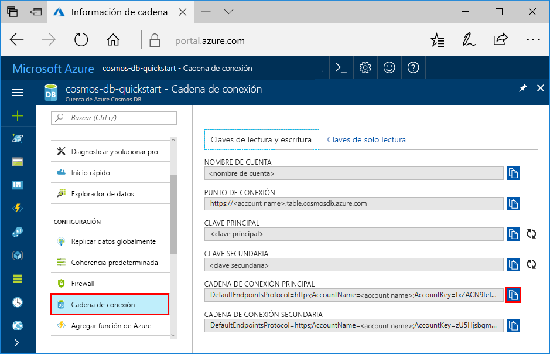

# <a name="quickstart-build-a-table-api-app-with-python-and-azure-cosmos-db"></a>Inicio rápido: Creación de una aplicación de Table API con Python y Azure Cosmos DB

> [!div class="op_single_selector"]
> * [.NET](create-table-dotnet.md)
> * [Java](create-table-java.md)
> * [Node.js](create-table-nodejs.md)
> * [Python](create-table-python.md)
> 

En este inicio rápido, se crea y administra una cuenta de Azure Cosmos DB para Table API desde Azure Portal y desde Visual Studio con una aplicación en Python clonada desde GitHub. Azure Cosmos DB es un servicio de base de datos multimodelo que permite crear y consultar rápidamente bases de datos de documentos, tablas, claves-valores y grafos con funcionalidades de distribución global y escala horizontal.

## <a name="prerequisites"></a>Prerrequisitos

- Una cuenta de Azure con una suscripción activa. [cree una de forma gratuita](https://azure.microsoft.com/free/?ref=microsoft.com&utm_source=microsoft.com&utm_medium=docs&utm_campaign=visualstudio). O bien, [pruebe gratis Azure Cosmos DB](https://azure.microsoft.com/try/cosmosdb/) sin una suscripción de Azure. También puede usar el [emulador de Azure Cosmos DB](https://aka.ms/cosmosdb-emulator) con el identificador URI `https://localhost:8081` y la clave `C2y6yDjf5/R+ob0N8A7Cgv30VRDJIWEHLM+4QDU5DE2nQ9nDuVTqobD4b8mGGyPMbIZnqyMsEcaGQy67XIw/Jw==`.
- [Visual Studio 2019](https://www.visualstudio.com/downloads/) con las cargas de trabajo **Desarrollo de Azure** y **Desarrollo de Python** seleccionadas durante la configuración. 
- [Git](https://git-scm.com/downloads).

## <a name="create-a-database-account"></a>Creación de una cuenta de base de datos

> [!IMPORTANT] 
> Debe crear una nueva cuenta de Table API para trabajar con los SDK de Table API disponibles para el público general. Las cuentas de Table API creadas durante la versión preliminar no son compatibles con los SDK disponibles para el público general.
>

[!INCLUDE [cosmos-db-create-dbaccount-table](../../includes/cosmos-db-create-dbaccount-table.md)]

## <a name="add-a-table"></a>Agregar una tabla

[!INCLUDE [cosmos-db-create-table](../../includes/cosmos-db-create-table.md)]

## <a name="add-sample-data"></a>Adición de datos de ejemplo

[!INCLUDE [cosmos-db-create-table-add-sample-data](../../includes/cosmos-db-create-table-add-sample-data.md)]

## <a name="clone-the-sample-application"></a>Clonación de la aplicación de ejemplo

Ahora vamos a clonar una aplicación de Table desde GitHub, establecer la cadena de conexión y ejecutarla. Verá lo fácil que es trabajar con datos mediante programación. 

1. Abra un símbolo del sistema, cree una carpeta nueva denominada ejemplos de GIT y, después, cierre el símbolo del sistema.

    ```bash
    md "C:\git-samples"
    ```

2. Abra una ventana de terminal de Git, como git bash y utilice el comando `cd` para cambiar a la nueva carpeta para instalar la aplicación de ejemplo.

    ```bash
    cd "C:\git-samples"
    ```

3. Ejecute el comando siguiente para clonar el repositorio de ejemplo. Este comando crea una copia de la aplicación de ejemplo en el equipo. 

    ```bash
    git clone https://github.com/Azure-Samples/storage-python-getting-started.git
    ```

3. Después, abra el archivo de solución en Visual Studio. 

## <a name="update-your-connection-string"></a>Actualización de la cadena de conexión

Ahora vuelva a Azure Portal para obtener la información de la cadena de conexión y cópiela en la aplicación. Esto permite que la aplicación se comunique con la base de datos hospedada. 

1. En la cuenta de Azure Cosmos DB, en [Azure Portal](https://portal.azure.com/), seleccione **Cadena de conexión**. 

    

2. Copie el valor de ACCOUNT NAME mediante el botón que encontrará en el lado derecho.

3. Abra el archivo *config.py* y pegue el valor de ACCOUNT NAME del portal en el valor de STORAGE_ACCOUNT_NAME en la línea 19.

4. Vuelva al portal y copie el valor de PRIMARY KEY.

5. Copie el valor de PRIMARY KEY del portal en el valor de STORAGE_ACCOUNT_KEY en la línea 20.

6. Guarde el archivo *config.py*.

## <a name="run-the-app"></a>Ejecución la aplicación

1. En Visual Studio, haga clic con el botón derecho en el proyecto en el **Explorador de soluciones**.

2. Seleccione el entorno de Python actual y haga clic con el botón derecho.

2. Seleccione el **paquete de instalación de Python** y, a continuación, escriba *azure-storage-table*.

3. Presione F5 para ejecutar la aplicación. La aplicación se muestra en el explorador. 

Ahora puede volver al Explorador de datos y ver, consultar, modificar y trabajar con estos nuevos datos. 

## <a name="review-slas-in-the-azure-portal"></a>Revisión de los SLA en Azure Portal

[!INCLUDE [cosmosdb-tutorial-review-slas](../../includes/cosmos-db-tutorial-review-slas.md)]

## <a name="clean-up-resources"></a>Limpieza de recursos

[!INCLUDE [cosmosdb-delete-resource-group](../../includes/cosmos-db-delete-resource-group.md)]

## <a name="next-steps"></a>Pasos siguientes

En este inicio rápido, ha aprendido a crear una cuenta de Azure Cosmos DB, a crear una tabla mediante el Explorador de datos y a ejecutar una aplicación de Python en Visual Studio para agregar datos de tabla.  Ahora ya puede consultar los datos mediante Table API.  

> [!div class="nextstepaction"]
> [Importación de datos de tabla a Table API](table-import.md)
