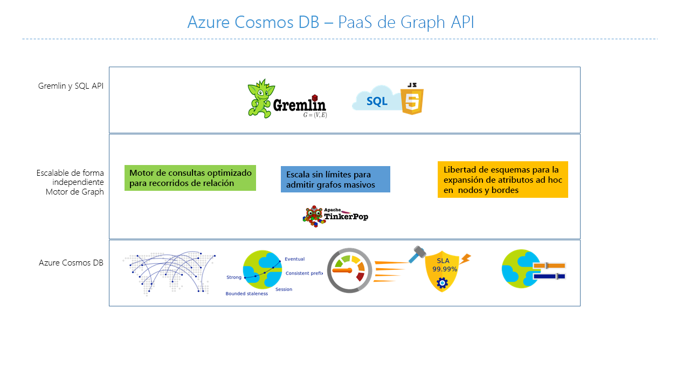
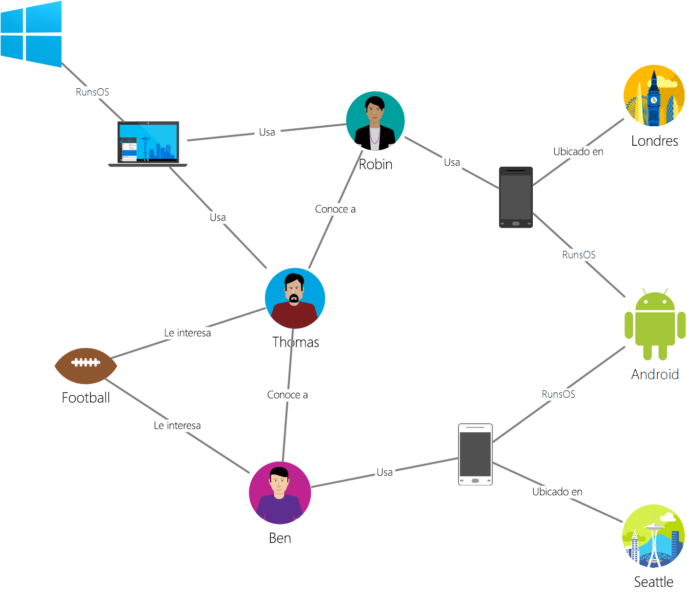

# <a name="introduction-to-azure-cosmos-db-gremlin-api"></a>Introducción a Azure Cosmos DB: API de Gremlin

[Azure Cosmos DB](introduction.md)  es el servicio de base de datos con varios modelos y distribución global de Microsoft para aplicaciones críticas. Es una base de datos multimodelo que admite modelos de datos de documentos, pares clave-valor, grafos y familias de columnas. La API Gremlin de Azure Cosmos DB se usa para almacenar y operar con datos de grafo en un servicio de base de datos totalmente administrado diseñado para cualquier escala.  



En este artículo se proporciona una introducción a Gremlin API de Azure Cosmos DB y se explica cómo se puede usar para almacenar grafos grandes con miles de millones de vértices y bordes. Puede consultar los grafos con una latencia de milisegundos y evolucionar la estructura de los grafos con facilidad. La API para Gremlin de Azure Cosmos DB se basa en el estándar de base de datos de grafos de [Apache TinkerPop](https://tinkerpop.apache.org)  y usa el lenguaje de consulta Gremlin. 

La API para Gremlin de Azure Cosmos DB combina la potencia de los algoritmos de base de datos de grafo con una infraestructura administrada altamente escalable para proporcionar una solución única y flexible para los problemas más comunes de datos asociados a la falta de flexibilidad y enfoques relacionales. 

## <a name="features-of-azure-cosmos-db-graph-database"></a>Características de la base de datos de grafos de Azure Cosmos DB
 
Azure Cosmos DB es una base de datos de gráficos totalmente administrada que ofrece una distribución global, escalado elástico de almacenamiento y rendimiento, indexación y consulta automáticas, niveles de coherencia ajustables y compatibilidad con el estándar TinkerPop. 

Las siguientes son características diferenciadas que ofrece la API para Gremlin de Azure Cosmos DB:

* **Rendimiento y almacenamiento escalables de manera elástica**

  Los gráficos en el mundo real necesitan escalarse más allá de la capacidad de un único servidor. Azure Cosmos DB admite bases de datos de grafos de escalabilidad horizontal que pueden tener un tamaño prácticamente ilimitado en términos de almacenamiento y rendimiento aprovisionado. A medida que crece la escala de la base de datos de grafos, los datos se distribuirán automáticamente mediante la [creación de particiones de grafos](https://docs.microsoft.com/azure/cosmos-db/graph-partitioning).

* **Replicación en varias regiones**

  Azure Cosmos DB puede replicar automáticamente los datos de grafo en cualquier región de Azure del mundo. La replicación global simplifica el desarrollo de aplicaciones que requieren acceso global a los datos. Además de minimizar la latencia de lectura y escritura en cualquier lugar del mundo, Azure Cosmos DB proporciona un mecanismo de conmutación por error regional automático que puede garantizar la continuidad de la aplicación en el caso excepcional de una interrupción del servicio en una región. 

* **Consultas rápidas y recorridos con el estándar de consulta de grafos más ampliamente adoptado**

  Almacene vértices y bordes heterogéneos, y consúltelos por medio de la sintaxis conocida de Gremlin. Gremlin es un lenguaje de consulta imperativo y funcional que proporciona una interfaz enriquecida para implementar algoritmos comunes de grafo. 
  
  Azure Cosmos DB permite realizar consultas y recorridos enriquecidos en tiempo real sin necesidad de especificar sugerencias de esquemas, índices secundarios ni vistas. Aprenda más en [Compatibilidad de Azure Cosmos DB con grafos Gremlin](gremlin-support.md).

* **Base de datos de grafos totalmente administrada**

  Azure Cosmos DB elimina la necesidad de administrar recursos de bases de datos y máquinas. La mayoría de las plataformas de base de datos de grafos existentes están supeditadas a las limitaciones de su infraestructura y a menudo requieren un alto grado de mantenimiento para garantizar su funcionamiento. 
  
  Al ser un servicio totalmente administrado, Cosmos DB evita la necesidad de administrar las máquinas virtuales, actualizar el software del entorno de ejecución, administrar el particionamiento o la replicación o realizar complejas actualizaciones en el nivel de datos. Se hacen copias de seguridad de todos los grafos, además de protegerlos ante errores regionales. Estas garantías permiten a los desarrolladores centrarse en la entrega de valor de la aplicación en lugar de dedicarse a la operación y administración de sus bases de datos de grafos. 

* **Indexación automática**

  De manera predeterminada, Azure Cosmos DB indexa automáticamente todas las propiedades en los nodos y bordes del grafo, y no espera ni requiere ningún esquema ni la creación de índices secundarios. Más información acerca de [la indexación de Azure Cosmos DB](https://docs.microsoft.com/azure/cosmos-db/index-overview). 

* **Compatibilidad con Apache TinkerPop**

  Azure Cosmos DB admite el [estándar de código abierto Apache TinkerPop](https://tinkerpop.apache.org/). El estándar Tinkerpop tiene un amplio ecosistema de aplicaciones y bibliotecas que se pueden integrar fácilmente con la API para Gremlin de Azure Cosmos DB. 

* **Niveles de coherencia ajustables**

  Azure Cosmos DB proporciona cinco niveles de coherencia bien definidos para lograr el equilibrio adecuado entre la coherencia y el rendimiento de la aplicación. Para las consultas y las operaciones de lectura, Azure Cosmos DB ofrece cinco niveles de coherencia diferentes: segura, obsolescencia limitada, sesión, prefijo coherente y posible. Estos niveles de coherencia bien definidos y pormenorizados le permiten realizar equilibrios razonables entre la coherencia, la disponibilidad y la latencia. Encontrará más información en [Niveles de coherencia de datos optimizables en Azure Cosmos DB](consistency-levels.md).

## <a name="scenarios-that-can-use-gremlin-api"></a>Escenarios que pueden usar Gremlin API
Estos son algunos escenarios donde puede resultar útil la compatibilidad con grafos de Azure Cosmos DB:

* **Redes sociales/Servicio de atención al cliente 365**

  Al combinar datos sobre los clientes y sus interacciones con otras personas, puede desarrollar experiencias personalizadas, predecir el comportamiento de los clientes o conectar a personas con otras que tengan intereses similares. Azure Cosmos DB puede utilizarse para administrar redes sociales y realizar un seguimiento de los datos y las preferencias de los usuarios.

* **Motores de recomendaciones**

  Este escenario se usa con frecuencia en el sector minorista. Al combinar información sobre productos, usuarios e interacciones de usuario, como comprar, examinar o clasificar un artículo, puede generar recomendaciones personalizadas. Azure Cosmos DB, con su latencia baja, escalado elástico y compatibilidad nativa con grafos, es ideal para estos escenarios.

* **Entorno geoespacial**

  Muchas aplicaciones en telecomunicaciones, logística y programación de viajes necesitan encontrar una ubicación de interés dentro de un área o localizar la mejor ruta entre dos ubicaciones o la más corta. Azure Cosmos DB es una opción natural para estos problemas.

* **Internet de las cosas**

  Con la red y las conexiones entre dispositivos IoT modeladas como un grafo, se puede conocer mejor el estado de los dispositivos y recursos. También se puede ver de qué manera los cambios en una parte de la red pueden afectar a otra.

## <a name="introduction-to-graph-databases"></a>Introducción a las bases de datos de grafos
Los datos, tal y como aparecen en el mundo real, están conectados naturalmente. El modelado de datos tradicional se centra en definir por separado las entidades y calcular sus relaciones en tiempo de ejecución. Aunque este modelo tiene sus ventajas, los datos muy conectados pueden resultar complicados de administrar con sus restricciones.  

Un enfoque de base de datos de grafo se basa en las relaciones persistentes en la capa de almacenamiento en su lugar, lo que da lugar a operaciones de recuperación de grafo muy eficaces. La API para Gremlin de Azure Cosmos DB es compatible con el [modelo de grafo de propiedades](https://tinkerpop.apache.org/docs/current/reference/#intro).

### <a name="property-graph-objects"></a>Objetos de grafos de propiedad

Un [grafo](http://mathworld.wolfram.com/Graph.html) es una estructura que está formada por [vértices](http://mathworld.wolfram.com/GraphVertex.html) y [bordes](http://mathworld.wolfram.com/GraphEdge.html). Ambos objetos pueden tener un número arbitrario de pares de clave-valor como propiedades. 

* **Vértices**: denotan entidades discretas, como una persona, un lugar o un evento.

* **Bordes**: representan las relaciones entre los vértices. Por ejemplo, es posible que una persona conozca a otra, haya participado en un evento y recientemente haya estado en una ubicación. 

* **Propiedades**: expresan información acerca de los bordes y los vértices. Puede haber cualquier número de propiedades tanto en los vértices como en los bordes, y se pueden usar para describir y filtrar los objetos en una consulta. Algunas propiedades de ejemplo incluyen un vértice con un nombre y una edad, o un borde, que tiene una marca de tiempo o un peso. 

Las bases de datos de grafos suelen incluirse en la categoría de base de datos NoSQL o no relacional, porque no hay ninguna dependencia de un esquema o modelo de datos restringido. Esta falta de esquema permite el modelado y almacenamiento de estructuras conectadas de forma natural y eficaz. 

### <a name="gremlin-by-example"></a>Gremlin con ejemplos
Vamos a usar un grafo de ejemplo para entender cómo se expresan las consultas en Gremlin. La siguiente ilustración muestra una aplicación empresarial que administra datos de usuarios, intereses y dispositivos en forma de grafo.  

 

Este grafo tiene los siguientes tipos de *vértices* (llamados "etiquetas" en Gremlin):

- **Personas**: El grafo tiene tres personas, Robin, Thomas y Ben
- **Intereses**: Sus intereses; en este ejemplo, el fútbol
- **Dispositivos**: Los dispositivos que usan las personas
- **Sistemas operativos**: Los sistemas operativos que se ejecutan en los dispositivos

Las relaciones entre estas entidades se representan con las siguientes etiquetas o tipos de *arista*:

- **Knows**: Por ejemplo, "Thomas conoce a Robin"
- **Interested**: Permite representar los intereses de las personas de nuestro grafo; por ejemplo, "Ben tiene interés en Fútbol"
- **RunsOS**: Portátil ejecuta el sistema operativo Windows
- **Uses**: Permite representar el dispositivo que una persona usa. Por ejemplo, Robin usa un teléfono Motorola con número de serie 77.

Vamos a ejecutar algunas operaciones en este grafo mediante la [consola de Gremlin](https://tinkerpop.apache.org/docs/3.3.2/reference/#gremlin-console). También puede realizar estas operaciones mediante controladores de Gremlin en la plataforma que elija (Java, Node.js, Python o .NET).  Antes de adentrarnos en lo que se admite en Azure Cosmos DB, veamos algunos ejemplos para familiarizarnos con la sintaxis.

Primero, echemos un vistazo a CRUD. La siguiente instrucción de Gremlin inserta el vértice "Thomas" en el grafo:

```java
:> g.addV('person').property('id', 'thomas.1').property('firstName', 'Thomas').property('lastName', 'Andersen').property('age', 44)
```

La siguiente instrucción de Gremlin inserta un arista "conoce a" entre Thomas y Robin.

```java
:> g.V('thomas.1').addE('knows').to(g.V('robin.1'))
```

La consulta siguiente devuelve los vértices "persona" en orden descendente de sus nombres:
```java
:> g.V().hasLabel('person').order().by('firstName', decr)
```

En el lugar donde brillan los grafos es donde se necesita responder preguntas como "¿Qué sistemas operativos usan los amigos de Thomas?". Puede ejecutar este recorrido de Gremlin para obtener esa información del grafo:

```java
:> g.V('thomas.1').out('knows').out('uses').out('runsos').group().by('name').by(count())
```

## <a name="next-steps"></a>Pasos siguientes
Para aprender más sobre la compatibilidad con grafos en Azure Cosmos DB:

* Empiece con el [tutorial de gráficos en Azure Cosmos DB](create-graph-dotnet.md).
* Obtenga más información sobre cómo [consultar grafos en Azure Cosmos DB mediante Gremlin](gremlin-support.md).
