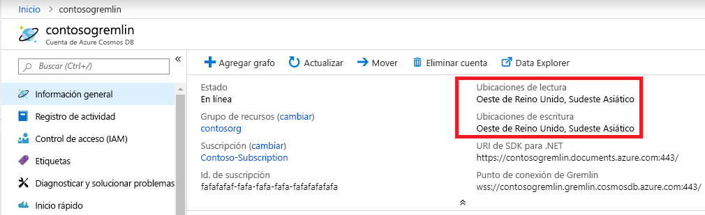

# <a name="regional-endpoints-for-azure-cosmos-db-graph-account"></a>Puntos de conexión regionales para la cuenta de grafos de Azure Cosmos DB
La base de datos de grafos de Azure Cosmos DB se [distribuye globalmente](distribute-data-globally.md), por lo que las aplicaciones pueden usar varios puntos de conexión de lectura. Las aplicaciones que necesitan acceso de escritura en varias ubicaciones deben habilitar la funcionalidad de [arquitectura multimaestro](how-to-multi-master.md).

Razones para elegir más de una región:
1. **Escalabilidad de lectura horizontal**: a medida que aumenta la carga de la aplicación, puede ser prudente enrutar el tráfico de lectura a diferentes regiones de Azure.
2. **Menor latencia**: puede reducir la sobrecarga de latencia de red de los distintos recorridos mediante el enrutamiento del tráfico de lectura y escritura a la región de Azure más cercana.

El requisito de **residencia de datos** se consigue estableciendo la directiva de Azure Resource Manager en la cuenta de Cosmos DB. El cliente puede limitar las regiones en las que Cosmos DB replica los datos.

## <a name="traffic-routing"></a>Enrutamiento del tráfico

La base de datos de grafos de Cosmos DB se ejecuta en varias regiones, y cada una de ellas contiene varios clústeres. Cada clúster, a su vez, tiene cientos de máquinas. El CNAME de DNS de la cuenta de grafos de Cosmos DB *accountname.gremlin.cosmos.azure.com* se resuelve en un registro D de DNS de un clúster. Una dirección IP individual de un equilibrador de carga oculta la topología interna del clúster.

Se crea un registro CNAME de DNS regional para cada región de la cuenta de grafos de Cosmos DB. El formato del punto de conexión regional es *accountname-region.gremlin.cosmos.azure.com*. Para obtener el segmento de la región del punto de conexión regional es preciso quitar todos los espacios del nombre de la [región de Azure](https://azure.microsoft.com/global-infrastructure/regions). Por ejemplo, la región `"East US 2"` de la cuenta de base de datos global `"contoso"` tendría el CNAME de DNS *contoso-eastus2.gremlin.cosmos.azure.com*

El cliente TinkerPop Gremlin está diseñado para funcionar con un solo servidor. La aplicación puede usar un CNAME de DNS de escritura global para el tráfico de lectura y escritura. Las aplicaciones que tienen en cuenta la región usan un punto de conexión regional para el tráfico de lectura. Los puntos de conexiones regional solo se pueden usar para el tráfico de escritura una región concreta está configurada para aceptar escrituras. 

> [!NOTE]
> Para que un motor de grafos de Cosmos DB acepte una operación de escritura en una región de lectura, es preciso difundir mediante un proxy el tráfico a la región de escritura. No se recomienda enviar escrituras a una región de solo lectura, ya que aumenta la latencia del recorrido y está sujeta a restricciones en el futuro.

El CNAME de la cuenta de base de datos global apunta siempre a una región de escritura válida. Durante la conmutación por error del servidor de la región de escritura, Cosmos DB actualiza la el CNAME de la cuenta de base de datos global para que apunte a la nueva región. Si la aplicación no puede controlar la redistribución del tráfico después de la conmutación por error, debe usar CNAME de DNS de la cuenta de base de datos global.

> [!NOTE]
> Cosmos DB no enruta el tráfico en función de la proximidad geográfica del autor de la llamada. Cada aplicación selecciona la región adecuada en función de sus necesidades únicas.

## <a name="portal-endpoint-discovery"></a>Detección de puntos de conexión del portal

La forma más sencilla de obtener la lista de regiones de una cuenta de grafos de Azure Cosmos DB es la hoja de información general de Azure Portal. Se podrá utilizar en aquellas aplicaciones que no cambien de región a menudo o que tengan una forma de actualizar la lista mediante la configuración de la aplicación.



En el ejemplo siguiente se muestran los principios generales del acceso al punto de conexión Gremlin regional. La aplicación debe tener en cuenta el número de regiones a las que se va a enviar el tráfico y el número de clientes de Gremlin correspondientes para crear instancias.

```csharp
// Example value: Central US, West US and UK West. This can be found in the overview blade of you Azure Cosmos DB Gremlin Account. 
// Look for Write Locations in the overview blade. You can click to copy and paste.
string[] gremlinAccountRegions = new string[] {"Central US", "West US" ,"UK West"};
string gremlinAccountName = "PUT-COSMOSDB-ACCOUNT-NAME-HERE";
string gremlinAccountKey = "PUT-ACCOUNT-KEY-HERE";
string databaseName = "PUT-DATABASE-NAME-HERE";
string graphName = "PUT-GRAPH-NAME-HERE";

foreach (string gremlinAccountRegion in gremlinAccountRegions)
{
  // Convert preferred read location to the form "[acountname]-[region].gremlin.cosmos.azure.com".
  string regionalGremlinEndPoint = $"{gremlinAccountName}-{gremlinAccountRegion.ToLowerInvariant().Replace(" ", string.Empty)}.gremlin.cosmos.azure.com";

  GremlinServer regionalGremlinServer = new GremlinServer(
    hostname: regionalGremlinEndPoint, 
    port: 443,
    enableSsl: true,
    username: "/dbs/" + databaseName + "/colls/" + graphName,
    password: gremlinAccountKey);

  GremlinClient regionalGremlinClient = new GremlinClient(
    gremlinServer: regionalGremlinServer,
    graphSONReader: new GraphSON2Reader(),
    graphSONWriter: new GraphSON2Writer(),
    mimeType: GremlinClient.GraphSON2MimeType);
}
```

## <a name="sdk-endpoint-discovery"></a>Detección de puntos de conexión del SDK

La aplicación puede usar el [SDK de Azure Cosmos DB](sql-api-sdk-dotnet.md) para detectar ubicaciones de lectura y escritura para la cuenta de grafos. Estas ubicaciones pueden cambiar en cualquier momento a través de la reconfiguración manual en el servidor o de la conmutación por error automática.

El SDK de TinkerPop Gremlin no tiene una API que detecte regiones de la cuenta de base de datos de grafos de Cosmos DB. Las aplicaciones que necesitan la detección de puntos de conexión del runtime necesitan hospedar dos SDK independientes en el espacio de procesos.

```csharp
// Depending on the version and the language of the SDK (.NET vs Java vs Python)
// the API to get readLocations and writeLocations may vary.
IDocumentClient documentClient = new DocumentClient(
    new Uri(cosmosUrl),
    cosmosPrimaryKey,
    connectionPolicy,
    consistencyLevel);

DatabaseAccount databaseAccount = await cosmosClient.GetDatabaseAccountAsync();

IEnumerable<DatabaseAccountLocation> writeLocations = databaseAccount.WritableLocations;
IEnumerable<DatabaseAccountLocation> readLocations = databaseAccount.ReadableLocations;

// Pick write or read locations to construct regional endpoints for.
foreach (string location in readLocations)
{
  // Convert preferred read location to the form "[acountname]-[region].gremlin.cosmos.azure.com".
  string regionalGremlinEndPoint = location
    .Replace("http:\/\/", string.Empty)
    .Replace("documents.azure.com:443/", "gremlin.cosmos.azure.com");
  
  // Use code from the previous sample to instantiate Gremlin client.
}
```

## <a name="next-steps"></a>Pasos siguientes
* [Administración del control de las cuentas de base de datos](how-to-manage-database-account.md) en Azure Cosmos DB
* [Alta disponibilidad](high-availability.md) en Azure Cosmos DB
* [Aspectos técnicos de la distribución global con Azure Cosmos DB](global-dist-under-the-hood.md)
* [Ejemplos de la CLI de Azure](cli-samples.md) para Azure Cosmos DB
