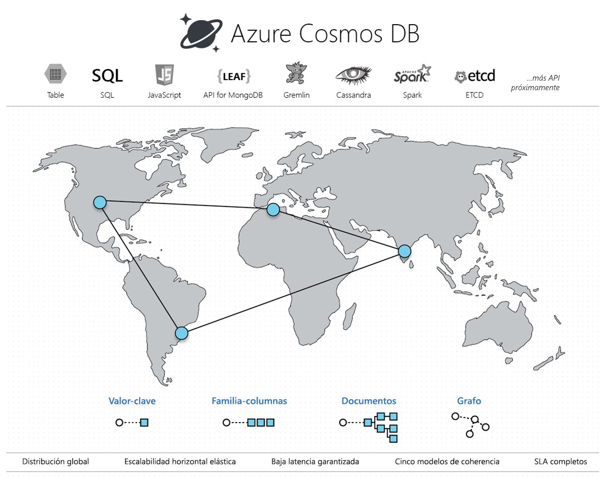

# Bienvenido a Azure Cosmos DB

Las aplicaciones actuales deben estar siempre en línea y tener una alta capacidad de respuesta. Para lograr baja latencia y alta disponibilidad, las instancias de estas aplicaciones deben implementarse en centros de datos que están cerca de sus usuarios. Es necesario que las aplicaciones respondan en tiempo real a grandes cambios, en cuanto a uso, en las horas punta, que almacenen volúmenes de datos que cada vez son mayores y que dichos datos estén a disposición de los usuarios en milisegundos.

Azure Cosmos DB es un servicio de base de datos con varios modelos distribuido de forma global de Microsoft. Con tan solo un clic, Cosmos DB permite escalar de forma elástica e individual el rendimiento y el almacenamiento en cualquier número de regiones de Azure a nivel mundial. Puede escalar de forma elástica el rendimiento y almacenamiento, y sacar provecho del rápido acceso a datos (menos de 10 milisegundos) mediante la API que prefiera, entre las que se incluyen SQL, MongoDB, Cassandra, Tables o Gremlin. Cosmos DB proporciona completos [Acuerdos de Nivel de Servicio](https://aka.ms/acdbsla) (SLA) con garantía de rendimiento, latencia, disponibilidad y consistencia, algo que no ofrecen otros servicios de base de datos.

También puede [probar gratis Azure Cosmos DB](https://azure.microsoft.com/try/cosmosdb/) sin ninguna suscripción de Azure, de forma gratuita y sin compromiso.

> [!div class="nextstepaction"]
> [Probar gratis Azure Cosmos DB](https://azure.microsoft.com/try/cosmosdb/)

## Ventajas principales

### Distribución global inmediata

Cosmos DB permite compilar aplicaciones con gran capacidad de respuesta y alta disponibilidad en todo el mundo. Cosmos DB replica de forma transparente sus datos allá donde estén sus usuarios, con el fin de que estos puedan interactuar con una réplica de los datos más cercanos a ellos.

Cosmos DB permite agregar o quitar cualquiera de las regiones de Azure de su cuenta de Cosmos en cualquier momento, con un solo clic de botón. Cosmos DB replicará perfectamente sus datos en todas las regiones asociadas con su cuenta de Cosmos y mientras su aplicación seguirá estando altamente disponible gracias a las funcionalidades de *hospedaje múltiple* del servicio. Para más información, consulte el artículo acerca de la [distribución global](distribute-data-globally.md).

### Always On

En virtud de la integración profunda con la infraestructura de Azure y la [replicación transparente de la arquitectura multimaestro](global-dist-under-the-hood.md), Cosmos DB proporciona una [alta disponibilidad del 99,999 %](high-availability.md) tanto para lecturas como para escrituras. Cosmos DB también proporciona la capacidad para invocar mediante programación (o a través del Portal) la conmutación por error regional de su cuenta de Cosmos. Esta funcionalidad ayuda a garantizar que la aplicación está diseñada para la conmutación por error en caso de desastre regional.

### Escalabilidad elástica del rendimiento y almacenamiento en todo el mundo

Cosmos DB se ha diseñado con creación de particiones horizontales y replicación de arquitectura multimaestro y ofrece una escalabilidad elástica sin precedentes para las operaciones de lectura y escritura en todo el mundo. Puede escalar verticalmente de forma elástica entre miles y cientos de millones de solicitudes por segundo en todo el mundo, con una sola llamada API y pagar solo por el rendimiento (y almacenamiento) que necesite. Esta funcionalidad le ayuda a tratar solucionar cargas de trabajo inesperadas de las de forma predecible sin tener que aprovisionar recursos de más por estos picos de actividad. Para más información, consulte [Creación de particiones en Azure Cosmos DB](partitioning-overview.md), [Aprovisionamiento del rendimiento en contenedores y bases de datos](set-throughput.md) y [Escalado global del rendimiento aprovisionado](scaling-throughput.md).

### Baja latencia garantizada en el percentil 99, en todo el mundo

Mediante Cosmos DB se pueden crear aplicaciones de escala planetaria con una gran capacidad de respuesta. Con el nuevo protocolo de replicación de arquitectura multimaestro y un [motor de base de datos optimizado para escritura](index-policy.md) y sin bloqueos, Cosmos DB garantiza latencias inferiores a 10 ms para las operaciones de lectura (indexadas) y escritura en el percentil 99, en todo el mundo. Esta funcionalidad permite la ingesta sostenida de datos y consultas increíblemente rápidas en aplicaciones con alta capacidad de respuesta.

### Varias opciones de coherencia definidas con precisión

Cuando compile aplicaciones distribuidas globalmente en Cosmos DB, ya no es preciso que haga [concesiones extremas entre coherencia, disponibilidad, latencia y rendimiento](consistency-levels-tradeoffs.md). El protocolo de replicación de la arquitectura multimaestro de Cosmos DB se ha diseñado meticulosamente para ofrecer [cinco opciones de coherencia bien definidas](consistency-levels.md) ( - *segura*, *obsolescencia limitada*, *sesión*, *prefijo coherente* y *eventual*) para disponer de un modelo de programación intuitivo con baja latencia y alta disponibilidad para aplicaciones distribuidas globalmente.

### Sin administración de índices o esquemas

Mantener la sincronización entre los índices y el esquema de una base de datos y el esquema de una aplicación es especialmente difícil en las aplicaciones distribuidas globalmente. Con Cosmos DB no es preciso ocuparse de la administración de esquemas o índices. El motor de base de datos es totalmente independiente del esquema.  Al no ser necesario administrar esquemas ni índices, tampoco es preciso preocuparse por el tiempo de inactividad de las aplicaciones durante la migración de esquemas. Cosmos DB [indexa automáticamente todos los datos](index-policy.md) y atiende rápidamente las consultas.

### Servicio de base de datos probado en el campo

Cosmos DB es un servicio fundamental de Azure. Durante casi una década, muchos productos de Microsoft han utilizado Cosmos DB para aplicaciones críticas a escala global, entre las que se incluyen Skype, Xbox, Office 365, Azure, etc. En la actualidad, Cosmos DB es uno de los servicios de crecimiento más rápido de Azure y lo usan muchos clientes externos y aplicaciones críticas que requieren un escalado flexible, distribución global inmediata y replicación de la arquitectura multimaestro para ofrecer baja latencia y alta disponibilidad de operaciones de lectura y escritura.

### Presencia en todas las regiones

Cosmos DB está disponible en todas las regiones de Azure del mundo, lo que incluye más de 54 regiones en la nube pública, [Azure China 21Vianet](https://www.azure.cn/en-us/), Azure Alemania, Azure Government y Azure Government para Department of Defense (DoD). Consulte [Presencia regional de Cosmos DB](regional-presence.md).

### Seguro de forma predeterminada y preparado para la empresa

Cosmos DB tiene la certificación de un [amplia gama de estándares de cumplimiento](compliance.md). Además, todos los datos de Cosmos DB se cifran tanto en reposo como en movimiento. Cosmos DB proporciona autorización a nivel de fila y cumple los estrictos estándares de seguridad.

### Ahorro considerable en TCO

Dado que Cosmos DB es un servicio totalmente administrado, no es preciso administrar y operar complejas implementaciones en varios centro de datos y actualizaciones del software de la base de datos, pagar el soporte técnico, las licencias o las operaciones ni tener que aprovisionar la base de datos para picos de cargas de trabajo. Para más información, consulte [Optimización de costo con Cosmos DB](total-cost-ownership.md).

### Acuerdos de nivel de servicio extraordinarios

Cosmos DB es el primer y único servicio que ofrece [excelentes y completos acuerdos de nivel de servicio](https://azure.microsoft.com/support/legal/sla/cosmos-db/) que incluyen una alta disponibilidad del 99,999 %, una latencia de lectura y escritura en el percentil 99, y rendimiento y coherencia garantizados.

### Análisis operativos distribuidos globalmente con Spark

[Spark](spark-connector.md) se puede ejecutar directamente en los datos almacenados en Cosmos DB. Esta funcionalidad permite realizar análisis operativo de baja latencia a escala global, sin que ello afecte a las cargas de trabajo transaccionales que operan directamente en Cosmos DB. Para más información, consulte [Análisis operativos distribuidos globalmente](lambda-architecture.md).

### Desarrollo de aplicaciones en Cosmos DB mediante API de NoSQL conocidas

Cosmos DB ofrece varias API que se pueden usar con los datos almacenados en una base de datos de Cosmos. De forma predeterminada, [puede utilizar SQL](how-to-sql-query.md) (una API básica) para consultar cualquier base de datos de Cosmos. Cosmos DB también implementa API para [Cassandra](cassandra-introduction.md), [MongoDB](mongodb-introduction.md), [Gremlin](graph-introduction.md) y [Azure Table Storage](table-introduction.md). Puede seleccionar controladores de cliente (y herramientas) para NoSQL que se usan con frecuencia (como MongoDB, Cassandra y Gremlin) directamente en su base de datos de Cosmos. Al admitir los protocolos de transferencia de las API de NoSQL que se usan con frecuencia, Cosmos DB, puede:

* Migrar fácilmente la aplicación a Cosmos DB, al tiempo que conserva partes importantes de la lógica de aplicación.
* Mantener la aplicación portátil y permanecer independiente de proveedores de nube.
* Obtener un servicio en la nube totalmente administrado con los mejores Acuerdos de Nivel de Servicio del sector con respaldo financiero para las API de NoSQL comunes. 
* Escalar de forma elástica el rendimiento y el almacenamiento aprovisionados para sus bases de datos en función de sus necesidades y pagar solo el rendimiento y el almacenamiento que necesita, lo que se traduce en un importante ahorro de costos.

## Soluciones que se benefician de Azure Cosmos DB

Cualquier [aplicación web, para dispositivos móviles, de juegos y de IoT](use-cases.md) que necesite controlar ingentes cantidades de datos y operaciones de lectura y escritura a [escala global](distribute-data-globally.md), con tiempos de respuesta casi en tiempo real para una variedad de datos se beneficiará de la alta disponibilidad, el elevado rendimiento, la latencia baja y la coherencia ajustable [garantizados](https://azure.microsoft.com/support/legal/sla/cosmos-db/) de Cosmos DB. Aprenda a usar Azure Cosmos DB para crear aplicaciones de [IoT y telemática](use-cases.md#iot-and-telematics), [comercio minorista y marketing](use-cases.md#retail-and-marketing), y [juegos](use-cases.md#gaming), así como [aplicaciones web y para dispositivos móviles](use-cases.md#web-and-mobile-applications).

## Pasos siguientes

Más información acerca de los conceptos básicos de [distribución global inmediata](distribute-data-globally.md), [creación de particiones](partitioning-overview.md) y [rendimiento aprovisionado](request-units.md) de Cosmos DB.

Comience a usar Azure Cosmos DB con una de nuestras guías rápidas:

* [Introducción a SQL API de Azure Cosmos DB](create-sql-api-dotnet.md)
* [Introducción a la API de Azure Cosmos DB para MongoDB](create-mongodb-nodejs.md)
* [Introducción a la API Cassandra de Azure Cosmos DB](create-cassandra-dotnet.md)
* [Introducción a Gremlin API de Azure Cosmos DB](create-graph-dotnet.md)
* [Introducción a Table API de Azure Cosmos DB](create-table-dotnet.md)

> [!div class="nextstepaction"]
> [Pruebe gratis Azure Cosmos DB](https://azure.microsoft.com/try/cosmosdb/)
