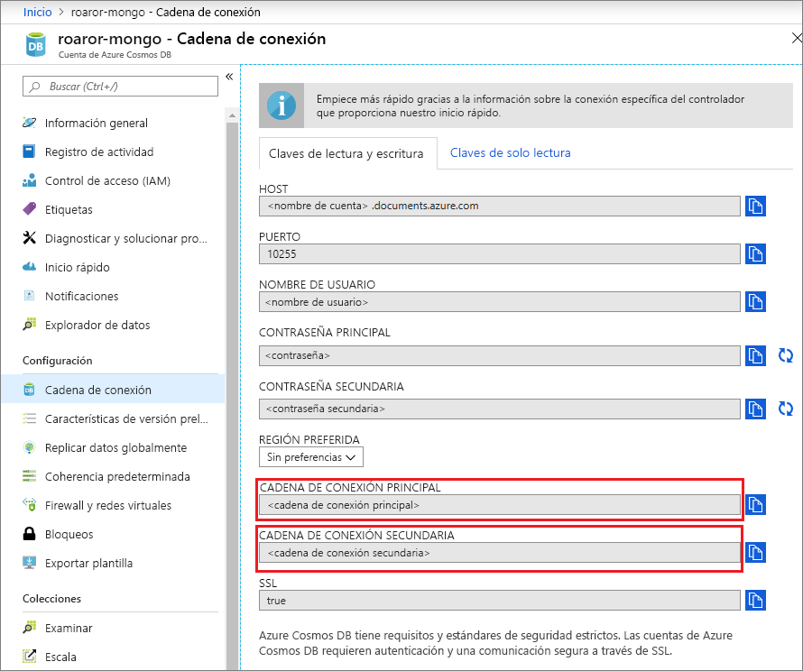
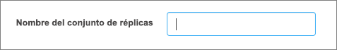

# Uso de MongoDB Compass para conectarse a la API de Azure Cosmos DB para MongoDB 

En este tutorial se muestra cómo usar [MongoDB Compass](https://www.mongodb.com/products/compass) para almacenar o administrar datos en Cosmos DB. En este tutorial usaremos la API de Azure Cosmos DB para MongoDB. Para aquellos que no estén familiarizados con este asunto, COMPASS es una GUI para MongoDB. Normalmente, se utiliza para visualizar los datos y ejecutar consultas ad hoc, junto con la administración de los datos. 

Cosmos DB es el servicio de base de datos de varios modelos de distribución global de Microsoft. Puede crear rápidamente bases de datos de documentos, clave-valor y grafos, y realizar consultas en ellas. Todas las bases de datos se beneficiarán de las funcionalidades de distribución global y escala horizontal en Cosmos DB.

## Requisitos previos 
Para conectar a una cuenta de Cosmos DB con Robo 3T, debe:

* Descargar e instalar [Compass](https://www.mongodb.com/download-center/compass?jmp=hero)
* Tener información de la [cadena de conexión](connect-mongodb-account.md) de Cosmos DB

## Conexión de la API de Cosmos DB para MongoDB 
Para conectar su cuenta de Cosmos DB con Compass, puede seguir los pasos siguientes:

1. Recupere la información de conexión de su cuenta de Cosmos configurada con la API MongoDB de Azure Cosmos DB siguiendo las instrucciones indicadas [aquí](connect-mongodb-account.md).

    

2. Haga clic en el botón para **copiar en el Portapapeles** que está junto a su **cadena de conexión principal o secundaria** en Cosmos DB. Al hacer clic en este botón, se copiará la cadena de conexión completa en el Portapapeles. 

    

3. Abra Compass en el escritorio o la máquina y haga clic sucesivamente en **Connect** (Conectar) y **Connect to...** (Conectarse a...). 

4. Compass detectará automáticamente una cadena de conexión en el Portapapeles y le preguntará si desea utilizar esa para la conexión. Haga clic en **Yes** (Sí) como se indica en la captura de pantalla anterior.

    

5. Al hacer clic en **Yes** (Sí) en el paso anterior, los detalles de la cadena de conexión se rellenarán automáticamente. Quite el valor rellenado automáticamente en el campo **Replica Set Name** (Nombre del conjunto de réplicas) para asegurarse de que se deja en blanco. 

    

6. Haga clic en **Connect** (Conectar), en la parte inferior de la página. La cuenta y las bases de datos de Cosmos DB deberían ser ya visibles en MongoDB Compass.

## Pasos siguientes

- Aprenda a [usar Studio 3T](mongodb-mongochef.md) con la API de Azure Cosmos DB para MongoDB.
- Explore [ejemplos](mongodb-samples.md) de MongoDB con la API de Azure Cosmos DB para MongoDB.