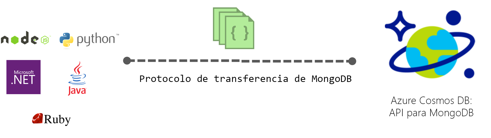

# API de Azure Cosmos DB para MongoDB

[Azure Cosmos DB](introduction.md) es un servicio de base de datos con varios modelos y distribución global de Microsoft para aplicaciones críticas. Azure Cosmos DB ofrece una [distribución global inmediata](distribute-data-globally.md), [escalado elástico de rendimiento y almacenamiento](partition-data.md) en todo el mundo, latencias de menos de 10 ms en el percentil 99 y alta disponibilidad garantizada, todo ello respaldado por [acuerdos de nivel de servicio líderes del sector](https://azure.microsoft.com/support/legal/sla/cosmos-db/). Azure Cosmos DB [indexa datos automáticamente](https://www.vldb.org/pvldb/vol8/p1668-shukla.pdf) sin que haya que ocuparse de la administración de esquemas ni de índices. Sigue varios modelos y es compatible con los modelos de datos de documento, de clave-valor, de grafo y de columnas. De forma predeterminada, puede interactuar con Cosmos DB mediante la API de SQL. Además, el servicio Cosmos DB implementa los protocolos de conexión para API de NoSQL comunes como Cassandra, MongoDB, Gremlin y Azure Table Storage. Esto le permite usar los controladores de cliente de NoSQL y las herramientas que ya conoce para interactuar con la base de datos de Cosmos.

## Compatibilidad de protocolo de conexión

Azure Cosmos DB implementa los protocolos de conexión de base de datos NoSQL comunes como Cassandra, MongoDB, Gremlin y Azure Table Storage. Al proporcionar una implementación nativa de los protocolos de conexión de manera directa y eficiente en Cosmos DB, permite que los SDK, los controladores y las herramientas de cliente existentes de las bases de datos NoSQL interactúen con Cosmos DB de forma transparente. Cosmos DB no utiliza ningún código fuente de las bases de datos para proporcionar API compatibles con la conexión a cualquiera de las bases de datos NoSQL.

La API de Azure Cosmos DB para MongoDB es compatible de manera predeterminada con la versión 3.2 del protocolo de conexión de MongoDB. Las características o los operadores de consulta que se han agregado en la versión 3.4 del protocolo de conexión están actualmente disponibles como característica en versión preliminar. Cualquier controlador cliente de MongoDB que reconozca estas versiones del protocolo debería poder conectarse de forma nativa a Cosmos DB.

 

## Ventajas principales

Las principales ventajas de Cosmos DB como base de datos completamente administrada y distribuida globalmente como servicio se describen [aquí](introduction.md). Además, al implementar de forma nativa los protocolos de conexión de API de NoSQL populares, Cosmos DB ofrece las siguientes ventajas:

* Migre fácilmente la aplicación a Cosmos DB al tiempo que conserva partes significativas de la lógica de aplicación.
* Mantenga la aplicación portátil y permanezca independiente de proveedores de nube.
* Obtenga contratos de nivel de servicio con respaldo financiero líderes del sector para API de NoSQL comunes con tecnología de Cosmos DB.
* Escale de forma elástica el rendimiento y el almacenamiento aprovisionados para sus bases de datos de Cosmos según sus necesidades y pague solo el rendimiento y el almacenamiento que necesita. Esto se traduce en ahorros de costos significativos.
* Distribución global llave en mano con replicación de arquitectura multimaestro.

## API de Cosmos DB para MongoDB

Siga los artículos de inicio rápido si desea crear una cuenta de Cosmos y migrar la aplicación de MongoDB para usar Azure Cosmos DB, o bien compile una nueva:

* [Migración de una aplicación web Node.js de MongoDB existente](create-mongodb-nodejs.md)
* [Compilación de una aplicación web mediante la API de Azure Cosmos DB para MongoDB y el SDK de .NET](create-mongodb-dotnet.md)
* [Compilación de una aplicación de consola mediante la API de Azure Cosmos DB para MongoDB y el SDK de Java](create-mongodb-java.md)

## Pasos siguientes

Estas son algunas sugerencias para comenzar:

* Para aprender a obtener la información de cadena de conexión de la cuenta, siga el tutorial de [conexión de una aplicación de MongoDB a Azure Cosmos DB](connect-mongodb-account.md).
* Para aprender a crear una conexión entre la base de datos de Azure Cosmos DB y la aplicación de MongoDB en Studio 3T, siga el tutorial de [uso de Studio 3T con Azure Cosmos DB](mongodb-mongochef.md).
* Para importar los datos a una base de datos de Cosmos, siga el tutorial de [importación de datos de MongoDB en Azure Cosmos DB](mongodb-migrate.md).
* Conéctese a una cuenta de Cosmos con [Robo 3T](mongodb-robomongo.md).
* Aprenda a [configurar las preferencias de lectura para las aplicaciones distribuidas globalmente](../cosmos-db/tutorial-global-distribution-mongodb.md).

Nota: En este artículo se describe una característica de Azure Cosmos DB que proporciona compatibilidad del protocolo de conexión con bases de datos de MongoDB. Microsoft no ejecuta bases de datos de MongoDB que ofrezcan este servicio. Azure Cosmos DB no está afiliado a MongoDB, Inc.
