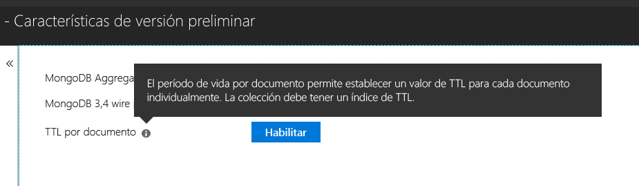

# <a name="expire-data-with-azure-cosmos-dbs-api-for-mongodb"></a>Expiración de los datos con la API de Azure Cosmos DB para MongoDB

La funcionalidad de período de vida (TTL) permite la expiración automática de los datos de la base de datos. La API de Azure Cosmos DB para MongoDB utiliza las funcionalidades de TTL básicas de Cosmos DB. Se admiten dos modos: establecer un valor de TTL predeterminado en toda la colección y establecer valores de TTL individuales para cada documento. La lógica que rige los índices de TTL y los valores de TTL por documento en la API de Azure Cosmos DB para MongoDB es la [misma que en Cosmos DB](../cosmos-db/mongodb-indexing.md).

## <a name="ttl-indexes"></a>Índices TTL
Para habilitar TTL de forma universal en una colección, es preciso crear un ["índice TTL" (índice de período de vida)](../cosmos-db/mongodb-indexing.md). El índice TTL es un índice del campo _ts con un valor "expireAfterSeconds".

Ejemplo:
```JavaScript
globaldb:PRIMARY> db.coll.createIndex({"_ts":1}, {expireAfterSeconds: 10})
{
        "_t" : "CreateIndexesResponse",
        "ok" : 1,
        "createdCollectionAutomatically" : true,
        "numIndexesBefore" : 1,
        "numIndexesAfter" : 4
}
```

El comando del ejemplo anterior creará un índice con la funcionalidad TTL. Una vez creado el índice, la base de datos eliminará automáticamente todos los documentos de la colección que no se hayan modificado en los últimos 10 segundos. 

> [!NOTE]
> **_ts** es un campo específico de Cosmos DB y no es accesible desde los clientes de MongoDB. Es una propiedad reservada (sistema) que contiene la marca de tiempo de la última modificación del documento.
>
    
Además, un ejemplo de C#: 

```csharp
var options = new CreateIndexOptions {ExpireAfter = TimeSpan.FromSeconds(10)}; 
var field = new StringFieldDefinition<BsonDocument>("_ts"); 
var indexDefinition = new IndexKeysDefinitionBuilder<BsonDocument>().Ascending(field); 
await collection.Indexes.CreateOneAsync(indexDefinition, options); 
``` 

## <a name="set-time-to-live-value-for-a-document"></a>Establecer el periodo de vida de un documento 
También se admiten valores TTL por documento. Los documentos deben contener una propiedad de nivel de raíz "ttl" (en minúscula), y se debe haber creado un índice TTL para la colección como se ha descrito anteriormente. Los valores TTL establecidos en un documento anularán el valor TTL de la colección.

El valor TTL debe ser int32. Como alternativa, un valor int64 que se ajuste a un valor int32 o uno doble sin la parte decimal que se ajuste a un valor int32. Se permiten valores de la propiedad TTL que no se ajusten a estas especificaciones, pero no se tratan como un valor TTL de documento significativo.

El valor TTL del documento es opcional; los documentos sin valor TTL se pueden insertar en la colección.  En este caso, se respetará el valor TTL de la colección. 

Los documentos siguientes tienen valores TTL válidos. Una vez que se insertan los documentos, los valores TTL de los documentos invalidan los valores TTL de la colección. Por tanto, los documentos se eliminan a los 20 segundos.  

```JavaScript 
globaldb:PRIMARY> db.coll.insert({id:1, location: "Paris", ttl: 20.0}) 
globaldb:PRIMARY> db.coll.insert({id:1, location: "Paris", ttl: NumberInt(20)}) 
globaldb:PRIMARY> db.coll.insert({id:1, location: "Paris", ttl: NumberLong(20)}) 
```

Los documentos siguientes tienen valores TTL no válidos. Los documentos se insertarán, pero no se respetará el valor TTL del documento. Por tanto, los documentos se eliminarán a los 10 segundos debido al valor TTL de la colección. 

```JavaScript 
globaldb:PRIMARY> db.coll.insert({id:1, location: "Paris", ttl: 20.5}) //TTL value contains non-zero decimal part. 
globaldb:PRIMARY> db.coll.insert({id:1, location: "Paris", ttl: NumberLong(2147483649)}) //TTL value is greater than Int32.MaxValue (2,147,483,648). 
``` 

## <a name="how-to-activate-the-per-document-ttl-feature"></a>Activación de la característica TTL de cada documento

La característica TTL por documento se puede activar con API de Azure Cosmos DB para MongoDB.

 

## <a name="next-steps"></a>Pasos siguientes
* [Expiración automática de los datos de Azure Cosmos DB con período de vida](../cosmos-db/time-to-live.md)
* [Indexación de la base de datos de Cosmos configurada con la API de Azure Cosmos DB para MongoDB](../cosmos-db/mongodb-indexing.md)
