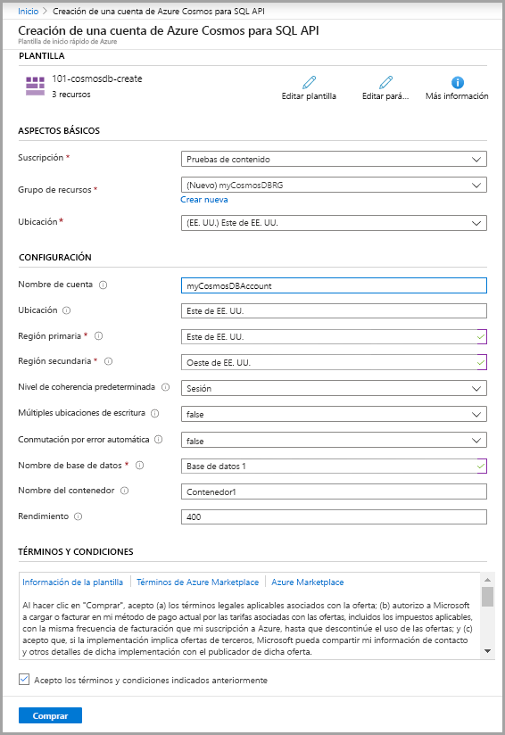
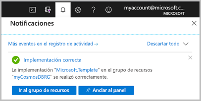

# <a name="quickstart-create-an-azure-cosmos-db-and-a-container-by-using-azure-resource-manager-template"></a>Inicio rápido: Creación de una instancia de Azure Cosmos DB y un contenedor mediante una plantilla de Resource Manager

Azure Cosmos DB es un servicio de base de datos con varios modelos y de distribución global de Microsoft. Puede usar Azure Cosmos DB para crear y consultar rápidamente las bases de datos de grafos, documentos y de claves y valores. Este inicio rápido se centra en el proceso de implementación de una plantilla de Resource Manager para crear una base de datos de Azure Cosmos y un contenedor en dicha base de datos. Posteriormente, puede almacenar datos en este contenedor.

La [plantilla de Resource Manager](../azure-resource-manager/templates/overview.md) es un archivo JSON (notación de objetos JavaScript) que contiene la infraestructura y la configuración del proyecto. La plantilla usa sintaxis declarativa, lo que permite establecer lo que pretende implementar sin tener que escribir la secuencia de comandos de programación para crearla. Si desea más información sobre el desarrollo de plantillas de Resource Manager, consulte la [documentación de Resource Manager](/azure/azure-resource-manager/) y la [referencia de la plantilla](/azure/templates/microsoft.DocumentDB/allversions).

Si no tiene una suscripción a Azure, cree una [cuenta gratuita](https://azure.microsoft.com/free/?WT.mc_id=A261C142F) antes de empezar.

## <a name="prerequisites"></a>Prerrequisitos

Una suscripción a Azure o una cuenta de evaluación gratuita de Azure Cosmos DB

- [!INCLUDE [quickstarts-free-trial-note](../../includes/quickstarts-free-trial-note.md)] 

- [!INCLUDE [cosmos-db-emulator-docdb-api](../../includes/cosmos-db-emulator-docdb-api.md)]  

## <a name="create-an-azure-cosmos-account-database-container"></a>Creación de una cuenta, una base de datos y un contenedor de Azure Cosmos

La plantilla usada en este inicio rápido forma parte de las [plantillas de inicio rápido de Azure](https://azure.microsoft.com/resources/templates/101-cosmosdb-create/).

:::code language="json" source="~/quickstart-templates/101-cosmosdb-create/azuredeploy.json":::

En la plantilla se definen tres recursos de Azure:

* [Microsoft.DocumentDB/databaseAccounts](/azure/templates/microsoft.documentdb/databaseaccounts): Creación de una cuenta de Azure Cosmos.

* [Microsoft.DocumentDB/databaseAccounts/sqlDatabases](/azure/templates/microsoft.documentdb/databaseaccounts/sqldatabases): Creación de una base de datos de Azure Cosmos.

* [Microsoft.DocumentDB/databaseAccounts/sqlDatabases/containers](/azure/templates/microsoft.documentdb/databaseaccounts/sqldatabases/containers): Creación de un contenedor de Azure Cosmos.

Encontrará más ejemplos de plantillas de Azure Cosmos DB en la [galería de plantillas de inicio rápido](https://azure.microsoft.com/resources/templates/?resourceType=Microsoft.Documentdb).

1. Seleccione la imagen siguiente para iniciar sesión en Azure y abrir una plantilla. La plantilla crea una cuenta, una base de datos y un contenedor de Azure Cosmos.

   <a href="https://portal.azure.com/#create/Microsoft.Template/uri/https%3A%2F%2Fraw.githubusercontent.com%2FAzure%2Fazure-quickstart-templates%2Fmaster%2F101-cosmosdb-create%2Fazuredeploy.json"></a>

2. Seleccione o escriba los siguientes valores.

   

    A menos que se especifique, utilice el valor predeterminado para crear los recursos de Azure Cosmos.

    * **Suscripción**: seleccione una suscripción de Azure.
    * **Grupo de recursos**: seleccione **Crear nuevo**, escriba un nombre único para el grupo de recursos y, a continuación, haga clic en **Aceptar**.
    * **Ubicación**: seleccione una ubicación.  Por ejemplo, **Centro de EE. UU**.
    * **Nombre de cuenta**: escriba un nombre para la cuenta de Azure Cosmos. Debe ser único globalmente. 
    * **Ubicación**: escriba una ubicación donde desea crear la cuenta de Azure Cosmos. La cuenta de Azure Cosmos puede estar en la misma ubicación que el grupo de recursos. 
    * **Región primaria**: la región de la réplica principal de la cuenta de Azure Cosmos.
    * **Región secundaria**: la región de la réplica secundaria de la cuenta de Azure Cosmos.
    * **Nombre de base de datos**: el nombre de la base de datos de Azure Cosmos.
    * **Nombre del contenedor**: el nombre del contenedor de Azure Cosmos.
    * **Rendimiento**:  el rendimiento del contenedor, el valor de rendimiento mínimo es 400 RU/s. 
    * **Acepto los términos y condiciones anteriores**: Seleccionar.

3. Seleccione **Comprar**. Cuando la cuenta de Azure Cosmos se haya implementado correctamente, recibirá una notificación:

   

Azure Portal se usa para implementar la plantilla. Además de Azure Portal, también puede usar Azure PowerShell, la CLI de Azure y API REST. Para obtener información sobre otros métodos de implementación, consulte [Implementación de plantillas](../azure-resource-manager/templates/deploy-powershell.md).

## <a name="validate-the-deployment"></a>Validación de la implementación

Puede usar Azure Portal para comprobar la cuenta de Azure Cosmos, la base de datos y el contenedor o usar el siguiente script de la CLI de Azure o Azure PowerShell para enumerar el secreto que ha creado.

# <a name="cli"></a>[CLI](#tab/CLI)

```azurecli-interactive
echo "Enter your Azure Cosmos account name:" &&
read cosmosAccountName &&
echo "Enter the resource group where the Azure Cosmos account exists:" &&
read resourcegroupName &&
az cosmosdb show -g $resourcegroupName -n $cosmosAccountName
```

# <a name="powershell"></a>[PowerShell](#tab/PowerShell)

```azurepowershell-interactive
$resourceGroupName = Read-Host -Prompt "Enter the resource group name where your Azure Cosmos account exists"
(Get-AzResource -ResourceType "Microsoft.DocumentDB/databaseAccounts" -ResourceGroupName $resourceGroupName).Name 
 Write-Host "Press [ENTER] to continue..."
```

---

## <a name="clean-up-resources"></a>Limpieza de recursos

Si tiene pensado seguir trabajando en otros tutoriales, considere la posibilidad de dejar estos recursos activos.
Cuando ya no lo necesite, elimine el grupo de recursos; de este modo, se eliminarán también la cuenta y los recursos relacionados de Azure Cosmos. Para eliminar el grupo de recursos mediante Azure PowerShell o la CLI de Azure:

# <a name="cli"></a>[CLI](#tab/CLI)

```azurecli-interactive
echo "Enter the Resource Group name:" &&
read resourceGroupName &&
az group delete --name $resourceGroupName &&
echo "Press [ENTER] to continue ..."
```

# <a name="powershell"></a>[PowerShell](#tab/PowerShell)

```azurepowershell-interactive
$resourceGroupName = Read-Host -Prompt "Enter the Resource Group name"
Remove-AzResourceGroup -Name $resourceGroupName
Write-Host "Press [ENTER] to continue..."
```

---

## <a name="next-steps"></a>Pasos siguientes

En este inicio rápido, ha creado una cuenta de Azure Cosmos, una base de datos y un contenedor mediante una plantilla de Azure Resource Manager y ha validado la implementación. Para más información sobre Azure Cosmos DB y Azure Resource Manager, continúe con los artículos siguientes.

- Lea una [introducción a Azure Cosmos DB](introduction.md).
- Obtenga más información sobre [Azure Resource Manager](../azure-resource-manager/management/overview.md).
- Obtenga otras [plantillas de Azure Resource Manager para Azure Cosmos DB](resource-manager-samples.md).