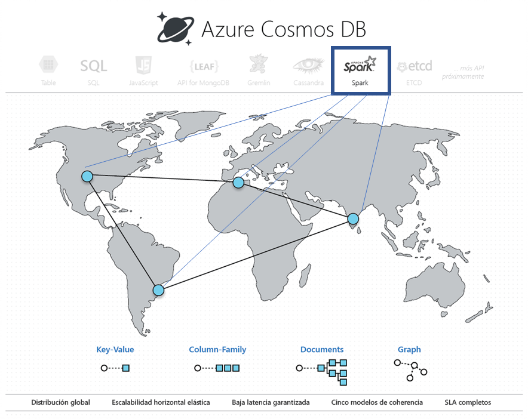

# Análisis operativo en tiempo real integrado en Azure Cosmos DB con Apache Spark (versión preliminar) 

La compatibilidad integrada con Apache Spark en Azure Cosmos DB permite ejecutar análisis de Apache Spark con los datos almacenados en una cuenta de Azure Cosmos. Proporciona la compatibilidad nativa para ejecutar directamente los trabajos de Apache Spark en las bases de datos distribuidas globalmente de Cosmos. Con estas funcionalidades, los desarrolladores, ingenieros de datos y científicos de datos pueden usar Azure Cosmos DB como una plataforma de datos flexible, escalable y de alto rendimiento para ejecutar las cargas de trabajo de **OLTP y OLAP/HTAP**. 

> [!NOTE]
> La compatibilidad integrada con Apache Spark en Azure Cosmos DB está actualmente en versión preliminar limitada. Para registrarse para la versión preliminar, vaya a la página de [registro en la versión preliminar](https://portal.azure.com/?feature.customportal=false#create/Microsoft.DocumentDB). 

La compatibilidad con Apache Spark en Azure Cosmos DB ofrece las siguientes ventajas:

* Puede obtener información para datos y usuarios geográficamente distribuidos en el menor tiempo posible.

* Puede simplificar la arquitectura de la solución y reducir el [costo total de propiedad](total-cost-ownership.md) (TCO). El sistema tiene el mínimo número de componentes de procesamiento de datos, y evita los movimientos de datos innecesarios entre ellos.

* Crea límites de [seguridad](secure-access-to-data.md), [cumplimiento](compliance.md)y auditoría que abarcan todos los datos bajo la administración.

* Proporciona análisis de usuario final "siempre disponibles" o de [alta disponibilidad](high-availability.md) que están respaldados por rigurosos Acuerdos de Nivel de Servicio.

 
Mediante la compatibilidad con Apache Spark en Azure Cosmos DB puede compilar e implementar soluciones como la inteligencia artificial y modelos aprendizaje profundo, el análisis predictivo, recomendaciones, IoT, Customer 360, detección de fraudes, opiniones de texto y análisis clickstream. Dichas soluciones trabajan directamente con los datos de Azure Cosmos DB.

Puede configurar por lotes y transmitir en secuencias un trabajo de extracción, transformación y carga de datos (ETL) en Azure Cosmos DB, sin tener que salir del servicio de base de datos o agregar más servicios de proceso. Puede escalar de forma elástica el entorno de proceso cuando tenga que realizar trabajos ETL y volver a reducir la escala una vez que se haya realizado el trabajo.

La compatibilidad con Apache Spark en Azure Cosmos DB ofrece compatibilidad integrada con Machine Learning en los runtimes de Apache Spark. Los tiempos de ejecución incluyen Spark MLLib, Microsoft Machine Learning para Spark, Azure Machine Learning y Cognitive Services. Con estas características, los científicos de datos, ingenieros de datos y analistas de datos pueden generar y poner en marcha modelos de Machine Learning directamente dentro de Azure Cosmos DB, en una fracción del tiempo y con un bajo costo.

## Ventajas principales

### IA y análisis operativos de baja latencia distribuidos globalmente

Con Apache Spark en la base de datos distribuida globalmente de Azure Cosmos, ahora puede obtener un rápido acceso a los datos en todo el mundo. Azure Cosmos DB habilita **análisis operativos de baja latencia distribuidos globalmente** a escala elástica con tres técnicas clave:

* Puesto que la base de datos de Azure Cosmos está distribuida globalmente, la ingesta de todos los datos se produce localmente en donde se encuentren los productores de los datos (por ejemplo, los usuarios). Las consultas se sirven con las réplicas locales más cercanas tanto a los productores como a los consumidores de datos, independientemente de dónde se encuentren en el mundo. 

* Todas las consultas analíticas se ejecutan directamente en los datos almacenados indexados dentro de las particiones de datos sin que se realice ningún movimiento innecesario de datos. 

* Dado que Spark comparte ubicación con Azure Cosmos DB, hay menos traslaciones intermedias y movimientos de datos, lo que resulta en un mejor rendimiento y escalabilidad.

### Experiencia sin servidor unificada para Apache Spark

Como base de datos multimodelo, Azure Cosmos DB ahora amplía su compatibilidad para las OSS API proporcionando una **experiencia sin servidor unificada para Apache Spark** con modelos de datos de familia de columnas de pares clave-valor, documento, grafos. Hay compatibilidad con diferentes modelos de datos mediante el uso de MongoDB, Cassandra, Gremlin, Etcd, y las SQL API, todos funcionando con los mismos datos subyacentes. 

Con la compatibilidad con Apache Spark en Azure Cosmos DB, puede admitir de forma nativa aplicaciones escritas en Scala, Python, Java y usar varias bibliotecas estrechamente integradas para SQL. Estas bibliotecas incluyen ([Spark SQL](https://spark.apache.org/sql/)), aprendizaje automático (Spark [MLlib](https://spark.apache.org/mllib/)), procesamiento de flujos ([Spark Structured Streaming](https://spark.apache.org/streaming/)) y procesamiento de grafos (Spark [GraphFrames]( https://docs.databricks.com/spark/latest/graph-analysis/graphframes/user-guide-python.html)). Estas herramientas facilitan el aprovechamiento de Apache Spark para varios casos de uso. No tiene que ocuparse de administrar Spark o los clústeres de Spark. Puede usar las Apache Spark API que le son familiares y las instancias de **Jupyter Notebook** para el análisis, y SQL API o cualquiera de las OSS NoSQL API como Cassandra para el procesamiento de transacciones en los mismos datos subyacentes al mismo tiempo.

### Sin administración de índices o esquemas

A diferencia de las bases de datos analíticas tradicionales, con Azure Cosmos DB, los ingenieros y científicos de datos ya no tienen que ocuparse del engorro que supone la administración de esquemas e índices. El motor de base de datos de Azure Cosmos DB no requiere ninguna administración de esquemas o índices explícita, y es capaz de indexar automáticamente todos los datos que ingiere para atender rápidamente las consultas de Apache Spark. 

### Opciones de coherencia

Teniendo en cuenta que los trabajos de Apache Spark se ejecutan en las particiones de datos de la base de datos de Azure Cosmos, las consultas tendrán las [cinco opciones de coherencia bien definidas](consistency-levels.md). Estos modelos de coherencia proporcionan la flexibilidad de elegir una coherencia estricta para proporcionar los resultados más precisos para los algoritmos de aprendizaje automático, sin poner en peligro la latencia y alta disponibilidad. 

### SLA

Los trabajos de Apache Spark tendrán las ventajas de Azure Cosmos DB como los [Acuerdos de Nivel de Servicio](https://azure.microsoft.com/support/legal/sla/documentdb/v1_1/) más completos del sector (99,999) sin ninguna sobrecarga de administración de clústeres de Apache Spark independientes. Estos SLA incluyen: rendimiento, baja latencia en el percentil 99, coherencia y alta disponibilidad. 

### Cargas de trabajo mixtas

La integración de Apache Spark en Azure Cosmos DB salva las diferencias en la separación analítica y transaccional, que ha sido uno de los principales puntos problemáticos para los clientes a la hora de compilar aplicaciones nativas de nube a escala global. 

## Pasos siguientes

* Para obtener información acerca de las ventajas de Azure Cosmos DB, consulte el artículo de [introducción](introduction.md).
* [Introducción a la API de Azure Cosmos DB para MongoDB](mongodb-introduction.md)
* [Introducción a la API Cassandra de Azure Cosmos DB](cassandra-introduction.md)
* [Introducción a Gremlin API de Azure Cosmos DB](graph-introduction.md)
* [Introducción a Table API de Azure Cosmos DB](table-introduction.md)

