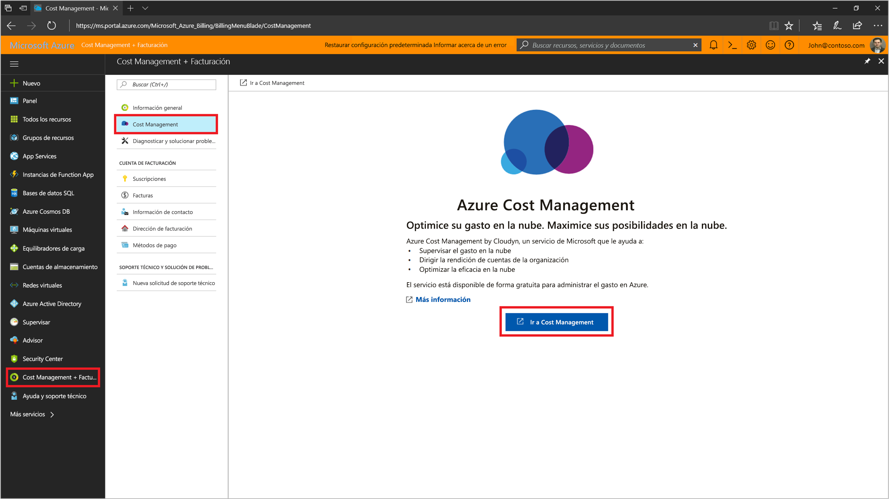
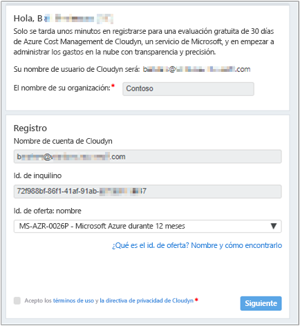
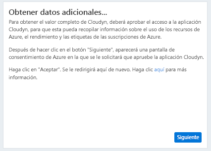
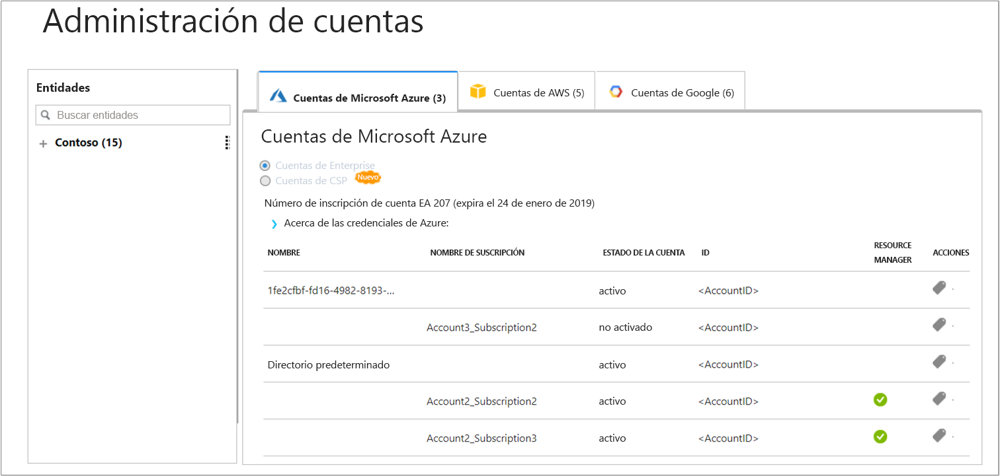

# Registrar una suscripción individual de Azure y ver los datos de costo

Puede usar su suscripción de Azure para registrarse con Cloudyn. Este registro le proporciona acceso al portal de Cloudyn. En esta guía de inicio rápido se detalla el proceso de registro necesario para crear una suscripción de evaluación de Cloudyn e iniciar sesión en el portal de Cloudyn. También se muestra cómo empezar a ver inmediatamente los datos de costo.

## Inicio de sesión en Azure

- Inicie sesión en Azure Portal en [https://portal.azure.com](https://portal.azure.com).

## Registrarse en Cloudyn

1. En Azure Portal, haga clic en **Administración de costos + facturación** en la lista de servicios.
2. En **Introducción** haga clic en **Cloudyn**  
    
3. En la página **Administración de costo**, haga clic en **Ir a Cloudyn** para abrir la página de registro de Cloudyn en una nueva ventana.
4. En la página de registro de evaluación del portal de Cloudyn, escriba el nombre de la compañía y, después, seleccione **Azure Individual Subscription Owner** (Propietario de suscripción individual de Azure). A continuación, haga clic en **Siguiente**. El nombre de la cuenta y el identificador del inquilino se agregarán automáticamente al formulario.  
    
5. Seleccione el **nombre y el identificador de la oferta** asociados a la suscripción. Si no está seguro de cuál es el identificador de tasa de su suscripción, puede consultar la factura de Azure para buscar el **identificador de oferta**.
6. Acepte los términos de uso, valide la información y, después, haga clic en **Siguiente**.
7. En la página **Gather additional data**(Recopilar datos adicionales), haga clic en **Siguiente** para permitir que Cloudyn recopile los datos de recursos de Azure. Los datos recopilados incluyen datos de uso, de rendimiento, de facturación y de etiquetas de las suscripciones.  
    
8. El explorador le lleva a la página de inicio de sesión de Cloudyn. Inicie sesión con las credenciales de la suscripción de Azure.
9. Haga clic en **Go to Cloudyn** (Ir a Cloudyn) para abrir el portal de Cloudyn y, después, en la página **Administración de cuentas**, debería ver la información de la cuenta de la suscripción de Azure.  
    

Para ver un tutorial en vídeo sobre cómo registrar su suscripción de Azure, consulte [Finding your Directory GUID and Rate ID for use in Cloudyn](https://youtu.be/PaRjnyaNGMI) (Buscar su GUID de directorio e Id. de tasa para su uso en Cloudyn).

[!INCLUDE [cost-management-create-account-view-data](../../../includes/cost-management-create-account-view-data.md)]

## Pasos siguientes

En esta guía de inicio rápido, usó la información de suscripción de Azure para registrarse con Cloudyn. También se inicia sesión en el portal de Cloudyn para que pueda empezar a visualizar los datos de costo. Para más información sobre Cloudyn, continúe con el tutorial de Cloudyn.

> [!div class="nextstepaction"]
> [Revisión del uso y los costos](tutorial-review-usage.md)
