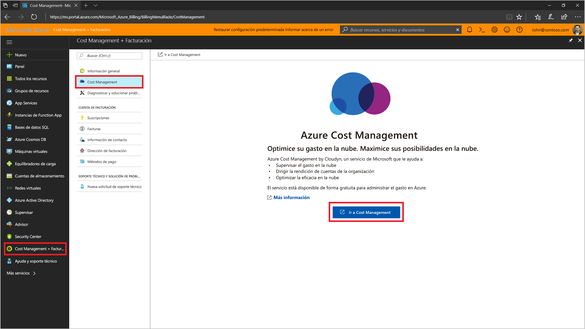
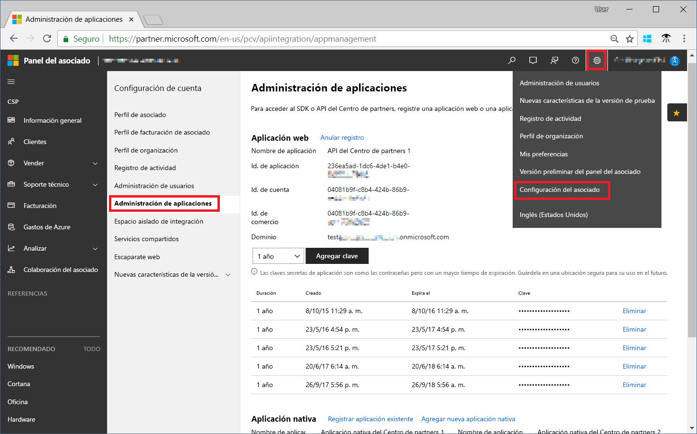
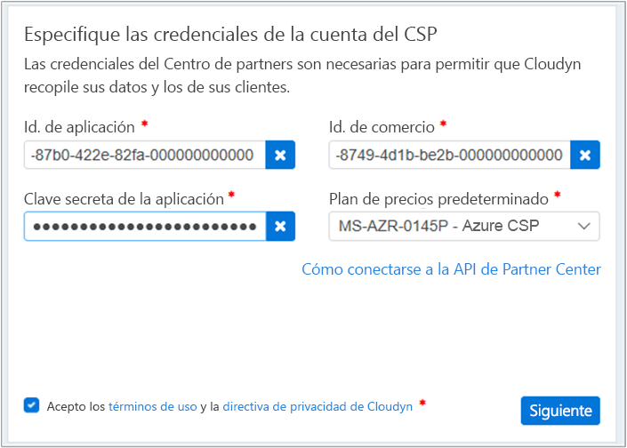

# Registrarse con el programa de asociados de CSP y ver los datos de costo

Como asociado de CSP, puede registrarse en Cloudyn. Este registro le proporciona acceso al portal de Cloudyn. En esta guía de inicio rápido se detalla el proceso de registro necesario para crear una suscripción de evaluación de Cloudyn e iniciar sesión en el portal de Cloudyn. También se muestra cómo empezar a ver inmediatamente los datos de costo.

> [!NOTE]
>
> Solo los asociados directos de CSP y los proveedores indirectos de CSP pueden completar el registro de Cloudyn.
>
> Se requiere la configuración de Partner Center API para la autenticación y el acceso a datos. Se necesita una cuenta de administrador global de Partner Center para proporcionar acceso a la API.
> Para más información, consulte [cómo conectarse a Partner Center API](https://msdn.microsoft.com/library/partnercenter/mt709136.aspx).
>
> El acceso a Cloudyn se puede a disposición de los distribuidores indirectos de CSP después de que su proveedor indirect de CSP se registre en Cloudyn. Posteriormente, los distribuidores indirectos de CSP pueden proporcionar acceso de Cloudyn para suscripciones y clientes de Azure.
>
>Cloudy es compatible con el modelo de aplicación segura de Microsoft. Para más información, consulte [Habilitación del marco de modelo de aplicación segura](/partner-center/develop/enable-secure-app-model).

## Inicio de sesión en Azure

- Inicie sesión en Azure Portal en https://portal.azure.com.

## Registrarse en Cloudyn

1. En Azure Portal, haga clic en **Administración de costos + facturación** en la lista de servicios.
2. En **Introducción** haga clic en **Cloudyn**  
    
3. En la página de **Cloudyn** haga clic en **Go to Cloudyn** (Ir a Cloudyn) para abrir la página de registro de Cloudyn en una nueva ventana.
4. En la página de registro de evaluación del portal de Cloudyn, escriba el nombre de la compañía, seleccione **Microsoft CSP Partner Program Administrator** (Administrador del programa para asociados de Microsoft CSP) y, después, haga clic en **Siguiente**.  
5. Escriba un **Id. de aplicación**, un **Id. de comercio**, la **Clave secreta de la aplicación** y seleccione el **plan de precios predeterminado**. Si no tiene la información a mano, inicie sesión en el portal del Centro de partners, en [https://partnercenter.microsoft.com](https://partnercenter.microsoft.com) con la cuenta de administrador principal y realice los pasos siguientes:
   1. Vaya a **Dashboard** (Panel), haga clic en el símbolo **Settings** (Configuración), haga clic en **Partner settings** (Configuración de asociados) y, a continuación, haga clic en **App Management** (Administración de aplicaciones).
   2. Si previamente creó una aplicación web, omita este paso. En caso contrario, haga clic en **Add new web app** (Agregar una nueva aplicación web) en la sección **Aplicación web**.
   3. Copie el GUID de **Id. de aplicación** de la aplicación web.
   4. Copie el GUID de **Id. de comercio** de la aplicación web.
   5. Seleccione una duración de validez de la clave de uno o dos años, según sea necesario. Seleccione **Agregar clave** y, después, copie y guarde el valor de la clave secreta.  
    
   6. Vuelva a la página de registro de Cloudyn y pegue la información.  
      
6. Acepte los términos de uso y, después, valide la información. Haga clic en **Siguiente** para permitir que Cloudyn recopile datos de recursos de Azure. Los datos recopilados incluyen datos de uso, de rendimiento, de facturación y de etiquetas de las suscripciones.  
7. En **Invite other stakeholders** (Invitar a otras partes interesadas), puede agregar usuarios escribiendo sus direcciones de correo electrónico. Cuando haya terminado, haga clic en **Siguiente**. Los datos de facturación tardarán, aproximadamente, dos horas en agregarse a Cloudyn.
8. Haga clic en **Go to Cloudyn** (Ir a Cloudyn) para abrir el portal de Cloudyn y, después, en la página **Cloud Accounts Management** (Administración de cuentas en la nube), debería ver la información de la cuenta de CSP registrada.

## Configuración del acceso al CSP indirecto en Cloudyn

De forma predeterminada, Partner Center API solo es accesible para los CSP directos. Sin embargo, un proveedor de CSP directo puede configurar el acceso para sus clientes o asociados de CSP indirecto mediante grupos de entidades de Cloudyn.

Para permitir el acceso de los clientes o asociados de CSP indirecto, siga los pasos que se describen en [Registrarse con Clouydn](#register-with-cloudyn) para configurar un registro de prueba. A continuación, complete los pasos siguientes para segmentar los datos de CSP indirecto mediante grupos de entidades de Cloudyn. Seguidamente, asigne los permisos de usuario correspondientes a los grupos de entidades.

1. Cree un grupo de entidades con la información en [Crear entidades](tutorial-user-access.md#create-and-manage-entities).
2. Siga los pasos que se describen en [Assigning subscriptions to Cost Entities](https://www.youtube.com/watch?v=d9uTWSdoQYo) (Asignación de suscripciones a entidades de costo). Asocie la cuenta del cliente de CSP indirecto y sus suscripciones de Azure a la entidad que creó anteriormente.
3. Siga los pasos que se describen en [Crear un usuario con acceso de administrador](tutorial-user-access.md#create-a-user-with-admin-access) para crear una cuenta de usuario con acceso de administrador. A continuación, asegúrese de que la cuenta de usuario tenga acceso de administrador a las entidades específicas que creó anteriormente para la cuenta indirecta.

Los asociados de CSP indirecto inician sesión en el portal de Cloudyn con las cuentas que ha creado para ellos.

[!INCLUDE [cost-management-create-account-view-data](../../../includes/cost-management-create-account-view-data.md)]

## Pasos siguientes

En esta guía de inicio rápido, se usa la información de CSP para registrarse en Cloudyn. También se inicia sesión en el portal de Cloudyn para que pueda empezar a visualizar los datos de costo. Para más información sobre Cloudyn, continúe con el tutorial de Cloudyn.

> [!div class="nextstepaction"]
> [Revisión del uso y los costos](tutorial-review-usage.md)
