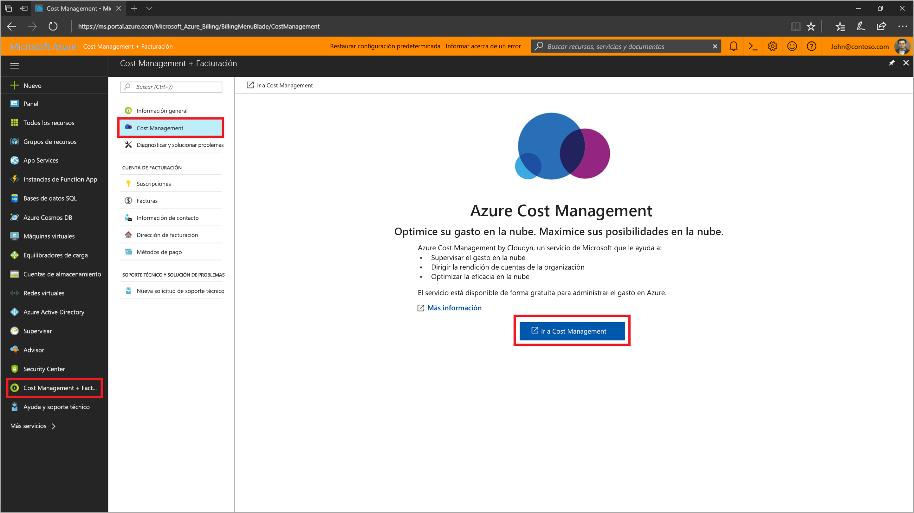
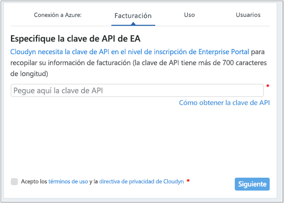
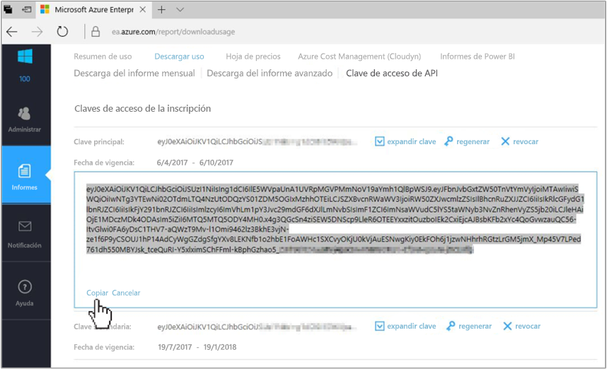
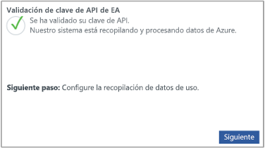

# Registrar un Contrato Enterprise de Azure y ver datos de costo

Use el Contrato Enterprise de Azure para registrarse en Cloudyn. Este registro le proporciona acceso al portal de Cloudyn. En esta guía de inicio rápido se detalla el proceso de registro necesario para crear una suscripción de evaluación de Cloudyn e iniciar sesión en el portal de Cloudyn. También se muestra cómo empezar a ver inmediatamente los datos de costo.

Azure Cost Management ofrece una funcionalidad similar a Cloudyn. Azure Cost Management es una solución de administración de costos de Azure nativa. Le ayuda a analizar costos, crear y administrar presupuestos, exportar datos y revisar y actuar sobre recomendaciones de optimización para ahorrar dinero. Para más información, consulte [Azure Cost Management](../cost-management-billing-overview.md).

## Inicio de sesión en Azure

- Inicie sesión en Azure Portal en https://portal.azure.com.

## Registrarse en Cloudyn

1. En Azure Portal, haga clic en **Administración de costos + facturación** en la lista de servicios.
2. En **Introducción** haga clic en **Cloudyn**  
    
3. En la página de **Cloudyn** haga clic en **Ir a Cloudyn** para abrir la página de registro de Cloudyn en una nueva ventana.
4. En la página de registro de evaluación del portal de Cloudyn, escriba el nombre de la compañía y, después, seleccione **Azure Enterprise Enrollment Administrator** (Administrador de inscripciones Enterprise de Azure).  
5. Escriba la clave de API de inscripción a Enterprise Portal. Si no tiene la clave a mano, haga clic en el vínculo [Enterprise Portal](https://ea.azure.com) y siga los pasos que se describen a continuación:  
    
   1. Inicie sesión en el sitio web de Azure Enterprise y haga clic en **Informes**, **API Access Key** (Clave de acceso de API) y copie la clave principal.  
    
   3. Vuelva a la página de registro y pegue la clave de API.
6. Acepte los términos de uso y, después, valide la clave. Haga clic en **Siguiente** para permitir que Cloudyn recopile datos de recursos de Azure. Los datos recopilados incluyen datos de uso, de rendimiento, de facturación y de etiquetas de las suscripciones.  
    
7. En **Invite other stakeholders** (Invitar a otras partes interesadas), puede agregar usuarios escribiendo sus direcciones de correo electrónico. Cuando haya terminado, haga clic en **Siguiente**. Según el tamaño de la inscripción de Azure, puede tardar hasta 24 horas para que todos sus datos de facturación se agreguen a Cloudyn.
8. Haga clic en **Go to Cloudyn** (Ir a Cloudyn) para abrir el portal de Cloudyn y, después, en la página **Cloud Accounts Management**, (Administración de cuentas en la nube) debería ver la información de la cuenta de EA registrada.

Para ver un tutorial en vídeo sobre cómo registrar su contrato Enterprise, vea [How to Find Your EA Enrollment ID and API Key for use in Cloudyn](https://youtu.be/u_phLs_udig) (Cómo encontrar su ID del Contrato Enterprise y clave de API para su uso en Cloudyn).

[!INCLUDE [cost-management-create-account-view-data](../../../includes/cost-management-create-account-view-data.md)]

## Pasos siguientes

En este tutorial, usó la información del Contrato Enterprise de Azure para registrarse con Cloudyn. También se inicia sesión en el portal de Cloudyn para que pueda empezar a visualizar los datos de costo. Para más información sobre Cloudyn, continúe con el tutorial de Cloudyn.

> [!div class="nextstepaction"]
> [Revisión del uso y los costos](tutorial-review-usage.md)
