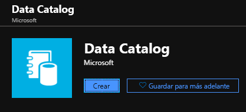
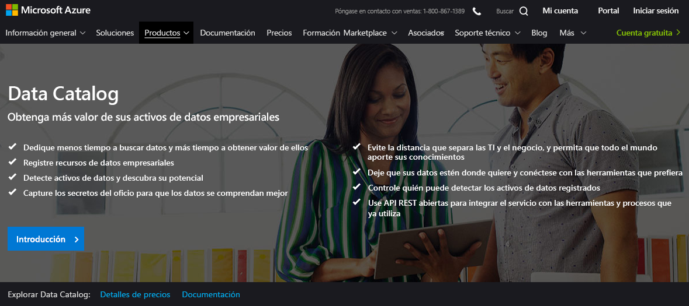
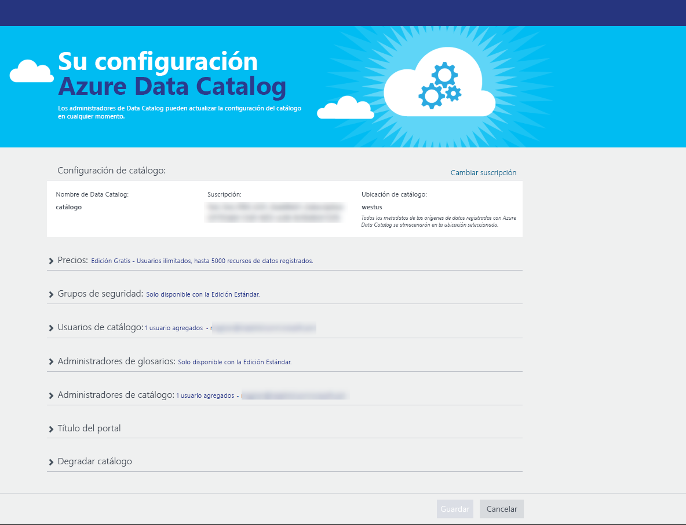
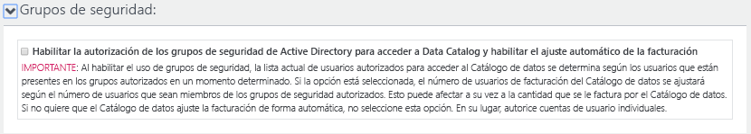
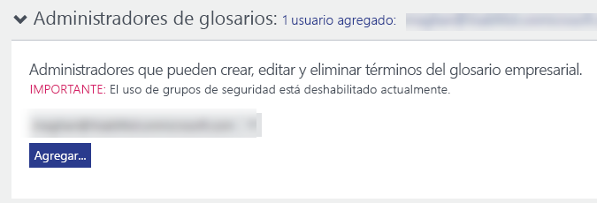
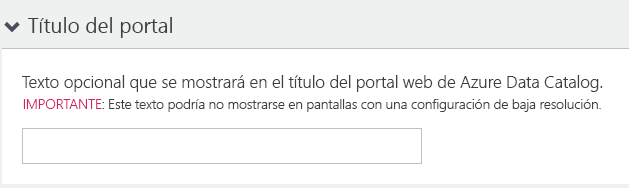
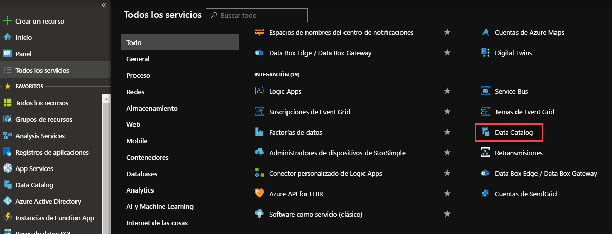
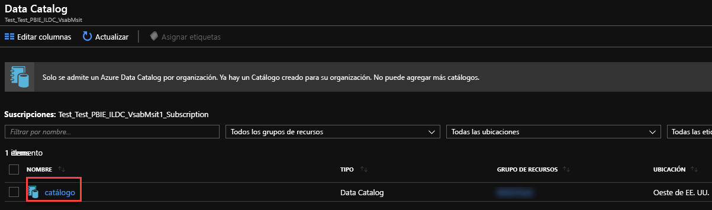
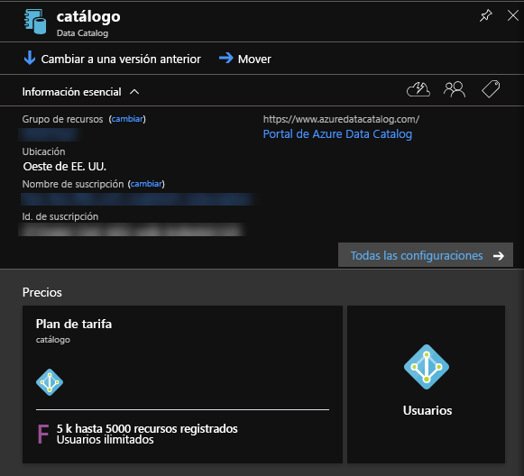
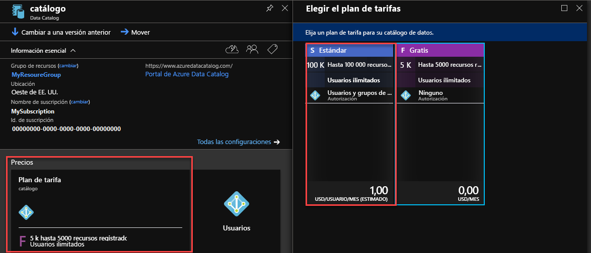

# Inicio rápido: Creación de una instancia de Azure Data Catalog

Azure Data Catalog es un servicio en la nube totalmente administrado que actúa como sistema de registro y de detección para recursos de datos empresariales. Si desea información detallada, consulte [¿Qué es Azure Data Catalog](overview.md).

Este inicio rápido le muestra los primeros pasos para crear una instancia de Azure Data Catalog.

Si no tiene una suscripción a Azure, cree una [cuenta gratuita](https://azure.microsoft.com/free/?WT.mc_id=A261C142F) antes de empezar.

## Requisitos previos

Para empezar, necesitará tener lo siguiente:

* Una suscripción de [Microsoft Azure](https://azure.microsoft.com/).
* Debe tener su propio [inquilino de Azure Active Directory](../active-directory/fundamentals/active-directory-access-create-new-tenant.md).

Para configurar Data Catalog, debe ser propietario o copropietario de una suscripción de Azure.

## Creación de un catálogo de datos

Solo se puede aprovisionar un catálogo de datos por organización (dominio de Azure Active Directory). Por consiguiente, si el propietario o copropietario de una suscripción de Azure que pertenezca a dicho dominio de Active Directory ya ha creado un catálogo, no podrá volver a crear otro, aunque tenga varias suscripciones de Azure. Para comprobar si algún usuario ha creado un catálogo de datos en un dominio de Azure Active Directory, vaya a la [página principal de Azure Data Catalog](http://azuredatacatalog.com) y compruebe si ve un catálogo. Si ya hay un catálogo creado, omita el siguiente procedimiento y vaya a la siguiente sección.

1. Vaya a [Azure Portal](https://portal.azure.com) > **Crear un recurso** y seleccione **Data Catalog**.

    

2. Especifique el **nombre**, la **suscripción** que desea usar, la **ubicación** y el **plan de tarifa** del catálogo de datos. Seleccione **Crear**.

3. Vaya a la [página principal de Azure Data Catalog](http://azuredatacatalog.com) y haga clic en **Publicar datos**.

   

   También puede acceder a la página principal de Data Catalog en la [página del servicio Data Catalog](https://azure.microsoft.com/services/data-catalog) seleccionando **Comenzar**.

   

4. Vaya a la página **Configuración**.

    

5. Expanda **Precios** y compruebe la **edición** de Azure Data Catalog (Gratis o Estándar).

    

6. Si elige la edición *Estándar* como plan de tarifa, puede expandir **Grupos de seguridad** y autorizar a los grupos de seguridad de Active Directory para que puedan acceder a Data Catalog y habilitar el ajuste automático de la facturación.

    

7. Expanda **Usuarios de catálogo** y haga clic en **Agregar** para agregar usuarios al catálogo de datos. Se le agregará automáticamente a este grupo.

    

8. Si elige la edición *Estándar* como plan de tarifa, puede expandir **Administradores de glosarios** y hacer clic en **Agregar** para agregar usuarios administradores de glosarios. Se le agregará automáticamente a este grupo.

    

9. Expanda **Administradores de catálogo** y haga clic en **Agregar** para agregar más administradores al catálogo de datos. Se le agregará automáticamente a este grupo.

    

10. Expanda **Título del portal** y agregue el texto adicional que se mostrará en este.

    

11. Cuando haya completado los datos de la página **Configuración**, vaya a la página **Publicar**.

    

## Búsqueda de un catálogo de datos en el Portal de Azure

1. En otra pestaña o en otra ventana del explorador web, vaya al [Azure Portal](https://portal.azure.com) e inicie sesión con la misma cuenta que usó para crear el catálogo de datos en el paso anterior.

2. Seleccione **Todos los servicios** y haga clic en **Data Catalog**.

    

     Verá el catálogo de datos que ha creado.

    

3. Haga clic en el catálogo que ha creado. Verá la hoja **Catálogo de datos** en el portal.

   

4. Puede ver las propiedades del catálogo de datos y actualizarlas. Por ejemplo, haga clic en **Plan de tarifa** y cambie la edición.

    

## Pasos siguientes

En este inicio rápido, ha aprendido a crear una instancia de Azure Data Catalog para su organización. Ahora puede registrar orígenes de datos en ella.

> [!div class="nextstepaction"]
> [Registro de orígenes de datos en Azure Data Catalog](data-catalog-how-to-register.md)
