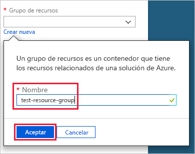
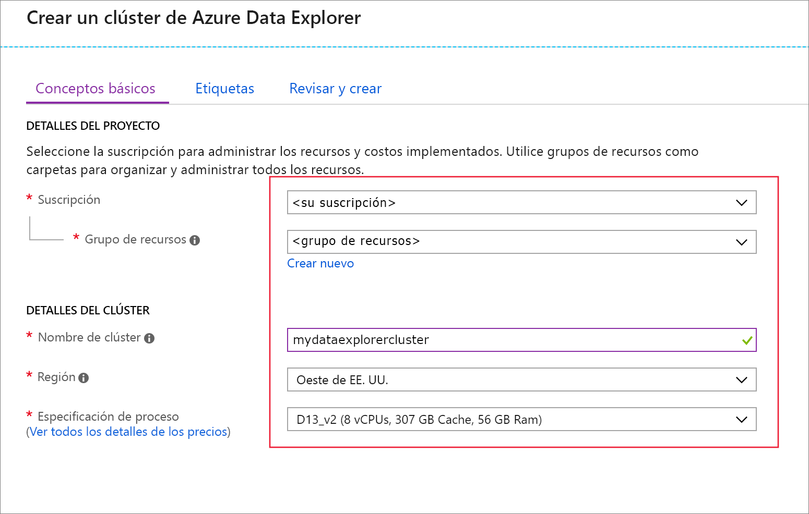
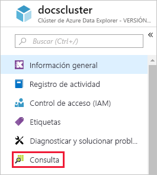
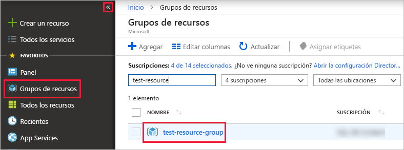

# Guía de inicio rápido: Creación de un clúster y de la base de datos del Explorador de datos de Azure

El Explorador de datos de Azure es un servicio de exploración de datos muy escalable y rápido para datos de telemetría y registro. Para usar el Explorador de datos de Azure, cree primero un *clúster* y una o varias *bases de datos* en ese clúster. A continuación, *ingerirá* (cargará) los datos en una base de datos para que pueda ejecutar consultas en ella. En esta guía de inicio rápido, creará un clúster y una base de datos. En artículos siguientes, le mostramos cómo ingerir datos.

Si no tiene una suscripción a Azure, cree una [cuenta gratuita de Azure](https://azure.microsoft.com/free/) antes de empezar.

## Inicio de sesión en Azure Portal

Inicie sesión en el [Azure Portal](https://portal.azure.com/).

## Creación de un clúster

Creará un clúster del Explorador de datos de Azure en un grupo de recursos de Azure con un conjunto definido de recursos de proceso y de almacenamiento.

1. Seleccione el botón **Crear un recurso** (+) de la esquina superior izquierda del portal.

1. Busque *Azure Data Explorer*.

   

1. En **Azure Data Explorer**, en la parte inferior de la pantalla, seleccione **Crear**.

1. Escriba un nombre único para el clúster, seleccione su suscripción y cree un grupo de recursos denominado *Grupo de recursos de prueba*.

    

1. Rellene el formulario con la siguiente información.

   

    **Configuración** | **Valor sugerido** | **Descripción del campo**
    |---|---|---|
    | Nombre del clúster | Un nombre de clúster único | Elija un nombre único que identifique el clúster. Por ejemplo, *miclusterdeprueba*. El nombre de dominio *[region].kusto.windows.net* se anexa al nombre del clúster que proporcione. El nombre solo puede contener letras minúsculas y números. Debe contener entre 3 y 22 caracteres.
    | Subscription | Su suscripción | Seleccione la suscripción de Azure que quiere usar para el servidor.|
    | Grupos de recursos | *test-resource-group* | Cree un nuevo grupo de recursos. |
    | Ubicación | *Oeste de EE. UU.* | Seleccione *Oeste de EE. UU.* para esta guía de inicio rápido. En un sistema de producción, seleccione la región que mejor cubra sus necesidades.
    | Especificaciones de Compute | *D13_v2* | Seleccione la especificación de precio más bajo para esta guía de inicio rápido. En un sistema de producción, seleccione la especificación que mejor se adapte a sus necesidades.
    | | |

1. Seleccione **Crear** para aprovisionar el clúster. Normalmente, el aprovisionamiento tarda unos diez minutos. Seleccione **Notificaciones** en la barra de herramientas para supervisar el proceso de aprovisionamiento.

    

1. Cuando el proceso haya finalizado, seleccione **Notificaciones** y, a continuación, **Ir al recurso**.

    

## Creación de una base de datos

Ahora está preparado para el segundo paso del proceso: la creación de la base de datos.

1. En la pestaña **Información general**, seleccione **Crear base de datos**.

    

1. Rellene el formulario con la siguiente información.

    

    **Configuración** | **Valor sugerido** | **Descripción del campo**
    |---|---|---|
    | Nombre de la base de datos | *TestDatabase* | El nombre de la base de datos debe ser único dentro del clúster.
    | Período de retención | *3650* | El intervalo de tiempo para el que se garantiza que los datos se mantengan disponibles para consultarlos. El intervalo de tiempo se mide desde el momento en que se ingieren los datos.
    | Período de caché | *31* | El intervalo de tiempo durante el que los datos consultados con frecuencia se van a mantener disponibles en el almacenamiento SSD o en la RAM, en lugar de en el almacenamiento a largo plazo.
    | | | |

1. Seleccione **Guardar** para crear la base de datos. Normalmente se tarda menos de un minuto. Una vez completado el proceso, vuelve a la pestaña **Información general** del clúster.

## Ejecución de comandos básicos en la base de datos

Ahora que tiene un clúster y la base de datos, puede ejecutar consultas y comandos. Aún no tiene ningún dato en la base de datos, pero todavía puede ver cómo funcionan las herramientas.

1. En el clúster, seleccione **Consulta**.

    

1. Pegue el siguiente comando en la ventana de consulta: `.show databases`; a continuación, seleccione **Ejecutar**.

    

    El conjunto de resultados muestra **TestDatabase**, la única base de datos en el clúster.

1. Pegue el siguiente comando en la ventana de consulta: `.show tables` y, a continuación, seleccione dicho comando en la ventana. Seleccione **Run** (Ejecutar).

    Este comando devuelve un conjunto de resultados vacío porque aún no hay ninguna tabla. Agregará una tabla en el siguiente artículo de esta serie.

## Detención y reinicio del clúster

Puede detener y reiniciar un clúster según las necesidades empresariales.

1. Para detener el clúster, en la parte superior de la pestaña **Información general**, seleccione **Detener**.

    Cuando el clúster se detiene, no está disponible para las consultas de datos y no puede ingerir datos nuevos.

1. Para reiniciar el clúster, en la parte superior de la pestaña **Información general**, seleccione **Iniciar**.

    Cuando el clúster se reinicia, tarda unos diez minutos en estar disponible (igual que cuando se aprovisionó originalmente). Se tarda más tiempo en que los datos se carguen en la memoria caché activa.  

## Limpieza de recursos

Si tiene previsto seguir nuestros tutoriales y guías de inicio rápido, conserve los recursos que creó. Si no, limpie el **grupo de recursos de prueba**, para evitar gastos.

1. En Azure Portal, seleccione **Grupos de recursos** en el extremo izquierdo y luego seleccione el grupo de recursos que creó.  

    Si el menú izquierdo está contraído, seleccione el  para expandirlo.

   

1. En **test-resource-group**, seleccione **Eliminar grupo de recursos**.

1. En la nueva ventana, escriba el nombre del grupo de recursos que quiere eliminar (*test-resource-group*) y luego seleccione **Eliminar**.

## Pasos siguientes

> [!div class="nextstepaction"]
> [Guía de inicio rápido: Ingesta de datos desde el centro de eventos en Azure Data Explorer](ingest-data-event-hub.md)

