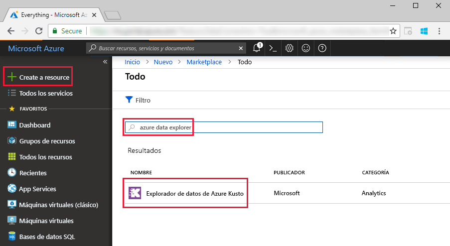
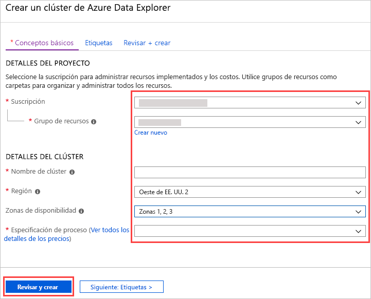
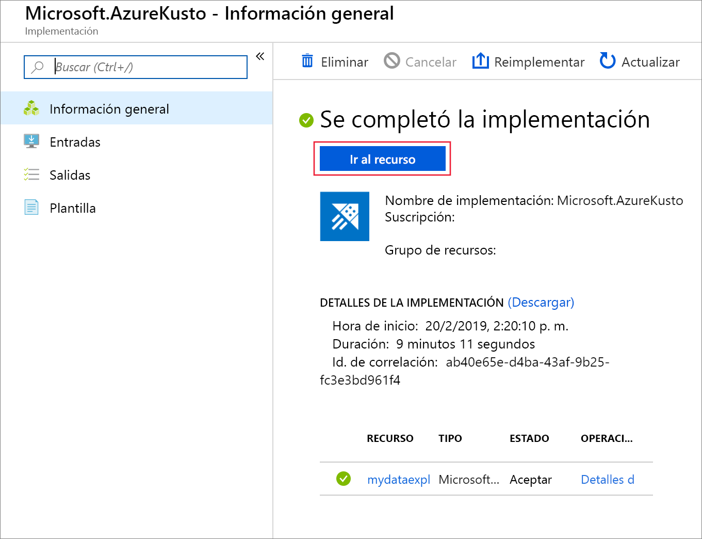
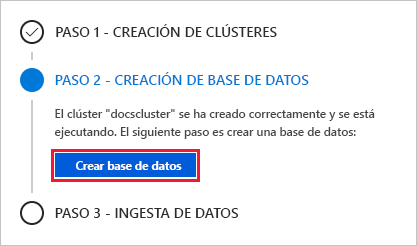
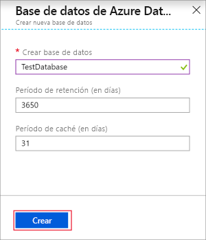
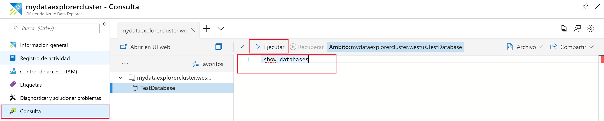

# Inicio rápido: Creación de un clúster y una base de datos de Azure Data Explorer

> [!div class="op_single_selector"]
> * [Portal](create-cluster-database-portal.md)
> * [CLI](create-cluster-database-cli.md)
> * [PowerShell](create-cluster-database-powershell.md)
> * [C#](create-cluster-database-csharp.md)
> * [Python](create-cluster-database-python.md)
> * [Plantilla ARM](create-cluster-database-resource-manager.md)

El Explorador de datos de Azure es un servicio de exploración de datos altamente escalable y rápido para datos de telemetría y registro. Para usar Azure Data Explorer, cree primero un clúster y una o varias bases de datos en ese clúster. A continuación, ingerirá (cargará) los datos en una base de datos para que pueda ejecutar consultas en ella. En esta guía de inicio rápido, creará un clúster y una base de datos.

Si no tiene una suscripción a Azure, cree una [cuenta gratuita de Azure](https://azure.microsoft.com/free/) antes de empezar.

## Inicio de sesión en Azure Portal

Inicie sesión en [Azure Portal](https://portal.azure.com/).

## Crear un clúster

Creará un clúster de Azure Data Explorer con un conjunto definido de recursos de proceso y de almacenamiento en un grupo de recursos de Azure.

1. Seleccione el botón **Crear un recurso** (+) de la esquina superior izquierda del portal.

1. Busque *Azure Data Explorer*.

   

1. En **Azure Data Explorer**, en la parte inferior de la pantalla, seleccione **Crear**.

1. Rellene los detalles del clúster básico con la siguiente información.

   

    **Configuración** | **Valor sugerido** | **Descripción del campo**
    |---|---|---|
    | Subscription | Su suscripción | Seleccione la suscripción de Azure que quiere usar para el servidor.|
    | Resource group | Su grupo de recursos | Use un grupo de recursos existente o cree uno. |
    | Nombre del clúster | Un nombre de clúster único | Elija un nombre único que identifique el clúster. El nombre de dominio *[region].kusto.windows.net* se anexa al nombre del clúster que proporcione. El nombre solo puede contener letras minúsculas y números. Tiene que contener entre 4 y 22 caracteres.
    | Region | *Oeste de EE. UU.* u *Oeste de EE. UU. 2* | Seleccione *Oeste de EE. UU.* u *Oeste de EE. UU. 2* (si usa zonas de disponibilidad) para este inicio rápido. En un sistema de producción, seleccione la región que mejor se adapte a sus necesidades.
    | Zonas de disponibilidad | *1*, *2*, y/o *3* | Coloque las instancias de clúster en varias zonas de disponibilidad en la misma región (opcional). [Azure Availability Zones](/azure/availability-zones/az-overview) son ubicaciones físicas exclusivas dentro de la misma región de Azure. Protegen un clúster del Explorador de datos de Azure y los datos de errores de regiones parciales. Los nodos de clúster se crean, de forma predeterminada, en el mismo centro de datos. Al seleccionar varias zonas de disponibilidad, puede eliminar un único punto de error y garantizar una alta disponibilidad. La implementación en zonas de disponibilidad solo es posible durante la creación del clúster y no se puede modificar más adelante.
    | Especificaciones de Compute | *D13_v2* | Seleccione la especificación de precio más bajo para esta guía de inicio rápido. En un sistema de producción, seleccione la especificación que mejor se adapte a sus necesidades.
    | | | |

1. Seleccione **Revisar y crear** para revisar los detalles del clúster, y **Crear** para aprovisionarlo. El aprovisionamiento suele tardar aproximadamente 10 minutos.

1. Cuando la implementación se complete, seleccione **Ir al grupo de recursos**.

    

## Crear una base de datos

Ahora está preparado para el segundo paso del proceso: la creación de la base de datos.

1. En la pestaña **Información general**, seleccione **Crear base de datos**.

    

1. Rellene el formulario con la siguiente información.

    

    **Configuración** | **Valor sugerido** | **Descripción del campo**
    |---|---|---|
    | Nombre de la base de datos | *TestDatabase* | El nombre de la base de datos debe ser único dentro del clúster.
    | Período de retención | *3650* | El intervalo de tiempo (en días) para el que se garantiza que los datos se mantengan disponibles para consultarlos. El intervalo de tiempo se mide desde el momento en que se ingieren los datos.
    | Período de caché | *31* | El intervalo de tiempo (en días) durante el que los datos consultados con frecuencia se van a mantener disponibles en el almacenamiento SSD o en la RAM, en lugar de en el almacenamiento a largo plazo.
    | | | |

1. Seleccione **Crear** para crear la base de datos. Normalmente se tarda menos de un minuto. Una vez completado el proceso, vuelve a la pestaña **Información general** del clúster.

## Ejecución de comandos básicos en la base de datos

Ahora que tiene un clúster y la base de datos, puede ejecutar consultas y comandos. Aún no tiene ningún dato en la base de datos, pero todavía puede ver cómo funcionan las herramientas.

1. En el clúster, seleccione **Consulta**. Pegue el comando `.show databases` en la ventana de consulta; a continuación, seleccione **Ejecutar**.

    

    El conjunto de resultados muestra **TestDatabase**, la única base de datos en el clúster.

1. Pegue el comando `.show tables` en la ventana de consulta; a continuación, seleccione **Ejecutar**.

    Este comando devuelve un conjunto de resultados vacío porque aún no hay ninguna tabla. Agregará una tabla en el siguiente artículo de esta serie.

## Detención y reinicio del clúster

Puede detener y reiniciar un clúster según las necesidades empresariales.

1. Para detener el clúster, en la parte superior de la pestaña **Información general**, seleccione **Detener**.

    Cuando el clúster se detiene, no está disponible para las consultas de datos y no puede ingerir datos nuevos.

1. Para reiniciar el clúster, en la parte superior de la pestaña **Información general**, seleccione **Iniciar**.

    Cuando el clúster se reinicia, tarda unos diez minutos en estar disponible (igual que cuando se aprovisionó originalmente). Se tarda más tiempo en que los datos se carguen en la memoria caché activa.  

## Limpieza de recursos

Si tiene previsto seguir nuestros tutoriales e inicios rápidos, conserve los recursos que creó. Si no, limpie el grupo de recursos de prueba para evitar ocasionar gastos.

1. En Azure Portal, seleccione **Grupos de recursos** en el extremo izquierdo y luego seleccione el grupo de recursos que contenga el clúster de Data Explorer.  

1. Seleccione **Eliminar grupo de recursos** para eliminar todo el grupo de recursos. Si utiliza un grupo de recursos existente, puede elegir eliminar solo el clúster de Data Explorer.

## Pasos siguientes

> [!div class="nextstepaction"]
> [Inicio rápido: Ingesta de datos del centro de eventos a Azure Data Explorer](ingest-data-event-hub.md).

