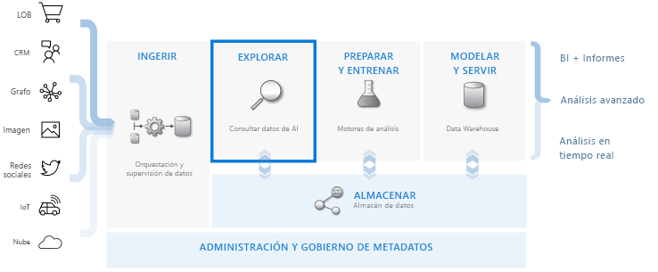
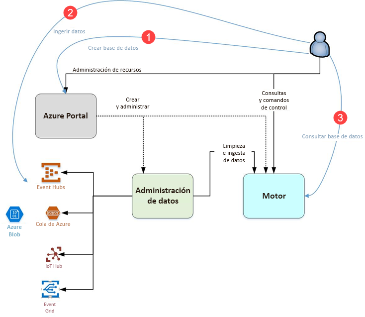

# ¿Qué es el Explorador de datos de Azure?

El Explorador de datos de Azure es un servicio de exploración de datos altamente escalable y rápido para datos de telemetría y registro. Le ayuda a administrar los numerosos flujos de datos emitidos por las aplicaciones de software actuales para poder recopilar, almacenar y analizar los datos. El Explorador de datos de Azure resulta idóneo para analizar grandes volúmenes de datos diversos desde cualquier origen de datos, como sitios web, aplicaciones, dispositivos de IoT, etc. Estos datos se usan para el diagnóstico, la supervisión, la creación de informes, el aprendizaje automático y las funcionalidades de análisis adicionales. Azure Data Explorer simplifica el proceso de ingesta de estos datos y permite realizar consultas ad hoc complejas en los datos en cuestión de segundos.

## ¿Qué hace único al Explorador de datos de Azure?

- Se escala de forma rápida a terabytes de datos en cuestión de minutos, lo que permite iteraciones rápidas de exploración de datos para detectar información pertinente.

- Ofrece un lenguaje de consulta innovador, optimizado para el análisis de datos de alto rendimiento.

- Admite el análisis de grandes volúmenes de datos heterogéneos (estructurados y no estructurados).

- Proporciona la capacidad para compilar e implementar exactamente lo que necesita mediante la combinación con otros servicios para proporcionar una solución de análisis de datos inclusiva, eficaz e interactiva.

## Flujo de trabajo de almacenamiento de datos

El Explorador de datos de Azure se integra con otros servicios principales para proporcionar una solución de un extremo a otro que incluye recopilación, ingesta, almacenamiento, indexación, consulta y visualización de datos. Tiene un rol fundamental en el flujo de almacenamiento de datos al ejecutar el paso **EXPLORE** del flujo en terabytes de datos sin procesar diversos.

El Explorador de datos de Azure admite varios métodos de ingesta, incluidos los conectores a los servicios comunes, como el centro de eventos, la programación de ingesta mediante los SDK, como .NET y Python, y acceso directo al motor para fines de exploración. El Explorador de datos de Azure se integra con servicios de modelado y análisis para análisis adicionales y la visualización de datos.

## Flujo de Explorador de datos de Azure

El siguiente diagrama muestra los diferentes aspectos de trabajar con el Explorador de datos de Azure.

Por lo general, el trabajo en el Explorador de datos de Azure sigue este patrón:

1. **Crear una base de datos:** cree un *clúster* y luego cree una o varias *bases de datos* en ese clúster. [Inicio rápido: Creación de un clúster y una base de datos de Azure Data Explorer](create-cluster-database-portal.md)

1. **Ingerir datos:** cargue los datos en tablas de base de datos para que pueda ejecutar consultas en ellas. [Inicio rápido: Ingesta de datos del centro de eventos a Azure Data Explorer](ingest-data-event-hub.md).

1. **Consultar base de datos:** use nuestra aplicación web para ejecutar, revisar y compartir consultas y resultados. Está disponible en Azure Portal como aplicación independiente. Además, puede enviar consultas mediante programación (usando un SDK) o a un punto de conexión de API REST. [Inicio rápido: Consulta de datos en Azure Data Explorer](web-query-data.md)

## Experiencia de consulta

Una consulta en el Explorador de datos de Azure es una solicitud de solo lectura para procesar datos y devolver los resultados de este procesamiento, sin modificar los datos o metadatos. Continuará perfeccionando sus consultas hasta que haya completado el análisis. Azure Data Explorer facilita este proceso gracias a su experiencia de consulta ad hoc muy rápida.

El Explorador de datos de Azure administra grandes cantidades de datos estructurados, semiestructurados (tipos anidados similares a JSON) y no estructurados (texto libre) igualmente bien. Permite buscar términos específicos de texto, ubicar eventos concretos y realizar cálculos de estilo de la métrica de datos estructurados. El Explorador de datos Azure salva los mundos de registros de texto no estructurados y dimensiones y números estructurados extrayendo los valores en tiempo de ejecución de los campos de texto de forma libre. La exploración de datos se simplifica mediante la combinación de la indización de texto rápido, el almacenamiento de columnas y las operaciones de series de tiempo.

Las funcionalidades de Azure Data Explorer se extienden mediante otros servicios creados sobre su eficaz lenguaje de consulta, como los [registros de Azure Monitor](/azure/log-analytics/), [Application Insights](/azure/application-insights/), [Time Series Insights](/azure/time-series-insights/) y [Windows Defender Advanced Threat Protection](/windows/security/threat-protection/windows-defender-atp/windows-defender-advanced-threat-protection/).

## Comentarios

Estaremos encantados de recibir sus comentarios sobre el Explorador de datos de Azure y su lenguaje de consulta en:

- Formulación de preguntas
  - [Stack Overflow](https://stackoverflow.com/questions/tagged/azure-data-explorer)
  - [Comunidad tecnológica de Microsoft](https://techcommunity.microsoft.com/t5/Azure-Data-Explorer/bd-p/Kusto)
  - [MSDN](https://social.msdn.microsoft.com/Forums/en-US/home?forum=AzureKusto)
- [Hacer sugerencias sobre productos de User Voice](https://aka.ms/AzureDataExplorer.UserVoice)

## Pasos siguientes

[Inicio rápido: Creación de un clúster y una base de datos de Azure Data Explorer](create-cluster-database-portal.md)

[Inicio rápido: Ingesta de datos del centro de eventos a Azure Data Explorer](ingest-data-event-hub.md).

[Inicio rápido: Consulta de datos en Azure Data Explorer](web-query-data.md)
