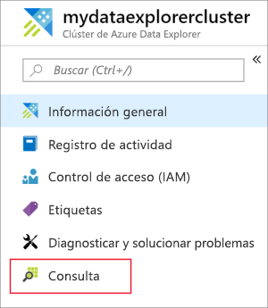
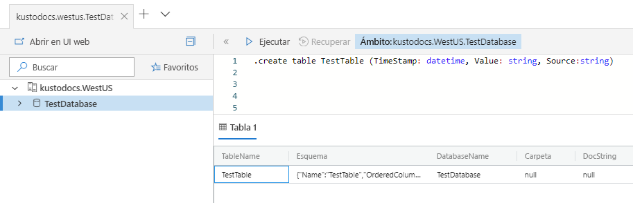
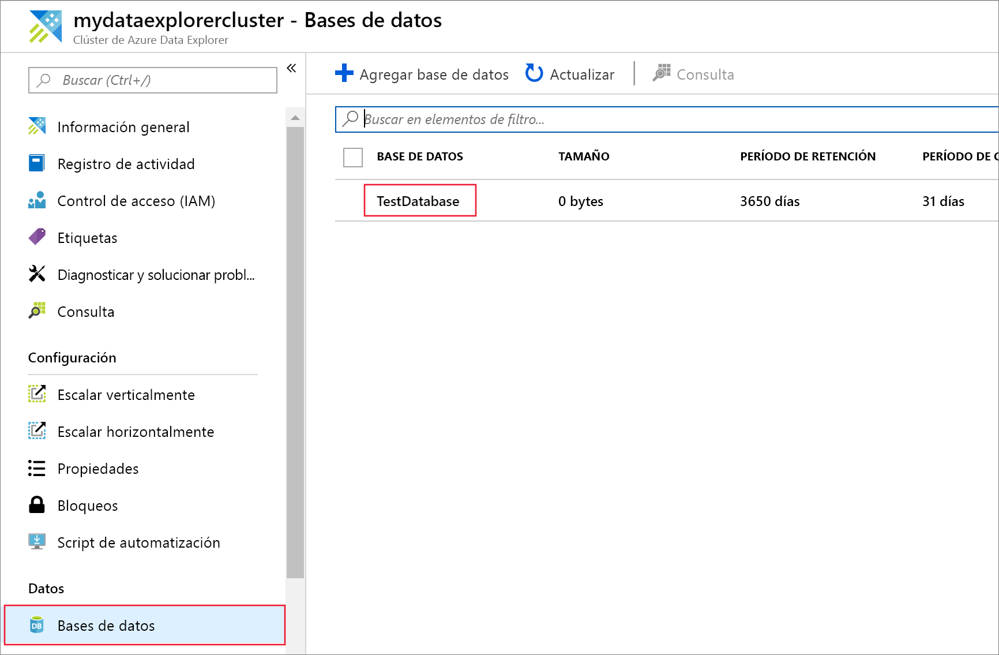
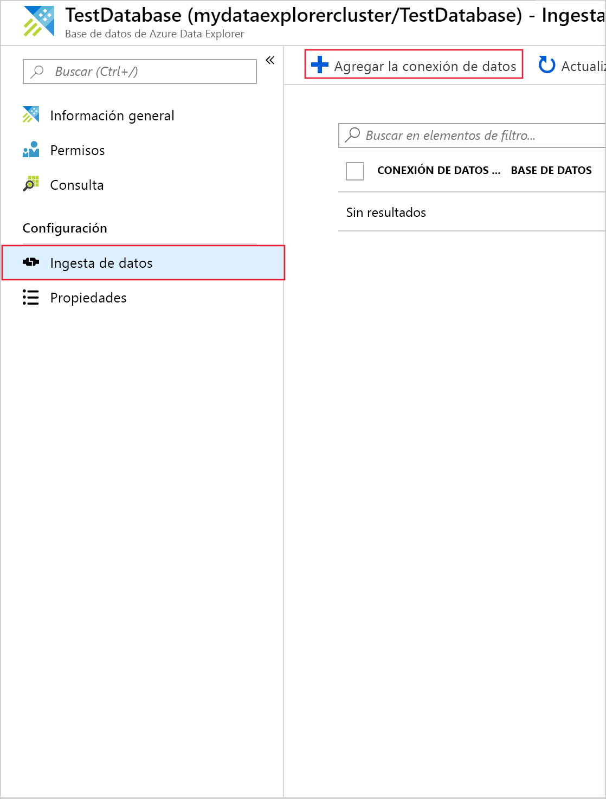
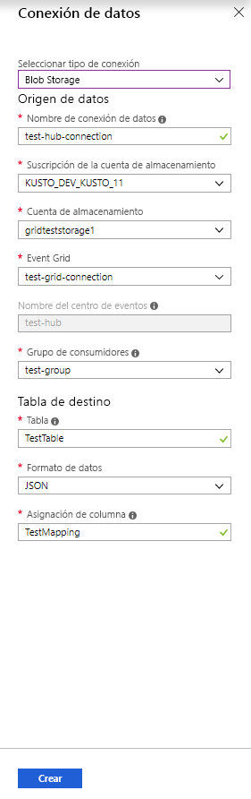
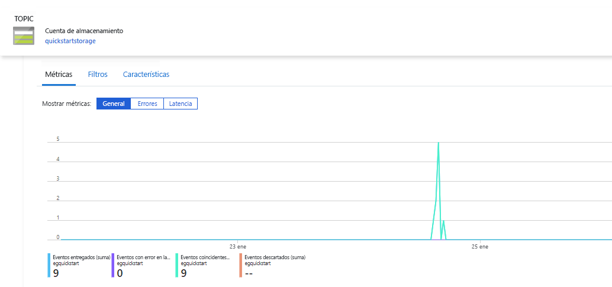
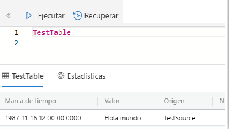

# <a name="ingest-blobs-into-azure-data-explorer-by-subscribing-to-event-grid-notifications"></a>Ingesta de blobs en Azure Data Explorer mediante la suscripción a las notificaciones de Event Grid

> [!div class="op_single_selector"]
> * [Portal](ingest-data-event-grid.md)
> * [C#](data-connection-event-grid-csharp.md)
> * [Python](data-connection-event-grid-python.md)
> * [Plantilla de Azure Resource Manager](data-connection-event-grid-resource-manager.md)

Azure Data Explorer es un servicio de exploración de datos escalable y rápido para datos de telemetría y registro. Ofrece una ingesta continua (carga de datos) a partir de blobs escritos en contenedores de blobs. 

En este artículo, obtendrá información sobre cómo configurar una suscripción a [Azure Event Grid](/azure/event-grid/overview) para enrutar eventos a Azure Data Explorer mediante un centro de eventos. Para empezar, debe tener una cuenta de almacenamiento con una suscripción de Event Grid que envíe notificaciones a Azure Event Hubs. Después, podrá crear una conexión de datos de Event Grid y ver el flujo de datos por el sistema.

## <a name="prerequisites"></a>Prerrequisitos

* Suscripción a Azure. Cree una [cuenta de Azure gratuita](https://azure.microsoft.com/free/).
* [Un clúster y una base de datos](create-cluster-database-portal.md).
* [Una cuenta de almacenamiento](https://docs.microsoft.com/azure/storage/common/storage-quickstart-create-account?tabs=azure-portal).
* [Un centro de eventos](https://docs.microsoft.com/azure/event-hubs/event-hubs-create).

## <a name="create-an-event-grid-subscription-in-your-storage-account"></a>Creación de una suscripción de Event Grid en la cuenta de almacenamiento

1. En Azure Portal, busque la cuenta de almacenamiento.
1. Seleccione **Eventos** > **Suscripción de eventos**.

    

1. En la ventana **Crear suscripción de eventos** de la pestaña **Básico**, proporcione los valores siguientes:

    **Configuración** | **Valor sugerido** | **Descripción del campo**
    |---|---|---|
    | Nombre | *test-grid-connection* | Nombre de la instancia de Event Grid que desea crear.|
    | Esquema de eventos | *Esquema de Event Grid* | Esquema que se debe usar para la instancia de Event Grid. |
    | Tipo de tema | *Cuenta de almacenamiento* | Tipo de tema de la cuadrícula de eventos. |
    | Recurso de tema | *gridteststorage* | El nombre de la cuenta de almacenamiento. |
    | Suscribirse a todos los tipos de evento | *clear* | No recibir notificaciones de los eventos. |
    | Tipos de evento definidos | *Blob created* | Eventos específicos de los que recibir notificaciones. |
    | Tipo de punto de conexión | *Event Hubs* | Tipo de punto de conexión al que enviar los eventos. |
    | Punto de conexión | *test-hub* | El centro de eventos que creó. |
    | | |

1. Seleccione la pestaña **Filtros** si desea realizar el seguimiento de los archivos de un contenedor específico. Establezca los filtros para las notificaciones de la manera siguiente:
    * El campo **El asunto comienza por** es el prefijo *literal* del contenedor de blobs. Como el patrón aplicado es *Comienza con*, puede abarcar varios contenedores. No se permiten comodines.
     *Debe* establecerse como sigue: *`/blobServices/default/containers/`* [prefijo del contenedor]
    * El campo **Asunto termina con** es el sufijo *literal* del blob. No se permiten comodines.

## <a name="create-a-target-table-in-azure-data-explorer"></a>Creación de una tabla de destino en el Explorador de datos de Azure

Cree una tabla en Azure Data Explorer a la que Event Hubs enviará los datos. Cree la tabla en el clúster y la base de datos preparados en los requisitos previos.

1. En Azure Portal, bajo el clúster, seleccione **Consulta**.

    

1. Copie el siguiente comando en la ventana y seleccione **Ejecutar** para crear la tabla (TestTable) que recibirá los datos ingeridos.

    ```Kusto
    .create table TestTable (TimeStamp: datetime, Value: string, Source:string)
    ```

    

1. Copie el siguiente comando en la ventana y seleccione **Ejecutar** para asignar los datos JSON entrantes a los tipos de datos y los nombres de columna de la tabla (TestTable).

    ```Kusto
    .create table TestTable ingestion json mapping 'TestMapping' '[{"column":"TimeStamp","path":"$.TimeStamp"},{"column":"Value","path":"$.Value"},{"column":"Source","path":"$.Source"}]'
    ```

## <a name="create-an-event-grid-data-connection-in-azure-data-explorer"></a>Creación de una conexión de datos de Event Grid en Azure Data Explorer

Ahora, conéctese a la instancia de Event Grid desde Azure Data Explorer para que el flujo de datos del contenedor de blobs se transmita también a la tabla de prueba. 

1. Seleccione **Notificaciones** en la barra de herramientas para comprobar que la implementación del centro de eventos se ha realizado correctamente.

1. En el clúster que creó, seleccione **Bases de datos** > **TestDatabase**.

    

1. Seleccione **Ingesta de datos** > **Agregar la conexión de datos**.

    

1.  Seleccione el tipo de conexión: **Blob Storage**.

1. Rellene el formulario con la siguiente información y seleccione **Crear**.

    

     Origen de datos:

    **Configuración** | **Valor sugerido** | **Descripción del campo**
    |---|---|---|
    | Nombre de la conexión de datos | *test-hub-connection* | Nombre de la conexión que desea crear en Azure Data Explorer.|
    | Suscripción de la cuenta de almacenamiento | Su Id. de suscripción | Identificador de la suscripción donde reside la cuenta de almacenamiento.|
    | Cuenta de almacenamiento | *gridteststorage* | Nombre de la cuenta de almacenamiento que creó anteriormente.|
    | Event Grid | *test-grid-connection* | Nombre de la instancia de Event Grid que creó. |
    | Nombre del centro de eventos | *test-hub* | El centro de eventos que creó. Este campo se rellena automáticamente al elegir una instancia de Event Grid. |
    | Grupo de consumidores | *test-group* | Grupo de consumidores de eventos definido en el centro de eventos que creó. |
    | | |

    Tabla de destino:

     **Configuración** | **Valor sugerido** | **Descripción del campo**
    |---|---|---|
    | Tabla | *TestTable* | La tabla que creó en **TestDatabase**. |
    | Formato de datos | *JSON* | Los formatos admitidos son Avro, CSV, JSON, JSON de varias líneas, PSV, SOH, SCSV, TSV, RAW y TXT. Opciones de compresión admitidas: ZIP y GZIP |
    | Asignación de columnas | *TestMapping* | La asignación que creó en **TestDatabase**, que asigna los datos JSON entrantes a los nombres de columnas y tipos de datos de **TestTable**.|
    | | |
    
## <a name="generate-sample-data"></a>Generación de datos de ejemplo

Ahora que Azure Data Explorer y la cuenta de almacenamiento están conectados, puede crear datos de ejemplo y cargarlos en Blob Storage.

Vamos a trabajar con un pequeño script de shell que emite algunos comandos básicos de la CLI de Azure para interactuar con recursos de Azure Storage. Este script crea un contenedor en la cuenta de almacenamiento, carga un archivo existente (como un blob) en un contenedor y luego enumera los blobs en el contenedor. Puede usar [Azure Cloud Shell](https://docs.microsoft.com/azure/cloud-shell/overview) para ejecutar el script directamente en el portal.

Guarde los datos en un archivo y cárguelo con este script:

```Json
{"TimeStamp": "1987-11-16 12:00","Value": "Hello World","Source": "TestSource"}
```

```bash
#!/bin/bash
### A simple Azure Storage example script

    export AZURE_STORAGE_ACCOUNT=<storage_account_name>
    export AZURE_STORAGE_KEY=<storage_account_key>

    export container_name=<container_name>
    export blob_name=<blob_name>
    export file_to_upload=<file_to_upload>
    export destination_file=<destination_file>

    echo "Creating the container..."
    az storage container create --name $container_name

    echo "Uploading the file..."
    az storage blob upload --container-name $container_name --file $file_to_upload --name $blob_name --metadata "rawSizeBytes=1024"

    echo "Listing the blobs..."
    az storage blob list --container-name $container_name --output table

    echo "Done"
```

> [!NOTE]
> Para lograr el mejor rendimiento de la ingesta, se deben comunicar los tamaño *sin comprimir* de los blobs comprimidos enviados para la ingesta. Dado que las notificaciones de Event Grid solo contienen detalles básicos, debe comunicarse explícitamente la información de tamaño. La información de tamaño sin comprimir se puede proporcionar estableciendo la propiedad `rawSizeBytes` en los metadatos del blob con el tamaño de los datos *sin comprimir* expresado en bytes.

### <a name="ingestion-properties"></a>Propiedades de la ingesta

Puede especificar las [propiedades de la ingesta](https://docs.microsoft.com/azure/kusto/management/data-ingestion/#ingestion-properties) de blobs mediante los metadatos del blob.

Se pueden establecer estas propiedades:

|**Propiedad** | **Descripción de la propiedad**|
|---|---|
| `rawSizeBytes` | Tamaño de los datos sin formato (sin comprimir). En Avro/ORC/Parquet, es el tamaño antes de que se aplique la compresión específica del formato.|
| `kustoTable` |  Nombre de la tabla de destino existente. Invalida el valor de `Table` establecido en la hoja `Data Connection`. |
| `kustoDataFormat` |  Formato de datos. Invalida el valor de `Data format` establecido en la hoja `Data Connection`. |
| `kustoIngestionMappingReference` |  Nombre de la asignación de ingesta existente que se va a usar. Invalida el valor de `Column mapping` establecido en la hoja `Data Connection`.|
| `kustoIgnoreFirstRecord` | Si se establece en `true`, Kusto omite la primera fila del blob. Úselo en datos con formato tabular (CSV, TSV o similar) para omitir los encabezados. |
| `kustoExtentTags` | Cadena que representa [etiquetas](/azure/kusto/management/extents-overview#extent-tagging) que se adjuntarán a la extensión resultante. |
| `kustoCreationTime` |  Invalida [$IngestionTime](/azure/kusto/query/ingestiontimefunction?pivots=azuredataexplorer) para el blob, con el formato de una cadena ISO 8601. Se usa para la reposición. |

> [!NOTE]
> Azure Data Explorer no eliminará los blobs con posterioridad a la ingesta.
> Conserve los blobs de tres a cinco días.
> Use [Administración del ciclo de vida de Azure Blob Storage](https://docs.microsoft.com/azure/storage/blobs/storage-lifecycle-management-concepts?tabs=azure-portal) para administrar la eliminación de blobs. 

## <a name="review-the-data-flow"></a>Revisión del flujo de datos

> [!NOTE]
> Azure Data Explorer tiene una directiva de agregación (procesamiento por lotes) para la ingesta de datos diseñada para optimizar dicho proceso.
De forma predeterminada, la directiva se configura en 5 minutos.
Si es necesario, podrá modificar la directiva más adelante. En este artículo puede esperar una latencia de unos minutos.

1. En Azure Portal, en la cuadrícula de eventos, verá el pico de actividad cuando la aplicación se está ejecutando.

    

1. Ejecute la siguiente consulta en la base de datos de prueba para comprobar cuántos mensajes se han enviado a la base de datos hasta el momento.

    ```Kusto
    TestTable
    | count
    ```

1. Para ver el contenido de los mensajes, ejecute la siguiente consulta en la base de datos de prueba.

    ```Kusto
    TestTable
    ```

    El conjunto de resultados debe tener un aspecto similar al siguiente:

    

## <a name="clean-up-resources"></a>Limpieza de recursos

Si no piensa volver a usar la cuadrícula de eventos, limpie **test-hub-rg** para evitar incurrir en costos.

1. En Azure Portal, seleccione **Grupos de recursos** en el extremo izquierdo y luego seleccione el grupo de recursos que creó.  

    Si el menú izquierdo está contraído, seleccione el  para expandirlo.

   

1. En **test-resource-group**, seleccione **Eliminar grupo de recursos**.

1. En la nueva ventana, escriba el nombre del grupo de recursos que quiere eliminar (*test-hub-rg*) y, después, seleccione **Eliminar**.

## <a name="next-steps"></a>Pasos siguientes

* [Consulta de datos en Azure Data Explorer](web-query-data.md)
