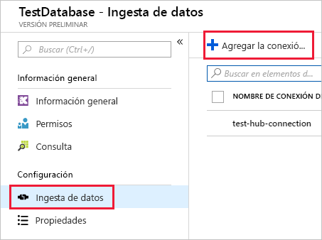

# <a name="quickstart-ingest-azure-blobs-into-azure-data-explorer-by-subscribing-to-event-grid-notifications"></a>Inicio rápido: Ingesta de blobs de Azure en Azure Data Explorer mediante la suscripción a las notificaciones de Event Grid

El Explorador de datos de Azure es un servicio de exploración de datos altamente escalable y rápido para datos de telemetría y registro. Azure Data Explorer ofrece una ingesta continua (carga de datos) a partir de blobs escritos en contenedores de blobs. Esto se logra al establecer una suscripción de [Azure Event Grid](/azure/event-grid/overview) a los eventos de creación de blobs y el enrutar estos eventos a Kusto mediante un centro de eventos. Para este artículo de inicio rápido debe tener una cuenta de almacenamiento con una suscripción de Event Grid que envíe notificaciones al centro de eventos. Entonces podrá crear una conexión de datos de Event Grid y ver el flujo de datos por el sistema.

## <a name="prerequisites"></a>Requisitos previos

1. Si no tiene una suscripción a Azure, cree una [cuenta de Azure gratuita](https://azure.microsoft.com/free/)
1. [Base de datos y clúster de prueba](create-cluster-database-portal.md)
1. [Una cuenta de almacenamiento](https://docs.microsoft.com/azure/storage/common/storage-quickstart-create-account?tabs=azure-portal)
1. [Un centro de eventos](https://docs.microsoft.com/azure/event-hubs/event-hubs-create)

## <a name="create-an-event-grid-subscription-in-your-storage-account"></a>Creación de una suscripción de Event Grid en la cuenta de almacenamiento

1. En Azure Portal, vaya a la cuenta de almacenamiento
1. Haga clic en la pestaña **Eventos** y en **Suscripción de eventos**

    

1. En la ventana **Crear suscripción de eventos** de la pestaña **Básico**, proporcione los valores siguientes:

    **Configuración** | **Valor sugerido** | **Descripción del campo**
    |---|---|---|
    | NOMBRE | *test-grid-connection* | Nombre de la cuadrícula de eventos que desea crear.|
    | Esquema de eventos | *Esquema de Event Grid* | Esquema que se debe usar para la cuadrícula de eventos. |
    | Tipo de tema | *Cuenta de almacenamiento* | Tipo de tema de la cuadrícula de eventos. |
    | Recurso de tema | *gridteststorage* | El nombre de la cuenta de almacenamiento. |
    | Suscribirse a todos los tipos de evento | *Desactivar* | No recibir notificaciones de los eventos. |
    | Tipos de evento definidos | *Blob Created* (Creados por el blob) | Eventos específicos de los que recibir notificaciones. |
    | Tipo de punto de conexión | *Event Hubs* | Tipo de punto de conexión al que enviar los eventos. |
    | Punto de conexión | *test-hub* | El centro de eventos que creó. |
    | | |

1. Seleccione la pestaña **Características adicionales** si desea realizar el seguimiento de los archivos de un contenedor específico. Establezca los filtros para las notificaciones de la manera siguiente:
    * El campo **Asunto comienza por** es el prefijo *literal* del contenedor de blobs (como el patrón aplicado es *startswith*, abarca varios contenedores). No se permiten comodines.
     *Debe* establecerse como sigue: *`/blobServices/default/containers/`*[prefijo del contenedor]
    * El campo **Asunto termina con** es el sufijo *literal* del blob. No se permiten comodines.

## <a name="create-a-target-table-in-azure-data-explorer"></a>Creación de una tabla de destino en el Explorador de datos de Azure

Cree una tabla en Azure Data Explorer a la que Event Hubs enviará datos. La tabla se crea en el clúster y la base de datos se aprovisiona en **Requisitos previos**.

1. En Azure Portal, bajo el clúster, seleccione **Consulta**.

    

1. Copie el siguiente comando en la ventana y seleccione **Ejecutar** para crear la tabla (TestTable) que recibirá los datos ingeridos.

    ```Kusto
    .create table TestTable (TimeStamp: datetime, Value: string, Source:string)
    ```

    

1. Copie el siguiente comando en la ventana y seleccione **Ejecutar** para asignar los datos JSON entrantes a los tipos de datos y los nombres de columna de la tabla (TestTable).

    ```Kusto
    .create table TestTable ingestion json mapping 'TestMapping' '[{"column":"TimeStamp","path":"$.TimeStamp"},{"column":"Value","path":"$.Value"},{"column":"Source","path":"$.Source"}]'
    ```

## <a name="create-an-event-grid-data-connection-in-azure-data-explorer"></a>Creación de una conexión de datos de Event Grid en Azure Data Explorer

Ahora se conectará a la cuadrícula de eventos desde Azure Data Explorer para que el flujo de datos del contenedor de blobs fluya también a la tabla de prueba.

1. Seleccione **Notificaciones** en la barra de herramientas para comprobar que la implementación del centro de eventos se ha realizado correctamente.

1. En el clúster que creó, seleccione **Bases de datos** y **TestDatabase**.

    

1. Seleccione **Ingesta de datos** y **Agregar conexión de datos**.

    

1. Seleccione el tipo de conexión: **Blob Storage**.

1. Rellene el formulario con la siguiente información y haga clic en **Crear**.

    

     Origen de datos:

    **Configuración** | **Valor sugerido** | **Descripción del campo**
    |---|---|---|
    | Nombre de la conexión de datos | *test-hub-connection* | Nombre de la conexión que desea crear en el Explorador de datos de Azure.|
    | Suscripción de la cuenta de almacenamiento | Su Id. de suscripción | Identificador de la suscripción donde reside la cuenta de almacenamiento.|
    | Cuenta de almacenamiento | *gridteststorage* | Nombre de la cuenta de almacenamiento que creó anteriormente.|
    | Event Grid | *test-grid-connection* | Nombre de la cuadrícula de eventos que ha creado. |
    | Nombre del centro de eventos | *test-hub* | El centro de eventos que creó. Esto se rellena automáticamente al elegir una cuadrícula de eventos. |
    | Grupo de consumidores | *test-group* | Grupo de consumidores de eventos definido en el centro de eventos que creó. |
    | | |

    Tabla de destino:

     **Configuración** | **Valor sugerido** | **Descripción del campo**
    |---|---|---|
    | Tabla | *TestTable* | La tabla que creó en **TestDatabase**. |
    | Formato de datos | *JSON* | Los formatos admitidos son Avro, CSV, JSON, JSON de varias líneas, PSV, SOH, SCSV, TSV y TXT. |
    | Asignación de columnas | *TestMapping* | La asignación que creó en **TestDatabase**, que asigna los datos JSON entrantes a los nombres de columnas y tipos de datos de **TestTable**.|
    | | |

## <a name="generate-sample-data"></a>Generación de datos de ejemplo

Ahora que Azure Data Explorer y la cuenta de almacenamiento están conectados, puede crear datos de ejemplo y cargarlos al almacenamiento en blobs.

Vamos a trabajar con un pequeño script de shell que emite algunos comandos básicos de la CLI de Azure para interactuar con recursos de Azure Storage. El script crea primero un nuevo contenedor en su cuenta de almacenamiento, y después carga un archivo existente (p. ej., un blob) en ese contenedor. A continuación, enumera todos los blobs del contenedor. Puede usar [Cloud Shell](https://docs.microsoft.com/azure/cloud-shell/overview) para ejecutar el script directamente en el portal.

Guarde los datos siguientes en un archivo y úselos con el siguiente script:

```Json
{"TimeStamp": "1987-11-16 12:00","Value": "Hello World","Source": "TestSource"}
```

```bash
#!/bin/bash
### A simple Azure Storage example script

    export AZURE_STORAGE_ACCOUNT=<storage_account_name>
    export AZURE_STORAGE_KEY=<storage_account_key>

    export container_name=<container_name>
    export blob_name=<blob_name>
    export file_to_upload=<file_to_upload>
    export destination_file=<destination_file>

    echo "Creating the container..."
    az storage container create --name $container_name

    echo "Uploading the file..."
    az storage blob upload --container-name $container_name --file $file_to_upload --name $blob_name

    echo "Listing the blobs..."
    az storage blob list --container-name $container_name --output table

    echo "Done"
```

## <a name="review-the-data-flow"></a>Revisión del flujo de datos

> [!NOTE]
> ADX tiene una directiva de agregación (procesamiento por lotes) para la ingesta de datos diseñada para optimizar el proceso.
De forma predeterminada, la directiva se configura en 5 minutos.
Si es necesario, podrá modificar la directiva más adelante. En este artículo de inicio rápido puede esperar una latencia de unos minutos.

1. En Azure Portal, en la cuadrícula de eventos, verá el pico de actividad cuando la aplicación se está ejecutando.

    

1. Ejecute la siguiente consulta en la base de datos de prueba para comprobar cuántos mensajes se han enviado a la base de datos hasta el momento.

    ```Kusto
    TestTable
    | count
    ```

1. Para ver el contenido de los mensajes, ejecute la siguiente consulta en la base de datos de prueba.

    ```Kusto
    TestTable
    ```

    El conjunto de resultados debe tener un aspecto similar al siguiente:

    

## <a name="clean-up-resources"></a>Limpieza de recursos

Si no piensa volver a usar la cuadrícula de eventos, limpie **test-hub-rg** para evitar incurrir en costos.

1. En Azure Portal, seleccione **Grupos de recursos** en el extremo izquierdo y luego seleccione el grupo de recursos que creó.  

    Si el menú izquierdo está contraído, seleccione el  para expandirlo.

   

1. En **test-resource-group**, seleccione **Eliminar grupo de recursos**.

1. En la nueva ventana, escriba el nombre del grupo de recursos que quiere eliminar (*test-hub-rg*) y seleccione **Eliminar**.

## <a name="next-steps"></a>Pasos siguientes

> [!div class="nextstepaction"]
> [Inicio rápido: Consulta de datos en Azure Data Explorer](web-query-data.md)
