# <a name="ingest-data-from-event-hub-into-azure-data-explorer"></a>Ingesta de datos del centro de eventos a Azure Data Explorer

> [!div class="op_single_selector"]
> * [Portal](ingest-data-event-hub.md)
> * [C#](data-connection-event-hub-csharp.md)
> * [Python](data-connection-event-hub-python.md)
> * [Plantilla de Azure Resource Manager](data-connection-event-hub-resource-manager.md)

El Explorador de datos de Azure es un servicio de exploración de datos altamente escalable y rápido para datos de telemetría y registro. El Explorador de datos de Azure ofrece ingesta (carga de datos) de Event Hubs, una plataforma de streaming de macrodatos y un servicio de ingesta de eventos. [Event Hubs](/azure/event-hubs/event-hubs-about) puede procesar millones de eventos por segundo prácticamente en tiempo real. En este artículo creará un centro de eventos, se conectará a él desde Azure Data Explorer y verá el flujo de datos a través del sistema.

## <a name="prerequisites"></a>Prerrequisitos

* Si no tiene una suscripción a Azure, cree una [cuenta gratuita de Azure](https://azure.microsoft.com/free/) antes de empezar.
* [Una base de datos y un clúster de prueba](create-cluster-database-portal.md).
* [Una aplicación de ejemplo](https://github.com/Azure-Samples/event-hubs-dotnet-ingest) que genera los datos y los envía a un centro de eventos. Descargue la aplicación de ejemplo en el sistema.
* [Visual Studio de 2019](https://visualstudio.microsoft.com/vs/) para ejecutar la aplicación de ejemplo.

## <a name="sign-in-to-the-azure-portal"></a>Inicio de sesión en Azure Portal

Inicie sesión en [Azure Portal](https://portal.azure.com/).

## <a name="create-an-event-hub"></a>Creación de un centro de eventos

En este artículo generará datos de ejemplo y los enviará a un centro de eventos. El primer paso es crear un centro de eventos. Para hacerlo, utilice una plantilla de Azure Resource Manager en Azure Portal.

1. Con el fin de crear un centro de eventos, use el botón siguiente para iniciar la implementación. Haga clic con el botón derecho y seleccione **Abrir en una ventana nueva** para seguir el resto de los pasos de este artículo.

    [](https://portal.azure.com/#create/Microsoft.Template/uri/https%3A%2F%2Fraw.githubusercontent.com%2FAzure%2Fazure-quickstart-templates%2Fmaster%2F201-event-hubs-create-event-hub-and-consumer-group%2Fazuredeploy.json)

    El botón **Deploy to Azure** (Implementar en Azure) le lleva a Azure Portal para rellenar un formulario de implementación.

    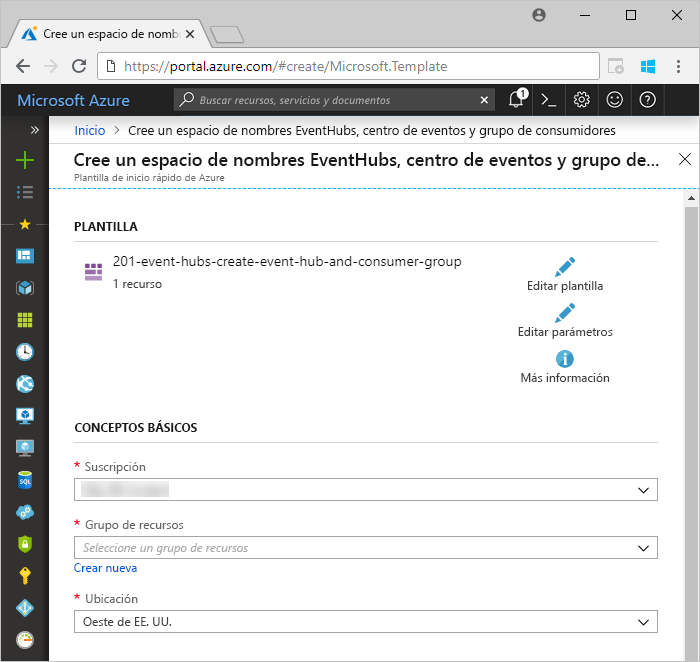

1. Seleccione la suscripción en la que desea crear el centro de eventos y cree un grupo de recursos denominado *test-hub-rg*.

    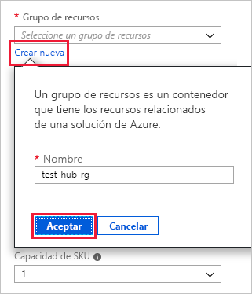

1. Rellene el formulario con la siguiente información.

    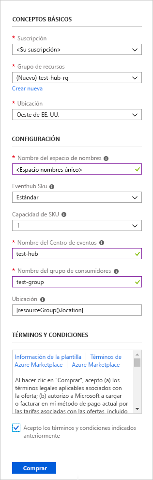

    Use los valores predeterminados para cualquier configuración que no aparezca en la tabla siguiente.

    **Configuración** | **Valor sugerido** | **Descripción del campo**
    |---|---|---|
    | Subscription | Su suscripción | Seleccione la suscripción de Azure que quiere usar para el centro de eventos.|
    | Resource group | *test-hub-rg* | Cree un nuevo grupo de recursos. |
    | Location | *Oeste de EE. UU.* | Seleccione *Oeste de EE. UU.* para este artículo. En un sistema de producción, seleccione la región que mejor se adapte a sus necesidades. Cree el espacio de nombres del centro de eventos en la misma ubicación que el clúster de Kusto para mejorar el rendimiento (más importante para espacios de nombres de centro de eventos con alto rendimiento).
    | Nombre del espacio de nombres | Nombre único del espacio de nombres | Elija un nombre único que identifique el espacio de nombres. Por ejemplo, *mytestnamespace*. El nombre de dominio *servicebus.windows.net* se anexa al nombre que proporcione. El nombre solo puede contener letras, números y guiones. El nombre debe comenzar y terminar con una letra o un número. El valor debe tener entre 6 y 50 caracteres.
    | Nombre del centro de eventos | *test-hub* | El centro de eventos se encuentra bajo el espacio de nombres, que proporciona un contenedor de ámbito único. El nombre del centro de eventos tiene que ser único dentro del espacio de nombres. |
    | Nombre del grupo de consumidores | *test-group* | Los grupos de consumidores permiten consumir varias aplicaciones y que cada una tenga una vista independiente del flujo de eventos. |
    | | |

1. Seleccione **Comprar**, que confirma que está creando recursos en su suscripción.

1. Seleccione **Notificaciones** en la barra de herramientas para supervisar el proceso de aprovisionamiento. La implementación puede tardar varios minutos en realizarse correctamente, pero puede continuar con el siguiente paso ahora.

    

## <a name="create-a-target-table-in-azure-data-explorer"></a>Creación de una tabla de destino en el Explorador de datos de Azure

Ahora creará una tabla en el Explorador de datos de Azure, al que Event Hubs enviará datos. Creará la tabla en el clúster y la base de datos aprovisionada en **Requisitos previos**.

1. En Azure Portal, vaya al clúster y, a continuación, seleccione **Consulta**.

    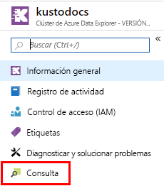

1. Copie el siguiente comando en la ventana y seleccione **Ejecutar** para crear la tabla (TestTable) que recibirá los datos ingeridos.

    ```Kusto
    .create table TestTable (TimeStamp: datetime, Name: string, Metric: int, Source:string)
    ```

    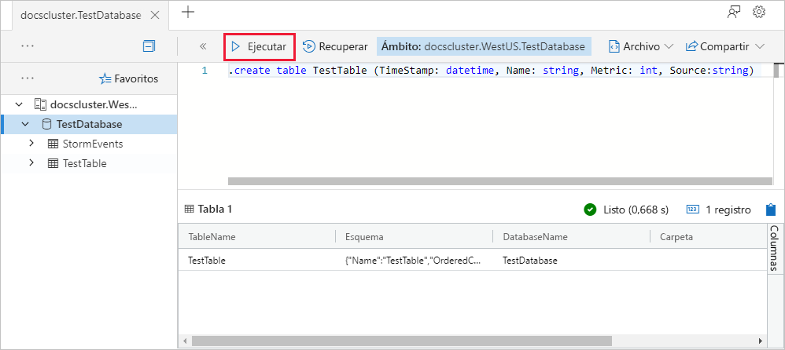

1. Copie el siguiente comando en la ventana y seleccione **Ejecutar** para asignar los datos JSON entrantes a los tipos de datos y los nombres de columna de la tabla (TestTable).

    ```Kusto
    .create table TestTable ingestion json mapping 'TestMapping' '[{"column":"TimeStamp","path":"$.timeStamp","datatype":"datetime"},{"column":"Name","path":"$.name","datatype":"string"},{"column":"Metric","path":"$.metric","datatype":"int"},{"column":"Source","path":"$.source","datatype":"string"}]'
    ```

## <a name="connect-to-the-event-hub"></a>Conexión a Event Hubs

Ahora puede conectarse al centro de eventos desde Azure Data Explorer. Cuando se efectúa esta conexión, los datos que fluyen al centro de eventos se transmiten a la tabla de prueba que creó anteriormente en este artículo.

1. Seleccione **Notificaciones** en la barra de herramientas para comprobar que la implementación del centro de eventos se ha realizado correctamente.

1. En el clúster que creó, seleccione **Bases de datos** y **TestDatabase**.

    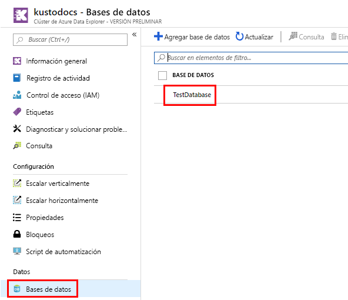

1. Seleccione **Ingesta de datos** y **Agregar conexión de datos**. Después, rellene el formulario con la siguiente información. Cuando haya terminado, seleccione **Crear**.

    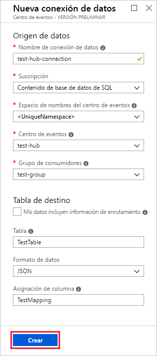

    **Origen de datos:**

    **Configuración** | **Valor sugerido** | **Descripción del campo**
    |---|---|---|
    | Nombre de la conexión de datos | *test-hub-connection* | Nombre de la conexión que desea crear en el Explorador de datos de Azure.|
    | Espacio de nombres del centro de eventos | Nombre único del espacio de nombres | Nombre elegido anteriormente que identifica el espacio de nombres. |
    | Centro de eventos | *test-hub* | El centro de eventos que creó. |
    | Grupo de consumidores | *test-group* | Grupo de consumidores de eventos definido en el centro de eventos que creó. |
    | Propiedades del sistema de eventos | Seleccione las propiedades pertinentes. | [Propiedades del sistema del centro de eventos](/azure/service-bus-messaging/service-bus-amqp-protocol-guide#message-annotations). Si hay varios registros por cada mensaje de evento, las propiedades del sistema se agregarán al primero de ellos. Cuando agregue las propiedades del sistema, [cree](/azure/kusto/management/create-table-command) o [actualice](/azure/kusto/management/alter-table-command) el esquema de tabla y la [asignación](/azure/kusto/management/mappings) para incluir las propiedades seleccionadas. |
    | Compresión | *None* | Tipo de compresión de la carga de mensajes del centro de eventos. Tipos de compresión admitidos: *Ninguno, GZip*.|
    | | |

    **Table de destino:**

    Hay dos opciones para el enrutamiento de los datos ingeridos: *estático* y *dinámico*. 
    En este artículo, usará el enrutamiento estático, en el que se especifican el nombre de la tabla, el formato de los datos y la asignación. Por tanto, deje **My data includes routing info** (Mis datos incluyen información de enrutamiento) sin seleccionar.

     **Configuración** | **Valor sugerido** | **Descripción del campo**
    |---|---|---|
    | Tabla | *TestTable* | La tabla que creó en **TestDatabase**. |
    | Formato de datos | *JSON* | Los formatos admitidos son Avro, CSV, JSON, MULTILINE JSON, PSV, SOHSV, SCSV, TSV, TSVE, TXT, ORC y PARQUET. |
    | Asignación de columnas | *TestMapping* | [Asignación](/azure/kusto/management/mappings) que creó en **TestDatabase**, que asigna los datos JSON entrantes a los nombres de columnas y tipos de datos de **TestTable**. Se requiere para JSON o MULTILINE JSON y es opcional para otros formatos.|
    | | |

    > [!NOTE]
    > * Seleccione **My data includes routing info** (Mis datos incluyen información de enrutamiento) para usar el enrutamiento dinámico, donde los datos incluyen la información de enrutamiento necesaria, tal como se muestra en los comentarios de la [aplicación de ejemplo](https://github.com/Azure-Samples/event-hubs-dotnet-ingest). Si se establecen propiedades estáticas y dinámicas, las propiedades dinámicas reemplazan a las estáticas. 
    > * Solamente se ingieren los eventos en cola después de crear la conexión de datos.
    > * También puede establecer el tipo de compresión a través de propiedades dinámicas, tal como se muestra en la [aplicación de ejemplo](https://github.com/Azure-Samples/event-hubs-dotnet-ingest).
    > * Los formatos Avro, ORC y PARQUET, así como las propiedades del sistema de eventos, no se admiten en la carga de compresión GZip.

[!INCLUDE [data-explorer-container-system-properties](../../includes/data-explorer-container-system-properties.md)]

## <a name="copy-the-connection-string"></a>Copiar la cadena de conexión

Al ejecutar la [aplicación de ejemplo](https://github.com/Azure-Samples/event-hubs-dotnet-ingest) que se enumera en los requisitos previos, necesitará la cadena de conexión para el espacio de nombres del centro de eventos.

1. En el espacio de nombres del centro de eventos que creó, seleccione **Directivas de acceso compartido** y **RootManageSharedAccessKey**.

    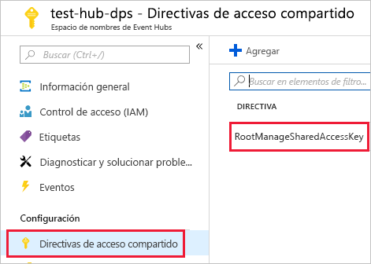

1. Copie **Cadena de conexión: clave principal**. Péguelo en la sección siguiente.

    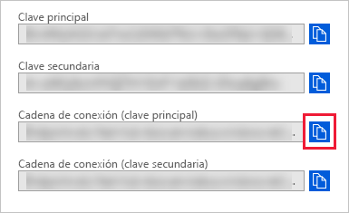

## <a name="generate-sample-data"></a>Generación de datos de ejemplo

Use la [aplicación de ejemplo](https://github.com/Azure-Samples/event-hubs-dotnet-ingest) que descargó para generar datos.

1. Abra la aplicación de ejemplo en Visual Studio.

1. En el archivo *program.cs*, actualice la constante `connectionString` a la cadena de conexión que copió desde el espacio de nombres del centro de eventos.

    ```csharp
    const string eventHubName = "test-hub";
    // Copy the connection string ("Connection string-primary key") from your Event Hub namespace.
    const string connectionString = @"<YourConnectionString>";
    ```

1. Compile y ejecute la aplicación. La aplicación envía mensajes al centro de eventos e imprime el estado cada diez segundos.

1. Cuando la aplicación haya enviado algunos mensajes, vaya al paso siguiente: revisión del flujo de datos en la tabla de prueba y el centro de eventos.

## <a name="review-the-data-flow"></a>Revisión del flujo de datos

Con la aplicación de generación de datos, ahora puede ver el flujo de datos desde el centro de eventos a la tabla del clúster.

1. En Azure Portal, bajo el centro de eventos, verá el pico de actividad cuando la aplicación se está ejecutando.

    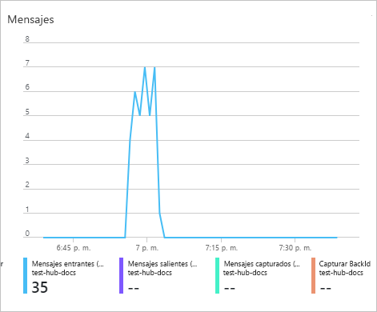

1. Ejecute la siguiente consulta en la base de datos de prueba para comprobar cuántos mensajes se han enviado a la base de datos hasta el momento.

    ```Kusto
    TestTable
    | count
    ```

1. Para ver el contenido de los mensajes, ejecute la siguiente consulta:

    ```Kusto
    TestTable
    ```

    El conjunto de resultados debe tener un aspecto similar al siguiente:

    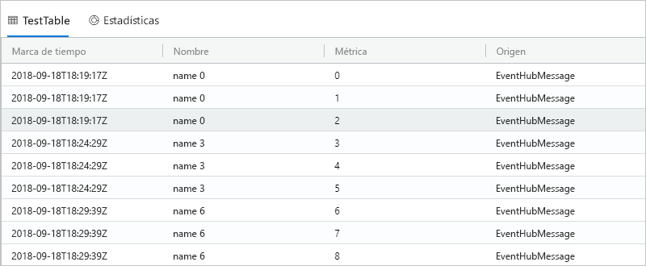

    > [!NOTE]
    > * Azure Data Explorer tiene una directiva de agregación (procesamiento por lotes) para la ingesta de datos diseñada para optimizar dicho proceso. De forma predeterminada, la directiva está configurada en 5 minutos o 500 MB de datos, por lo que puede experimentar una latencia. Consulte la [directiva de procesamiento por lotes](/azure/kusto/concepts/batchingpolicy) para ver las opciones de agregación. 
    > * La ingesta de datos del centro de eventos incluye el tiempo de respuesta del centro de eventos de 10 segundos o 1 MB. 
    > * Configure la tabla para que admita el streaming y quite el retraso en el tiempo de respuesta. Consulte la [directiva de streaming](/azure/kusto/concepts/streamingingestionpolicy). 

## <a name="clean-up-resources"></a>Limpieza de recursos

Si no piensa volver a usar el centro de eventos, limpie **test-hub-rg** para evitar incurrir en costos.

1. En Azure Portal, seleccione **Grupos de recursos** en el extremo izquierdo y luego seleccione el grupo de recursos que creó.  

    Si el menú izquierdo está contraído, seleccione el  para expandirlo.

   

1. En **test-resource-group**, seleccione **Eliminar grupo de recursos**.

1. En la nueva ventana, escriba el nombre del grupo de recursos que quiere eliminar (*test-hub-rg*) y seleccione **Eliminar**.

## <a name="next-steps"></a>Pasos siguientes

* [Consulta de datos en Azure Data Explorer](web-query-data.md)
