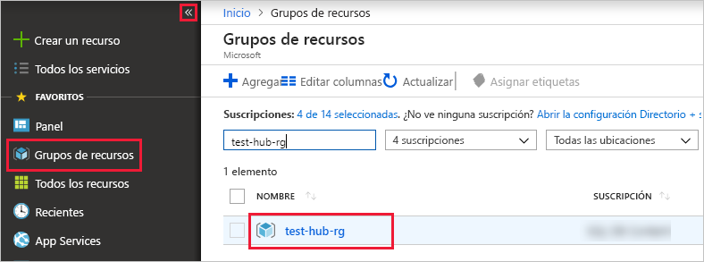

# <a name="ingest-data-from-iot-hub-into-azure-data-explorer"></a>Ingesta de datos de IoT Hub en Azure Data Explorer 

> [!div class="op_single_selector"]
> * [Portal](ingest-data-iot-hub.md)
> * [C#](data-connection-iot-hub-csharp.md)
> * [Python](data-connection-iot-hub-python.md)
> * [Plantilla de Azure Resource Manager](data-connection-iot-hub-resource-manager.md)

El Explorador de datos de Azure es un servicio de exploración de datos altamente escalable y rápido para datos de telemetría y registro. Azure Data Explorer ofrece ingesta (carga de datos) desde IoT Hub, una plataforma de streaming de macrodatos y un servicio de ingesta de IoT.

## <a name="prerequisites"></a>Prerrequisitos

* Si no tiene una suscripción a Azure, cree una [cuenta gratuita de Azure](https://azure.microsoft.com/free/) antes de empezar.
* Cree [un clúster y una base de datos de prueba](create-cluster-database-portal.md) con el nombre de base de datos *testdb*.
* [Una aplicación de ejemplo](https://github.com/Azure-Samples/azure-iot-samples-csharp) y documentación para simular un dispositivo.
* [Visual Studio de 2019](https://visualstudio.microsoft.com/vs/) para ejecutar la aplicación de ejemplo.

## <a name="create-an-iot-hub"></a>Creación de una instancia de IoT Hub

[!INCLUDE [iot-hub-include-create-hub](../../includes/iot-hub-include-create-hub.md)]

## <a name="register-a-device-to-the-iot-hub"></a>Registro de un dispositivo en IoT Hub

[!INCLUDE [iot-hub-get-started-create-device-identity](../../includes/iot-hub-get-started-create-device-identity.md)]

## <a name="create-a-target-table-in-azure-data-explorer"></a>Creación de una tabla de destino en el Explorador de datos de Azure

Ahora creará una tabla en Azure Data Explorer a la que enviarán datos los centros de IoT. Cree la tabla en el clúster y la base de datos aprovisionados en [**Requisitos previos**](#prerequisites).

1. En Azure Portal, vaya al clúster y seleccione **Consultar**.

    

1. Copie el siguiente comando en la ventana y seleccione **Ejecutar** para crear la tabla (TestTable) que recibirá los datos ingeridos.

    ```Kusto
    .create table TestTable (temperature: real, humidity: real)
    ```
    
    

1. Copie el siguiente comando en la ventana y seleccione **Ejecutar** para asignar los datos JSON entrantes a los tipos de datos y los nombres de columna de la tabla (TestTable).

    ```Kusto
    .create table TestTable ingestion json mapping 'TestMapping' '[{"column":"humidity","path":"$.humidity","datatype":"real"},{"column":"temperature","path":"$.temperature","datatype":"real"}]'
    ```

## <a name="connect-azure-data-explorer-table-to-iot-hub"></a>Conexión de la tabla de Azure Data Explorer a IoT Hub

Ahora puede conectarse a IoT Hub desde Azure Data Explorer. Una vez completada esta conexión, los datos que fluyen a IoT Hub se transmiten a la [tabla de destino que creó](#create-a-target-table-in-azure-data-explorer).

1. Seleccione **Notificaciones** en la barra de herramientas para comprobar que la implementación de IoT Hub se ha realizado correctamente.

1. En el clúster que ha creado, seleccione **Bases de datos** y, a continuación, seleccione la base de datos que creó, **testdb**.
    
    

1. Seleccione **Ingesta de datos** y **Agregar conexión de datos**. Después, rellene el formulario con la siguiente información. Cuando haya finalizado, seleccione **Crear**.

    

    **Origen de datos**:

    **Configuración** | **Descripción del campo**
    |---|---|
    | Nombre de la conexión de datos | Nombre de la conexión que desea crear en Azure Data Explorer.
    | IoT Hub | Nombre de IoT Hub |
    | Directiva de acceso compartido | Nombre de la directiva de acceso compartido. Debe tener permisos de lectura. |
    | Grupo de consumidores |  Grupo de consumidores definido en el punto de conexión integrado de IoT Hub |
    | Propiedades del sistema de eventos | [Propiedades del sistema de eventos de IoT Hub](/azure/iot-hub/iot-hub-devguide-messages-construct#system-properties-of-d2c-iot-hub-messages) Cuando agregue las propiedades del sistema, [cree](/azure/kusto/management/tables#create-table) o [actualice](/azure/kusto/management/tables#alter-table-and-alter-merge-table) el esquema de tabla y la [asignación](/azure/kusto/management/mappings) para incluir las propiedades seleccionadas. | | | 

    > [!NOTE]
    > En el caso de una [conmutación por error manual](/azure/iot-hub/iot-hub-ha-dr#manual-failover), debe volver a crear la conexión de datos.

    **Tabla de destino**:

    Hay dos opciones para el enrutamiento de los datos ingeridos: *estático* y *dinámico*. 
    En este artículo, usará el enrutamiento estático, en el que se especifican el nombre de la tabla, el formato de los datos y la asignación. Por tanto, deje **My data includes routing info** (Mis datos incluyen información de enrutamiento) sin seleccionar.

     **Configuración** | **Valor sugerido** | **Descripción del campo**
    |---|---|---|
    | Tabla | *TestTable* | La tabla que creó en **testdb**. |
    | Formato de datos | *JSON* | Los formatos admitidos son Avro, CSV, JSON, MULTILINE JSON, PSV, SOHSV, SCSV, TSV, TSVE, and TXT. |
    | Asignación de columnas | *TestMapping* | [Asignación](/azure/kusto/management/mappings) que creó en **testdb**, que asigna los datos JSON entrantes a los nombres de columnas y tipos de datos de **testdb**. Necesario para JSON, MULTILINE JSON y AVRO y opcional para otros formatos.|
    | | |

    > [!NOTE]
    > * Seleccione **My data includes routing info** (Mis datos incluyen información de enrutamiento) para usar el enrutamiento dinámico, donde los datos incluyen la información de enrutamiento necesaria, tal como se muestra en los comentarios de la [aplicación de ejemplo](https://github.com/Azure-Samples/event-hubs-dotnet-ingest). Si se establecen propiedades estáticas y dinámicas, las propiedades dinámicas reemplazan a las estáticas. 
    > * Solamente se ingieren los eventos en cola después de crear la conexión de datos.

[!INCLUDE [data-explorer-container-system-properties](../../includes/data-explorer-container-system-properties.md)]

## <a name="generate-sample-data-for-testing"></a>Generación de datos de ejemplo para pruebas

La aplicación de dispositivo simulado se conecta a un punto de conexión específico del dispositivo en IoT Hub y envía datos de telemetría simulados sobre temperatura y humedad.

1. Descargue el proyecto de C# de muestra de https://github.com/Azure-Samples/azure-iot-samples-csharp/archive/master.zip y extraiga el archivo ZIP.

1. En una ventana de terminal local, vaya a la carpeta raíz del proyecto de C# de muestra. A continuación, vaya a la carpeta **iot-hub\Quickstarts\simulated-device**.

1. Abra el archivo **SimulatedDevice.cs** en el editor de texto de su elección.

    Reemplace el valor de la variable `s_connectionString` por la cadena de conexión del dispositivo de [Registro de un dispositivo en IoT Hub](#register-a-device-to-the-iot-hub). A continuación, guarde los cambios realizados en el archivo **SimulatedDevice.cs**.

1. En la ventana de terminal local, ejecute los comandos siguientes para instalar los paquetes necesarios para la aplicación de dispositivo simulado:

    ```cmd/sh
    dotnet restore
    ```

1. En la ventana de terminal local, ejecute el comando siguiente para compilar la aplicación de dispositivo simulado y ejecutarla:

    ```cmd/sh
    dotnet run
    ```

    La siguiente captura de pantalla muestra la salida en la que la aplicación de dispositivo simulado envía datos de telemetría a IoT Hub:

    

## <a name="review-the-data-flow"></a>Revisión del flujo de datos

Con la aplicación que genera datos, ahora puede ver el flujo de datos desde el centro de IoT a la tabla del clúster.

1. En Azure Portal, bajo el centro de IoT, verá el pico de actividad cuando la aplicación está en ejecución.

    

1. Ejecute la siguiente consulta en la base de datos de prueba para comprobar cuántos mensajes se han enviado a la base de datos hasta el momento.

    ```Kusto
    TestTable
    | count
    ```

1. Para ver el contenido de los mensajes, ejecute la siguiente consulta:

    ```Kusto
    TestTable
    ```

    El conjunto de resultados:
    
    

    > [!NOTE]
    > * Azure Data Explorer tiene una directiva de agregación (procesamiento por lotes) para la ingesta de datos diseñada para optimizar dicho proceso. De forma predeterminada, la directiva está configurada en 5 minutos o 500 MB de datos, por lo que puede experimentar una latencia. Consulte la [directiva de procesamiento por lotes](/azure/kusto/concepts/batchingpolicy) para ver las opciones de agregación. 
    > * Configure la tabla para que admita el streaming y quite el retraso en el tiempo de respuesta. Consulte la [directiva de streaming](/azure/kusto/concepts/streamingingestionpolicy). 

## <a name="clean-up-resources"></a>Limpieza de recursos

Si no piensa volver a usar el centro de IoT, limpie **test-hub-rg** para evitar incurrir en costos.

1. En Azure Portal, seleccione **Grupos de recursos** en el extremo izquierdo y luego seleccione el grupo de recursos que creó.  

    Si el menú izquierdo está contraído, seleccione el  para expandirlo.

   

1. En **test-resource-group**, seleccione **Eliminar grupo de recursos**.

1. En la nueva ventana, escriba el nombre del grupo de recursos que quiere eliminar (*test-hub-rg*) y seleccione **Eliminar**.

## <a name="next-steps"></a>Pasos siguientes

* [Consulta de datos en Azure Data Explorer](web-query-data.md)
