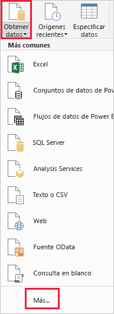
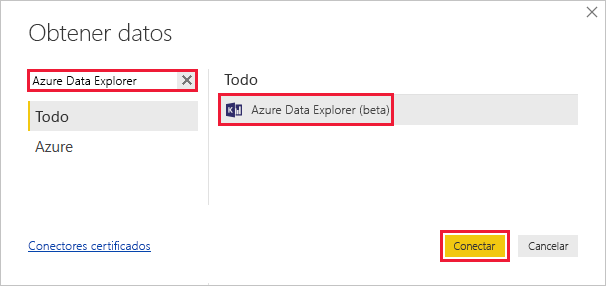
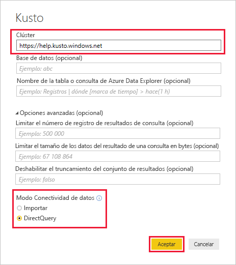
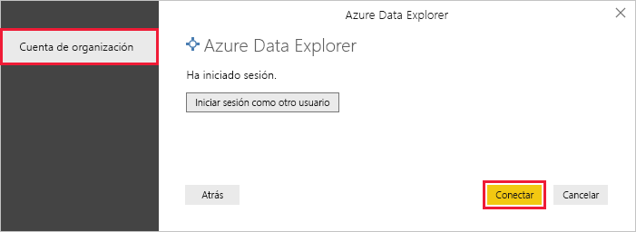
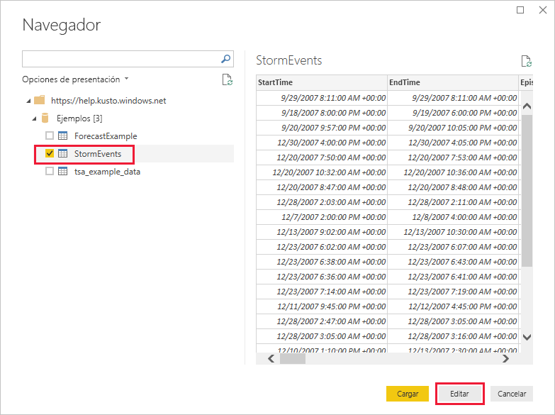
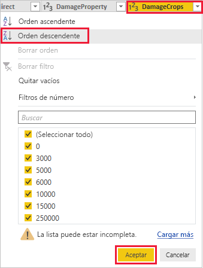
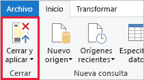

# Guía de inicio rápido: Visualización de datos mediante el conector de Azure Data Explorer para Power BI

El Explorador de datos de Azure es un servicio de exploración de datos altamente escalable y rápido para datos de telemetría y registro. Power BI es una solución de análisis de negocios que le permite visualizar sus datos y compartir los resultados en su organización.

Azure Data Explorer ofrece tres opciones para conectarse a los datos de Power BI: usar el conector integrado, importar una consulta de Azure Data Explorer o usar una consulta SQL. En esta guía de inicio rápido se le enseña a usar el conector integrado para obtener datos y visualizarlos en un informe de Power BI.

Si no tiene una suscripción a Azure, cree una [cuenta gratuita de Azure](https://azure.microsoft.com/free/) antes de empezar.

## Requisitos previos

Necesita lo siguiente para completar esta guía de inicio rápido:

* Una cuenta de correo electrónico organizativa que sea miembro de Azure Active Directory, para que pueda conectarse al [clúster de ayuda de Azure Data Explorer](https://dataexplorer.azure.com/clusters/help/databases/samples).

* [Power BI Desktop](https://powerbi.microsoft.com/get-started/) (seleccione **DESCARGAR GRATIS**)

## Obtención de datos de Azure Data Explorer

En primer lugar, conéctese al clúster de ayuda de Azure Data Explorer, después, traiga un subconjunto de los datos de la tabla *StormEvents*. [!INCLUDE [data-explorer-storm-events](../../includes/data-explorer-storm-events.md)]

1. En la pestaña **Inicio** de Power BI Desktop, seleccione **Obtener datos** y luego **Más**.

    

1. Busque *Azure Data Explorer* y, a continuación, seleccione **Azure Data Explorer (versión beta)** y **Conectar**.

    

1. En la pantalla **Conector de vista previa**, seleccione **Continuar**.

1. En la siguiente pantalla, rellene el formulario con esta información.

    

    **Configuración** | **Valor** | **Descripción del campo**
    |---|---|---|
    | Clúster | *https://help.kusto.windows.net* | La dirección URL para el clúster de ayuda. Para otros clústeres, la dirección URL tiene el formato *https://\<NombreCluster\>.\<Región\>.kusto.windows.net*. |
    | Base de datos | Déjelo en blanco | Una base de datos que se hospeda en el clúster al que se va a conectar. Se seleccionará en un paso posterior. |
    | Nombre de tabla | Déjelo en blanco | Una de las tablas de la base de datos o una consulta como "StormEvents | take 1000". Se seleccionará en un paso posterior. |
    | Opciones avanzadas | Déjelo en blanco | Opciones para las consultas como, por ejemplo, el tamaño del conjunto de resultados. |
    | Modo Conectividad de datos | *DirectQuery* | Determina si Power BI importa los datos o se conecta directamente al origen de datos. Puede usar cualquiera de las opciones con este conector. |
    | | | |

1. Si no dispone de una conexión al clúster de ayuda, inicie sesión. Inicie sesión con una cuenta de organización y, luego, seleccione **Conectar**.

    

1. En la pantalla **Navegador**, expanda la base de datos **Ejemplos**, seleccione **StormEvents** y **Editar**.

    

    La tabla se abre en el editor de Power Query, donde puede editar filas y columnas antes de importar los datos.

1. En el Editor de Power Query, seleccione la flecha situada junto a la columna **DamageCrops** y, a continuación, **Orden descendente**.

    

1. En la pestaña **Inicio**, seleccione **Conservar filas** y, después, **Conservar filas superiores**. Escriba un valor de *1000* para traer las primeras 1000 filas de la tabla ordenada.

    

1. En la pestaña **Inicio**, seleccione **Cerrar y aplicar**.

    

## Visualización de datos de un informe

[!INCLUDE [data-explorer-power-bi-visualize-basic](../../includes/data-explorer-power-bi-visualize-basic.md)]

## Limpieza de recursos

Si ya no necesita el informe que ha creado para esta guía de inicio rápido, elimine el archivo .pbix de Power BI Desktop.

## Pasos siguientes

> [!div class="nextstepaction"]
> [Guía de inicio rápido: Visualización de datos mediante una consulta importada en Power BI](power-bi-imported-query.md)