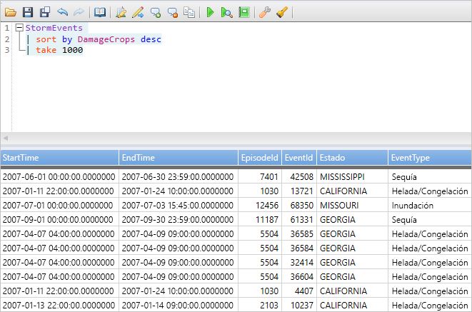
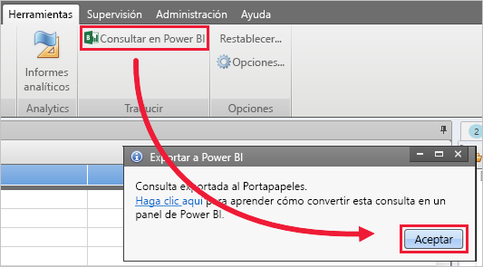
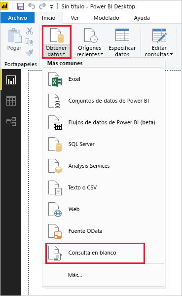
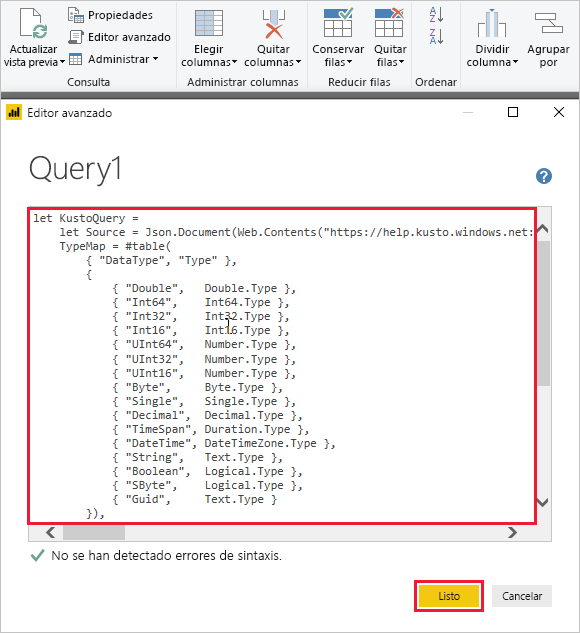
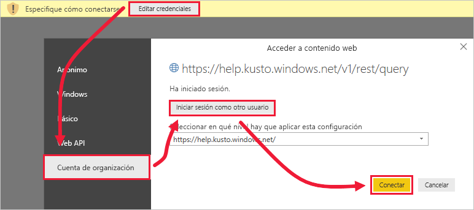
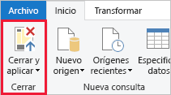

# <a name="visualize-data-using-a-query-imported-into-power-bi"></a>Visualización de datos mediante una consulta importada en Power BI

El Explorador de datos de Azure es un servicio de exploración de datos altamente escalable y rápido para datos de telemetría y registro. Power BI es una solución de análisis de negocios que le permite visualizar sus datos y compartir los resultados en su organización.

Azure Data Explorer ofrece tres opciones para conectarse a los datos de Power BI: usar el conector integrado, importar una consulta de Azure Data Explorer o usar una consulta SQL. En este artículo se le enseña a importar una consulta para obtener datos y visualizarlos en un informe de Power BI.

Si no tiene una suscripción a Azure, cree una [cuenta gratuita de Azure](https://azure.microsoft.com/free/) antes de empezar.

## <a name="prerequisites"></a>Prerrequisitos

Para completar este artículo, necesitará lo siguiente:

* Una cuenta de correo electrónico organizativa que sea miembro de Azure Active Directory, para que pueda conectarse al [clúster de ayuda de Azure Data Explorer](https://dataexplorer.azure.com/clusters/help/databases/samples).

* [Power BI Desktop](https://powerbi.microsoft.com/get-started/) (seleccione **DESCARGAR GRATIS**)

* [Aplicación de escritorio de Azure Data Explorer](/azure/kusto/tools/kusto-explorer)

## <a name="get-data-from-azure-data-explorer"></a>Obtención de datos de Azure Data Explorer

En primer lugar, cree una consulta en la aplicación de escritorio de Azure Data Explorer y expórtela para su uso en Power BI. Después, conéctese al clúster de ayuda de Azure Data Explorer, y traiga un subconjunto de los datos de la tabla *StormEvents*. [!INCLUDE [data-explorer-storm-events](../../includes/data-explorer-storm-events.md)]

1. En un explorador, vaya a [https://help.kusto.windows.net/](https://help.kusto.windows.net/) para iniciar la aplicación de escritorio de Azure Data Explorer.

1. En la aplicación de escritorio, copie la siguiente consulta en la ventana de consultas de la esquina superior derecha y, después, ejecútela.

    ```Kusto
    StormEvents
    | sort by DamageCrops desc
    | take 1000
    ```

    Las primeras filas del conjunto de resultados deben ser parecidas a las de la siguiente imagen.

    

1. En la pestaña **Herramientas**, seleccione **Consultar en Power BI** y, después, **Aceptar**.

    

1. En la pestaña **Inicio** de Power BI Desktop, seleccione **Obtener datos** y luego **Consulta en blanco**.

    

1. En el Editor de Power Query, en la pestaña **Inicio**, seleccione **Editor avanzado**.

1. En la ventana **Editor avanzado**, pegue la consulta que exportó y, a continuación, seleccione **Listo**.

    

1. En la ventana principal del Editor de Power Query, seleccione **Editar credenciales**. Seleccione **Cuenta de organización**, inicie sesión y, luego, seleccione **Conectar**.

    

1. En la pestaña **Inicio**, seleccione **Cerrar y aplicar**.

    

## <a name="visualize-data-in-a-report"></a>Visualización de datos de un informe

[!INCLUDE [data-explorer-power-bi-visualize-basic](../../includes/data-explorer-power-bi-visualize-basic.md)]

## <a name="clean-up-resources"></a>Limpieza de recursos

Si ya no necesita el informe que ha creado para este artículo, elimine el archivo de Power BI Desktop (.pbix).

## <a name="next-steps"></a>Pasos siguientes

[Visualización de datos mediante el conector de Azure Data Explorer para Power BI](power-bi-connector.md)