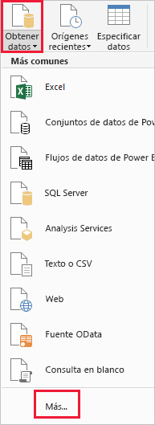
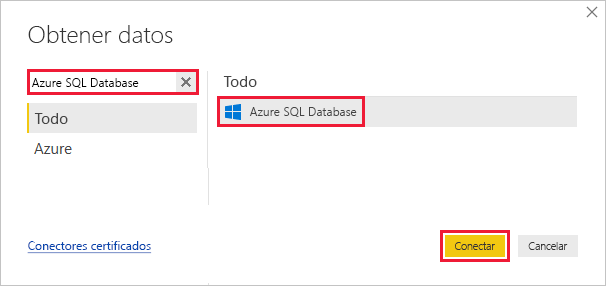
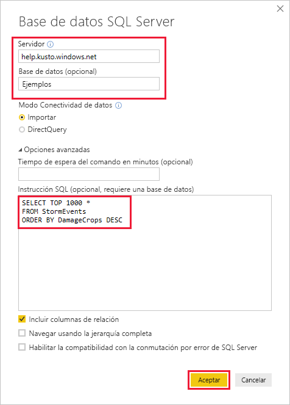
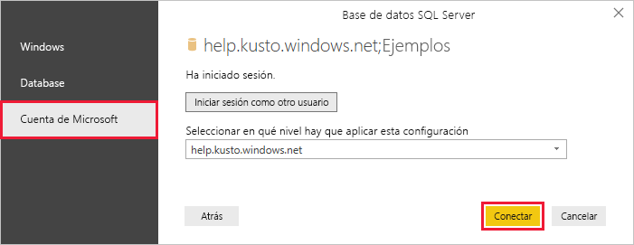
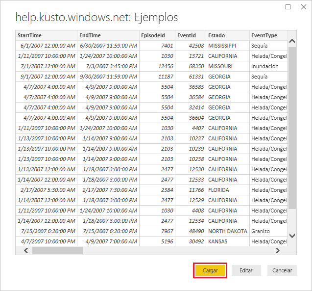

# <a name="visualize-data-from-azure-data-explorer-using-a-sql-query-in-power-bi"></a>Visualización de datos desde Azure Data Explorer con una consulta de SQL en Power BI

El Explorador de datos de Azure es un servicio de exploración de datos altamente escalable y rápido para datos de telemetría y registro. Power BI es una solución de análisis de negocios que le permite visualizar sus datos y compartir los resultados en su organización.

Azure Data Explorer ofrece tres opciones para conectarse a los datos de Power BI: usar el conector integrado, importar una consulta de Azure Data Explorer o usar una consulta SQL. En este artículo se enseña a usar una consulta SQL para obtener datos y visualizarlos en un informe de Power BI.

Si no tiene una suscripción a Azure, cree una [cuenta gratuita de Azure](https://azure.microsoft.com/free/) antes de empezar.

## <a name="prerequisites"></a>Prerrequisitos

Para completar este artículo, necesitará lo siguiente:

* Una cuenta de correo electrónico organizativa que sea miembro de Azure Active Directory, para que pueda conectarse al [clúster de ayuda de Azure Data Explorer](https://dataexplorer.azure.com/clusters/help/databases/samples).

* [Power BI Desktop](https://powerbi.microsoft.com/get-started/) (seleccione **DESCARGAR GRATIS**)

## <a name="get-data-from-azure-data-explorer"></a>Obtención de datos de Azure Data Explorer

En primer lugar, conéctese al clúster de ayuda de Azure Data Explorer, después, traiga un subconjunto de los datos de la tabla *StormEvents*. [!INCLUDE [data-explorer-storm-events](../../includes/data-explorer-storm-events.md)]

Normalmente se utiliza el lenguaje de consulta nativo con Azure Data Explorer, pero también se admiten las consultas SQL que serán las que se usen en este caso. Azure Data Explorer traduce automáticamente la consulta SQL en una consulta nativa.

1. En la pestaña **Inicio** de Power BI Desktop, seleccione **Obtener datos** y luego **Más**.

    

1. Busque *Azure SQL Database*, seleccione **Azure SQL Database** y, a continuación, **Conectar**.

    

1. En la pantalla **Base de datos de SQL Server**, rellene el formulario con la siguiente información.

    

    **Configuración** | **Valor** | **Descripción del campo**
    |---|---|---|
    | Server | *help.kusto.windows.net* | La dirección URL para el clúster de ayuda (sin *https://* ). Para otros clústeres, la dirección URL tiene el formato *\<NombreClúster\>\<Región\>.kusto.windows.net*. |
    | Base de datos | *Muestras* | La base de datos de ejemplo que se hospeda en el clúster al que se va a conectar. |
    | Modo Conectividad de datos | *Importar* | Determina si Power BI importa los datos o se conecta directamente al origen de datos. Puede usar cualquiera de las opciones con este conector. |
    | Tiempo de espera del comando | Déjelo en blanco | El tiempo que la consulta se puede estar ejecutando antes de lanzar un error de tiempo de expiración. |
    | Instrucción SQL | Copie la consulta que aparece después de esta tabla | La instrucción SQL que Azure Data Explorer traduce en una consulta nativa. |
    | Otras opciones | Deje los valores predeterminados | Las opciones no se aplican a los clústeres de Azure Data Explorer. |
    | | | |

    ```SQL
    SELECT TOP 1000 *
    FROM StormEvents
    ORDER BY DamageCrops DESC
    ```

1. Si no dispone de una conexión al clúster de ayuda, inicie sesión. Inicie sesión con una cuenta Microsoft y, a continuación, seleccione **Conectar**.

    

1. En la pantalla **help.kusto.windows.net: Samples**, seleccione **Cargar**.

    

    La tabla se abre en la ventana principal de Power BI, en la vista de informes, donde puede crear informes basados en los datos de ejemplo.

## <a name="visualize-data-in-a-report"></a>Visualización de datos de un informe

[!INCLUDE [data-explorer-power-bi-visualize-basic](../../includes/data-explorer-power-bi-visualize-basic.md)]

## <a name="clean-up-resources"></a>Limpieza de recursos

Si ya no necesita el informe que ha creado para este artículo, elimine el archivo de Power BI Desktop (.pbix).

## <a name="next-steps"></a>Pasos siguientes

[Visualización de datos mediante el conector de Azure Data Explorer para Power BI](power-bi-connector.md)