# <a name="quickstart-query-data-in-azure-data-explorer"></a>Guía de inicio rápido: Consulta de datos en Azure Data Explorer

El Explorador de datos de Azure es un servicio de exploración de datos altamente escalable y rápido para datos de telemetría y registro. El Explorador de datos de Azure proporciona una aplicación web que le permite ejecutar y compartir consultas. La aplicación está disponible en Azure Portal como aplicación web independiente. En este artículo, trabaja en la versión independiente, que le permite conectarse a varios clústeres y compartir vínculos profundos a sus consultas.

Si no tiene una suscripción a Azure, cree una [cuenta gratuita de Azure](https://azure.microsoft.com/free/) antes de empezar.

## <a name="prerequisites"></a>Requisitos previos

Además de una suscripción de Azure, necesita [un clúster y una base de datos de prueba](create-cluster-database-portal.md) para completar esta guía de inicio rápido.

## <a name="sign-in-to-the-application"></a>Inicie sesión en la aplicación.

Inicie sesión en [la aplicación](https://dataexplorer.azure.com/).

## <a name="add-clusters"></a>Agregar clústeres

Al abrir la aplicación por primera vez, no hay ninguna conexión.


Debe agregar una conexión a al menos un clúster antes de poder empezar a ejecutar consultas. En esta sección, agrega conexiones al *clúster de ayuda* del Explorador de datos de Azure que hemos configurado para facilitar el aprendizaje y al clúster de prueba que creó en una guía de inicio rápido anterior.

1. En la parte superior izquierda de la aplicación, haga clic en **Agregar clúster**.

1. En el cuadro de diálogo **Agregar clúster**, escriba el identificador URI y, a continuación, seleccione **Agregar**.

   Puede usar el identificador URI del clúster de ayuda, `https://help.kusto.windows.net`. Si tiene su propio clúster, proporcione su URI. Por ejemplo, `https://mydataexplorercluster.westus.kusto.windows.net` tal como se muestra en la siguiente imagen:

    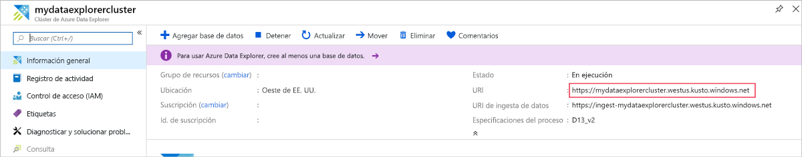

1. En el panel izquierdo, debería ver ahora el clúster de **ayuda**. Expanda la base de datos de **ejemplo** para que pueda ver las tablas de ejemplo a las que tiene acceso.

    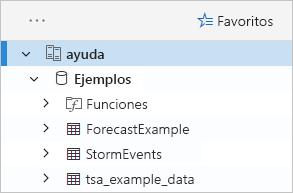

    Usamos la tabla **StormEvents** posteriormente en esta guía de inicio rápido y en otros artículos del Explorador de datos de Azure.

Agregue ahora el clúster de prueba que creó.

1. Seleccione **Agregar clúster**.

1. En el cuadro de diálogo **Agregar clúster**, escriba su dirección URL del clúster de prueba en el formulario `https://<ClusterName>.<Region>.kusto.windows.net/` y, a continuación, seleccione **Agregar**.

    En el siguiente ejemplo, puede ver el clúster de **ayuda** y un nuevo clúster, **docscluster.westus** (la dirección URL completa es `https://docscluster.westus.kusto.windows.net/`).

    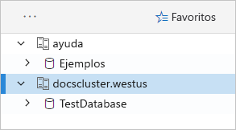

## <a name="run-queries"></a>Ejecutar consultas

Ahora puede ejecutar consultas en cualquier clúster al que esté conectado (suponiendo que tenga datos en su clúster de prueba). Nos centraremos en el clúster de **ayuda**.

1. En el panel izquierdo, en el clúster de **ayuda**, seleccione la base de datos de **ejemplo**.

1. Copie y pegue la siguiente consulta en la ventana de consulta. En la parte superior de la ventana, seleccione **Examinar**.

    ```Kusto
    StormEvents
    | sort by StartTime desc
    | take 10
    ```
    Esta consulta devuelve los diez registros más recientes de la tabla **StormEvents**. El lado izquierdo del resultado debe tener una apariencia similar a la de la tabla siguiente.

    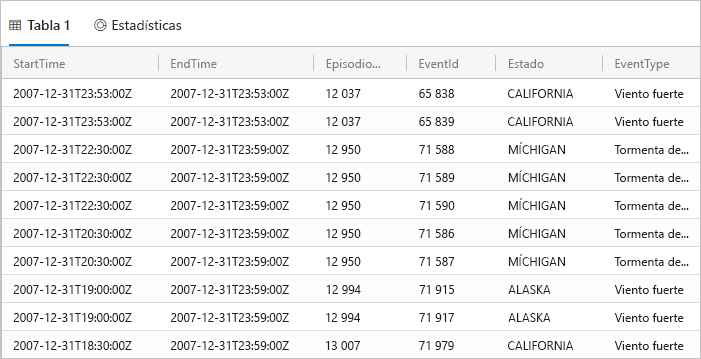

    En la siguiente imagen se muestra el estado en el que debería encontrarse la aplicación ahora, con clústeres agregados y una consulta con resultados.

    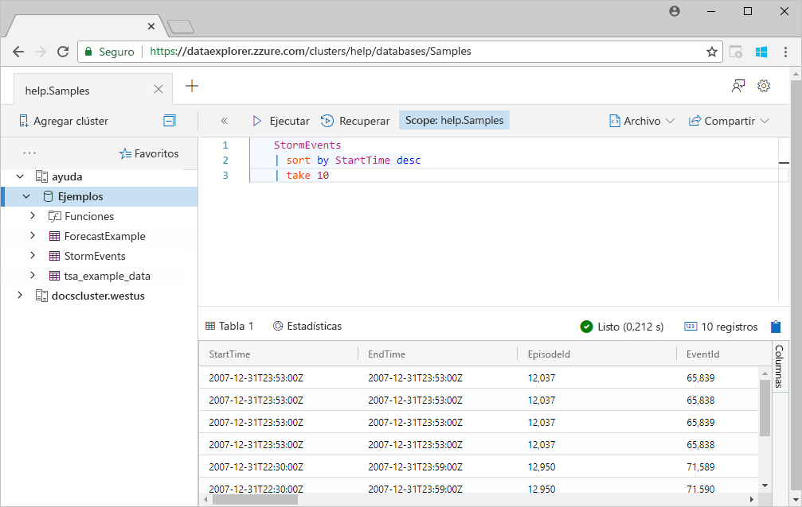

1. Copie y pegue la siguiente consulta en la ventana de consulta, después de la primera consulta. Como puede ver, no se formatea en líneas independientes como la primera consulta.

    ```Kusto
    StormEvents | sort by StartTime desc | project StartTime, EndTime, State, EventType, DamageProperty, EpisodeNarrative | take 10
    ```

1. Haga clic en el nueva consulta de la ventana, que selecciona la consulta. Presione Mayús+Alt+F para formatear la consulta de modo que tenga el siguiente aspecto.

    

1. Presione Mayús+Entrar, que es un acceso directo para ejecutar una consulta.

   Esta consulta devuelve los mismos registros que la primera, pero incluye solo las columnas especificadas en la instrucción `project`. El resultado debe tener un aspecto similar a la siguiente tabla.

    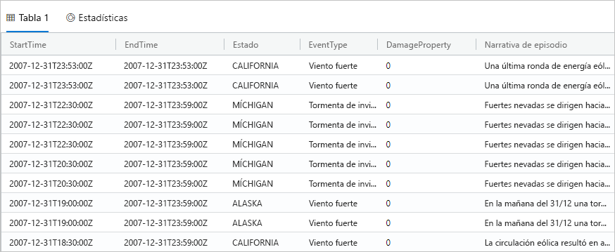

1. En la parte superior de la ventana de consulta, seleccione **Recuperar**.

    Ahora, en la ventana de consulta se muestran los resultados de la primera consulta sin necesidad de volver a ejecutar la consulta. A menudo, durante el análisis, ejecuta varias consultas, y **Recuperar** le permite volver a visitar los resultados de consultas anteriores.

1. Vamos a ejecutar una consulta más para ver un tipo de resultado distinto.

    ```Kusto
    StormEvents
    | summarize event_count=count(), mid = avg(BeginLat) by State
    | sort by mid
    | where event_count > 1800
    | project State, event_count
    | render columnchart
    ```
    El resultado debe tener un aspecto similar al siguiente gráfico.

    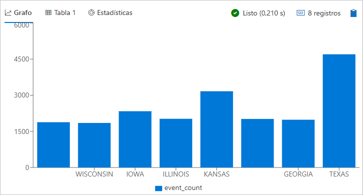

## <a name="work-with-the-table-grid"></a>Trabajar con la cuadrícula de tabla

Ahora que ha visto cómo funcionan las consultas básicas, vamos a fijarnos en cómo podemos usar la cuadrícula de tabla para personalizar los resultados y realizar más análisis.

1. Vuelva a ejecutar la primera consulta. Coloque el mouse sobre la columna **Estado**, seleccione el menú y seleccione **Agrupar por estado**.

    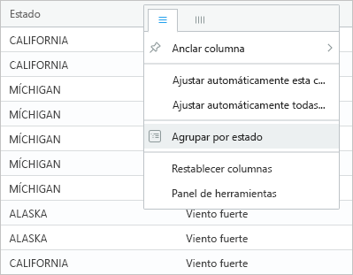

1. En la cuadrícula, expanda **California** para ver los registros correspondientes a ese estado.

    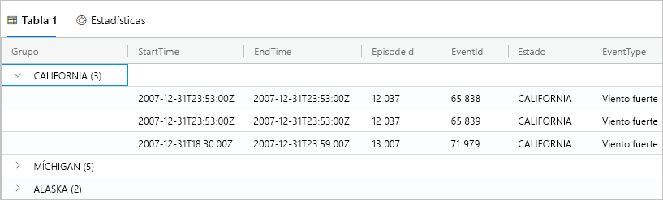

    Este tipo de agrupación puede resultar de utilidad al realizar análisis exploratorios.

1. Coloque el mouse sobre la columna **Grupo** y, a continuación, seleccione **Restablecer columnas**.

    

    Esto devuelve la cuadrícula a su estado original.

1. Ejecute la siguiente consulta.

    ```Kusto
    StormEvents
    | sort by StartTime desc
    | where DamageProperty > 5000
    | project StartTime, State, EventType, DamageProperty, Source
    | take 10
    ```

1. En el lado derecho de la cuadrícula, seleccione **Columnas** para ver el panel de herramientas.

    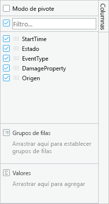

    Este panel funciona de forma similar a la lista de campos de tabla dinámica en Excel, lo que le permite realizar más análisis en la propia cuadrícula.

1. Seleccione **Modo de pivote** y, después, arrastre las columnas de este modo: **Estado** a **Grupos de filas**, **DamageProperty** a **Valores** y **EventType** a **Etiquetas de columna**.  

    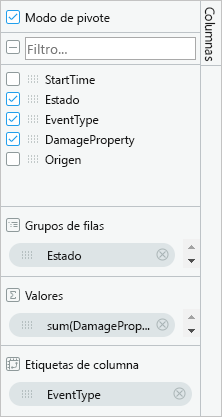

    El resultado debe tener un aspecto similar a la siguiente tabla dinámica.

    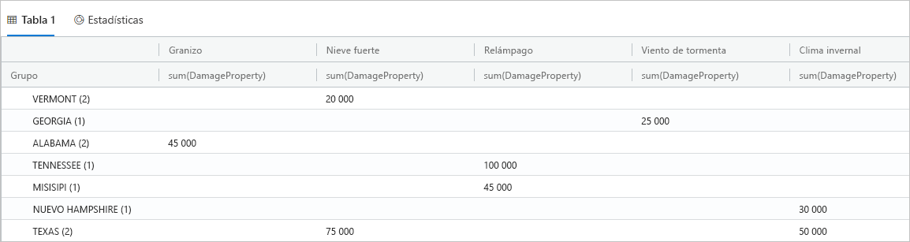

    Como puede ver, Vermont y Alabama tienen dos eventos pertenecientes a la misma categoría, mientras que Texas tiene dos eventos pertenecientes a categorías distintas. Las tablas dinámicas le permiten detectar de forma rápida cosas como esta; son una gran herramienta para realizar análisis rápidos.

## <a name="share-queries"></a>Compartir consultas

Muchas veces, desea consultar las consultas que crea. Puede proporcionar un vínculo profundo de modo que otros usuarios con acceso al clúster puedan ejecutar las consultas.

1. En la ventana de consulta, seleccione la primera consulta en la que copió.

1. En la parte superior de la ventana de consulta, seleccione **Compartir**.

1. Seleccione **Link, query to clipboard** (Vincular consulta al Portapapeles).

1. Copie el vínculo y la consulta en un archivo de texto.

1. Pegue el vínculo en una nueva ventana del explorador. El resultado debe tener una apariencia similar a la siguiente tras ejecutarse la consulta.

    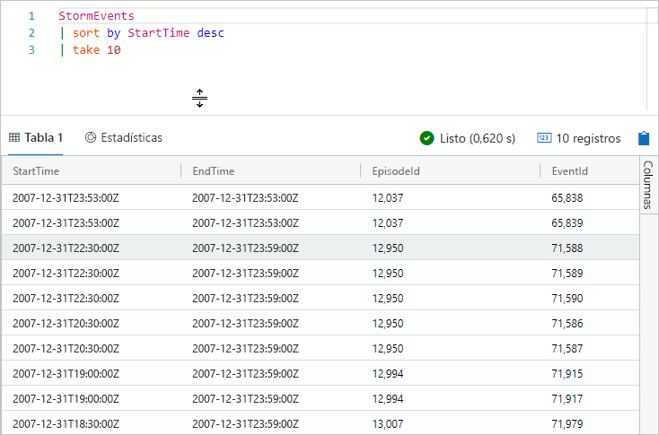

## <a name="provide-feedback"></a>Envío de comentarios

El Explorador de datos se encuentra actualmente en versión preliminar y recibimos con los brazos abiertos los comentarios sobre su experiencia. Puede hacerlo ahora o esperar hasta que haya pasado más tiempo con él.

1. En la parte superior derecha de la aplicación, seleccione el icono de comentarios: .

1. Escriba sus comentarios y, a continuación, seleccione **Enviar**.

## <a name="clean-up-resources"></a>Limpieza de recursos

No creó ningún recurso en esta guía de inicio rápido, pero si desea quitar uno o ambos clústeres de la aplicación, haga clic con el botón derecho en el clúster y seleccione **Quitar conexión**.

## <a name="next-steps"></a>Pasos siguientes

> [!div class="nextstepaction"]
> [Write queries for Azure Data Explorer](write-queries.md) (Escritura de consultas del Explorador de datos de Azure)
