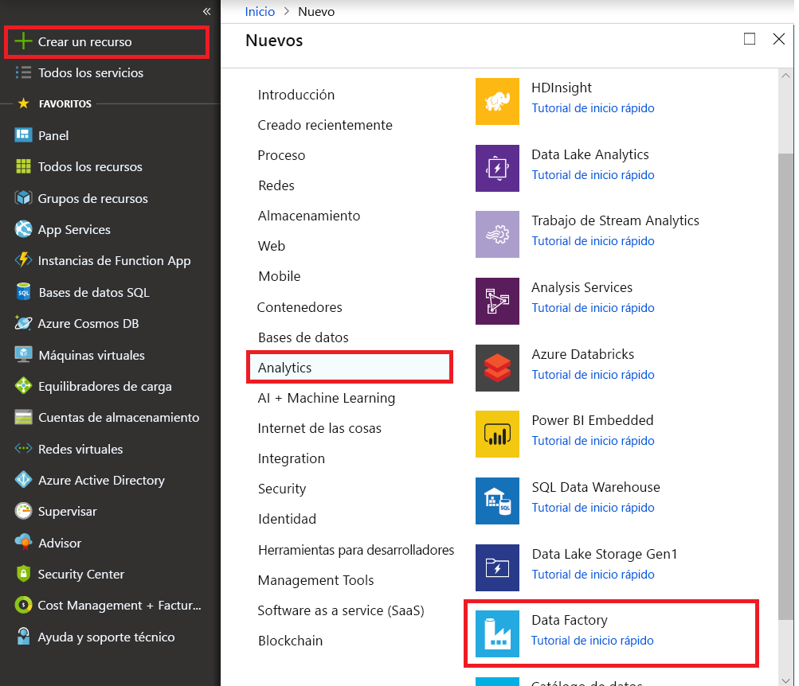
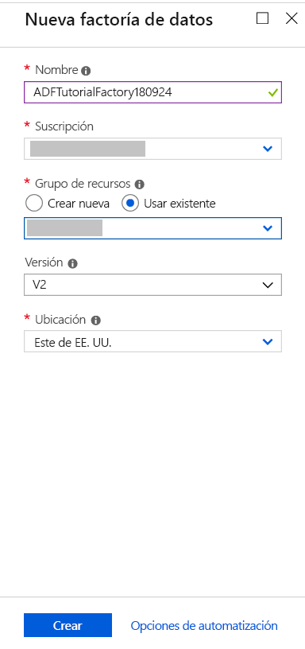
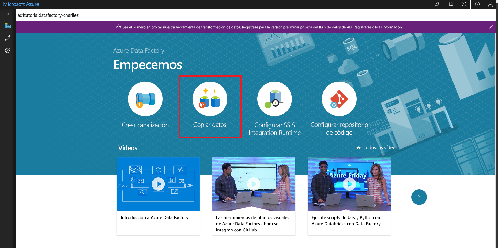
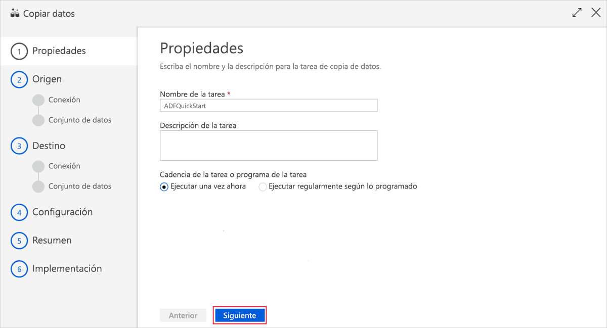
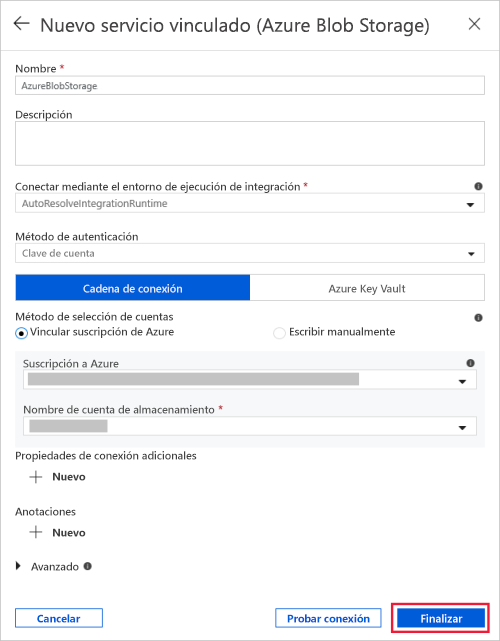
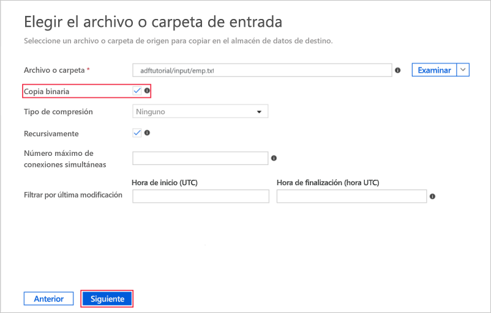
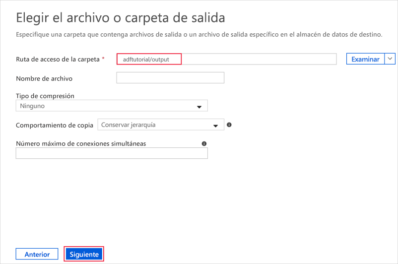
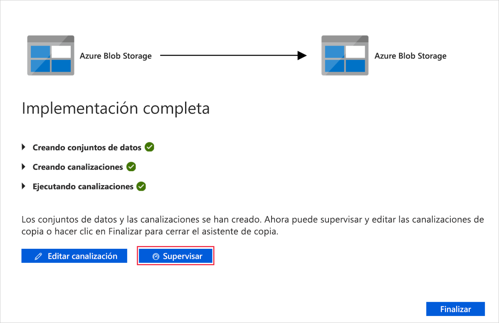

# Uso de la herramienta Copy Data para copiar datos 
> [!div class="op_single_selector" title1="Select the version of Data Factory service that you are using:"]
> * [Versión 1](v1/data-factory-copy-data-from-azure-blob-storage-to-sql-database.md)
> * [Versión actual](quickstart-create-data-factory-copy-data-tool.md)

En esta guía de inicio rápido, usará Azure Portal para crear una factoría de datos. A continuación, usará la herramienta Copy Data para crear una canalización que copia datos de una carpeta de una instancia de Azure Blob Storage a otra carpeta. 

> [!NOTE]
> Si no está familiarizado con Azure Data Factory, consulte [Introduction to Azure Data Factory](data-factory-introduction.md) antes de seguir los pasos de esta guía de inicio rápido. 

[!INCLUDE [data-factory-quickstart-prerequisites](../../includes/data-factory-quickstart-prerequisites.md)] 

## Crear una factoría de datos

1. Seleccione **Nuevo** en el menú de la izquierda, seleccione **Datos y análisis** y, después, seleccione **Data Factory**. 
   
   
1. En la página **Nueva factoría de datos**, escriba **ADFTutorialDataFactory** en **Nombre**. 
      
   
 
   El nombre de la instancia de Azure Data Factory debe ser *único de forma global*. Si ve el siguiente error, cambie el nombre de la factoría de datos (por ejemplo, **&lt;suNombre&gt;ADFTutorialDataFactory**) e intente crearlo de nuevo. Para conocer las reglas de nomenclatura de los artefactos de Data Factory, consulte el artículo [Azure Data Factory: reglas de nomenclatura](naming-rules.md).
  
   
1. En **Suscripción**, seleccione la suscripción de Azure donde desea crear la factoría de datos. 
1. Para **Grupo de recursos**, realice uno de los siguientes pasos:
     
   - Seleccione en primer lugar **Usar existente** y después un grupo de recursos de la lista. 
   - Seleccione **Crear nuevo**y escriba el nombre de un grupo de recursos.   
         
   Para obtener más información sobre los grupos de recursos, consulte [Uso de grupos de recursos para administrar los recursos de Azure](../azure-resource-manager/resource-group-overview.md).  
1. En **Versión**, seleccione **V2**.
1. En **Ubicación**, seleccione la ubicación de la factoría de datos. 

   La lista muestra únicamente las ubicaciones admitidas. Los almacenes de datos (como Azure Storage y Azure SQL Database) y los procesos (como Azure HDInsight) que usa Data Factory pueden encontrarse en otras ubicaciones o regiones.

1. Seleccione **Anclar al panel**.     
1. Seleccione **Crear**.
1. En el panel, verá el icono siguiente con el estado **Deploying Data Factory** (Implementando Data Factory): 

    
1. Una vez completada la creación, verá la página **Data Factory**. Seleccione el icono **Author & Monitor** (Creación y supervisión) para iniciar la aplicación de interfaz de usuario de Azure Data Factory en una pestaña independiente.
   
   

## Inicio de la herramienta Copy Data

1. En la página **Let's get started** (Comencemos), seleccione el icono **Copy Data** para iniciar la herramienta Copy Data. 

   

1. En la página **Propiedades** de la herramienta Copiar datos, puede especificar un nombre para la canalización y su descripción, y luego seleccionar **Siguiente**. 

   
1. En la página **Almacén de datos de origen**, realice los pasos siguientes:

    a. Haga clic en **+ Crear nueva conexión** para agregar una conexión.

    

    b. Seleccione **Azure Blob Storage** en la galería y, a continuación, seleccione **Siguiente**.

    

    c. En la página **Specify the Azure Blob storage account** (Especificar la cuenta de Azure Blob Storage), seleccione el **nombre de la cuenta de Storage** y, después, seleccione **Finish** (Finalizar). 

   

   d. Seleccione el servicio vinculado recién creado como origen y, a continuación, haga clic en **Siguiente**.

   

1. En la página **Choose the input file or folder** (Elegir el archivo o la carpeta de entrada), complete los siguientes pasos:

   a. Haga clic en **Examinar** para ir a la carpeta **adftutorial/input**, seleccione el archivo **emp.txt** y, finalmente, haga clic en **Elegir**. 

   

   d. Marque la opción **Binary copy** (Copia binaria) para copiar el archivo tal cual está, después, seleccione **Siguiente**. 

   

1. En la página **Almacén de datos de destino**, seleccione el servicio vinculado a **Azure Blob Storage** que acaba de crear y, después, en **Siguiente**. 

   

1. En la página **Choose the output file or folder** (Elegir el archivo o la carpeta de salida), escriba **adftutorial/output** como ruta de acceso a la carpeta y, después, seleccione **Siguiente**. 

    

1. En la página **Configuración**, seleccione **Siguiente** para usar las configuraciones predeterminadas. 

1. En la página **Resumen**, revise todos los valores y seleccione **Siguiente**. 

    

1. En la página **Deployment complete** (Implementación finalizada), haga clic en **Monitor** (Supervisión) para supervisar la canalización que ha creado. 

    

1. La aplicación cambia a la pestaña **Monitor** (Supervisión). En esta pestaña verá el estado de la canalización. Seleccione **Refresh** (Actualizar) para actualizar la lista. 
    
    

1. Seleccione el vínculo **View Activity Runs** (Ver ejecuciones de actividad) en la columna **Actions** (Acciones). La canalización tiene una única actividad de tipo **Copy** (Copia). 

    
    
1. Para más información sobre la operación de copia, seleccione el vínculo **Details** (Detalles) (imagen de gafas) de la columna **Actions** (Acciones). Para más información sobre las propiedades, consulte [Introducción a la actividad de copia](copy-activity-overview.md).

    

1. Compruebe que se crea el archivo **emp.txt** en la carpeta **output** del contenedor **adftutorial**. Si no existe la carpeta de salida, el servicio Data Factory la crea automáticamente. 

1. Cambie a la pestaña **Creador** situada encima de la pestaña **Supervisar** del panel izquierdo para editar los servicios, conjuntos de datos y canalizaciones vinculados. Para saber cómo editarlos en la interfaz de usuario de Data Factory, consulte [Crear una factoría de datos mediante Azure Portal](quickstart-create-data-factory-portal.md).

## Pasos siguientes
La canalización de este ejemplo copia los datos de una ubicación a otra en una instancia de Azure Blob Storage. Para más información sobre el uso de Data Factory en otros escenarios, consulte los siguientes [tutoriales](tutorial-copy-data-portal.md). 